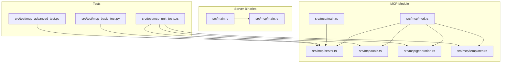
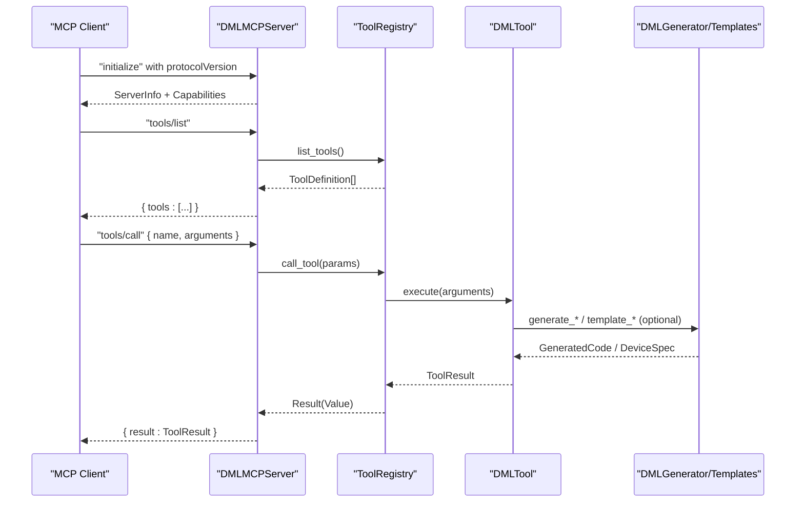
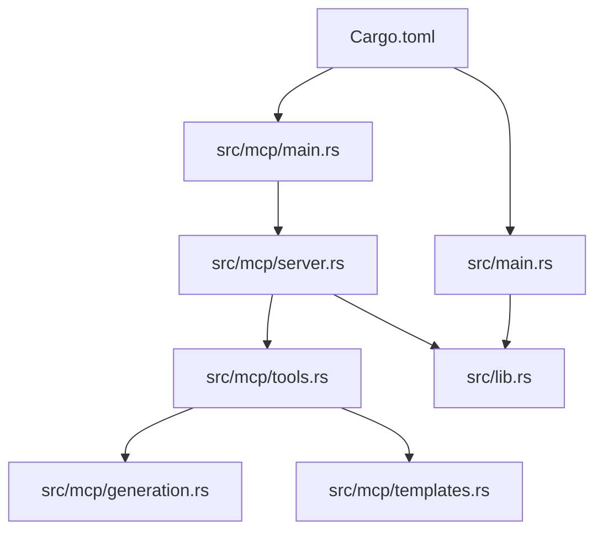

# Tool Registry System

<cite>
**Referenced Files in This Document**
- [Cargo.toml](file://Cargo.toml)
- [src/lib.rs](file://src/lib.rs)
- [src/main.rs](file://src/main.rs)
- [src/mcp/mod.rs](file://src/mcp/mod.rs)
- [src/mcp/main.rs](file://src/mcp/main.rs)
- [src/mcp/server.rs](file://src/mcp/server.rs)
- [src/mcp/tools.rs](file://src/mcp/tools.rs)
- [src/mcp/generation.rs](file://src/mcp/generation.rs)
- [src/mcp/templates.rs](file://src/mcp/templates.rs)
- [MCP_SERVER_GUIDE.md](file://MCP_SERVER_GUIDE.md)
- [src/test/mcp_unit_tests.rs](file://src/test/mcp_unit_tests.rs)
- [src/test/mcp_basic_test.py](file://src/test/mcp_basic_test.py)
- [src/test/mcp_advanced_test.py](file://src/test/mcp_advanced_test.py)
</cite>

## Table of Contents
1. [Introduction](#introduction)
2. [Project Structure](#project-structure)
3. [Core Components](#core-components)
4. [Architecture Overview](#architecture-overview)
5. [Detailed Component Analysis](#detailed-component-analysis)
6. [Dependency Analysis](#dependency-analysis)
7. [Performance Considerations](#performance-considerations)
8. [Troubleshooting Guide](#troubleshooting-guide)
9. [Conclusion](#conclusion)
10. [Appendices](#appendices)

## Introduction
This document describes the MCP tool registry system that powers DML code generation within the DML Language Server. It explains how tools are registered, discovered, executed, and how their metadata is managed. It also documents the DML-specific tools for code generation, analysis utilities, and template instantiation, along with the execution model, parameter handling, result processing, and lifecycle management. Guidance is provided for extending the tool collection and integrating custom tools with the analysis engine.

## Project Structure
The MCP subsystem is organized under the `src/mcp/` directory and integrates with the broader DML Language Server ecosystem. The key files include the module exports, server implementation, tool registry, generation engine, and template library.

**Diagram sources**
- [src/mcp/mod.rs](file://src/mcp/mod.rs#L1-L54)
- [src/mcp/main.rs](file://src/mcp/main.rs#L1-L23)
- [src/mcp/server.rs](file://src/mcp/server.rs#L1-L229)
- [src/mcp/tools.rs](file://src/mcp/tools.rs#L1-L399)
- [src/mcp/generation.rs](file://src/mcp/generation.rs#L1-L411)
- [src/mcp/templates.rs](file://src/mcp/templates.rs#L1-L428)
- [src/main.rs](file://src/main.rs#L1-L60)
- [src/test/mcp_unit_tests.rs](file://src/test/mcp_unit_tests.rs#L1-L406)
- [src/test/mcp_basic_test.py](file://src/test/mcp_basic_test.py#L1-L134)
- [src/test/mcp_advanced_test.py](file://src/test/mcp_advanced_test.py#L1-L184)

**Section sources**
- [src/mcp/mod.rs](file://src/mcp/mod.rs#L1-L54)
- [src/mcp/main.rs](file://src/mcp/main.rs#L1-L23)
- [src/mcp/server.rs](file://src/mcp/server.rs#L1-L229)
- [src/mcp/tools.rs](file://src/mcp/tools.rs#L1-L399)
- [src/mcp/generation.rs](file://src/mcp/generation.rs#L1-L411)
- [src/mcp/templates.rs](file://src/mcp/templates.rs#L1-L428)
- [src/main.rs](file://src/main.rs#L1-L60)
- [src/test/mcp_unit_tests.rs](file://src/test/mcp_unit_tests.rs#L1-L406)
- [src/test/mcp_basic_test.py](file://src/test/mcp_basic_test.py#L1-L134)
- [src/test/mcp_advanced_test.py](file://src/test/mcp_advanced_test.py#L1-L184)

## Core Components
- MCP Protocol Types and Capabilities: Defines server metadata, capabilities, and protocol version.
- MCP Server: Implements JSON-RPC over stdio, handles initialization, tool listing, and tool invocation.
- Tool Registry: Manages tool registration, discovery, and execution, including built-in tools.
- Code Generation Engine: Provides structured generation primitives and configurable formatting.
- Template Library: Supplies pre-defined device templates and patterns for rapid prototyping.

Key responsibilities:
- Tool Registration: Centralized registry that registers built-in tools and exposes discovery and execution APIs.
- Tool Metadata Management: ToolDefinition captures tool name, description, and inputSchema for clients.
- Tool Execution Model: Asynchronous tool execution with structured input and result handling.
- Integration with Analysis Engine: Generation engine and templates leverage DML analysis capabilities for robust code generation.

**Section sources**
- [src/mcp/mod.rs](file://src/mcp/mod.rs#L17-L54)
- [src/mcp/server.rs](file://src/mcp/server.rs#L36-L132)
- [src/mcp/tools.rs](file://src/mcp/tools.rs#L45-L121)
- [src/mcp/generation.rs](file://src/mcp/generation.rs#L8-L111)
- [src/mcp/templates.rs](file://src/mcp/templates.rs#L8-L359)

## Architecture Overview
The MCP server operates as a standalone binary communicating over stdin/stdout using JSON-RPC 2.0. It initializes with MCP 2024-11-05 protocol, lists available tools, and executes tool calls with structured parameters. The tool registry encapsulates tool lifecycle and execution, while the generation engine and template library provide DML-specific capabilities.

**Diagram sources**
- [src/mcp/server.rs](file://src/mcp/server.rs#L88-L206)
- [src/mcp/tools.rs](file://src/mcp/tools.rs#L101-L121)
- [src/mcp/generation.rs](file://src/mcp/generation.rs#L52-L111)
- [src/mcp/templates.rs](file://src/mcp/templates.rs#L11-L359)

## Detailed Component Analysis

### MCP Protocol Types and Capabilities
- ServerInfo: Provides server name and version.
- ServerCapabilities: Declares MCP feature flags (tools, resources, prompts, logging).
- MCP_VERSION: Protocol version string.

These types are used by the server to respond to initialization requests and advertise capabilities.

**Section sources**
- [src/mcp/mod.rs](file://src/mcp/mod.rs#L20-L54)

### MCP Server Implementation
- JSON-RPC Message Handling: Parses incoming messages, routes to appropriate handlers, and writes responses.
- Initialization: Responds with protocol version, server info, and capabilities.
- Tool Discovery: Lists tools with their metadata (name, description, inputSchema).
- Tool Invocation: Executes tools asynchronously, returning structured results or JSON-RPC errors.

Error handling:
- Unknown methods return -32601.
- Missing params for tools/call return -32602.
- Internal tool execution failures return -32603 with details.

**Section sources**
- [src/mcp/server.rs](file://src/mcp/server.rs#L12-L132)
- [src/mcp/server.rs](file://src/mcp/server.rs#L134-L206)

### Tool Registry and Tool Lifecycle
- ToolRegistry: Holds a HashMap of tool name to DMLTool trait object.
- Registration: Built-in tools are registered during initialization.
- Discovery: list_tools() maps tool instances to ToolDefinition entries.
- Execution: call_tool() validates parameters, resolves tool by name, executes, and serializes results.

Tool metadata:
- ToolDefinition includes name, description, and inputSchema for client-side validation.

Execution model:
- Asynchronous execution via async_trait.
- Structured ToolResult with content array and optional is_error flag.

**Section sources**
- [src/mcp/tools.rs](file://src/mcp/tools.rs#L45-L121)
- [src/mcp/tools.rs](file://src/mcp/tools.rs#L27-L43)

### Built-in Tools
The registry registers seven built-in tools. Two are fully implemented for device and register generation, while others are placeholders indicating future enhancements.

- generate_device: Generates a complete DML device with registers, interfaces, and optional template inheritance.
- generate_register: Creates a register with fields, bit ranges, and access controls.
- generate_method: Placeholder tool for method generation.
- analyze_project: Placeholder tool for project analysis.
- validate_code: Placeholder tool for code validation.
- generate_template: Placeholder tool for template creation.
- apply_pattern: Placeholder tool for applying design patterns.

Input schemas:
- Each tool defines a JSON Schema describing required and optional parameters for client-side validation.

Execution:
- Implemented tools extract parameters from the input Value, construct generation specs, and produce ToolResult with generated DML text content.

**Section sources**
- [src/mcp/tools.rs](file://src/mcp/tools.rs#L66-L81)
- [src/mcp/tools.rs](file://src/mcp/tools.rs#L125-L203)
- [src/mcp/tools.rs](file://src/mcp/tools.rs#L205-L280)
- [src/mcp/tools.rs](file://src/mcp/tools.rs#L282-L325)

### Code Generation Engine
The generation engine provides structured generation primitives and formatting controls:

- GenerationContext: Captures device name, namespace, imports, templates, and GenerationConfig.
- GenerationConfig: Controls indentation style, line ending, max line length, documentation generation, and output validation.
- DMLGenerator: Orchestrates generation of devices, banks, registers, fields, and methods. Supports validation hooks and configurable formatting.

Generation flow:
- Device generation composes header, device declaration, banks, interfaces, and methods.
- Register generation adds documentation, declaration, fields, and optional methods.
- Method generation constructs signatures, parameters, return types, and bodies with optional documentation.

Formatting:
- IndentStyle supports spaces or tabs.
- LineEnding supports Unix or Windows styles.

Validation:
- Validation hook is present for integrating with the DML parser.

**Section sources**
- [src/mcp/generation.rs](file://src/mcp/generation.rs#L8-L111)
- [src/mcp/generation.rs](file://src/mcp/generation.rs#L52-L310)

### Template Library
The template library provides pre-defined device patterns and common snippets:

- DMLTemplates: Factory methods for common device types (CPU, memory, peripheral) and design patterns (interrupt controller, memory-mapped devices, bus interfaces).
- Pattern Templates: A map of pattern names to factory closures that accept a device name and configuration JSON, returning a DeviceSpec.
- DMLSnippets: Common method and field patterns for reuse.

Template usage:
- Built-in tools can leverage templates to generate realistic device structures quickly.
- Patterns encapsulate typical register layouts and method implementations.

**Section sources**
- [src/mcp/templates.rs](file://src/mcp/templates.rs#L8-L359)
- [src/mcp/templates.rs](file://src/mcp/templates.rs#L361-L428)

### Tool Execution Model and Parameter Handling
Tool execution follows a strict JSON-RPC flow:
- Clients send "tools/call" with a name and arguments.
- Server validates presence of name and arguments.
- ToolRegistry resolves tool by name and executes asynchronously.
- Tool returns ToolResult serialized as JSON-RPC result.
- Errors are mapped to JSON-RPC error codes with optional data.

Parameter handling:
- Tools define inputSchema for validation.
- Execution extracts typed values from the input JSON, with explicit error reporting for missing fields.

Result processing:
- ToolResult.content is an array of ToolContent entries with type and text.
- Optional is_error flag allows tools to signal non-fatal warnings.

**Section sources**
- [src/mcp/server.rs](file://src/mcp/server.rs#L173-L206)
- [src/mcp/tools.rs](file://src/mcp/tools.rs#L101-L121)
- [src/mcp/tools.rs](file://src/mcp/tools.rs#L12-L25)

### Tool Discovery Mechanisms
- Server responds to "tools/list" with ToolDefinition[].
- ToolDefinition is derived from each tool’s metadata and inputSchema.
- Clients can introspect tool capabilities before invoking.

**Section sources**
- [src/mcp/server.rs](file://src/mcp/server.rs#L154-L171)
- [src/mcp/tools.rs](file://src/mcp/tools.rs#L90-L99)

### Integration with the Analysis Engine
- Generation engine and templates are designed to leverage DML analysis capabilities for correctness and consistency.
- Validation hook exists for integrating with the DML parser.
- Templates encode common device patterns validated by the analysis engine.

**Section sources**
- [src/mcp/generation.rs](file://src/mcp/generation.rs#L305-L310)
- [src/mcp/templates.rs](file://src/mcp/templates.rs#L11-L359)

### Example Tool Implementation Patterns
- Implementing a new tool:
  - Define a struct implementing DMLTool with name(), description(), input_schema(), and execute().
  - Register the tool in ToolRegistry::register_builtin_tools().
  - Use the generation engine or templates to produce DML code.
- Placeholder tools:
  - Use macro_rules! impl_placeholder_tool! to quickly scaffold tools with a default response.

**Section sources**
- [src/mcp/tools.rs](file://src/mcp/tools.rs#L125-L203)
- [src/mcp/tools.rs](file://src/mcp/tools.rs#L282-L325)

### Tool Lifecycle Management
- Registration: During ToolRegistry::new(), built-in tools are registered.
- Discovery: list_tools() enumerates available tools.
- Execution: call_tool() validates parameters, resolves tool, and executes.
- Shutdown: Server runs until EOF on stdin; graceful termination occurs on process exit.

**Section sources**
- [src/mcp/tools.rs](file://src/mcp/tools.rs#L51-L81)
- [src/mcp/server.rs](file://src/mcp/server.rs#L57-L86)

### Error Propagation and Best Practices
- JSON-RPC Errors: Unknown method (-32601), invalid params (-32602), internal error (-32603).
- Tool Errors: Tools return Result<ToolResult>, with errors propagated as JSON-RPC errors containing details.
- Logging: Info/warn/error logs are emitted for diagnostics.
- Best Practices:
  - Define precise inputSchema for each tool.
  - Validate inputs early in execute() and return clear error messages.
  - Use ToolResult.is_error for non-fatal warnings.
  - Keep tool execution asynchronous and non-blocking.

**Section sources**
- [src/mcp/server.rs](file://src/mcp/server.rs#L108-L132)
- [src/mcp/server.rs](file://src/mcp/server.rs#L188-L206)
- [src/mcp/tools.rs](file://src/mcp/tools.rs#L12-L25)

## Dependency Analysis
The MCP module depends on the DML Language Server core for configuration and analysis capabilities. The server binary is separate from the main DLS binary, enabling standalone MCP functionality.

**Diagram sources**
- [src/mcp/main.rs](file://src/mcp/main.rs#L6-L22)
- [src/mcp/server.rs](file://src/mcp/server.rs#L3-L11)
- [src/mcp/tools.rs](file://src/mcp/tools.rs#L10-L10)
- [src/mcp/generation.rs](file://src/mcp/generation.rs#L1-L7)
- [src/mcp/templates.rs](file://src/mcp/templates.rs#L1-L7)
- [src/lib.rs](file://src/lib.rs#L31-L47)
- [src/main.rs](file://src/main.rs#L14-L59)
- [Cargo.toml](file://Cargo.toml#L28-L31)

**Section sources**
- [Cargo.toml](file://Cargo.toml#L28-L31)
- [src/mcp/main.rs](file://src/mcp/main.rs#L6-L22)
- [src/mcp/server.rs](file://src/mcp/server.rs#L3-L11)
- [src/mcp/tools.rs](file://src/mcp/tools.rs#L10-L10)
- [src/mcp/generation.rs](file://src/mcp/generation.rs#L1-L7)
- [src/mcp/templates.rs](file://src/mcp/templates.rs#L1-L7)
- [src/lib.rs](file://src/lib.rs#L31-L47)
- [src/main.rs](file://src/main.rs#L14-L59)

## Performance Considerations
- Asynchronous execution: Tools and server use async/await for non-blocking operations.
- Minimal overhead: ToolRegistry stores boxed trait objects; lookup is O(1) average via HashMap.
- Formatting controls: Configurable indentation and line endings reduce post-processing costs.
- Validation hook: Early validation prevents expensive generation retries.

[No sources needed since this section provides general guidance]

## Troubleshooting Guide
Common issues and resolutions:
- Tool not found: Ensure tool name matches exactly; verify ToolRegistry::register_builtin_tools() includes the tool.
- Missing parameters: Confirm "tools/call" includes both name and arguments; server returns -32602 for invalid params.
- JSON parsing errors: Verify JSON-RPC messages conform to spec; server logs parse failures.
- Internal errors: Inspect ToolResult.is_error and server logs for detailed error messages.

Testing:
- Unit tests validate server info, capabilities, generation config, and template patterns.
- Python integration tests demonstrate end-to-end MCP protocol compliance and tool execution.

**Section sources**
- [src/mcp/server.rs](file://src/mcp/server.rs#L108-L132)
- [src/mcp/server.rs](file://src/mcp/server.rs#L188-L206)
- [src/test/mcp_unit_tests.rs](file://src/test/mcp_unit_tests.rs#L14-L406)
- [src/test/mcp_basic_test.py](file://src/test/mcp_basic_test.py#L37-L134)
- [src/test/mcp_advanced_test.py](file://src/test/mcp_advanced_test.py#L33-L184)

## Conclusion
The MCP tool registry system provides a robust, extensible foundation for DML code generation. It offers standardized tool discovery, structured execution, and rich metadata for clients. The integration with the generation engine and template library enables high-quality, validated DML code generation. The modular design supports easy addition of new tools and patterns, while maintaining compatibility with the broader DML ecosystem.

[No sources needed since this section summarizes without analyzing specific files]

## Appendices

### Available Tools and Descriptions
- generate_device: Generate a complete DML device model with registers, interfaces, and optional template inheritance.
- generate_register: Create a register with fields, bit ranges, and access controls.
- generate_method: Placeholder for method generation.
- analyze_project: Placeholder for project analysis.
- validate_code: Placeholder for code validation.
- generate_template: Placeholder for template creation.
- apply_pattern: Placeholder for applying design patterns.

**Section sources**
- [MCP_SERVER_GUIDE.md](file://MCP_SERVER_GUIDE.md#L35-L107)

### Example Usage Patterns
- Initialize server, list tools, and call generate_device with device_name, device_type, registers, and interfaces.
- Call generate_register with name, size, offset, fields, and documentation.
- Apply patterns via apply_pattern with configuration JSON.

**Section sources**
- [MCP_SERVER_GUIDE.md](file://MCP_SERVER_GUIDE.md#L42-L106)
- [src/test/mcp_basic_test.py](file://src/test/mcp_basic_test.py#L86-L115)
- [src/test/mcp_advanced_test.py](file://src/test/mcp_advanced_test.py#L54-L170)