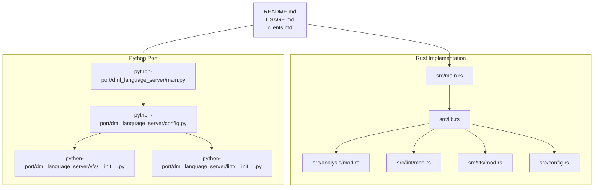
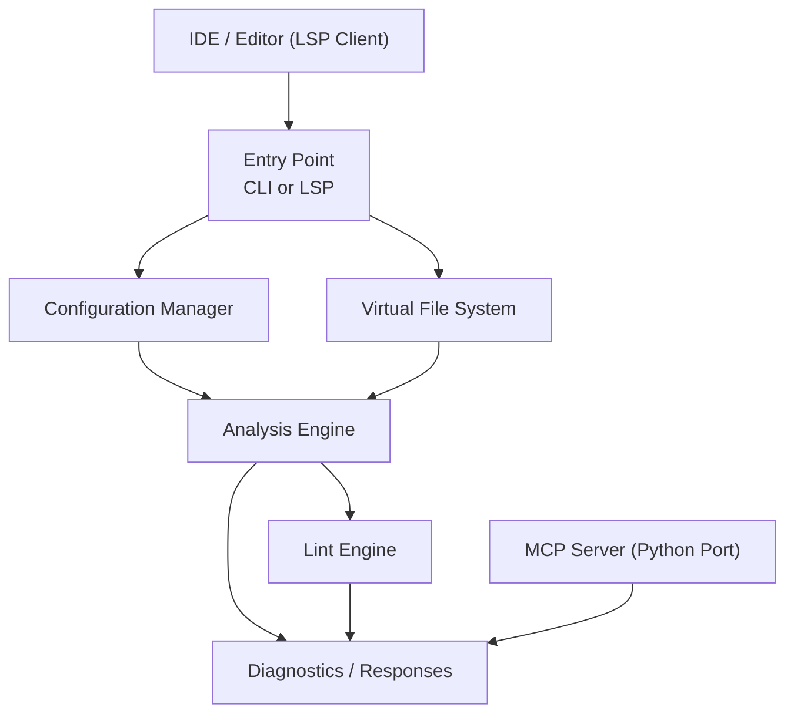
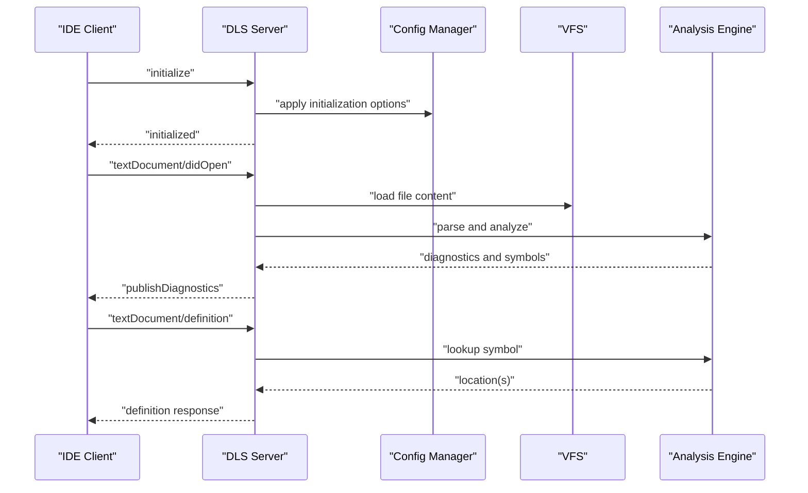
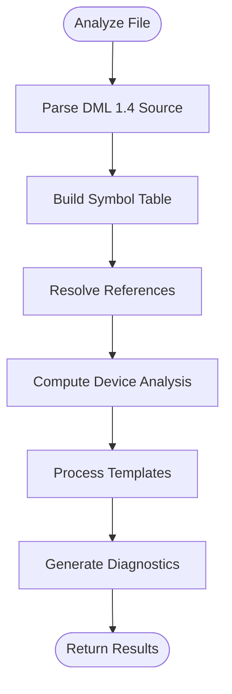
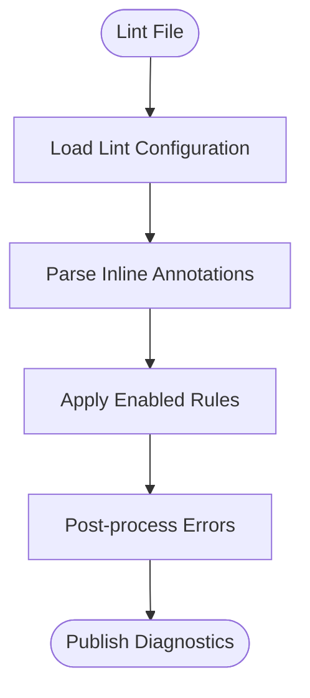
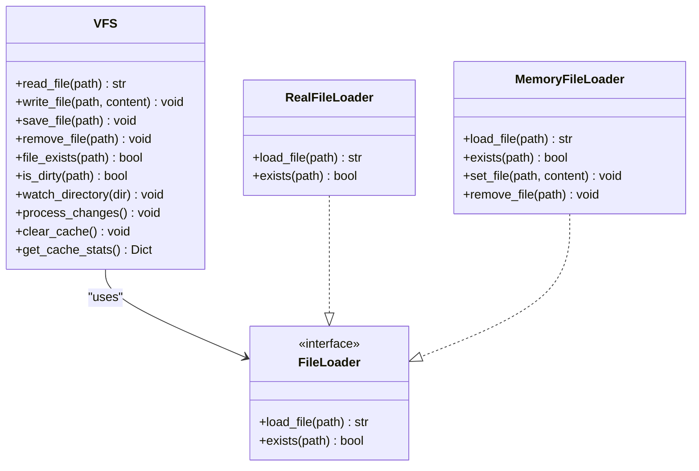
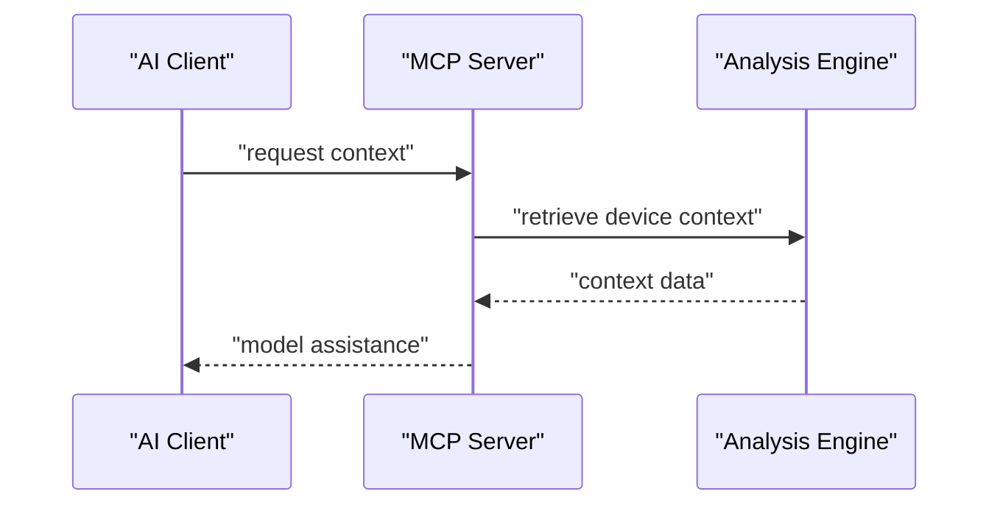
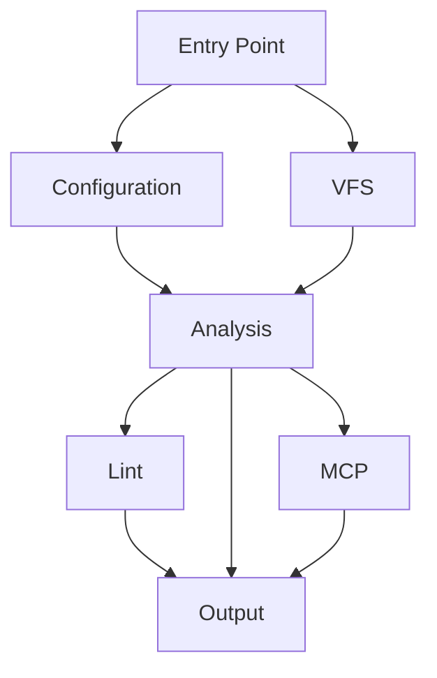

# Project Overview

<cite>
**Referenced Files in This Document**
- [README.md](file://README.md)
- [USAGE.md](file://USAGE.md)
- [clients.md](file://clients.md)
- [python-port/README.md](file://python-port/README.md)
- [python-port/DEVELOPMENT.md](file://python-port/DEVELOPMENT.md)
- [src/main.rs](file://src/main.rs)
- [src/lib.rs](file://src/lib.rs)
- [src/config.rs](file://src/config.rs)
- [src/analysis/mod.rs](file://src/analysis/mod.rs)
- [src/lint/mod.rs](file://src/lint/mod.rs)
- [src/vfs/mod.rs](file://src/vfs/mod.rs)
- [python-port/dml_language_server/main.py](file://python-port/dml_language_server/main.py)
- [python-port/dml_language_server/config.py](file://python-port/dml_language_server/config.py)
- [python-port/dml_language_server/vfs/__init__.py](file://python-port/dml_language_server/vfs/__init__.py)
- [python-port/dml_language_server/lint/__init__.py](file://python-port/dml_language_server/lint/__init__.py)
</cite>

## Table of Contents
1. [Introduction](#introduction)
2. [Project Structure](#project-structure)
3. [Core Components](#core-components)
4. [Architecture Overview](#architecture-overview)
5. [Detailed Component Analysis](#detailed-component-analysis)
6. [Dependency Analysis](#dependency-analysis)
7. [Performance Considerations](#performance-considerations)
8. [Troubleshooting Guide](#troubleshooting-guide)
9. [Conclusion](#conclusion)
10. [Appendices](#appendices)

## Introduction
The DML Language Server (DLS) provides IDE support for Intel Simics Device Modeling Language (DML) by acting as a background server that communicates over the Language Server Protocol (LSP). It delivers syntax and semantic analysis, symbol resolution, navigation features (such as go-to-definition and find-references), hover information, and configurable linting for DML 1.4. The project targets both IDE developers integrating DLS into editors and end users who write DML device models within the Simics ecosystem.

Key capabilities:
- Syntax and semantic analysis for DML 1.4
- Symbol resolution and navigation (definition, references, implementation, base)
- Configurable linting with inline and external configuration
- Virtual file system (VFS) for efficient file caching and change tracking
- MCP (Model Context Protocol) server for AI-assisted development (Python port)
- CLI tools for batch analysis and diagnostics

Scope and limitations:
- Supports DML 1.4 only; there are no plans to support DML 1.2
- Requires explicit declaration of DML 1.4 version in source files
- Linting is configurable via external configuration and inline annotations

Target audience:
- IDE developers implementing LSP clients
- DML developers using editors with LSP support
- Users leveraging Simics Modeling Extension and related tooling

Relationship to Simics:
- DLS integrates with Simics projects through compile commands files and device modeling workflows
- It complements the broader Simics ecosystem by enabling robust editing experiences for DML code

**Section sources**
- [README.md](file://README.md#L1-L57)
- [USAGE.md](file://USAGE.md#L1-L48)
- [clients.md](file://clients.md#L1-L191)
- [python-port/README.md](file://python-port/README.md#L1-L243)

## Project Structure
The repository contains both a Rust implementation and a Python port, each with distinct entry points and complementary documentation. The Rust implementation focuses on performance and native LSP features, while the Python port emphasizes developer accessibility, CLI tooling, and MCP integration.

High-level structure:
- Rust implementation: src/, Cargo.toml, and related modules for LSP, analysis, linting, VFS, and MCP
- Python port: python-port/ with dml_language_server/, examples/, tests/, and development docs
- Documentation: README.md, USAGE.md, clients.md, and development guides

**Diagram sources**
- [src/main.rs](file://src/main.rs#L1-L60)
- [src/lib.rs](file://src/lib.rs#L1-L54)
- [src/analysis/mod.rs](file://src/analysis/mod.rs#L1-L800)
- [src/lint/mod.rs](file://src/lint/mod.rs#L1-L587)
- [src/vfs/mod.rs](file://src/vfs/mod.rs#L1-L800)
- [src/config.rs](file://src/config.rs#L1-L319)
- [python-port/dml_language_server/main.py](file://python-port/dml_language_server/main.py#L1-L106)
- [python-port/dml_language_server/config.py](file://python-port/dml_language_server/config.py#L1-L311)
- [python-port/dml_language_server/vfs/__init__.py](file://python-port/dml_language_server/vfs/__init__.py#L1-L329)
- [python-port/dml_language_server/lint/__init__.py](file://python-port/dml_language_server/lint/__init__.py#L1-L298)

**Section sources**
- [README.md](file://README.md#L1-L57)
- [python-port/README.md](file://python-port/README.md#L1-L243)

## Core Components
This section outlines the primary subsystems that enable DLS functionality.

- Language Server Protocol (LSP) server
  - Rust: entry point initializes CLI or LSP mode and manages configuration
  - Python: CLI entry point supports LSP server and CLI modes with async processing

- Analysis engine
  - Parsing and semantic analysis for DML 1.4
  - Symbol storage, scope management, and reference resolution
  - Device analysis and templating support

- Lint engine
  - Configurable linting rules with inline annotations
  - Support for per-file and per-line suppression
  - Rule configuration via JSON and runtime toggles

- Virtual File System (VFS)
  - File caching, change tracking, and asynchronous operations
  - Watchdog-based file system monitoring (Python port)
  - Efficient text manipulation and line indexing

- MCP server (Python port)
  - Model Context Protocol for AI-assisted development
  - Tool integration and context-aware assistance

- Configuration management
  - Workspace configuration, compile commands, and lint settings
  - Dynamic configuration updates and validation

Practical examples:
- IDE integration: configure a generic LSP client to launch the DLS executable for DML files
- Command-line analysis: run the CLI with compile info to analyze DML files and generate reports
- Inline linting: use comments to disable specific rules for entire files or individual lines

**Section sources**
- [src/main.rs](file://src/main.rs#L1-L60)
- [src/lib.rs](file://src/lib.rs#L1-L54)
- [src/analysis/mod.rs](file://src/analysis/mod.rs#L1-L800)
- [src/lint/mod.rs](file://src/lint/mod.rs#L1-L587)
- [src/vfs/mod.rs](file://src/vfs/mod.rs#L1-L800)
- [src/config.rs](file://src/config.rs#L1-L319)
- [python-port/dml_language_server/main.py](file://python-port/dml_language_server/main.py#L1-L106)
- [python-port/dml_language_server/config.py](file://python-port/dml_language_server/config.py#L1-L311)
- [python-port/dml_language_server/vfs/__init__.py](file://python-port/dml_language_server/vfs/__init__.py#L1-L329)
- [python-port/dml_language_server/lint/__init__.py](file://python-port/dml_language_server/lint/__init__.py#L1-L298)
- [USAGE.md](file://USAGE.md#L1-L48)
- [clients.md](file://clients.md#L1-L191)

## Architecture Overview
DLS follows a layered architecture with clear separation of concerns:
- Entry point: CLI or LSP initialization
- Configuration: workspace and initialization options
- VFS: file caching and change detection
- Analysis: parsing, symbol resolution, and semantic constructs
- Lint: style and quality rules enforcement
- MCP: AI-assisted development (Python port)
- Output: diagnostics, hover, and navigation responses

**Diagram sources**
- [src/main.rs](file://src/main.rs#L1-L60)
- [src/config.rs](file://src/config.rs#L1-L319)
- [src/vfs/mod.rs](file://src/vfs/mod.rs#L1-L800)
- [src/analysis/mod.rs](file://src/analysis/mod.rs#L1-L800)
- [src/lint/mod.rs](file://src/lint/mod.rs#L1-L587)
- [python-port/dml_language_server/main.py](file://python-port/dml_language_server/main.py#L1-L106)
- [python-port/dml_language_server/config.py](file://python-port/dml_language_server/config.py#L1-L311)
- [python-port/dml_language_server/vfs/__init__.py](file://python-port/dml_language_server/vfs/__init__.py#L1-L329)
- [python-port/dml_language_server/lint/__init__.py](file://python-port/dml_language_server/lint/__init__.py#L1-L298)

## Detailed Component Analysis

### Language Server Protocol (LSP) Server
The LSP server handles initialization, configuration updates, and requests for language features. It supports standard LSP notifications and requests, along with experimental extensions for context control and progress reporting.

**Diagram sources**
- [clients.md](file://clients.md#L63-L98)
- [src/config.rs](file://src/config.rs#L1-L319)
- [src/vfs/mod.rs](file://src/vfs/mod.rs#L1-L800)
- [src/analysis/mod.rs](file://src/analysis/mod.rs#L1-L800)

**Section sources**
- [clients.md](file://clients.md#L1-L191)
- [src/config.rs](file://src/config.rs#L1-L319)

### Analysis Engine
The analysis engine performs parsing, symbol resolution, and semantic checks for DML 1.4. It builds symbol tables, tracks references, and computes device-level analyses with template support.

**Diagram sources**
- [src/analysis/mod.rs](file://src/analysis/mod.rs#L292-L416)

**Section sources**
- [src/analysis/mod.rs](file://src/analysis/mod.rs#L1-L800)

### Lint Engine
The lint engine enforces configurable style and quality rules. It supports inline annotations for per-line and per-file suppression and integrates with external configuration files.

**Diagram sources**
- [src/lint/mod.rs](file://src/lint/mod.rs#L209-L229)

**Section sources**
- [src/lint/mod.rs](file://src/lint/mod.rs#L1-L587)
- [USAGE.md](file://USAGE.md#L15-L48)

### Virtual File System (VFS)
The VFS manages file caching, change detection, and asynchronous operations. It ensures efficient access to file contents and coordinates with the analysis engine.

**Diagram sources**
- [src/vfs/mod.rs](file://src/vfs/mod.rs#L123-L288)
- [python-port/dml_language_server/vfs/__init__.py](file://python-port/dml_language_server/vfs/__init__.py#L123-L329)

**Section sources**
- [src/vfs/mod.rs](file://src/vfs/mod.rs#L1-L800)
- [python-port/dml_language_server/vfs/__init__.py](file://python-port/dml_language_server/vfs/__init__.py#L1-L329)

### MCP Server (Python Port)
The MCP server provides AI-assisted development features, enabling context-aware suggestions and automated assistance for DML modeling tasks.

**Diagram sources**
- [python-port/README.md](file://python-port/README.md#L70-L76)

**Section sources**
- [python-port/README.md](file://python-port/README.md#L1-L243)

## Dependency Analysis
The DLS components exhibit loose coupling with clear interfaces:
- Entry points depend on configuration and VFS
- Analysis depends on parsing and symbol resolution
- Lint depends on analysis results and configuration
- VFS provides abstraction over file operations
- MCP depends on analysis for context

**Diagram sources**
- [src/main.rs](file://src/main.rs#L1-L60)
- [src/config.rs](file://src/config.rs#L1-L319)
- [src/vfs/mod.rs](file://src/vfs/mod.rs#L1-L800)
- [src/analysis/mod.rs](file://src/analysis/mod.rs#L1-L800)
- [src/lint/mod.rs](file://src/lint/mod.rs#L1-L587)
- [python-port/dml_language_server/main.py](file://python-port/dml_language_server/main.py#L1-L106)
- [python-port/dml_language_server/config.py](file://python-port/dml_language_server/config.py#L1-L311)
- [python-port/dml_language_server/vfs/__init__.py](file://python-port/dml_language_server/vfs/__init__.py#L1-L329)
- [python-port/dml_language_server/lint/__init__.py](file://python-port/dml_language_server/lint/__init__.py#L1-L298)

**Section sources**
- [src/lib.rs](file://src/lib.rs#L1-L54)
- [python-port/DEVELOPMENT.md](file://python-port/DEVELOPMENT.md#L128-L153)

## Performance Considerations
- Incremental analysis and caching reduce repeated work
- VFS minimizes disk I/O through caching and change tracking
- Async I/O and concurrent operations improve responsiveness
- Limit diagnostics per file to manage overhead
- Use smart invalidation strategies for file changes

[No sources needed since this section provides general guidance]

## Troubleshooting Guide
Common issues and resolutions:
- Import errors: verify Python path and virtual environment setup
- Async issues: ensure proper handling of async functions and event loops
- File watching: confirm watcher initialization and cleanup
- Memory leaks: clear caches and close resources appropriately
- LSP protocol errors: validate JSON-RPC messages and adhere to LSP specification

**Section sources**
- [python-port/DEVELOPMENT.md](file://python-port/DEVELOPMENT.md#L204-L237)

## Conclusion
The DML Language Server provides comprehensive IDE support for DML 1.4, combining robust analysis, symbol resolution, and configurable linting within an LSP framework. Its modular architecture enables both high-performance Rust-based implementations and accessible Python-based tooling, serving both IDE integrators and DML developers within the Simics ecosystem. While focused on DML 1.4, the project’s design allows for future enhancements and extensions aligned with the broader Simics toolchain.

[No sources needed since this section summarizes without analyzing specific files]

## Appendices

### Practical Examples
- IDE integration: configure a generic LSP client to launch the DLS executable for DML files
- Command-line analysis: run the CLI with compile info to analyze DML files and generate reports
- Inline linting: use comments to disable specific rules for entire files or individual lines

**Section sources**
- [USAGE.md](file://USAGE.md#L1-L48)
- [clients.md](file://clients.md#L126-L166)

### Scope and Limitations
- Scope: DML 1.4 syntax and semantics, symbol resolution, navigation, linting, and MCP assistance
- Limitations: DML 1.2 not supported; linting configuration and inline annotations; compile commands dependency

**Section sources**
- [README.md](file://README.md#L18-L21)

### Future Roadmap
- Extended semantic and type analysis
- Basic refactoring patterns and renaming support
- Enhanced language construct templates
- Improved linting rules and configuration

**Section sources**
- [README.md](file://README.md#L14-L16)