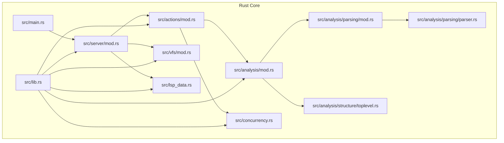
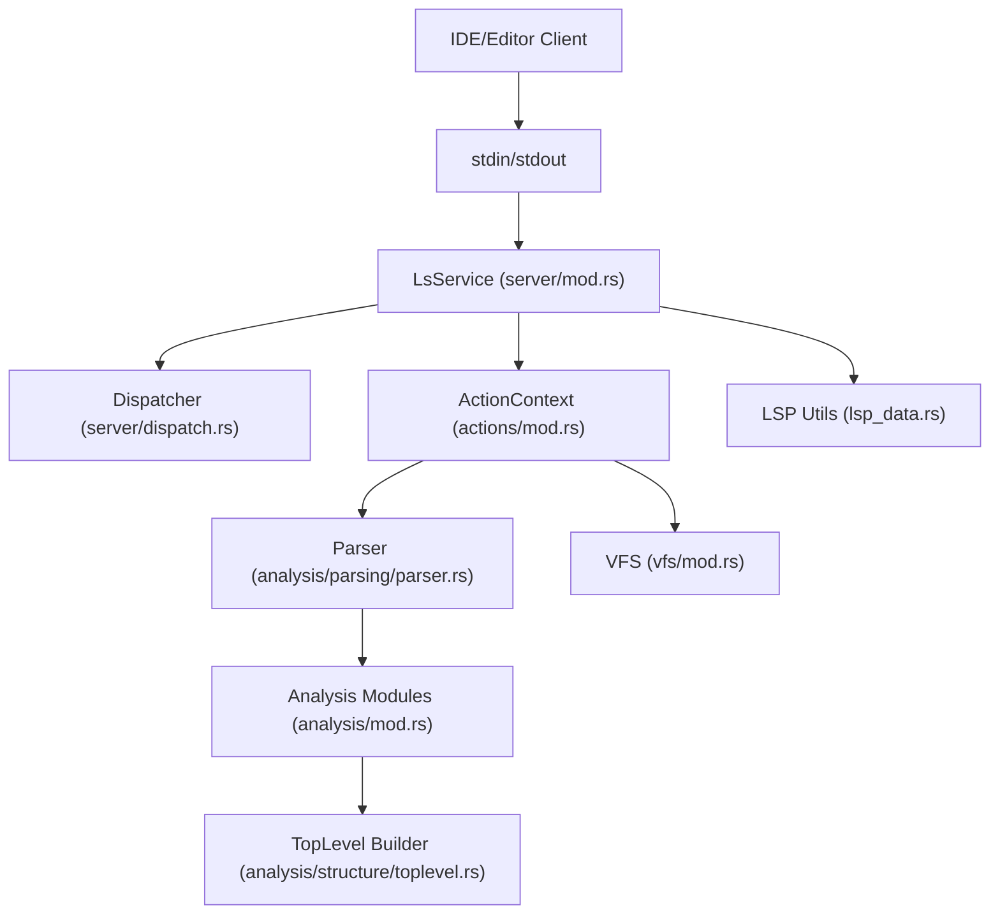
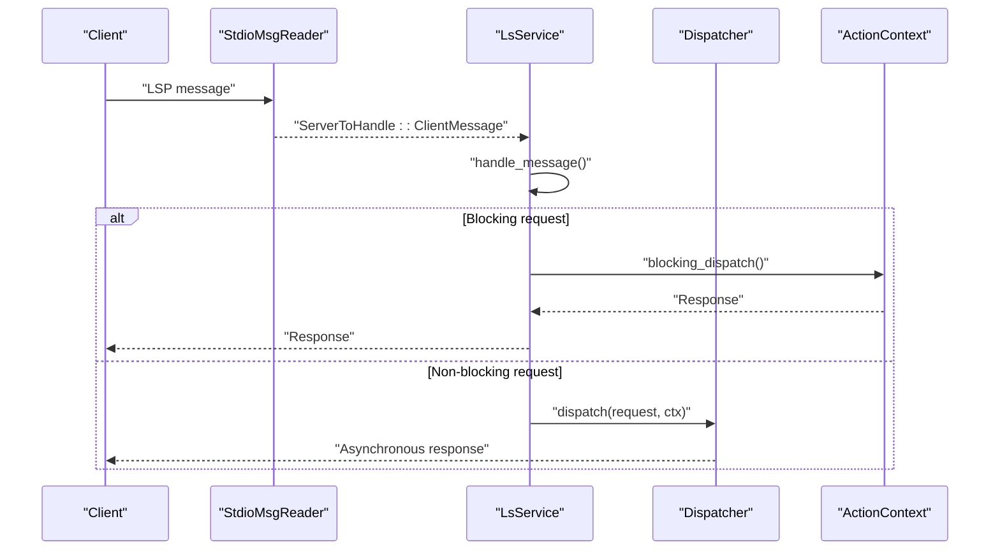
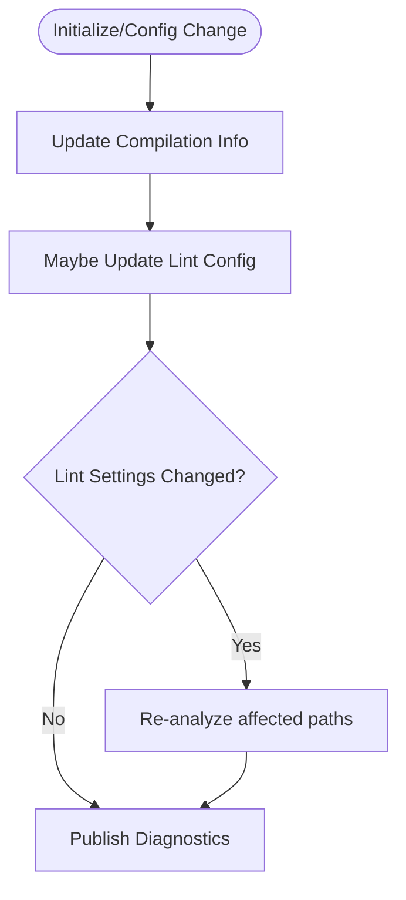
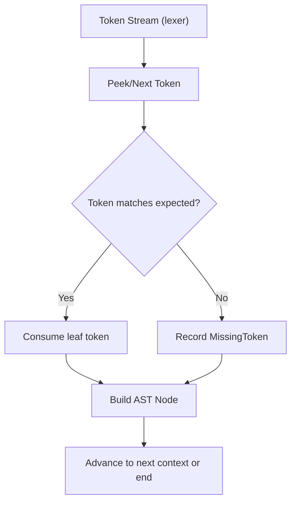
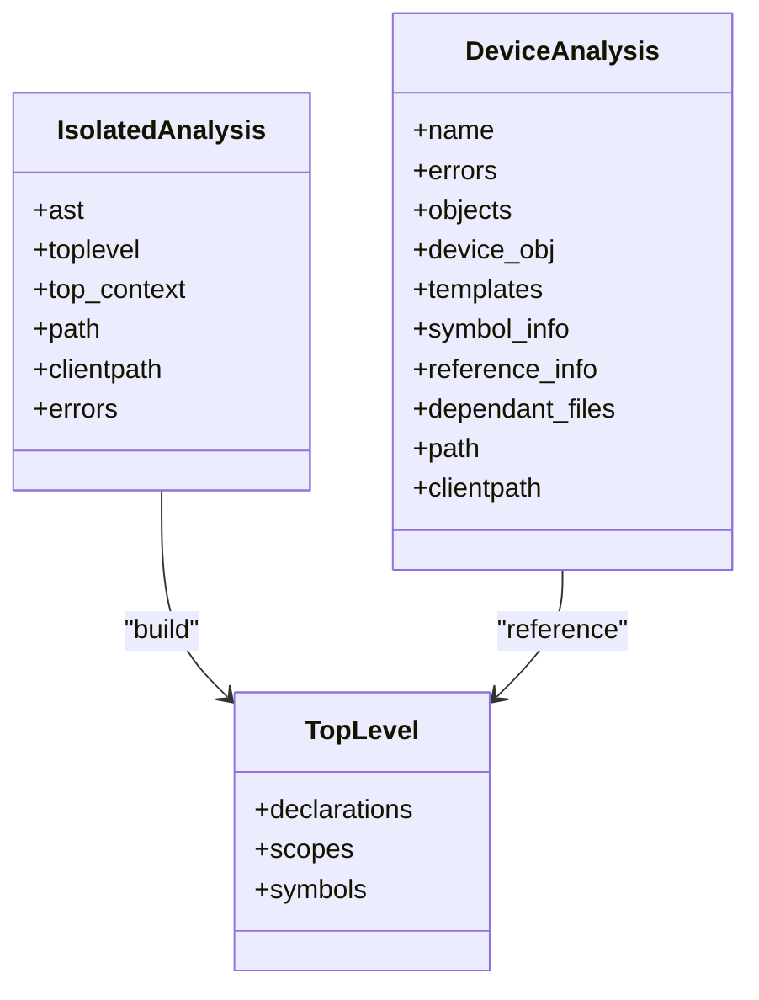
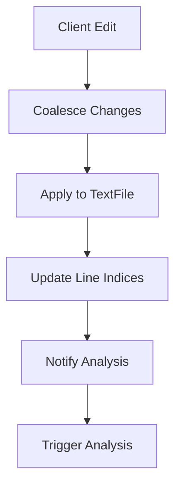
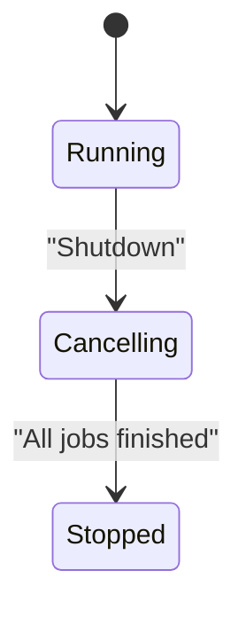
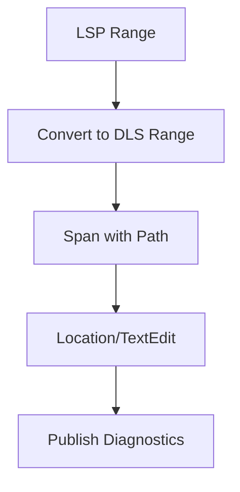
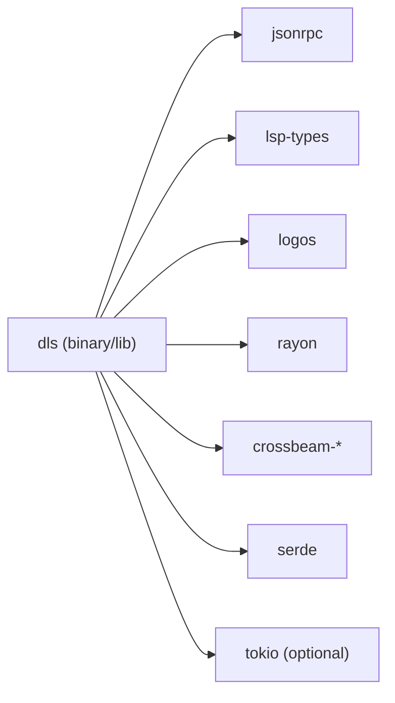

# Architecture Overview

<cite>
**Referenced Files in This Document**
- [README.md](file://README.md)
- [Cargo.toml](file://Cargo.toml)
- [src/main.rs](file://src/main.rs)
- [src/lib.rs](file://src/lib.rs)
- [src/server/mod.rs](file://src/server/mod.rs)
- [src/vfs/mod.rs](file://src/vfs/mod.rs)
- [src/actions/mod.rs](file://src/actions/mod.rs)
- [src/actions/requests.rs](file://src/actions/requests.rs)
- [src/analysis/mod.rs](file://src/analysis/mod.rs)
- [src/analysis/parsing/mod.rs](file://src/analysis/parsing/mod.rs)
- [src/analysis/parsing/parser.rs](file://src/analysis/parsing/parser.rs)
- [src/analysis/structure/toplevel.rs](file://src/analysis/structure/toplevel.rs)
- [src/concurrency.rs](file://src/concurrency.rs)
- [src/lsp_data.rs](file://src/lsp_data.rs)
- [clients.md](file://clients.md)
</cite>

## Table of Contents
1. [Introduction](#introduction)
2. [Project Structure](#project-structure)
3. [Core Components](#core-components)
4. [Architecture Overview](#architecture-overview)
5. [Detailed Component Analysis](#detailed-component-analysis)
6. [Dependency Analysis](#dependency-analysis)
7. [Performance Considerations](#performance-considerations)
8. [Troubleshooting Guide](#troubleshooting-guide)
9. [Conclusion](#conclusion)
10. [Appendices](#appendices)

## Introduction
This document presents the architecture of the DML Language Server (DLS), a background server that provides IDEs and editors with syntactic and semantic analysis for DML 1.4 code via the Language Server Protocol (LSP). The system integrates with clients through stdin/stdout, parses DML source into structured analyses, and coordinates virtual file system (VFS) access, configuration-driven compilation metadata, and linting. It emphasizes a modular design with clear separation of concerns among the server loop, parsing engine, analysis modules, and VFS, and documents concurrency, memory management, and performance characteristics.

## Project Structure
The repository is organized into a Rust core and a Python port. The Rust implementation is the primary production codebase, with the Python port serving as a compatibility layer and test harness. The Rust code is split into modules representing server orchestration, actions (requests/notifications), analysis (parsing, structure, templating), VFS, concurrency primitives, and LSP data conversion utilities.

**Diagram sources**
- [src/main.rs](file://src/main.rs#L1-L60)
- [src/lib.rs](file://src/lib.rs#L31-L49)
- [src/server/mod.rs](file://src/server/mod.rs#L67-L84)
- [src/actions/mod.rs](file://src/actions/mod.rs#L97-L177)
- [src/analysis/mod.rs](file://src/analysis/mod.rs#L1-L27)
- [src/analysis/parsing/mod.rs](file://src/analysis/parsing/mod.rs#L1-L16)
- [src/analysis/parsing/parser.rs](file://src/analysis/parsing/parser.rs#L1-L60)
- [src/analysis/structure/toplevel.rs](file://src/analysis/structure/toplevel.rs#L1-L60)
- [src/vfs/mod.rs](file://src/vfs/mod.rs#L29-L51)
- [src/concurrency.rs](file://src/concurrency.rs#L1-L60)
- [src/lsp_data.rs](file://src/lsp_data.rs#L1-L40)

**Section sources**
- [src/main.rs](file://src/main.rs#L1-L60)
- [src/lib.rs](file://src/lib.rs#L31-L49)
- [README.md](file://README.md#L1-L57)

## Core Components
- Server loop and LSP integration: Orchestrates message parsing, dispatching, and lifecycle (initialize/shutdown), with a dedicated thread for reading client messages and a main loop for handling events and analysis triggers.
- Action context: Holds shared state across requests/notifications, including VFS, configuration, analysis queues, device contexts, and job tracking.
- Parsing engine: Lexical analysis and recursive descent parsing into an AST, with context-aware token consumption and error reporting.
- Analysis modules: Convert parsed ASTs into structured models (top-level declarations, objects, statements, expressions), compute symbol scopes, and derive device-level semantic structures.
- Virtual File System (VFS): Manages in-memory snapshots of open files, change coalescing, and synchronization with the physical file system.
- Concurrency primitives: Lightweight job tracking and cancellation, with crossbeam channels and atomic flags to coordinate shutdown and progress reporting.
- LSP data utilities: Convert between DLS internal spans and LSP types, URIs, and diagnostics.

**Section sources**
- [src/server/mod.rs](file://src/server/mod.rs#L67-L84)
- [src/actions/mod.rs](file://src/actions/mod.rs#L97-L177)
- [src/analysis/parsing/parser.rs](file://src/analysis/parsing/parser.rs#L48-L120)
- [src/analysis/mod.rs](file://src/analysis/mod.rs#L246-L270)
- [src/vfs/mod.rs](file://src/vfs/mod.rs#L29-L51)
- [src/concurrency.rs](file://src/concurrency.rs#L1-L60)
- [src/lsp_data.rs](file://src/lsp_data.rs#L127-L187)

## Architecture Overview
The DLS follows a layered, event-driven architecture:
- Entry point initializes logging, parses CLI, and starts either CLI mode or the LSP server with a shared VFS.
- The server loop reads LSP messages, dispatches to blocking or non-blocking handlers, and coordinates analysis via an action context.
- Parsing and analysis modules transform textual DML into typed structures and symbol tables.
- VFS mediates file reads/writes and change application, ensuring consistent views for analysis.
- Concurrency primitives manage long-running tasks and graceful shutdown.

**Diagram sources**
- [src/server/mod.rs](file://src/server/mod.rs#L291-L321)
- [src/actions/mod.rs](file://src/actions/mod.rs#L97-L177)
- [src/analysis/parsing/parser.rs](file://src/analysis/parsing/parser.rs#L1-L60)
- [src/analysis/structure/toplevel.rs](file://src/analysis/structure/toplevel.rs#L1-L60)
- [src/vfs/mod.rs](file://src/vfs/mod.rs#L29-L51)
- [src/lsp_data.rs](file://src/lsp_data.rs#L127-L187)

## Detailed Component Analysis

### Server Loop and LSP Integration
- Message handling: Dedicated reader thread decodes LSP messages and forwards them to the main loop via a channel. The main loop dispatches notifications, blocking requests, and non-blocking requests to specialized handlers.
- Lifecycle: Initialize sets up capabilities and workspaces; Shutdown triggers coordinated termination and job cancellation.
- Progress and diagnostics: Uses progress notifiers and publishes diagnostics to the client.

**Diagram sources**
- [src/server/mod.rs](file://src/server/mod.rs#L322-L371)
- [src/server/mod.rs](file://src/server/mod.rs#L474-L600)

**Section sources**
- [src/server/mod.rs](file://src/server/mod.rs#L67-L84)
- [src/server/mod.rs](file://src/server/mod.rs#L207-L289)
- [src/server/mod.rs](file://src/server/mod.rs#L322-L472)

### Action Context and Analysis Coordination
- Shared state: Holds VFS, configuration, analysis storage, device contexts, and job registry. Provides methods to trigger analysis, update compilation info, and publish diagnostics.
- Device context management: Tracks active device contexts and triggers device-level analysis when dependencies are satisfied.
- Lint integration: Updates and applies lint configuration, re-analyzes as needed, and filters lint diagnostics by direct-only mode.

**Diagram sources**
- [src/actions/mod.rs](file://src/actions/mod.rs#L417-L501)
- [src/actions/mod.rs](file://src/actions/mod.rs#L644-L740)

**Section sources**
- [src/actions/mod.rs](file://src/actions/mod.rs#L97-L177)
- [src/actions/mod.rs](file://src/actions/mod.rs#L417-L501)
- [src/actions/mod.rs](file://src/actions/mod.rs#L644-L740)

### Parsing Engine and AST Construction
- Lexer and token stream: Uses logos to tokenize source text and lazily advances through tokens.
- Parser contexts: Context-aware consumption of tokens with end-position signaling and missing-token reporting for robust error recovery.
- AST nodes: Tokens and leaves carry positional information; parser constructs higher-level AST nodes for statements, expressions, and top-level declarations.

**Diagram sources**
- [src/analysis/parsing/parser.rs](file://src/analysis/parsing/parser.rs#L48-L120)
- [src/analysis/parsing/parser.rs](file://src/analysis/parsing/parser.rs#L121-L200)

**Section sources**
- [src/analysis/parsing/parser.rs](file://src/analysis/parsing/parser.rs#L1-L60)
- [src/analysis/parsing/parser.rs](file://src/analysis/parsing/parser.rs#L48-L120)

### Analysis Modules and Semantic Structures
- Isolated analysis: Captures AST, top-level structure, and cached symbol context for a single file.
- Device analysis: Aggregates device-level objects, templates, and symbol/reference maps for semantic queries.
- Top-level builder: Translates parsed constructs into typed structures, managing existence conditions and scoping.

**Diagram sources**
- [src/analysis/mod.rs](file://src/analysis/mod.rs#L246-L270)
- [src/analysis/mod.rs](file://src/analysis/mod.rs#L358-L375)
- [src/analysis/structure/toplevel.rs](file://src/analysis/structure/toplevel.rs#L1-L60)

**Section sources**
- [src/analysis/mod.rs](file://src/analysis/mod.rs#L246-L270)
- [src/analysis/mod.rs](file://src/analysis/mod.rs#L358-L375)
- [src/analysis/structure/toplevel.rs](file://src/analysis/structure/toplevel.rs#L1-L60)

### Virtual File System (VFS)
- In-memory snapshots: Stores file contents and line indices, enabling fast random access and incremental change application.
- Change coalescing: Consolidates multiple edits per file and applies them atomically.
- Thread-safety: Uses mutexes and parking to coordinate between readers and writers, preventing race conditions during file loads and writes.

**Diagram sources**
- [src/vfs/mod.rs](file://src/vfs/mod.rs#L354-L379)
- [src/vfs/mod.rs](file://src/vfs/mod.rs#L731-L777)

**Section sources**
- [src/vfs/mod.rs](file://src/vfs/mod.rs#L29-L51)
- [src/vfs/mod.rs](file://src/vfs/mod.rs#L354-L379)
- [src/vfs/mod.rs](file://src/vfs/mod.rs#L731-L777)

### Concurrency Model and Memory Management
- Job tracking: ConcurrentJob/JobToken pair allows long-running tasks to be tracked, canceled, and awaited deterministically.
- Atomic flags: Shutdown flag ensures orderly termination and prevents new mutations during teardown.
- Memory layout: Analysis structures are designed to minimize duplication; symbol and reference maps are keyed by spans and structure keys to enable efficient lookups.

**Diagram sources**
- [src/concurrency.rs](file://src/concurrency.rs#L70-L122)
- [src/server/mod.rs](file://src/server/mod.rs#L86-L107)

**Section sources**
- [src/concurrency.rs](file://src/concurrency.rs#L1-L60)
- [src/concurrency.rs](file://src/concurrency.rs#L70-L122)
- [src/server/mod.rs](file://src/server/mod.rs#L86-L107)

### LSP Data Conversion and Client Interactions
- URI/path conversions: Robust utilities to convert between LSP URIs and local paths, accounting for platform differences.
- Range/position mapping: Converts between LSP UTF-16 offsets and DLS Unicode scalar values for accurate diagnostics and navigation.
- Client capabilities: Initializes server capabilities and handles dynamic configuration updates.

**Diagram sources**
- [src/lsp_data.rs](file://src/lsp_data.rs#L127-L187)

**Section sources**
- [src/lsp_data.rs](file://src/lsp_data.rs#L1-L40)
- [src/lsp_data.rs](file://src/lsp_data.rs#L127-L187)

## Dependency Analysis
The system relies on a focused set of crates for LSP communication, logging, concurrency, and parsing. Dependencies are declared in the Cargo manifest and include jsonrpc for RPC framing, lsp-types for protocol types, logos for lexical analysis, rayon for parallelism, and crossbeam for channels.

**Diagram sources**
- [Cargo.toml](file://Cargo.toml#L33-L62)

**Section sources**
- [Cargo.toml](file://Cargo.toml#L33-L62)

## Performance Considerations
- Parallelism: Analysis uses rayon for parallelizable operations across files and scopes.
- Incremental updates: VFS coalesces edits and maintains line indices to reduce recomputation.
- Analysis caching: Isolated and device analyses are cached and invalidated based on dependencies and timestamps.
- Concurrency controls: Job registry and atomic flags prevent resource contention and ensure clean shutdown.
- Logging and diagnostics: Structured warnings and progress notifications improve responsiveness and observability.

[No sources needed since this section provides general guidance]

## Troubleshooting Guide
- Initialization failures: The server validates initialization options and reports unknown/deprecated/duplicated configuration keys to the client.
- Unknown/unsupported LSP methods: Dispatch logs “Method not found” and ignores unsupported notifications/requests.
- VFS errors: Errors such as out-of-sync files, bad locations, or uncommitted changes are surfaced with descriptive messages.
- Lint configuration: Unknown lint fields are reported as errors; duplicated entries produce warnings.

**Section sources**
- [src/server/mod.rs](file://src/server/mod.rs#L109-L206)
- [src/server/mod.rs](file://src/server/mod.rs#L554-L600)
- [src/vfs/mod.rs](file://src/vfs/mod.rs#L110-L147)

## Conclusion
The DML Language Server employs a modular, event-driven architecture centered on a robust LSP server loop, a precise parsing engine, and comprehensive analysis modules. The VFS provides a consistent, thread-safe abstraction over file content, while concurrency primitives ensure safe, cancellable execution. Together, these components deliver responsive diagnostics, symbol navigation, and semantic insights tailored for DML 1.4 development environments.

[No sources needed since this section summarizes without analyzing specific files]

## Appendices

### System Context and Client Integration
- Clients integrate via stdin/stdout using the LSP specification. The server exposes standard capabilities and supports experimental extensions for context control.
- Clients should implement required notifications and requests, handle progress notifications, and manage configuration via didChangeConfiguration.

**Section sources**
- [clients.md](file://clients.md#L63-L98)
- [clients.md](file://clients.md#L99-L181)
- [src/server/mod.rs](file://src/server/mod.rs#L678-L731)