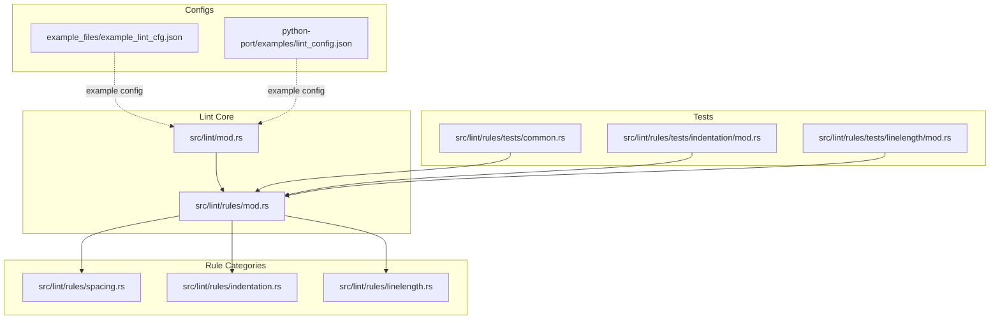
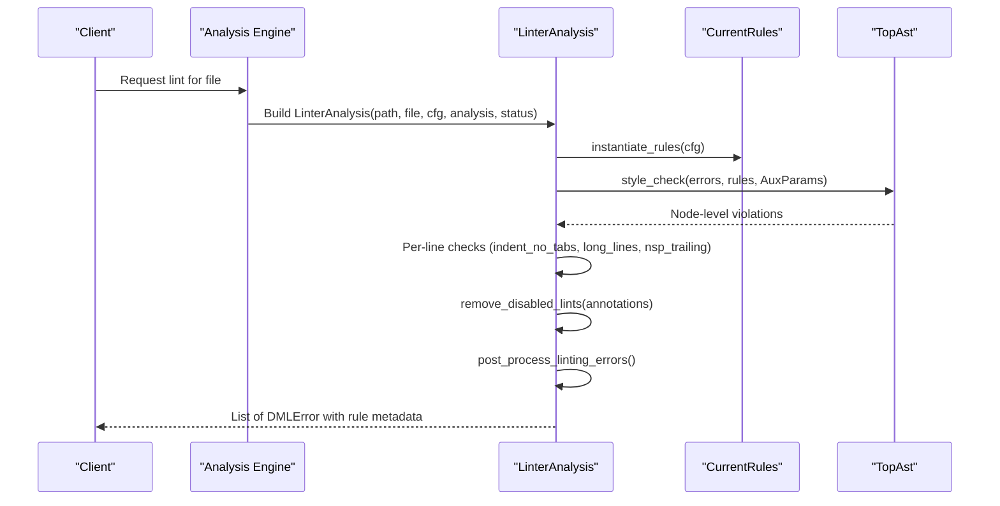
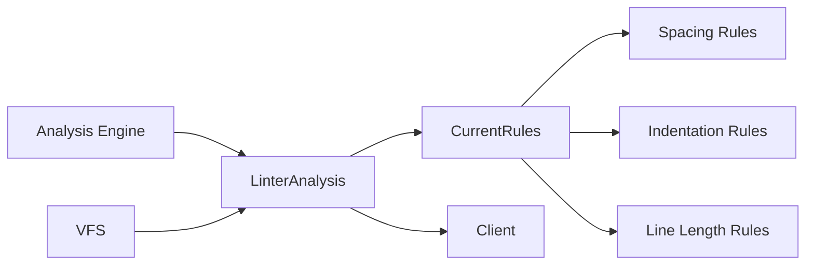

# Configurable Linting Support

<cite>
**Referenced Files in This Document**
- [src/lint/mod.rs](file://src/lint/mod.rs)
- [src/lint/rules/mod.rs](file://src/lint/rules/mod.rs)
- [src/lint/rules/spacing.rs](file://src/lint/rules/spacing.rs)
- [src/lint/rules/indentation.rs](file://src/lint/rules/indentation.rs)
- [src/lint/rules/linelength.rs](file://src/lint/rules/linelength.rs)
- [src/lint/rules/tests/common.rs](file://src/lint/rules/tests/common.rs)
- [src/lint/rules/tests/indentation/mod.rs](file://src/lint/rules/tests/indentation/mod.rs)
- [src/lint/rules/tests/linelength/mod.rs](file://src/lint/rules/tests/linelength/mod.rs)
- [example_files/example_lint_cfg.json](file://example_files/example_lint_cfg.json)
- [python-port/examples/lint_config.json](file://python-port/examples/lint_config.json)
</cite>

## Table of Contents
1. [Introduction](#introduction)
2. [Project Structure](#project-structure)
3. [Core Components](#core-components)
4. [Architecture Overview](#architecture-overview)
5. [Detailed Component Analysis](#detailed-component-analysis)
6. [Dependency Analysis](#dependency-analysis)
7. [Performance Considerations](#performance-considerations)
8. [Troubleshooting Guide](#troubleshooting-guide)
9. [Conclusion](#conclusion)
10. [Appendices](#appendices)

## Introduction
This document describes the configurable linting system for the DML language server. It explains the architecture supporting pluggable rule categories (spacing, indentation, and line length), how lint configurations are managed and applied, how rules are activated or deactivated, and how lint warnings are generated, categorized by severity, and reported to clients. It also covers rule execution order, performance characteristics, integration with the analysis engine, and configuration file formats and customization options. Finally, it connects lint rules to DML language constructs and provides examples of common violations and resolutions.

## Project Structure
The linting subsystem is organized around a central configuration module and a rules registry that instantiates rule sets according to user preferences. Tests demonstrate rule behavior and configuration parsing.

**Diagram sources**
- [src/lint/mod.rs](file://src/lint/mod.rs#L49-L184)
- [src/lint/rules/mod.rs](file://src/lint/rules/mod.rs#L1-L88)
- [src/lint/rules/spacing.rs](file://src/lint/rules/spacing.rs)
- [src/lint/rules/indentation.rs](file://src/lint/rules/indentation.rs)
- [src/lint/rules/linelength.rs](file://src/lint/rules/linelength.rs)
- [src/lint/rules/tests/common.rs](file://src/lint/rules/tests/common.rs)
- [src/lint/rules/tests/indentation/mod.rs](file://src/lint/rules/tests/indentation/mod.rs)
- [src/lint/rules/tests/linelength/mod.rs](file://src/lint/rules/tests/linelength/mod.rs)
- [example_files/example_lint_cfg.json](file://example_files/example_lint_cfg.json)
- [python-port/examples/lint_config.json](file://python-port/examples/lint_config.json)

**Section sources**
- [src/lint/mod.rs](file://src/lint/mod.rs#L49-L184)
- [src/lint/rules/mod.rs](file://src/lint/rules/mod.rs#L1-L88)

## Core Components
- Lint configuration model and deserialization
  - Centralized configuration structure with optional rule-specific options for each category.
  - Unknown field detection during deserialization.
  - Default configuration enabling most rules with sensible defaults.
- Rule instantiation and activation
  - A registry that builds a CurrentRules bundle from LintCfg, enabling or disabling rules based on presence of options.
- Lint execution pipeline
  - AST traversal with per-node checks.
  - Per-line checks for spacing and indentation constraints.
  - Annotation-based suppression of specific rules.
  - Post-processing to refine results (e.g., removing redundant errors).
- Error reporting
  - Structured lint errors with rule identity, type, and range.
  - Optional client-side annotation of warnings with rule identifiers.

Key implementation references:
- Configuration and defaults: [src/lint/mod.rs](file://src/lint/mod.rs#L80-L184)
- Instantiation of rules from configuration: [src/lint/rules/mod.rs](file://src/lint/rules/mod.rs#L62-L88)
- Execution pipeline: [src/lint/mod.rs](file://src/lint/mod.rs#L245-L265)
- Error model and annotation handling: [src/lint/mod.rs](file://src/lint/mod.rs#L186-L243)

**Section sources**
- [src/lint/mod.rs](file://src/lint/mod.rs#L80-L184)
- [src/lint/rules/mod.rs](file://src/lint/rules/mod.rs#L62-L88)
- [src/lint/mod.rs](file://src/lint/mod.rs#L245-L265)
- [src/lint/mod.rs](file://src/lint/mod.rs#L186-L243)

## Architecture Overview
The linting engine integrates tightly with the analysis pipeline. It receives an isolated analysis result (AST and file text), applies configured rules, and produces a list of structured warnings.

**Diagram sources**
- [src/lint/mod.rs](file://src/lint/mod.rs#L208-L243)
- [src/lint/mod.rs](file://src/lint/mod.rs#L245-L265)
- [src/lint/rules/mod.rs](file://src/lint/rules/mod.rs#L62-L88)

## Detailed Component Analysis

### Configuration Management and Activation
- Configuration file format
  - JSON with optional fields for each rule category. Unknown fields are captured separately to support forward compatibility and user feedback.
- Activation mechanism
  - Presence of a rule’s options in the configuration enables that rule; absence disables it.
  - Defaults enable a broad set of rules with safe defaults.
- Example configurations
  - Example JSON configs are provided for quick start and validation.

Implementation references:
- Parsing and unknown field detection: [src/lint/mod.rs](file://src/lint/mod.rs#L49-L76)
- Deserialization and unknown tracking: [src/lint/mod.rs](file://src/lint/mod.rs#L135-L148)
- Default configuration: [src/lint/mod.rs](file://src/lint/mod.rs#L154-L184)
- Example configs: [example_files/example_lint_cfg.json](file://example_files/example_lint_cfg.json), [python-port/examples/lint_config.json](file://python-port/examples/lint_config.json)

**Section sources**
- [src/lint/mod.rs](file://src/lint/mod.rs#L49-L76)
- [src/lint/mod.rs](file://src/lint/mod.rs#L135-L148)
- [src/lint/mod.rs](file://src/lint/mod.rs#L154-L184)
- [example_files/example_lint_cfg.json](file://example_files/example_lint_cfg.json)
- [python-port/examples/lint_config.json](file://python-port/examples/lint_config.json)

### Rule Categories and Execution Order
- Spacing rules
  - Cover spacing around reserved words, braces, punctuation, binary operators, ternary operators, pointer declarations, and unary/namespaces.
  - Enabled/disabled via options under the spacing category.
- Indentation rules
  - Enforce indentation size, prohibit tabs, enforce code block indentation, closing brace alignment, parentheses expression indentation, switch case indentation, empty loop indentation, and continuation line indentation.
  - Many indentation rules accept per-rule options (e.g., indentation_spaces).
- Line length rules
  - Enforce maximum line length and formatting decisions for function calls, method outputs, conditional expressions, and binary operators.

Execution order:
- AST traversal runs first, collecting violations from node-level checks.
- Per-line checks run afterward for line-wide constraints.
- Suppression annotations are applied before post-processing.
- Post-processing removes redundant errors (e.g., suppressing other violations on lines flagged by a specific rule).

Implementation references:
- Rule instantiation and activation: [src/lint/rules/mod.rs](file://src/lint/rules/mod.rs#L62-L88)
- Rule types and mapping: [src/lint/rules/mod.rs](file://src/lint/rules/mod.rs#L107-L171)
- Pipeline stages: [src/lint/mod.rs](file://src/lint/mod.rs#L245-L265)

**Section sources**
- [src/lint/rules/mod.rs](file://src/lint/rules/mod.rs#L62-L88)
- [src/lint/rules/mod.rs](file://src/lint/rules/mod.rs#L107-L171)
- [src/lint/mod.rs](file://src/lint/mod.rs#L245-L265)

### Lint Annotations and Suppression
- Inline annotations
  - Comments of the form “// dml-lint: allow=<RuleName>” suppress a specific rule for subsequent lines until a non-comment line resets the stack.
  - “// dml-lint: allow-file=<RuleName>” suppresses a rule for the entire file.
- Unknown or invalid annotations
  - Reported as configuration errors with precise ranges.
- Application
  - Disabled lints are filtered out before final reporting.

Implementation references:
- Annotation grammar and parsing: [src/lint/mod.rs](file://src/lint/mod.rs#L288-L399)
- Removal of disabled lints: [src/lint/mod.rs](file://src/lint/mod.rs#L416-L427)
- Tests validating annotation behavior: [src/lint/rules/tests/common.rs](file://src/lint/rules/tests/common.rs)

**Section sources**
- [src/lint/mod.rs](file://src/lint/mod.rs#L288-L399)
- [src/lint/mod.rs](file://src/lint/mod.rs#L416-L427)
- [src/lint/rules/tests/common.rs](file://src/lint/rules/tests/common.rs)

### Error Generation, Severity, and Reporting
- Error model
  - Each lint violation is represented as a structured error with a range, description, rule identifier, and rule type.
- Severity
  - The lint subsystem does not define separate severity levels; violations are surfaced uniformly as warnings. Clients may interpret and categorize them further.
- Reporting
  - Lint results are returned as a list of errors suitable for client consumption. Optional client-side annotation appends the rule identifier to the description.

Implementation references:
- Error creation and wrapping: [src/lint/mod.rs](file://src/lint/mod.rs#L186-L243)
- Rule trait and error construction: [src/lint/rules/mod.rs](file://src/lint/rules/mod.rs#L90-L105)

**Section sources**
- [src/lint/mod.rs](file://src/lint/mod.rs#L186-L243)
- [src/lint/rules/mod.rs](file://src/lint/rules/mod.rs#L90-L105)

### Relationship Between Lint Rules and DML Language Constructs
- Spacing rules
  - Apply to tokens such as reserved words, operators, braces, punctuation, pointer declarations, and unary constructs.
- Indentation rules
  - Apply to blocks, closing braces, parentheses expressions, switch cases, loops, and continuation lines.
- Line length rules
  - Apply to long lines and formatting choices for function calls, method outputs, conditional expressions, and binary operators.

Implementation references:
- Rule categories and rule types: [src/lint/rules/mod.rs](file://src/lint/rules/mod.rs#L10-L32)

**Section sources**
- [src/lint/rules/mod.rs](file://src/lint/rules/mod.rs#L10-L32)

### Examples of Common Lint Violations and Resolutions
Note: The following examples describe typical violations and suggested resolutions. They are illustrative and intended to help users understand rule intent.

- Spacing around binary operators
  - Violation: Missing spaces around operators.
  - Resolution: Add spaces around binary operators as per the spacing rule configuration.
- Pointer declaration spacing
  - Violation: Incorrect spacing around pointer declarations.
  - Resolution: Adjust spacing according to the pointer declaration spacing rule.
- Tab indentation used
  - Violation: Tabs present in indentation.
  - Resolution: Replace tabs with spaces as configured.
- Closing brace alignment
  - Violation: Misaligned closing brace.
  - Resolution: Align closing brace with the opening construct.
- Long line length
  - Violation: Exceeding configured maximum line length.
  - Resolution: Wrap or reformat the line to meet the limit.

These examples align with the rule categories and their typical targets as defined in the rules registry.

**Section sources**
- [src/lint/rules/mod.rs](file://src/lint/rules/mod.rs#L10-L32)

### Custom Rule Development
To add a new lint rule:
- Define the rule struct and implement the Rule trait with name, description, and get_rule_type.
- Add the rule to the CurrentRules struct and wire it in instantiate_rules.
- Choose an appropriate RuleType classification.
- Provide any options struct if the rule supports configuration.
- Integrate checks into the AST traversal or per-line scanning as needed.
- Add tests mirroring existing rule tests.

Implementation references:
- Rule trait and error construction: [src/lint/rules/mod.rs](file://src/lint/rules/mod.rs#L90-L105)
- CurrentRules composition: [src/lint/rules/mod.rs](file://src/lint/rules/mod.rs#L36-L60)
- Rule instantiation: [src/lint/rules/mod.rs](file://src/lint/rules/mod.rs#L62-L88)
- Test utilities for rule testing: [src/lint/rules/tests/common.rs](file://src/lint/rules/tests/common.rs)

**Section sources**
- [src/lint/rules/mod.rs](file://src/lint/rules/mod.rs#L90-L105)
- [src/lint/rules/mod.rs](file://src/lint/rules/mod.rs#L36-L60)
- [src/lint/rules/mod.rs](file://src/lint/rules/mod.rs#L62-L88)
- [src/lint/rules/tests/common.rs](file://src/lint/rules/tests/common.rs)

## Dependency Analysis
The linting system depends on the analysis engine for AST and file text, and on the VFS for file access. The rules registry encapsulates rule instantiation and activation.

**Diagram sources**
- [src/lint/mod.rs](file://src/lint/mod.rs#L208-L243)
- [src/lint/rules/mod.rs](file://src/lint/rules/mod.rs#L36-L88)

**Section sources**
- [src/lint/mod.rs](file://src/lint/mod.rs#L208-L243)
- [src/lint/rules/mod.rs](file://src/lint/rules/mod.rs#L36-L88)

## Performance Considerations
- Early exit and alive checks
  - Linting respects an alive status to abort expensive operations when the client cancels.
- Minimal allocations
  - Reuse of vectors and sets for tracking annotations and errors.
- Single-pass pipeline
  - AST traversal and per-line checks are combined to reduce file scans.
- Conditional rule execution
  - Disabled rules are not instantiated, avoiding unnecessary computation.

Recommendations:
- Keep configuration minimal to reduce rule evaluation overhead.
- Prefer targeted rule enabling for large files.
- Use allow-file sparingly to avoid broad suppression.

**Section sources**
- [src/lint/mod.rs](file://src/lint/mod.rs#L214-L216)
- [src/lint/mod.rs](file://src/lint/mod.rs#L245-L265)
- [src/lint/rules/mod.rs](file://src/lint/rules/mod.rs#L62-L88)

## Troubleshooting Guide
- Unknown configuration fields
  - Detected during deserialization; unknown fields are reported separately. Review the configuration against supported keys.
- Invalid lint annotations
  - Invalid commands or unknown rule targets produce configuration errors with precise ranges.
- Annotations without effect
  - Unapplied annotations at the end of the file trigger a warning to guide correction.
- Post-processing behavior
  - Some errors may be removed if they overlap with lines flagged by a specific rule (e.g., indentation-no-tabs).

Implementation references:
- Unknown field detection and reporting: [src/lint/mod.rs](file://src/lint/mod.rs#L49-L76)
- Annotation parsing and errors: [src/lint/mod.rs](file://src/lint/mod.rs#L288-L399)
- Post-processing filtering: [src/lint/mod.rs](file://src/lint/mod.rs#L401-L414)

**Section sources**
- [src/lint/mod.rs](file://src/lint/mod.rs#L49-L76)
- [src/lint/mod.rs](file://src/lint/mod.rs#L288-L399)
- [src/lint/mod.rs](file://src/lint/mod.rs#L401-L414)

## Conclusion
The linting system provides a flexible, configurable framework for enforcing DML style and formatting standards. Its modular design allows easy activation/deactivation of rule categories, precise suppression via inline annotations, and straightforward extension for new rules. Integrated with the analysis engine, it delivers actionable warnings with rich metadata for client consumption.

## Appendices

### Appendix A: Configuration Keys and Options
- Spacing rules
  - sp_reserved, sp_brace, sp_punct, sp_binop, sp_ternary, sp_ptrdecl, nsp_ptrdecl, nsp_funpar, nsp_inparen, nsp_unary, nsp_trailing
- Indentation rules
  - long_lines, indent_size, indent_no_tabs, indent_code_block, indent_closing_brace, indent_paren_expr, indent_switch_case, indent_empty_loop, indent_continuation_line
- Line length rules
  - break_func_call_open_paren, break_conditional_expression, break_method_output, break_before_binary_op
- Global
  - annotate_lints (boolean)

Defaults enable a broad set of rules with sensible defaults.

**Section sources**
- [src/lint/mod.rs](file://src/lint/mod.rs#L80-L184)

### Appendix B: Example Configuration Files
- Example JSON configuration files are provided for quick setup and validation.

**Section sources**
- [example_files/example_lint_cfg.json](file://example_files/example_lint_cfg.json)
- [python-port/examples/lint_config.json](file://python-port/examples/lint_config.json)