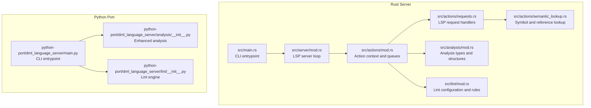
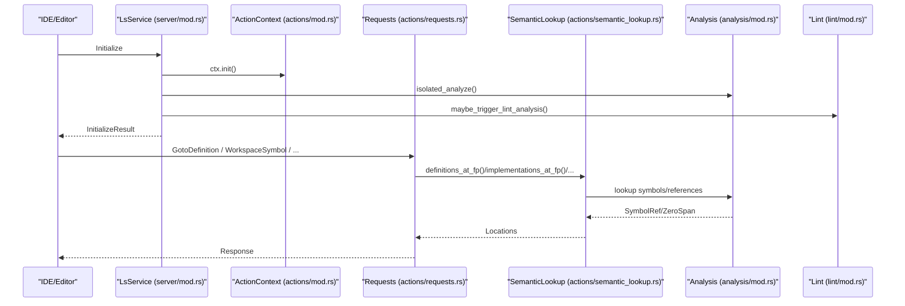
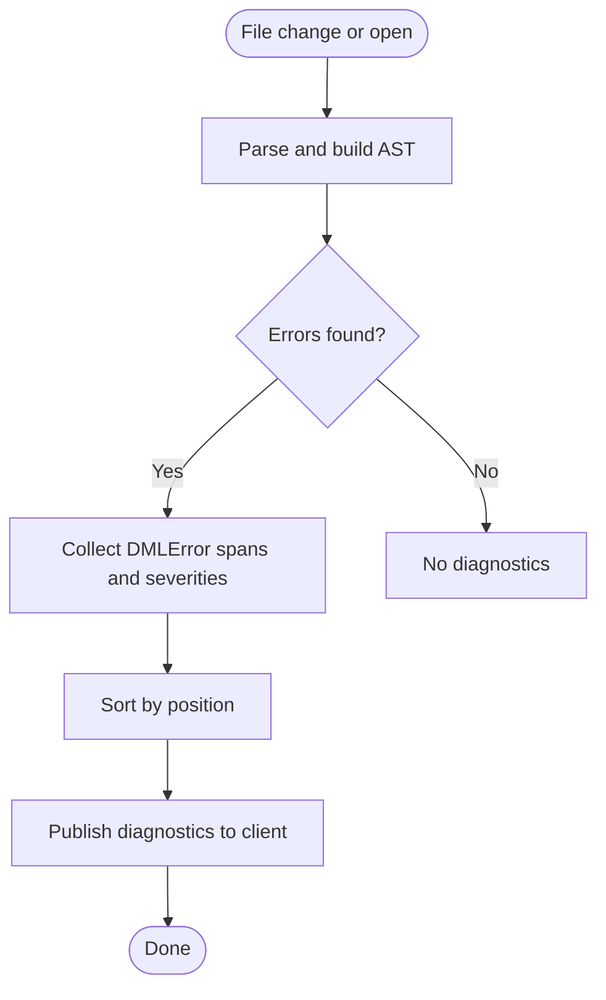
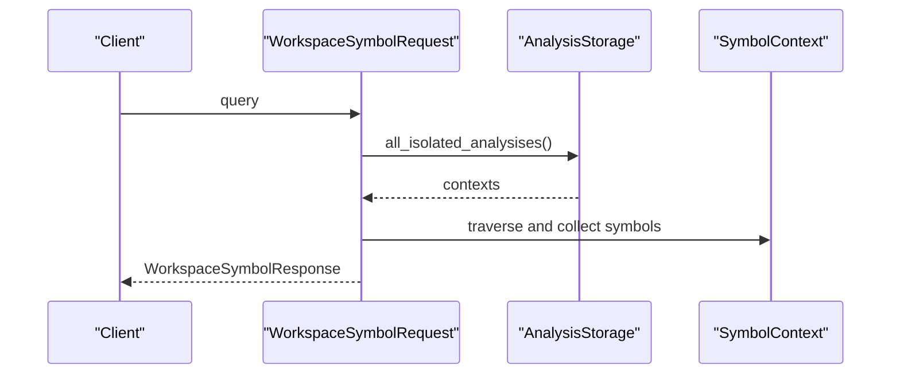
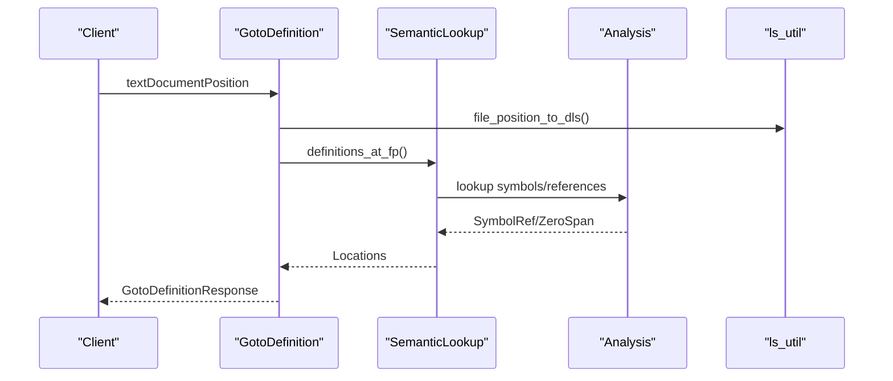
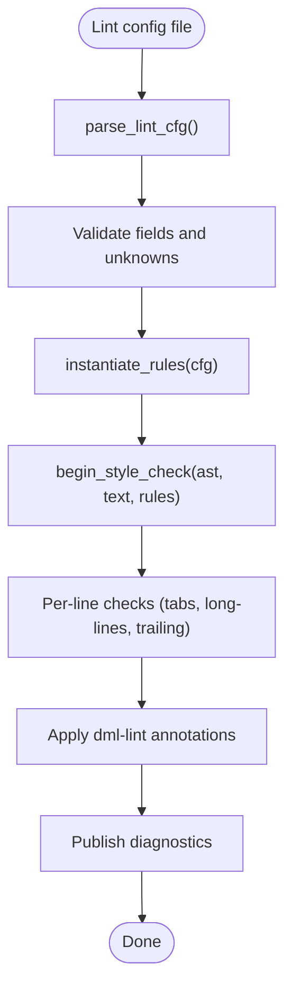
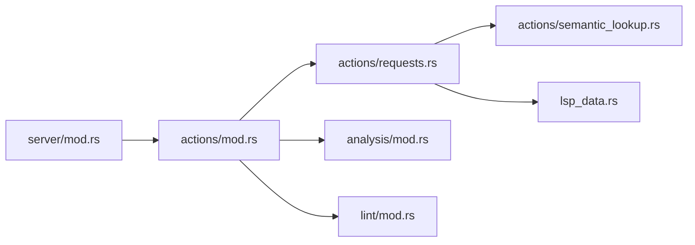

# Core Features

<cite>
**Referenced Files in This Document**
- [main.rs](file://src/main.rs)
- [main.py](file://python-port/dml_language_server/main.py)
- [mod.rs (server)](file://src/server/mod.rs)
- [mod.rs (actions)](file://src/actions/mod.rs)
- [requests.rs](file://src/actions/requests.rs)
- [semantic_lookup.rs](file://src/actions/semantic_lookup.rs)
- [mod.rs (analysis)](file://src/analysis/mod.rs)
- [lsp_data.rs](file://src/lsp_data.rs)
- [mod.rs (lint)](file://src/lint/mod.rs)
- [__init__.py (lint)](file://python-port/dml_language_server/lint/__init__.py)
- [__init__.py (analysis)](file://python-port/dml_language_server/analysis/__init__.py)
- [example_lint_cfg.json](file://example_files/example_lint_cfg.json)
- [example_lint_cfg.README](file://example_files/example_lint_cfg.README)
</cite>

## Table of Contents
1. [Introduction](#introduction)
2. [Project Structure](#project-structure)
3. [Core Components](#core-components)
4. [Architecture Overview](#architecture-overview)
5. [Detailed Component Analysis](#detailed-component-analysis)
6. [Dependency Analysis](#dependency-analysis)
7. [Performance Considerations](#performance-considerations)
8. [Troubleshooting Guide](#troubleshooting-guide)
9. [Conclusion](#conclusion)
10. [Appendices](#appendices)

## Introduction
This document details the core features of the DML Language Server (DLS), focusing on syntax error reporting, symbol search, navigation (Go To Definition, Go To Implementation, Find References, Go To Base), and configurable linting with warning messages. It explains how each feature is implemented, how they interact, and how to configure them. It also documents the DML 1.4 language support scope and limitations, and provides guidance on performance and troubleshooting.

## Project Structure
The DLS is implemented in Rust with a Python port for prototyping and experimentation. The core runtime and production server live under src/, while the Python port resides under python-port/. The server exposes LSP capabilities and integrates analysis, symbol resolution, and linting.

**Diagram sources**
- [main.rs](file://src/main.rs#L15-L59)
- [mod.rs (server)](file://src/server/mod.rs#L68-L84)
- [mod.rs (actions)](file://src/actions/mod.rs#L1-L120)
- [requests.rs](file://src/actions/requests.rs#L276-L303)
- [semantic_lookup.rs](file://src/actions/semantic_lookup.rs#L88-L129)
- [mod.rs (analysis)](file://src/analysis/mod.rs#L246-L269)
- [mod.rs (lint)](file://src/lint/mod.rs#L49-L76)
- [main.py](file://python-port/dml_language_server/main.py#L52-L91)
- [__init__.py (analysis)](file://python-port/dml_language_server/analysis/__init__.py#L182-L293)
- [__init__.py (lint)](file://python-port/dml_language_server/lint/__init__.py#L196-L288)

**Section sources**
- [main.rs](file://src/main.rs#L15-L59)
- [main.py](file://python-port/dml_language_server/main.py#L52-L91)

## Core Components
- Syntax error reporting: Built on parsing and analysis structures that produce diagnostic spans and severities.
- Symbol search: Workspace and document symbol queries backed by symbol contexts and scopes.
- Navigation: Go To Definition, Go To Implementation, Find References, and Go To Base leverage semantic lookup and reference resolution.
- Configurable linting: Lint configuration parsing, rule instantiation, and per-file diagnostics with optional line-level annotations.

**Section sources**
- [mod.rs (analysis)](file://src/analysis/mod.rs#L164-L219)
- [requests.rs](file://src/actions/requests.rs#L276-L303)
- [semantic_lookup.rs](file://src/actions/semantic_lookup.rs#L299-L383)
- [mod.rs (lint)](file://src/lint/mod.rs#L49-L76)

## Architecture Overview
The server initializes, sets capabilities, and handles LSP messages. Requests are dispatched to handlers that coordinate analysis, symbol lookup, and linting. Results are published as diagnostics and responses.

**Diagram sources**
- [mod.rs (server)](file://src/server/mod.rs#L207-L289)
- [mod.rs (actions)](file://src/actions/mod.rs#L417-L451)
- [requests.rs](file://src/actions/requests.rs#L500-L554)
- [semantic_lookup.rs](file://src/actions/semantic_lookup.rs#L299-L383)
- [mod.rs (analysis)](file://src/analysis/mod.rs#L246-L269)
- [mod.rs (lint)](file://src/lint/mod.rs#L245-L265)

## Detailed Component Analysis

### Syntax Error Reporting
- Purpose: Produce diagnostics for syntax and semantic errors across files.
- Implementation:
  - Parsing and AST construction yield errors with spans.
  - Diagnostics are gathered from isolated and device analyses.
  - Diagnostics are published to the client via publish diagnostics notifications.
- Key types and flows:
  - DMLError carries span, description, severity, and related information.
  - IsolatedAnalysis and DeviceAnalysis expose errors and symbol information.
  - report_errors aggregates and sorts diagnostics per file.

**Diagram sources**
- [mod.rs (analysis)](file://src/analysis/mod.rs#L164-L219)
- [mod.rs (actions)](file://src/actions/mod.rs#L503-L557)

**Section sources**
- [mod.rs (analysis)](file://src/analysis/mod.rs#L164-L219)
- [mod.rs (actions)](file://src/actions/mod.rs#L503-L557)

### Symbol Search (Workspace and Document)
- WorkspaceSymbolRequest: Builds a flattened list of symbols from all isolated analyses and filters by query.
- DocumentSymbolRequest: Returns hierarchical document symbols for a given file by unfolding the top-level context.
- Implementation relies on context-to-symbol conversion and recursive traversal of symbol contexts.

**Diagram sources**
- [requests.rs](file://src/actions/requests.rs#L276-L303)
- [requests.rs](file://src/actions/requests.rs#L305-L342)

**Section sources**
- [requests.rs](file://src/actions/requests.rs#L276-L303)
- [requests.rs](file://src/actions/requests.rs#L305-L342)

### Navigation Features
- Go To Definition: Resolves definitions for a symbol at a position, including method overrides and declarations.
- Go To Implementation: Finds implementations for methods and other polymorphic constructs.
- Find References: Returns all reference locations for a symbol at a position.
- Go To Base: Returns base declarations for methods and parameters.
- Implementation approach:
  - Convert LSP position to internal file position.
  - Wait for device analysis readiness.
  - Use semantic_lookup to map positions to symbols or references.
  - Convert results to LSP locations and handle limitations (e.g., template instantiation).

**Diagram sources**
- [requests.rs](file://src/actions/requests.rs#L500-L554)
- [semantic_lookup.rs](file://src/actions/semantic_lookup.rs#L347-L361)
- [lsp_data.rs](file://src/lsp_data.rs#L154-L161)

**Section sources**
- [requests.rs](file://src/actions/requests.rs#L384-L441)
- [requests.rs](file://src/actions/requests.rs#L443-L498)
- [requests.rs](file://src/actions/requests.rs#L500-L554)
- [requests.rs](file://src/actions/requests.rs#L556-L612)
- [semantic_lookup.rs](file://src/actions/semantic_lookup.rs#L299-L383)
- [lsp_data.rs](file://src/lsp_data.rs#L154-L161)

### Configurable Linting Support
- Purpose: Provide style and convention warnings with granular configuration.
- Implementation:
  - Lint configuration is parsed from JSON and validated; unknown fields are reported.
  - Rules are instantiated from configuration and applied to files.
  - Per-line checks complement AST-based style checks.
  - Line-level annotations allow selective disabling of rules for specific lines or files.
  - Diagnostics are published alongside syntax and semantic diagnostics.

**Diagram sources**
- [mod.rs (lint)](file://src/lint/mod.rs#L49-L76)
- [mod.rs (lint)](file://src/lint/mod.rs#L245-L265)
- [mod.rs (lint)](file://src/lint/mod.rs#L245-L265)
- [mod.rs (lint)](file://src/lint/mod.rs#L288-L399)

**Section sources**
- [mod.rs (lint)](file://src/lint/mod.rs#L49-L76)
- [mod.rs (lint)](file://src/lint/mod.rs#L135-L184)
- [mod.rs (lint)](file://src/lint/mod.rs#L245-L265)
- [mod.rs (lint)](file://src/lint/mod.rs#L288-L399)

### Python Port: Lint Engine and Enhanced Analysis
- The Python port provides a lint engine and enhanced analysis for prototyping and compatibility.
- LintEngine loads configuration, registers rules, and applies per-rule settings.
- Enhanced analysis builds symbol scopes, validates file structure, and extracts symbols and references.

**Section sources**
- [__init__.py (lint)](file://python-port/dml_language_server/lint/__init__.py#L196-L288)
- [__init__.py (analysis)](file://python-port/dml_language_server/analysis/__init__.py#L182-L293)

## Dependency Analysis
- The server depends on analysis types for symbol and reference resolution.
- Requests depend on semantic lookup to map positions to symbols and locations.
- Linting depends on configuration parsing and rule instantiation.
- The Python port mirrors core concepts for compatibility.

**Diagram sources**
- [mod.rs (server)](file://src/server/mod.rs#L68-L84)
- [mod.rs (actions)](file://src/actions/mod.rs#L1-L120)
- [requests.rs](file://src/actions/requests.rs#L276-L303)
- [semantic_lookup.rs](file://src/actions/semantic_lookup.rs#L88-L129)
- [mod.rs (analysis)](file://src/analysis/mod.rs#L246-L269)
- [mod.rs (lint)](file://src/lint/mod.rs#L49-L76)
- [lsp_data.rs](file://src/lsp_data.rs#L127-L216)

**Section sources**
- [mod.rs (server)](file://src/server/mod.rs#L68-L84)
- [mod.rs (actions)](file://src/actions/mod.rs#L1-L120)
- [requests.rs](file://src/actions/requests.rs#L276-L303)
- [semantic_lookup.rs](file://src/actions/semantic_lookup.rs#L88-L129)
- [mod.rs (analysis)](file://src/analysis/mod.rs#L246-L269)
- [mod.rs (lint)](file://src/lint/mod.rs#L49-L76)
- [lsp_data.rs](file://src/lsp_data.rs#L127-L216)

## Performance Considerations
- Incremental analysis: The server tracks analysis state and updates only when needed, reducing redundant work.
- Concurrency: Analysis queues and background workers prevent UI blocking during parsing and linting.
- Diagnostics batching: Errors are sorted and published in batches to minimize client churn.
- Limitations: Some semantic operations (e.g., type-based references) are limited and may require device context activation.

[No sources needed since this section provides general guidance]

## Troubleshooting Guide
- Unknown lint configuration fields: The server reports unknown fields and continues with defaults.
- Deprecated or duplicated configuration keys: Warnings are issued for deprecated and duplicated keys.
- Missing built-in files: A warning is issued if essential built-in templates are not found, affecting semantic analysis.
- Limitations in results: Responses may include limitations indicating partial results due to internal constraints.

**Section sources**
- [mod.rs (server)](file://src/server/mod.rs#L167-L181)
- [mod.rs (server)](file://src/server/mod.rs#L183-L205)
- [mod.rs (actions)](file://src/actions/mod.rs#L776-L788)

## Conclusion
The DML Language Server provides robust syntax error reporting, symbol search, and navigation features powered by precise analysis and symbol resolution. Its configurable linting supports customizable style enforcement with per-line annotations. The architecture balances performance with correctness, and the server surfaces limitations clearly to guide users toward complete results.

[No sources needed since this section summarizes without analyzing specific files]

## Appendices

### DML 1.4 Language Support Scope and Limitations
- Scope:
  - Supports DML 1.4 language constructs and device modeling.
  - Includes parsing, semantic analysis, and linting tailored to DML.
- Known limitations:
  - Type-based semantic analysis and references are limited.
  - References inside uninstantiated templates require a device context for accurate results.
  - Some advanced features may require device files that import the relevant constructs.

**Section sources**
- [semantic_lookup.rs](file://src/actions/semantic_lookup.rs#L44-L62)
- [semantic_lookup.rs](file://src/actions/semantic_lookup.rs#L214-L223)

### Feature Configuration Options and Customization
- CLI options:
  - --cli: Run in command-line mode.
  - --compile-info: Path to compile-info JSON for include paths and defines.
  - --linting/--no-linting: Toggle linting globally.
  - --lint-cfg: Path to lint configuration JSON.
  - --verbose/-v: Enable verbose logging.
- Lint configuration:
  - JSON schema supports numerous style options (spacing, indentation, line length, etc.).
  - Unknown fields are reported; defaults are applied for unspecified options.
  - Example configuration and README are provided in example_files/.

**Section sources**
- [main.rs](file://src/main.rs#L21-L42)
- [main.py](file://python-port/dml_language_server/main.py#L25-L51)
- [mod.rs (lint)](file://src/lint/mod.rs#L49-L76)
- [example_lint_cfg.json](file://example_files/example_lint_cfg.json)
- [example_lint_cfg.README](file://example_files/example_lint_cfg.README)