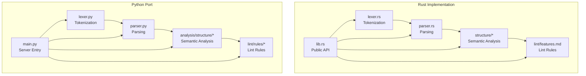
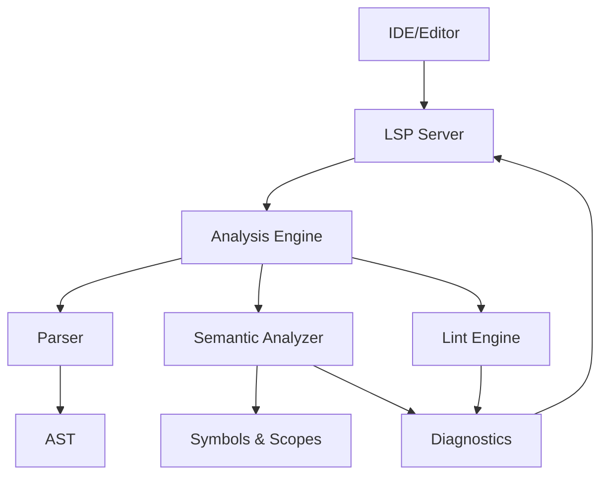
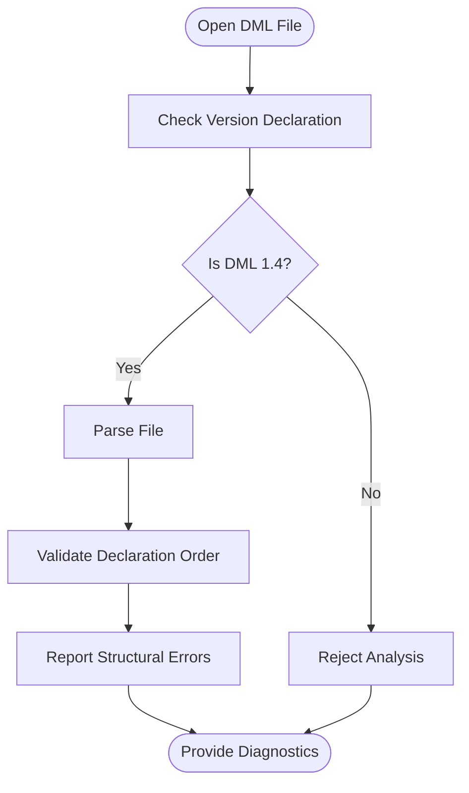
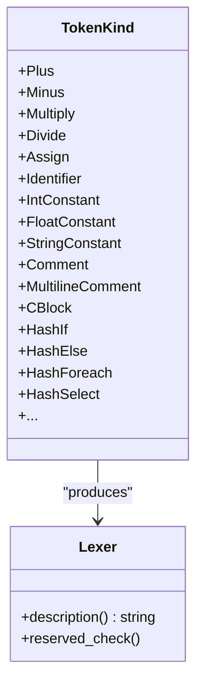
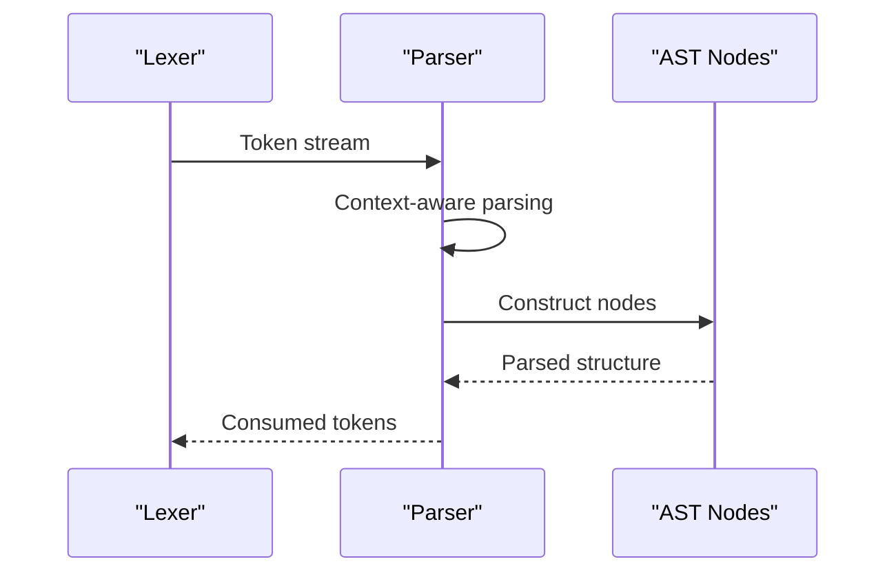
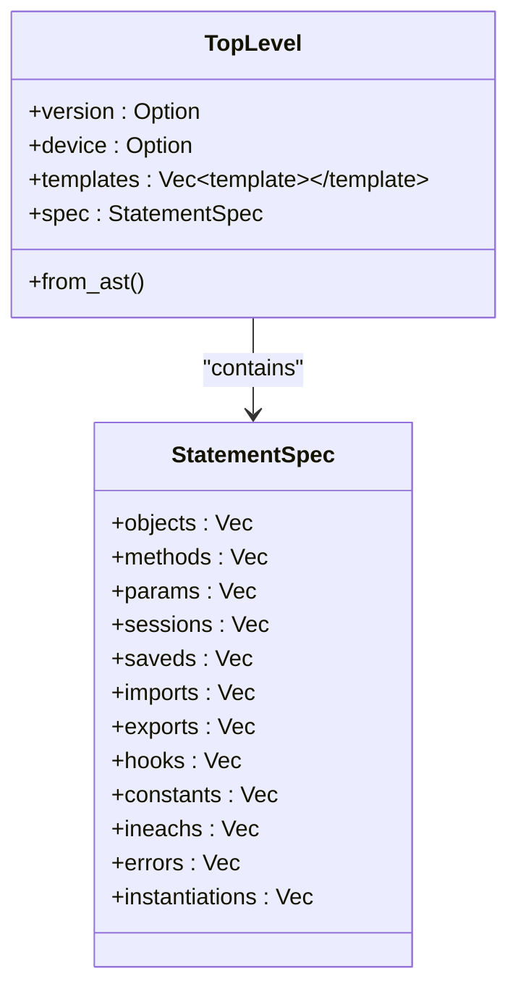
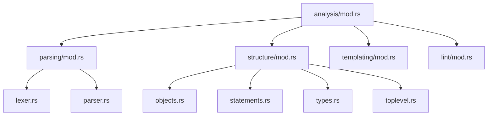

# DML Language Support Scope

<cite>
**Referenced Files in This Document**
- [README.md](file://README.md)
- [lib.rs](file://src/lib.rs)
- [mod.rs](file://src/analysis/mod.rs)
- [parser.rs](file://src/analysis/parsing/parser.rs)
- [lexer.rs](file://src/analysis/parsing/lexer.rs)
- [toplevel.rs](file://src/analysis/structure/toplevel.rs)
- [objects.rs](file://src/analysis/structure/objects.rs)
- [statements.rs](file://src/analysis/structure/statements.rs)
- [types.rs](file://src/analysis/structure/types.rs)
- [features.md](file://src/lint/features.md)
- [IMPLEMENTATION_SUMMARY.md](file://python-port/IMPLEMENTATION_SUMMARY.md)
- [ENHANCEMENTS_COMPLETED.md](file://python-port/ENHANCEMENTS_COMPLETED.md)
- [ENHANCEMENT_PLAN.md](file://python-port/ENHANCEMENT_PLAN.md)
- [README.md](file://python-port/README.md)
</cite>

## Table of Contents
1. [Introduction](#introduction)
2. [Project Structure](#project-structure)
3. [Core Components](#core-components)
4. [Architecture Overview](#architecture-overview)
5. [Detailed Component Analysis](#detailed-component-analysis)
6. [Dependency Analysis](#dependency-analysis)
7. [Performance Considerations](#performance-considerations)
8. [Troubleshooting Guide](#troubleshooting-guide)
9. [Conclusion](#conclusion)
10. [Appendices](#appendices)

## Introduction
This document describes the DML language support scope and limitations of the DML Language Server (DLS). It explains the DML 1.4 language specification coverage, supported language constructs, and syntax elements. It also documents version compatibility requirements, limitations regarding DML 1.2 code support, and the relationship between language version declarations and analysis capabilities. Guidance on feature usage and limitations is provided, along with current status and roadmap considerations for future language support.

## Project Structure
The DLS consists of:
- A Rust implementation (primary) providing parsing, semantic analysis, and LSP integration
- A Python port mirroring the Rust architecture for broader accessibility and development flexibility

Key areas covered:
- Lexical analysis and tokenization
- Parsing and AST construction
- Semantic analysis and symbol resolution
- Linting rules and diagnostics
- LSP server and client integration

**Diagram sources**
- [lexer.rs](file://src/analysis/parsing/lexer.rs#L96-L424)
- [parser.rs](file://src/analysis/parsing/parser.rs#L1-L800)
- [toplevel.rs](file://src/analysis/structure/toplevel.rs#L546-L625)
- [features.md](file://src/lint/features.md#L1-L75)
- [lib.rs](file://src/lib.rs#L1-L56)
- [README.md](file://python-port/README.md#L1-L243)

**Section sources**
- [README.md](file://README.md#L1-L57)
- [lib.rs](file://src/lib.rs#L1-L56)
- [README.md](file://python-port/README.md#L1-L243)

## Core Components
- Language version support: DML 1.4 only
- Lexical analysis: Comprehensive tokenization including reserved words, operators, literals, comments, and C-blocks
- Parsing: Grammar-driven construction of AST nodes for statements, expressions, and top-level declarations
- Semantic analysis: Symbol extraction, scope resolution, and structural validation
- Linting: Configurable rules for spacing, indentation, line length, and code style
- LSP integration: Basic LSP features with room for enhancement

**Section sources**
- [README.md](file://README.md#L18-L20)
- [lib.rs](file://src/lib.rs#L8-L10)
- [lexer.rs](file://src/analysis/parsing/lexer.rs#L96-L424)
- [parser.rs](file://src/analysis/parsing/parser.rs#L1-L800)
- [toplevel.rs](file://src/analysis/structure/toplevel.rs#L627-L645)
- [features.md](file://src/lint/features.md#L1-L75)

## Architecture Overview
The DLS architecture separates concerns into lexical analysis, parsing, semantic analysis, linting, and LSP integration. The Rust implementation provides robust parsing and semantic analysis, while the Python port mirrors this structure for development and experimentation.

**Diagram sources**
- [lib.rs](file://src/lib.rs#L32-L48)
- [mod.rs](file://src/analysis/mod.rs#L1-L12)
- [features.md](file://src/lint/features.md#L1-L75)

## Detailed Component Analysis

### Language Version Declarations and Compatibility
- The server only supports DML 1.4 code and has no plans to support DML 1.2
- Analysis is restricted to files declared as using DML 1.4
- Structural validation enforces top-level declaration order and version presence

**Diagram sources**
- [toplevel.rs](file://src/analysis/structure/toplevel.rs#L627-L645)
- [README.md](file://README.md#L18-L20)

**Section sources**
- [README.md](file://README.md#L18-L20)
- [toplevel.rs](file://src/analysis/structure/toplevel.rs#L627-L645)

### Lexical Analysis and Reserved Keywords
- The lexer recognizes a comprehensive set of reserved words and operators
- Reserved words include DML-specific keywords and common C/C++ reserved words
- Tokens include identifiers, literals, operators, punctuators, comments, and C-blocks

**Diagram sources**
- [lexer.rs](file://src/analysis/parsing/lexer.rs#L96-L424)

**Section sources**
- [lexer.rs](file://src/analysis/parsing/lexer.rs#L96-L424)

### Parsing and AST Construction
- The parser builds AST nodes for statements, expressions, and top-level declarations
- Context-aware parsing handles nested constructs and recovery strategies
- ParseContext manages token consumption and error reporting

**Diagram sources**
- [parser.rs](file://src/analysis/parsing/parser.rs#L322-L483)

**Section sources**
- [parser.rs](file://src/analysis/parsing/parser.rs#L1-L800)

### Semantic Analysis and Symbol Resolution
- Semantic analysis extracts symbols, resolves scopes, and validates structures
- Top-level constructs enforce declaration order and version presence
- Templates, methods, and object hierarchies are represented and validated

**Diagram sources**
- [toplevel.rs](file://src/analysis/structure/toplevel.rs#L546-L625)
- [objects.rs](file://src/analysis/structure/objects.rs#L232-L291)

**Section sources**
- [toplevel.rs](file://src/analysis/structure/toplevel.rs#L546-L625)
- [objects.rs](file://src/analysis/structure/objects.rs#L651-L731)

### Language Constructs Coverage
Supported constructs include:
- Top-level declarations: version, device, bitorder, imports, exports, typedefs, templates, constants, loggroups, headers/footers, externs, and C blocks
- Object declarations: devices, banks, registers, fields, methods, parameters, attributes, connections, interfaces, ports, events, groups, data, sessions, saveds, constants, typedefs, variables, hooks, subdevices, loggroups
- Statements: expressions, blocks, conditionals, loops, switches, jumps, try/catch/throw, logs, asserts, deletes, after-statements, foreach, in-each, hash-if/hash-select
- Expressions: literals, identifiers, binary/unary operations, calls, member/indexing, ternary, slices, casts, sizeof, new, initializers
- Types: primitives, arrays, pointers, functions, structs, unions, enums, typedefs, void, auto, template types

**Section sources**
- [toplevel.rs](file://src/analysis/structure/toplevel.rs#L627-L800)
- [objects.rs](file://src/analysis/structure/objects.rs#L1-L800)
- [statements.rs](file://src/analysis/structure/statements.rs#L1-L800)
- [types.rs](file://src/analysis/structure/types.rs#L1-L90)

### Linting Rules and Diagnostics
- Spacing rules: spaces around reserved words, binary operators, ternary operators, braces, punctuation, pointer declarations, function parameters, parentheses, unary operators
- Indentation rules: fixed indentation spaces, no tabs, code block indentation, closing brace alignment, parenthesized expression continuation, switch case indentation, empty loop indentation
- Line length rules: maximum line length, breaking before binary operators, conditional expressions, method output, function call open parenthesis

**Section sources**
- [features.md](file://src/lint/features.md#L1-L75)

### Python Port Implementation Summary
- Near-parity with Rust implementation for parsing and linting
- Parser fixes for device declaration, missing keywords, register template syntax, nested brace handling
- Modular lint rule system and DFA integration
- Production-ready status for file analysis, symbol extraction, basic linting, and command-line tools

**Section sources**
- [IMPLEMENTATION_SUMMARY.md](file://python-port/IMPLEMENTATION_SUMMARY.md#L1-L186)
- [ENHANCEMENTS_COMPLETED.md](file://python-port/ENHANCEMENTS_COMPLETED.md#L1-L180)
- [README.md](file://python-port/README.md#L1-L243)

## Dependency Analysis
The analysis module orchestrates parsing, semantic analysis, symbol resolution, and diagnostics. It integrates with VFS for file operations and supports incremental analysis and caching.

**Diagram sources**
- [mod.rs](file://src/analysis/mod.rs#L1-L12)
- [parser.rs](file://src/analysis/parsing/parser.rs#L1-L800)
- [lexer.rs](file://src/analysis/parsing/lexer.rs#L1-L689)
- [toplevel.rs](file://src/analysis/structure/toplevel.rs#L1-L800)
- [objects.rs](file://src/analysis/structure/objects.rs#L1-L800)
- [statements.rs](file://src/analysis/structure/statements.rs#L1-L800)
- [types.rs](file://src/analysis/structure/types.rs#L1-L90)

**Section sources**
- [mod.rs](file://src/analysis/mod.rs#L1-L12)

## Performance Considerations
- The Python port is slower than the Rust implementation for large files but remains suitable for most use cases
- Performance characteristics: comparable for small files, 2–5x slower for medium and large files
- Memory usage: higher than Rust due to Python runtime
- Optimization roadmap includes caching, incremental parsing, and parallel analysis

**Section sources**
- [ENHANCEMENTS_COMPLETED.md](file://python-port/ENHANCEMENTS_COMPLETED.md#L111-L121)
- [ENHANCEMENT_PLAN.md](file://python-port/ENHANCEMENT_PLAN.md#L73-L85)

## Troubleshooting Guide
Common issues and resolutions:
- Import errors: verify Python path and virtual environment
- Async issues: use proper async patterns and ensure correct event loop handling
- File watching: ensure proper cleanup of file watchers
- Memory leaks: clear caches and close resources
- LSP protocol errors: validate JSON-RPC message format and LSP specification compliance
- Performance problems: profile with standard tools, reduce unnecessary file system operations, optimize hot code paths

**Section sources**
- [DEVELOPMENT.md](file://python-port/DEVELOPMENT.md#L204-L345)

## Conclusion
The DML Language Server provides comprehensive support for DML 1.4, including robust parsing, semantic analysis, linting, and LSP integration. While the primary focus is on DML 1.4, the Python port offers a development-friendly environment with near-parity functionality. Future enhancements aim to expand LSP features, improve linting coverage, and optimize performance.

## Appendices

### Supported DML 1.4 Language Constructs
- Top-level declarations: version, device, bitorder, imports, exports, typedefs, templates, constants, loggroups, headers/footers, externs, C blocks
- Object declarations: devices, banks, registers, fields, methods, parameters, attributes, connections, interfaces, ports, events, groups, data, sessions, saveds, constants, typedefs, variables, hooks, subdevices, loggroups
- Statements: expressions, blocks, conditionals, loops, switches, jumps, try/catch/throw, logs, asserts, deletes, after-statements, foreach, in-each, hash-if/hash-select
- Expressions: literals, identifiers, binary/unary operations, calls, member/indexing, ternary, slices, casts, sizeof, new, initializers
- Types: primitives, arrays, pointers, functions, structs, unions, enums, typedefs, void, auto, template types

### Version Compatibility and Limitations
- DML 1.4 only: No support for DML 1.2
- Analysis scope: Files must declare DML 1.4 to be analyzed
- Structural validation: Enforces declaration order and presence of required top-level constructs

### Roadmap Considerations
- LSP actions: hover, go-to-definition, find references, document symbols
- Advanced lint rules: spacing around operators, brace placement, function parameter spacing, advanced indentation rules
- Performance optimization: caching, incremental analysis, parallel analysis
- MCP server: AI-assisted development features

**Section sources**
- [README.md](file://README.md#L18-L20)
- [toplevel.rs](file://src/analysis/structure/toplevel.rs#L627-L645)
- [features.md](file://src/lint/features.md#L1-L75)
- [ENHANCEMENT_PLAN.md](file://python-port/ENHANCEMENT_PLAN.md#L1-L85)