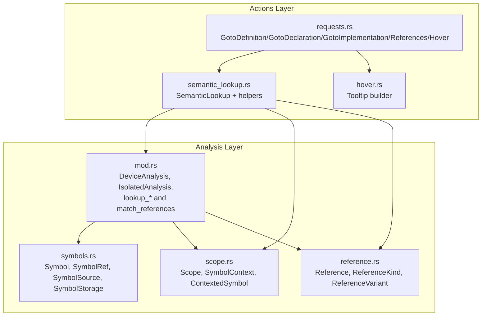
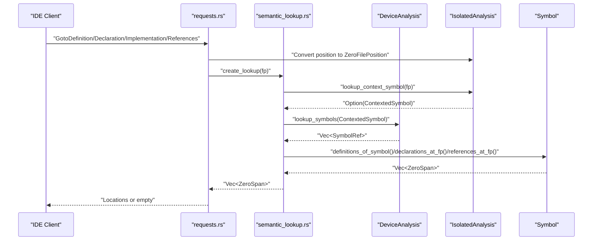
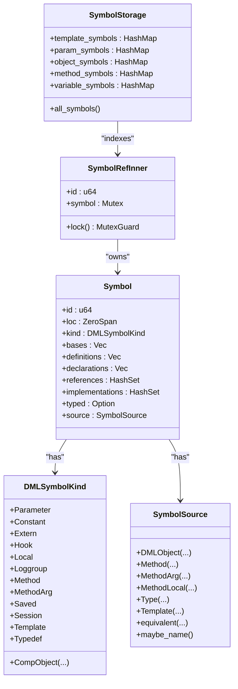
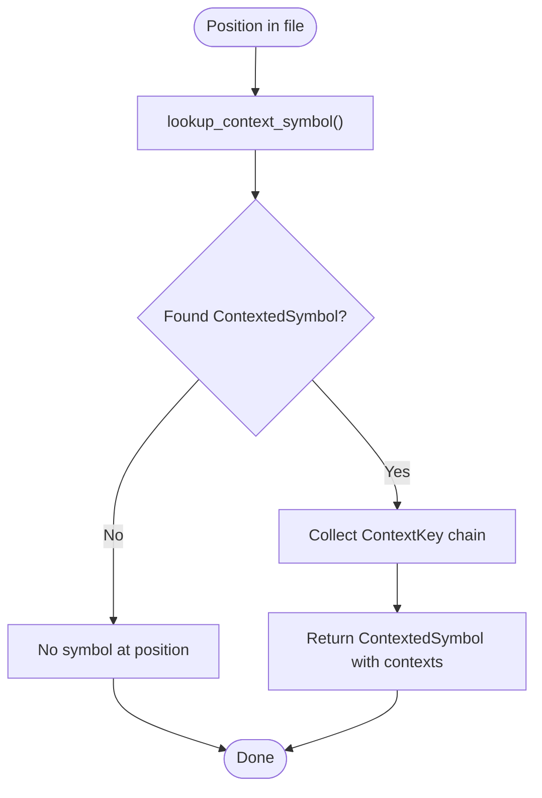
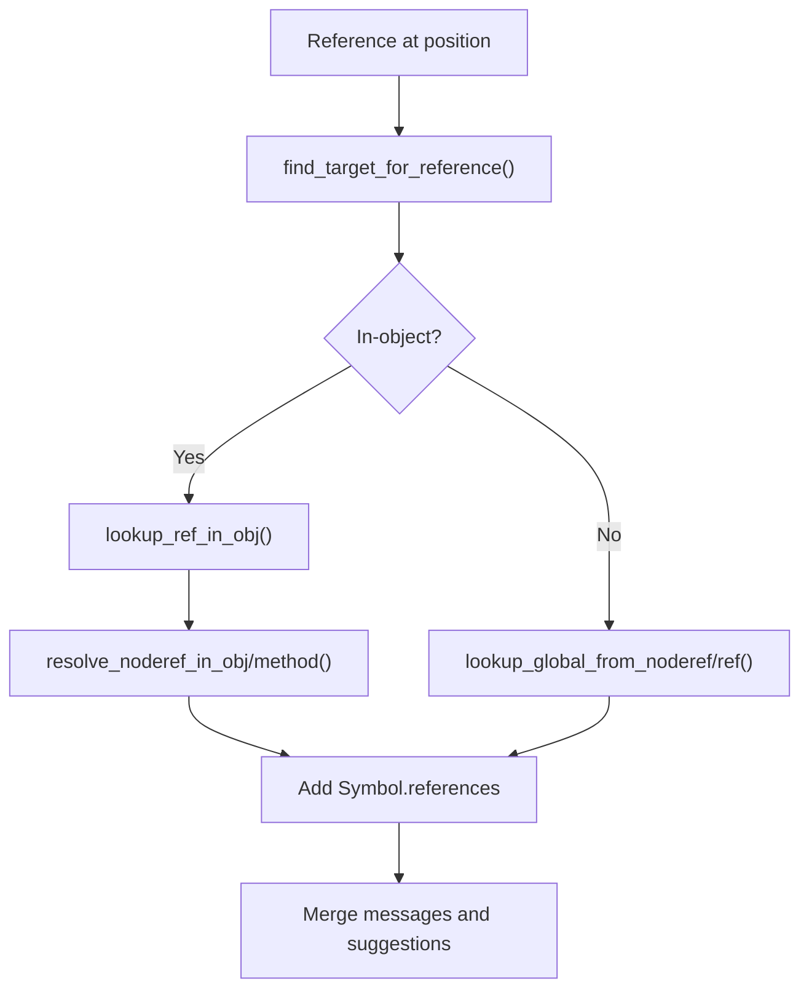
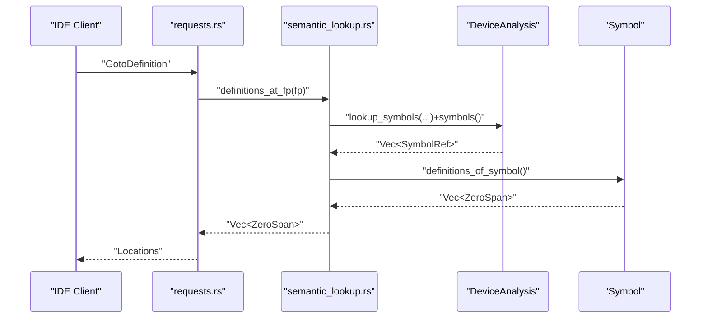
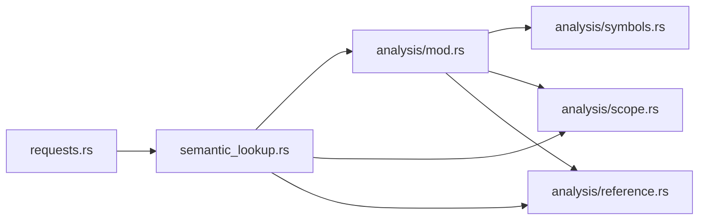

# Symbol Search and Navigation

<cite>
**Referenced Files in This Document**
- [symbols.rs](file://src/analysis/symbols.rs)
- [scope.rs](file://src/analysis/scope.rs)
- [reference.rs](file://src/analysis/reference.rs)
- [mod.rs](file://src/analysis/mod.rs)
- [semantic_lookup.rs](file://src/actions/semantic_lookup.rs)
- [requests.rs](file://src/actions/requests.rs)
- [hover.rs](file://src/actions/hover.rs)
</cite>

## Table of Contents
1. [Introduction](#introduction)
2. [Project Structure](#project-structure)
3. [Core Components](#core-components)
4. [Architecture Overview](#architecture-overview)
5. [Detailed Component Analysis](#detailed-component-analysis)
6. [Dependency Analysis](#dependency-analysis)
7. [Performance Considerations](#performance-considerations)
8. [Troubleshooting Guide](#troubleshooting-guide)
9. [Conclusion](#conclusion)

## Introduction
This document explains the symbol search and navigation capabilities of the DML Language Server. It focuses on how the server implements Go To Definition, Go To Implementation, Go To Declaration, Go To References, and Base symbol navigation. It also documents the symbol table management system, hierarchical scoping, reference resolution, indexing/searching/resolution across contexts, hover information, performance optimizations, caching strategies, and cross-file navigation. The goal is to make the implementation understandable to both developers and users who want to integrate IDE features.

## Project Structure
The symbol search and navigation system spans several modules:
- Analysis layer: symbol model, scoping, references, and device/Isolated analyses
- Actions layer: request handlers for LSP navigation requests and hover
- Semantic lookup: orchestrates symbol and reference discovery at a cursor position

**Diagram sources**
- [requests.rs](file://src/actions/requests.rs#L384-L612)
- [semantic_lookup.rs](file://src/actions/semantic_lookup.rs#L88-L129)
- [hover.rs](file://src/actions/hover.rs#L19-L29)
- [symbols.rs](file://src/analysis/symbols.rs#L180-L331)
- [scope.rs](file://src/analysis/scope.rs#L13-L62)
- [reference.rs](file://src/analysis/reference.rs#L118-L146)
- [mod.rs](file://src/analysis/mod.rs#L575-L800)

**Section sources**
- [requests.rs](file://src/actions/requests.rs#L384-L612)
- [semantic_lookup.rs](file://src/actions/semantic_lookup.rs#L88-L129)
- [hover.rs](file://src/actions/hover.rs#L19-L29)
- [symbols.rs](file://src/analysis/symbols.rs#L180-L331)
- [scope.rs](file://src/analysis/scope.rs#L13-L62)
- [reference.rs](file://src/analysis/reference.rs#L118-L146)
- [mod.rs](file://src/analysis/mod.rs#L575-L800)

## Core Components
- Symbol model and storage
  - SymbolKind enumerates DML constructs (objects, methods, parameters, constants, etc.)
  - Symbol carries locations for definitions, declarations, bases, implementations, references, and typed metadata
  - SymbolRef is a thread-safe reference to a mutable Symbol guarded by a Mutex
  - SymbolSource ties a Symbol to its origin (object, method, type, template)
  - SymbolStorage indexes symbols by location and parent context
- Scoping and context
  - Scope defines a region with defined symbols, nested scopes, and references
  - SymbolContext builds a hierarchical tree of scopes and symbols
  - ContextedSymbol pairs a SimpleSymbol with a chain of ContextKey representing the path to reach it
- References
  - ReferenceKind distinguishes Template, Type, Variable, Callable
  - ReferenceVariant wraps either a global or variable reference
  - DeviceAnalysis.match_references resolves references across scopes and populates Symbol.references and Symbol.implementations
- Lookup and navigation
  - IsolatedAnalysis provides position-to-symbol and position-to-reference lookups
  - DeviceAnalysis.lookup_symbols_by_contexted_symbol resolves symbols within device context
  - SemanticLookup coordinates symbol and reference discovery at a position

**Section sources**
- [symbols.rs](file://src/analysis/symbols.rs#L19-L35)
- [symbols.rs](file://src/analysis/symbols.rs#L180-L331)
- [scope.rs](file://src/analysis/scope.rs#L98-L139)
- [scope.rs](file://src/analysis/scope.rs#L190-L217)
- [reference.rs](file://src/analysis/reference.rs#L96-L102)
- [reference.rs](file://src/analysis/reference.rs#L118-L146)
- [mod.rs](file://src/analysis/mod.rs#L247-L269)
- [mod.rs](file://src/analysis/mod.rs#L358-L374)
- [mod.rs](file://src/analysis/mod.rs#L575-L589)
- [mod.rs](file://src/analysis/mod.rs#L1450-L1529)

## Architecture Overview
The navigation pipeline starts from an LSP request, resolves the position to a symbol or reference, and returns locations. For method symbols, implementations are expanded transitively.

**Diagram sources**
- [requests.rs](file://src/actions/requests.rs#L500-L553)
- [semantic_lookup.rs](file://src/actions/semantic_lookup.rs#L88-L129)
- [semantic_lookup.rs](file://src/actions/semantic_lookup.rs#L347-L361)
- [semantic_lookup.rs](file://src/actions/semantic_lookup.rs#L363-L383)
- [semantic_lookup.rs](file://src/actions/semantic_lookup.rs#L385-L399)
- [mod.rs](file://src/analysis/mod.rs#L575-L589)

## Detailed Component Analysis

### Symbol Model and Storage
- SymbolKind covers DML constructs and is used to map to LSP SymbolKind for document/workspace symbols
- Symbol holds:
  - loc, kind, bases, definitions, declarations, references, implementations, typed, source
  - Methods special-case: implementations include direct overrides; recursive expansion yields all overrides
- SymbolRefInner provides atomic identity and a Mutex-guarded Symbol
- SymbolStorage indexes:
  - template_symbols
  - param_symbols (by (loc, name) and parent)
  - object_symbols
  - method_symbols (by decl location and parent)
  - variable_symbols (by decl location)
- Indexing enables fast lookup by location and context

**Diagram sources**
- [symbols.rs](file://src/analysis/symbols.rs#L19-L35)
- [symbols.rs](file://src/analysis/symbols.rs#L180-L207)
- [symbols.rs](file://src/analysis/symbols.rs#L240-L278)
- [symbols.rs](file://src/analysis/symbols.rs#L329-L331)
- [symbols.rs](file://src/analysis/symbols.rs#L329-L352)

**Section sources**
- [symbols.rs](file://src/analysis/symbols.rs#L19-L35)
- [symbols.rs](file://src/analysis/symbols.rs#L180-L207)
- [symbols.rs](file://src/analysis/symbols.rs#L240-L278)
- [symbols.rs](file://src/analysis/symbols.rs#L329-L352)

### Hierarchical Scoping and Context
- Scope defines regions with defined_scopes, defined_symbols, defined_references
- SymbolContext builds a tree of nested scopes and symbols
- ContextedSymbol pairs a SimpleSymbol with a chain of ContextKey (Structure, Method, Template, AllWithTemplate)
- IsolatedAnalysis.lookup_context_symbol traverses SymbolContext to find the symbol at a position

**Diagram sources**
- [scope.rs](file://src/analysis/scope.rs#L219-L246)
- [scope.rs](file://src/analysis/scope.rs#L190-L217)
- [mod.rs](file://src/analysis/mod.rs#L1730-L1733)

**Section sources**
- [scope.rs](file://src/analysis/scope.rs#L13-L62)
- [scope.rs](file://src/analysis/scope.rs#L98-L139)
- [scope.rs](file://src/analysis/scope.rs#L190-L217)
- [scope.rs](file://src/analysis/scope.rs#L219-L246)
- [mod.rs](file://src/analysis/mod.rs#L1730-L1733)

### Reference Resolution and Cross-File Navigation
- ReferenceKind distinguishes Template, Type, Variable, Callable
- DeviceAnalysis.match_references walks all scopes, resolves references via find_target_for_reference, and updates Symbol.references and Symbol.implementations
- ReferenceCache avoids redundant computation for the same (object_path, VariableReference) with agnostic flattening of NodeRef
- Method-local symbol lookup uses RangeEntry trees keyed by method declaration span

**Diagram sources**
- [reference.rs](file://src/analysis/reference.rs#L118-L146)
- [mod.rs](file://src/analysis/mod.rs#L1360-L1439)
- [mod.rs](file://src/analysis/mod.rs#L1450-L1529)
- [mod.rs](file://src/analysis/mod.rs#L481-L549)

**Section sources**
- [reference.rs](file://src/analysis/reference.rs#L96-L102)
- [reference.rs](file://src/analysis/reference.rs#L118-L146)
- [mod.rs](file://src/analysis/mod.rs#L1360-L1439)
- [mod.rs](file://src/analysis/mod.rs#L1450-L1529)
- [mod.rs](file://src/analysis/mod.rs#L481-L549)

### Navigation Workflows

#### Go To Definition
- Converts position to ZeroFilePosition
- Uses SemanticLookup.create_lookup to get DeviceSymbols
- For methods, falls back to implementations when the method is abstract and no direct definition is found
- Returns LSP locations

**Diagram sources**
- [requests.rs](file://src/actions/requests.rs#L500-L553)
- [semantic_lookup.rs](file://src/actions/semantic_lookup.rs#L347-L361)
- [semantic_lookup.rs](file://src/actions/semantic_lookup.rs#L319-L345)
- [mod.rs](file://src/analysis/mod.rs#L575-L589)

**Section sources**
- [requests.rs](file://src/actions/requests.rs#L500-L553)
- [semantic_lookup.rs](file://src/actions/semantic_lookup.rs#L347-L361)
- [semantic_lookup.rs](file://src/actions/semantic_lookup.rs#L319-L345)
- [mod.rs](file://src/analysis/mod.rs#L575-L589)

#### Go To Declaration
- Similar to definitions, but returns bases for methods/parameters and declarations for others

**Section sources**
- [requests.rs](file://src/actions/requests.rs#L443-L498)
- [semantic_lookup.rs](file://src/actions/semantic_lookup.rs#L363-L383)

#### Go To Implementation
- Recursively expands method implementations to include all overrides reachable from the selected method

**Section sources**
- [requests.rs](file://src/actions/requests.rs#L384-L441)
- [semantic_lookup.rs](file://src/actions/semantic_lookup.rs#L235-L281)

#### Find References
- Resolves references across scopes and returns all locations marked as Symbol.references

**Section sources**
- [requests.rs](file://src/actions/requests.rs#L556-L612)
- [semantic_lookup.rs](file://src/actions/semantic_lookup.rs#L385-L399)

#### Hover Information
- Currently returns an empty tooltip; future enhancements can populate contents with type info, documentation, and quick details

**Section sources**
- [hover.rs](file://src/actions/hover.rs#L19-L29)

### Workspace and Document Symbols
- WorkspaceSymbolRequest builds a flat list of symbols across all IsolatedAnalyses
- DocumentSymbolRequest builds nested DocumentSymbol hierarchy from SymbolContext

**Section sources**
- [requests.rs](file://src/actions/requests.rs#L276-L303)
- [requests.rs](file://src/actions/requests.rs#L305-L342)

## Dependency Analysis
The following diagram shows key dependencies among modules involved in symbol navigation.

**Diagram sources**
- [requests.rs](file://src/actions/requests.rs#L384-L612)
- [semantic_lookup.rs](file://src/actions/semantic_lookup.rs#L88-L129)
- [mod.rs](file://src/analysis/mod.rs#L575-L800)
- [scope.rs](file://src/analysis/scope.rs#L13-L62)
- [reference.rs](file://src/analysis/reference.rs#L118-L146)
- [symbols.rs](file://src/analysis/symbols.rs#L180-L331)

**Section sources**
- [requests.rs](file://src/actions/requests.rs#L384-L612)
- [semantic_lookup.rs](file://src/actions/semantic_lookup.rs#L88-L129)
- [mod.rs](file://src/analysis/mod.rs#L575-L800)
- [scope.rs](file://src/analysis/scope.rs#L13-L62)
- [reference.rs](file://src/analysis/reference.rs#L118-L146)
- [symbols.rs](file://src/analysis/symbols.rs#L180-L331)

## Performance Considerations
- Parallel reference matching
  - DeviceAnalysis.match_references_in_scope processes current scope’s references in chunks and uses parallel iterators to improve throughput
- Spatial indexing for method locals
  - RangeEntry organizes method-local symbols by scope ranges to accelerate local symbol lookup
- Reference caching
  - ReferenceCache stores per-(object_path, flattened NodeRef, method_scope) results to avoid recomputation
- Limitations and warnings
  - Certain reference kinds (e.g., Type) are not yet supported; limitations are surfaced to the client to manage expectations
- Scalability
  - The design separates IsolatedAnalysis (syntax) from DeviceAnalysis (semantics), enabling incremental updates and targeted lookups

**Section sources**
- [mod.rs](file://src/analysis/mod.rs#L1450-L1529)
- [mod.rs](file://src/analysis/mod.rs#L271-L327)
- [mod.rs](file://src/analysis/mod.rs#L481-L549)
- [semantic_lookup.rs](file://src/actions/semantic_lookup.rs#L44-L62)

## Troubleshooting Guide
- No results returned
  - Verify the file is a DML 1.4 file; non-1.4 files produce errors and skip analysis
  - Ensure a device file is open/imported so DeviceAnalysis is available
  - For template-only contexts, references inside uninstantiated templates may be limited; the server surfaces a DLSLimitation
- Abstract method navigation
  - Go To Definition on an abstract method returns first-level overrides instead of a definition
- Type references
  - Type semantic analysis is not yet supported; attempting to navigate to a Type reference produces a limitation notice
- Hover content
  - Current implementation returns empty tooltip; enhancement is planned

**Section sources**
- [mod.rs](file://src/analysis/mod.rs#L1625-L1653)
- [semantic_lookup.rs](file://src/actions/semantic_lookup.rs#L44-L62)
- [semantic_lookup.rs](file://src/actions/semantic_lookup.rs#L319-L345)
- [hover.rs](file://src/actions/hover.rs#L19-L29)

## Conclusion
The DML Language Server implements robust symbol search and navigation by combining a precise symbol model, hierarchical scoping, and efficient reference resolution. The system supports Go To Definition, Declaration, Implementation, References, and integrates with workspace/document symbol APIs. Performance is enhanced through parallelization, spatial indexing, and caching. Limitations around type references and template contexts are surfaced to users, and future work includes richer hover tooltips and expanded semantic capabilities.