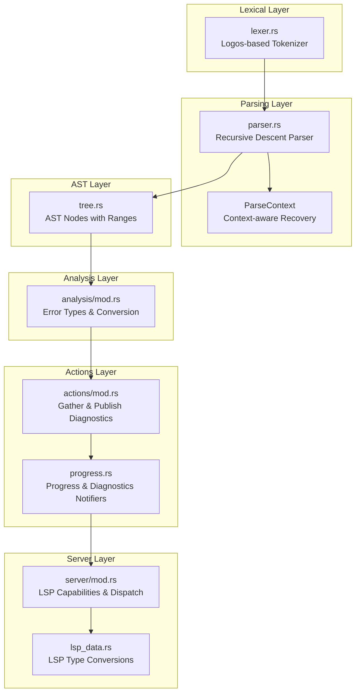
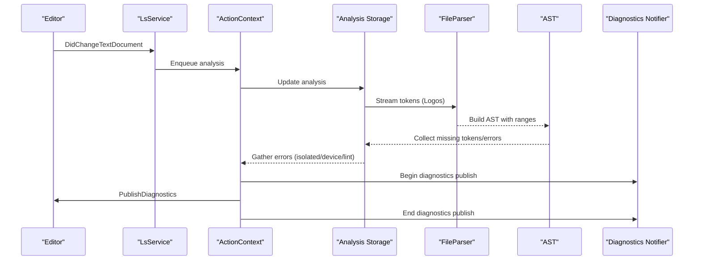
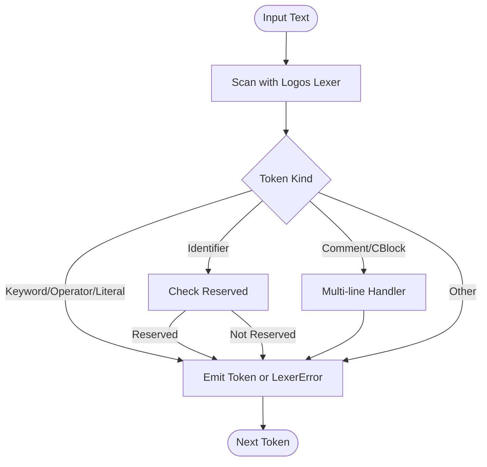
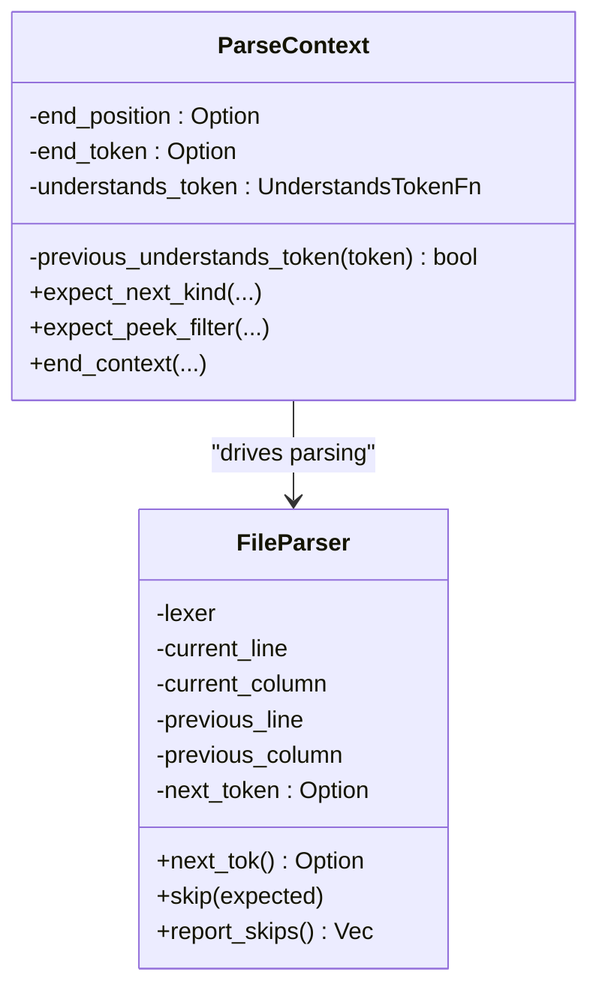
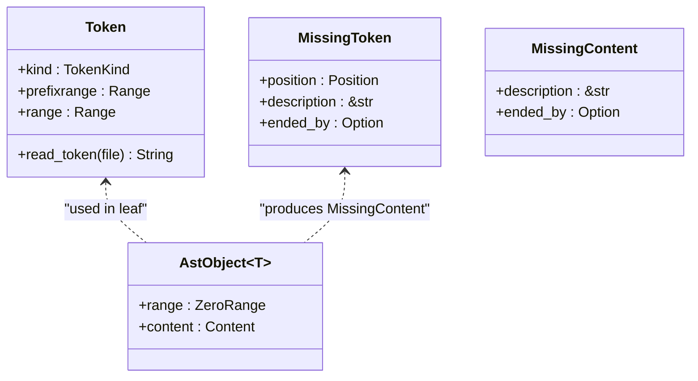
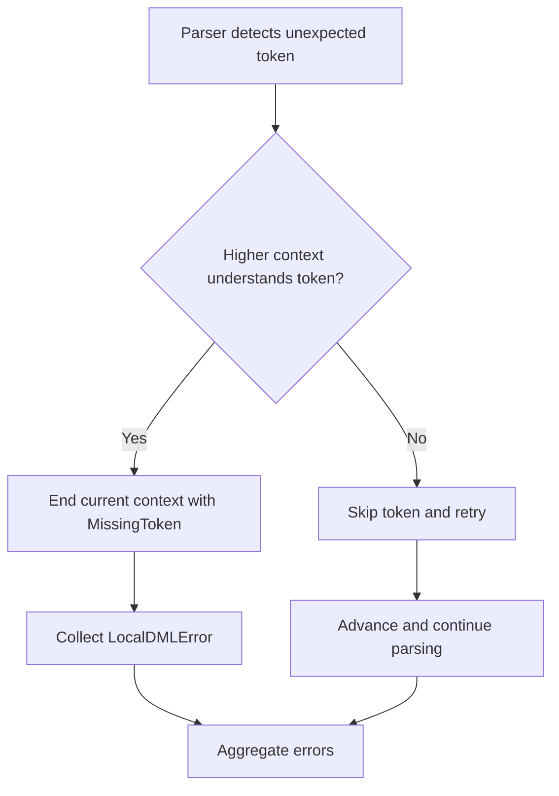
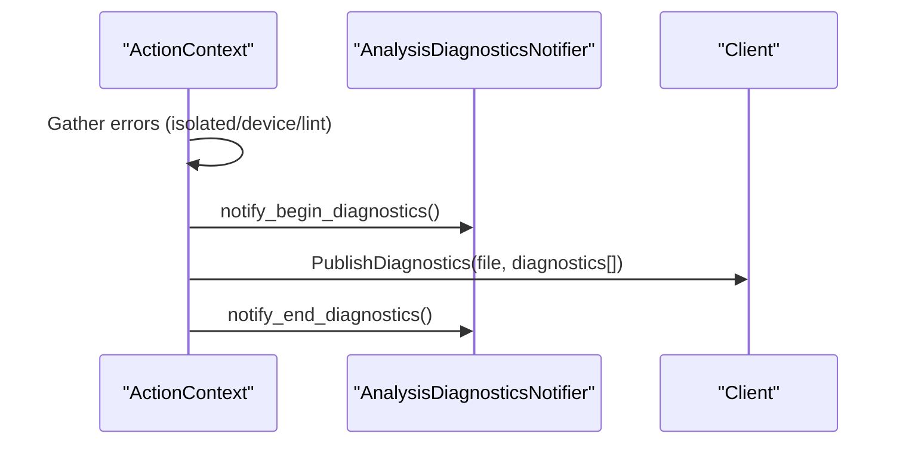
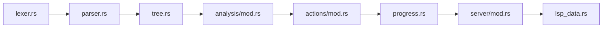

# Syntax Error Reporting

<cite>
**Referenced Files in This Document**
- [lexer.rs](file://src/analysis/parsing/lexer.rs)
- [parser.rs](file://src/analysis/parsing/parser.rs)
- [tree.rs](file://src/analysis/parsing/tree.rs)
- [mod.rs (analysis)](file://src/analysis/mod.rs)
- [mod.rs (actions)](file://src/actions/mod.rs)
- [progress.rs](file://src/actions/progress.rs)
- [server/mod.rs](file://src/server/mod.rs)
- [lsp_data.rs](file://src/lsp_data.rs)
</cite>

## Table of Contents
1. [Introduction](#introduction)
2. [Project Structure](#project-structure)
3. [Core Components](#core-components)
4. [Architecture Overview](#architecture-overview)
5. [Detailed Component Analysis](#detailed-component-analysis)
6. [Dependency Analysis](#dependency-analysis)
7. [Performance Considerations](#performance-considerations)
8. [Troubleshooting Guide](#troubleshooting-guide)
9. [Conclusion](#conclusion)

## Introduction
This document explains how the DML Language Server performs real-time syntax validation during editing sessions. It details the lexer built with the Logos crate for tokenization, the recursive descent parser architecture, AST construction with precise source mapping, error detection and recovery strategies, and how syntax errors are reported to clients via LSP diagnostics. It also provides examples of common syntax errors and guidance on error positioning, severity levels, and recovery techniques that maintain analysis continuity.

## Project Structure
The syntax error reporting pipeline spans several modules:
- Lexical analysis: tokenization using Logos
- Parsing: recursive descent with context-aware recovery
- AST construction: precise source ranges and missing token modeling
- Error collection: local errors transformed into LSP diagnostics
- Publishing: diagnostics sent to the client via LSP PublishDiagnostics

**Diagram sources**
- [lexer.rs](file://src/analysis/parsing/lexer.rs#L96-L424)
- [parser.rs](file://src/analysis/parsing/parser.rs#L48-L320)
- [tree.rs](file://src/analysis/parsing/tree.rs#L14-L120)
- [mod.rs (analysis)](file://src/analysis/mod.rs#L164-L244)
- [mod.rs (actions)](file://src/actions/mod.rs#L503-L557)
- [progress.rs](file://src/actions/progress.rs#L149-L189)
- [server/mod.rs](file://src/server/mod.rs#L678-L731)
- [lsp_data.rs](file://src/lsp_data.rs#L127-L216)

**Section sources**
- [lexer.rs](file://src/analysis/parsing/lexer.rs#L1-L689)
- [parser.rs](file://src/analysis/parsing/parser.rs#L1-L807)
- [tree.rs](file://src/analysis/parsing/tree.rs#L1-L398)
- [mod.rs (analysis)](file://src/analysis/mod.rs#L1-L2540)
- [mod.rs (actions)](file://src/actions/mod.rs#L1-L1471)
- [progress.rs](file://src/actions/progress.rs#L1-L189)
- [server/mod.rs](file://src/server/mod.rs#L1-L838)
- [lsp_data.rs](file://src/lsp_data.rs#L1-L421)

## Core Components
- Lexer (Logos): Defines token kinds, handles reserved identifiers, strings, comments, and multi-line constructs. Emits a dedicated error token for unrecognized sequences.
- Parser: Implements a recursive descent engine with a streaming tokenizer, context-aware recovery, and precise position tracking.
- AST: Models nodes with precise ranges, including missing tokens and content, enabling accurate error reporting.
- Error model: LocalDMLError and DMLError represent syntax errors with spans and severities; conversion to LSP Diagnostic occurs downstream.
- Diagnostics publishing: Aggregates errors from isolated, device, and lint analyses and publishes them via LSP PublishDiagnostics.

**Section sources**
- [lexer.rs](file://src/analysis/parsing/lexer.rs#L96-L424)
- [parser.rs](file://src/analysis/parsing/parser.rs#L16-L483)
- [tree.rs](file://src/analysis/parsing/tree.rs#L234-L398)
- [mod.rs (analysis)](file://src/analysis/mod.rs#L164-L244)
- [mod.rs (actions)](file://src/actions/mod.rs#L503-L557)

## Architecture Overview
The pipeline integrates lexical analysis, parsing, AST construction, and error reporting into a cohesive system that continuously updates diagnostics as the user edits.

**Diagram sources**
- [server/mod.rs](file://src/server/mod.rs#L382-L472)
- [mod.rs (actions)](file://src/actions/mod.rs#L503-L557)
- [parser.rs](file://src/analysis/parsing/parser.rs#L322-L483)
- [tree.rs](file://src/analysis/parsing/tree.rs#L344-L398)
- [progress.rs](file://src/actions/progress.rs#L149-L189)

## Detailed Component Analysis

### Lexer: Logos-Based Tokenization
- Token kinds enumerate operators, literals, keywords, and special constructs (e.g., C blocks, hash directives).
- Reserved identifier filtering ensures correct classification of identifiers vs. keywords.
- Multi-line constructs (comments and C blocks) are handled with dedicated callbacks and stateful scanning.
- LexerError is emitted for malformed or unterminated constructs, enabling downstream recovery.

**Diagram sources**
- [lexer.rs](file://src/analysis/parsing/lexer.rs#L96-L424)

**Section sources**
- [lexer.rs](file://src/analysis/parsing/lexer.rs#L1-L689)

### Parser: Recursive Descent with Context-Aware Recovery
- FileParser wraps a Logos lexer and advances through tokens, skipping whitespace and comments while tracking positions.
- ParseContext manages recovery boundaries: it can end a context early when encountering tokens outside its understanding, producing MissingToken entries.
- Recovery strategies:
  - Transparently skip unknown tokens when no higher context can consume them.
  - End the current context and mark a MissingToken when a token is understood by an enclosing context.
  - Report skipped tokens with expected descriptions for diagnostics.
- Token ranges are computed precisely, preserving UTF-16 semantics required by LSP.

**Diagram sources**
- [parser.rs](file://src/analysis/parsing/parser.rs#L48-L320)

**Section sources**
- [parser.rs](file://src/analysis/parsing/parser.rs#L1-L807)

### AST Construction: Precise Source Mapping and Missing Tokens
- Token carries both the token range and a prefix range for accurate span computation.
- AST nodes encapsulate either actual content or MissingContent/MissingToken, enabling downstream diagnostics to pinpoint missing constructs.
- TreeElement provides traversal and error propagation, surfacing the first missing child by default.

**Diagram sources**
- [parser.rs](file://src/analysis/parsing/parser.rs#L16-L40)
- [tree.rs](file://src/analysis/parsing/tree.rs#L234-L398)

**Section sources**
- [parser.rs](file://src/analysis/parsing/parser.rs#L15-L41)
- [tree.rs](file://src/analysis/parsing/tree.rs#L234-L398)

### Error Detection and Recovery
- Missing tokens are represented as MissingToken with the position where parsing ended and the token that ended the context.
- Missing content (e.g., entire constructs) is represented as MissingContent and converted to LocalDMLError.
- Skipped tokens are tracked with their expected descriptions, enabling diagnostics like “Unexpected token X, expected Y”.

**Diagram sources**
- [parser.rs](file://src/analysis/parsing/parser.rs#L170-L292)
- [tree.rs](file://src/analysis/parsing/tree.rs#L344-L398)
- [mod.rs (analysis)](file://src/analysis/mod.rs#L221-L244)

**Section sources**
- [parser.rs](file://src/analysis/parsing/parser.rs#L170-L292)
- [tree.rs](file://src/analysis/parsing/tree.rs#L344-L398)
- [mod.rs (analysis)](file://src/analysis/mod.rs#L221-L244)

### Error Reporting to Clients (LSP Diagnostics)
- Errors are aggregated from isolated, device, and lint analyses.
- Each error is converted to a Diagnostic with:
  - Range mapped from ZeroRange to LSP Range
  - Severity (ERROR or WARNING)
  - Source label indicating origin (“dml” or “dml-lint”)
  - Optional related information
- Diagnostics are published via PublishDiagnostics and surfaced to the client.

**Diagram sources**
- [mod.rs (actions)](file://src/actions/mod.rs#L503-L557)
- [progress.rs](file://src/actions/progress.rs#L149-L189)

**Section sources**
- [mod.rs (actions)](file://src/actions/mod.rs#L503-L557)
- [progress.rs](file://src/actions/progress.rs#L149-L189)
- [lsp_data.rs](file://src/lsp_data.rs#L127-L216)

## Dependency Analysis
The following diagram highlights key dependencies among modules involved in syntax error reporting.

**Diagram sources**
- [lexer.rs](file://src/analysis/parsing/lexer.rs#L1-L689)
- [parser.rs](file://src/analysis/parsing/parser.rs#L1-L807)
- [tree.rs](file://src/analysis/parsing/tree.rs#L1-L398)
- [mod.rs (analysis)](file://src/analysis/mod.rs#L1-L2540)
- [mod.rs (actions)](file://src/actions/mod.rs#L1-L1471)
- [progress.rs](file://src/actions/progress.rs#L1-L189)
- [server/mod.rs](file://src/server/mod.rs#L1-L838)
- [lsp_data.rs](file://src/lsp_data.rs#L1-L421)

**Section sources**
- [lexer.rs](file://src/analysis/parsing/lexer.rs#L1-L689)
- [parser.rs](file://src/analysis/parsing/parser.rs#L1-L807)
- [tree.rs](file://src/analysis/parsing/tree.rs#L1-L398)
- [mod.rs (analysis)](file://src/analysis/mod.rs#L1-L2540)
- [mod.rs (actions)](file://src/actions/mod.rs#L1-L1471)
- [progress.rs](file://src/actions/progress.rs#L1-L189)
- [server/mod.rs](file://src/server/mod.rs#L1-L838)
- [lsp_data.rs](file://src/lsp_data.rs#L1-L421)

## Performance Considerations
- Tokenization leverages Logos for efficient, deterministic scanning with minimal overhead.
- Parser tracks positions carefully to avoid expensive re-scans; ranges are computed incrementally.
- AST nodes store ranges compactly; missing constructs are represented without materializing full subtrees.
- Diagnostics publishing batches errors per file and sorts them for consistent presentation.

[No sources needed since this section provides general guidance]

## Troubleshooting Guide
Common syntax errors and their typical characteristics:
- Unexpected token: Detected when the parser encounters a token not matching the current expectation; often resolved by inserting the missing token or correcting surrounding syntax.
- Missing semicolon or delimiter: Reported as a MissingToken at the position where parsing ended; the error indicates what was expected next.
- Unterminated comment or C block: LexerError is emitted; the parser records a missing token and continues recovery.
- Mismatched delimiters: Recovery ends the current context at the offending token, producing a MissingToken with the context’s expected description.

Error positioning and severity:
- Ranges are derived from precise token spans; LSP diagnostics use UTF-16 code unit offsets.
- Severity is ERROR for critical syntax issues and WARNING for recoverable conditions (e.g., missing optional constructs).

Recovery techniques:
- Unknown tokens are skipped when no higher context can consume them.
- When a token is understood by an enclosing context, the current context is ended and a MissingToken is recorded.
- Skipped tokens are tracked with expected descriptions to aid diagnostics.

**Section sources**
- [parser.rs](file://src/analysis/parsing/parser.rs#L170-L292)
- [tree.rs](file://src/analysis/parsing/tree.rs#L344-L398)
- [mod.rs (analysis)](file://src/analysis/mod.rs#L221-L244)
- [lsp_data.rs](file://src/lsp_data.rs#L127-L216)

## Conclusion
The DML Language Server integrates Logos-based lexing, a robust recursive descent parser with context-aware recovery, and precise AST construction to deliver real-time syntax error reporting. Errors are modeled accurately with source ranges and missing constructs, aggregated across analyses, and published as LSP diagnostics with appropriate severities. The system’s recovery strategies ensure continuous analysis and helpful feedback during interactive editing.