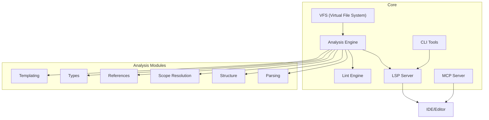
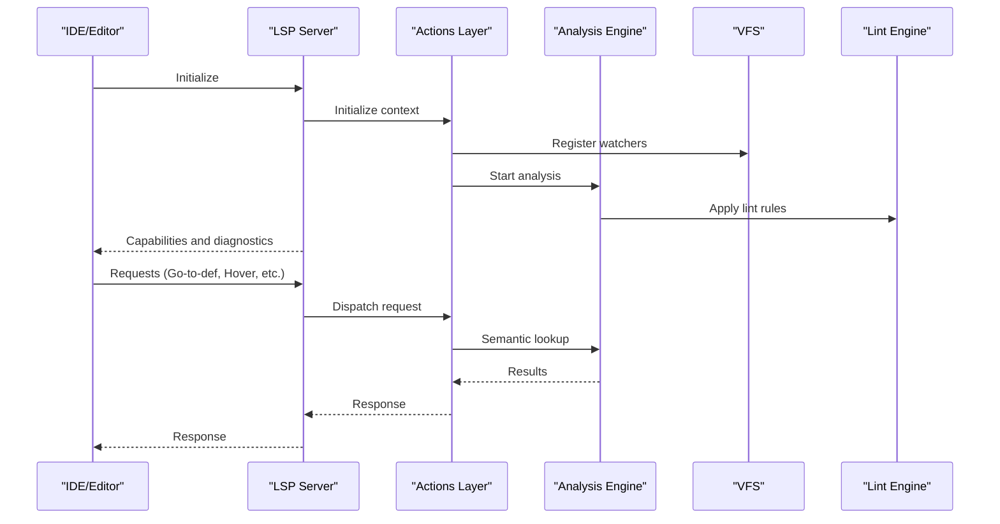
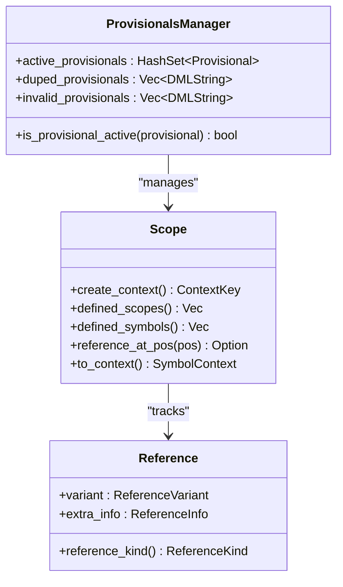
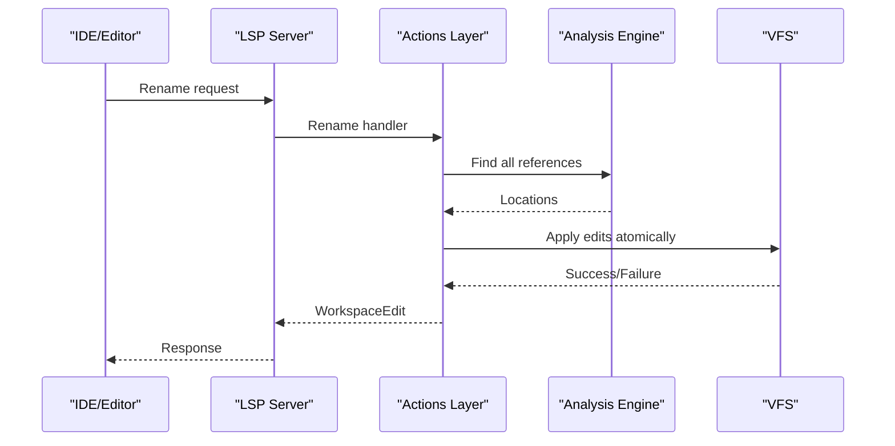
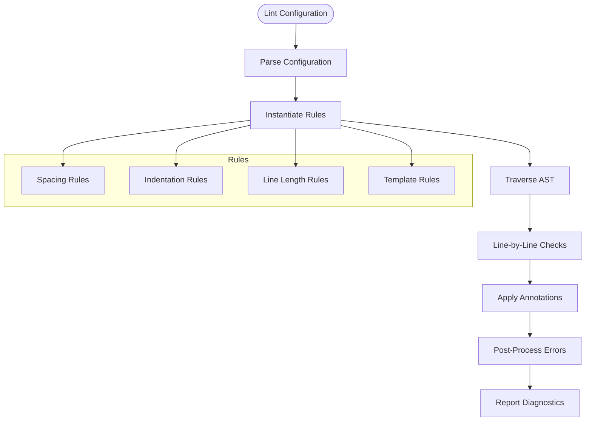
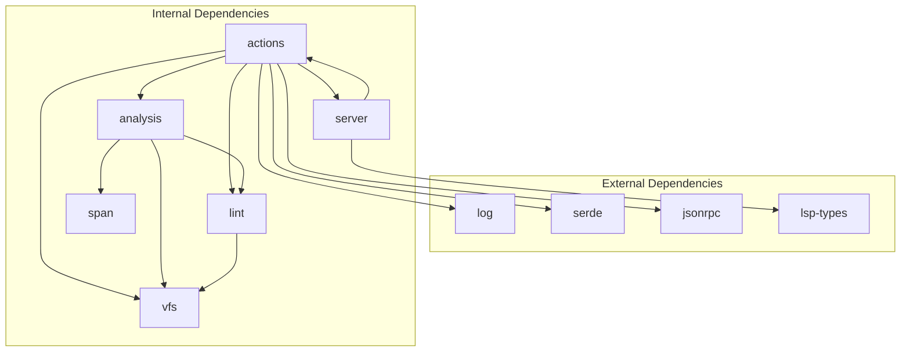

# Future Roadmap

<cite>
**Referenced Files in This Document**
- [README.md](file://README.md)
- [CONTRIBUTING.md](file://CONTRIBUTING.md)
- [ENHANCEMENT_PLAN.md](file://python-port/ENHANCEMENT_PLAN.md)
- [IMPLEMENTATION_SUMMARY.md](file://python-port/IMPLEMENTATION_SUMMARY.md)
- [DEVELOPMENT.md](file://python-port/DEVELOPMENT.md)
- [lib.rs](file://src/lib.rs)
- [main.rs](file://src/main.rs)
- [actions/mod.rs](file://src/actions/mod.rs)
- [actions/requests.rs](file://src/actions/requests.rs)
- [actions/notifications.rs](file://src/actions/notifications.rs)
- [analysis/mod.rs](file://src/analysis/mod.rs)
- [analysis/scope.rs](file://src/analysis/scope.rs)
- [analysis/reference.rs](file://src/analysis/reference.rs)
- [analysis/provisionals.rs](file://src/analysis/provisionals.rs)
- [lint/mod.rs](file://src/lint/mod.rs)
- [lint/features.md](file://src/lint/features.md)
</cite>

## Table of Contents
1. [Introduction](#introduction)
2. [Project Structure](#project-structure)
3. [Core Components](#core-components)
4. [Architecture Overview](#architecture-overview)
5. [Detailed Component Analysis](#detailed-component-analysis)
6. [Dependency Analysis](#dependency-analysis)
7. [Performance Considerations](#performance-considerations)
8. [Troubleshooting Guide](#troubleshooting-guide)
9. [Conclusion](#conclusion)
10. [Appendices](#appendices)

## Introduction
This document outlines the future roadmap for the DML Language Server (DLS), focusing on planned enhancements to semantic and type analysis, refactoring capabilities, language construct templates, renaming support, and linting. It also describes the development timeline, priorities, technical challenges, and the relationship between current capabilities and future directions. Backward compatibility considerations and migration paths are addressed, along with the enhancement planning process and community contribution opportunities.

## Project Structure
The DLS is implemented in Rust with a modular architecture supporting:
- Virtual File System (VFS) for file operations and caching
- Analysis engine for parsing, semantic analysis, and symbol resolution
- Language Server Protocol (LSP) server for IDE integration
- Lint engine for configurable code quality checks
- Model Context Protocol (MCP) for AI-assisted development
- CLI tools for batch operations and diagnostics

**Diagram sources**
- [lib.rs](file://src/lib.rs#L31-L45)
- [main.rs](file://src/main.rs#L15-L59)

**Section sources**
- [lib.rs](file://src/lib.rs#L31-L45)
- [main.rs](file://src/main.rs#L15-L59)

## Core Components
- Current capabilities include syntax parsing, basic navigation (go-to-definition, references), hover tooltips, and basic linting with configurable rules.
- The Rust implementation provides a foundation for advanced semantic analysis, device-context-aware analysis, and robust LSP features.
- The Python port focuses on aligning with the Rust architecture and completing missing components (actions, analysis modules, VFS).

**Section sources**
- [README.md](file://README.md#L7-L21)
- [lib.rs](file://src/lib.rs#L5-L11)
- [actions/mod.rs](file://src/actions/mod.rs#L97-L177)

## Architecture Overview
The DLS architecture separates concerns into distinct layers:
- VFS manages file caching and change detection
- Analysis engine performs parsing and semantic analysis
- LSP server handles protocol communication
- Lint engine applies configurable rules
- MCP server enables AI-assisted workflows

**Diagram sources**
- [actions/mod.rs](file://src/actions/mod.rs#L115-L177)
- [actions/requests.rs](file://src/actions/requests.rs#L354-L380)
- [actions/notifications.rs](file://src/actions/notifications.rs#L33-L73)
- [lint/mod.rs](file://src/lint/mod.rs#L49-L76)

## Detailed Component Analysis

### Extended Semantic and Type Analysis
- Current state: Basic symbol resolution and device-context-aware analysis are implemented. Scope resolution and reference tracking are foundational but require enhancement.
- Planned improvements:
  - Enhanced scope resolution with improved nested scoping and context-aware lookups
  - Advanced reference tracking for precise find-references and go-to-implementation
  - Provisional declaration handling for forward-declared symbols
  - Improved type inference and compatibility checking
- Timeline and priority:
  - Phase 3: Analysis Enhancements (later) - focus on improving scope resolution, reference tracking, and provisional handling
- Technical challenges:
  - Maintaining performance with deep nested scopes
  - Handling forward references and circular dependencies
  - Ensuring correctness across device contexts
- Migration considerations:
  - Backward-compatible API extensions
  - Gradual rollout of new features with opt-in configuration

**Diagram sources**
- [analysis/scope.rs](file://src/analysis/scope.rs#L13-L62)
- [analysis/reference.rs](file://src/analysis/reference.rs#L11-L220)
- [analysis/provisionals.rs](file://src/analysis/provisionals.rs#L28-L64)

**Section sources**
- [analysis/scope.rs](file://src/analysis/scope.rs#L13-L62)
- [analysis/reference.rs](file://src/analysis/reference.rs#L11-L220)
- [analysis/provisionals.rs](file://src/analysis/provisionals.rs#L28-L64)
- [ENHANCEMENT_PLAN.md](file://python-port/ENHANCEMENT_PLAN.md#L30-L48)

### Basic Refactoring Patterns
- Current state: Limited refactoring support; rename requests are marked as TODO.
- Planned improvements:
  - Rename refactoring with workspace-wide updates
  - Safe deletion with dependency analysis
  - Extract method/variable refactoring
  - Quick fixes for common issues
- Timeline and priority:
  - Post-initial LSP feature completion
- Technical challenges:
  - Accurate symbol identification across device contexts
  - Handling template instantiations and substitutions
  - Ensuring atomic operations with rollback support
- Migration considerations:
  - Provide opt-out mechanisms for aggressive refactoring
  - Clear preview of proposed changes

**Diagram sources**
- [actions/requests.rs](file://src/actions/requests.rs#L656-L682)
- [actions/requests.rs](file://src/actions/requests.rs#L556-L612)

**Section sources**
- [actions/requests.rs](file://src/actions/requests.rs#L656-L682)
- [actions/requests.rs](file://src/actions/requests.rs#L556-L612)

### Improved Language Construct Templates
- Current state: Template system exists with type resolution and method analysis.
- Planned improvements:
  - Enhanced template instantiation with better error reporting
  - Template parameter binding improvements
  - Template hierarchy visualization
  - Template-specific quick fixes
- Timeline and priority:
  - Phase 3: Analysis Enhancements
- Technical challenges:
  - Managing template instantiation order and dependencies
  - Handling complex template specializations
  - Optimizing template resolution performance

**Section sources**
- [analysis/mod.rs](file://src/analysis/mod.rs#L575-L800)
- [lint/features.md](file://src/lint/features.md#L1-L75)

### Renaming Support
- Current state: Rename request handler is implemented but returns fallback response.
- Planned improvements:
  - Full rename implementation with workspace-wide updates
  - Template-aware renaming
  - Safe rename with conflict detection
- Timeline and priority:
  - Immediate post-LSP stabilization
- Technical challenges:
  - Cross-device context renaming
  - Template parameter renaming
  - Maintaining referential integrity

**Section sources**
- [actions/requests.rs](file://src/actions/requests.rs#L656-L682)

### Enhanced Linting Capabilities
- Current state: Basic linting with configurable rules and annotation support.
- Planned improvements:
  - Additional spacing and indentation rules
  - Line length and formatting rules
  - Template-specific linting
  - Custom rule registration
- Timeline and priority:
  - Phase 1: Lint Rules (immediate)
- Technical challenges:
  - Balancing rule coverage with performance
  - Handling DML-specific formatting constraints
  - Providing actionable suggestions

**Diagram sources**
- [lint/mod.rs](file://src/lint/mod.rs#L245-L265)
- [lint/mod.rs](file://src/lint/mod.rs#L80-L184)

**Section sources**
- [lint/mod.rs](file://src/lint/mod.rs#L80-L184)
- [lint/features.md](file://src/lint/features.md#L1-L75)
- [ENHANCEMENT_PLAN.md](file://python-port/ENHANCEMENT_PLAN.md#L5-L16)

## Dependency Analysis
The DLS components have clear separation of concerns with well-defined dependencies:

**Diagram sources**
- [lib.rs](file://src/lib.rs#L31-L45)

**Section sources**
- [lib.rs](file://src/lib.rs#L31-L45)

## Performance Considerations
- Current performance characteristics show room for improvement in large file analysis and concurrent operations.
- Optimization strategies include:
  - Incremental analysis for partial file updates
  - Caching strategies for repeated queries
  - Parallel processing for independent operations
  - Memory-efficient symbol storage
- Performance targets:
  - Sub-second analysis for medium-sized files (<1000 lines)
  - Responsive LSP operations under 100ms for common requests
  - Minimal memory footprint for long editing sessions

**Section sources**
- [DEVELOPMENT.md](file://python-port/DEVELOPMENT.md#L238-L253)
- [ENHANCEMENT_PLAN.md](file://python-port/ENHANCEMENT_PLAN.md#L73-L77)

## Troubleshooting Guide
- Common issues and resolutions:
  - Import resolution failures: Verify DML compile commands configuration
  - Device context activation: Check device context mode settings
  - Lint configuration errors: Validate JSON syntax and rule names
  - Performance problems: Enable debug logging and profile hot paths
- Debugging tools:
  - CLI mode for isolated testing
  - Verbose logging for development
  - Test harness for regression verification

**Section sources**
- [CONTRIBUTING.md](file://CONTRIBUTING.md#L204-L237)
- [DEVELOPMENT.md](file://python-port/DEVELOPMENT.md#L204-L237)

## Conclusion
The DML Language Server roadmap focuses on extending semantic analysis capabilities, implementing comprehensive refactoring support, enhancing template systems, and expanding linting functionality. The phased approach ensures steady progress while maintaining backward compatibility. Community contributions are encouraged through the established development workflow, with clear guidelines for feature additions and testing requirements.

## Appendices

### Enhancement Planning Process
- Feature prioritization follows impact and feasibility matrix
- Implementation phases with clear milestones and success criteria
- Community feedback integration through issue tracking and discussions
- Backward compatibility maintenance through gradual feature rollout

**Section sources**
- [ENHANCEMENT_PLAN.md](file://python-port/ENHANCEMENT_PLAN.md#L54-L85)
- [DEVELOPMENT.md](file://python-port/DEVELOPMENT.md#L271-L307)

### Community Contribution Opportunities
- Code style and quality standards using Black, isort, flake8, and mypy
- Testing requirements with pytest and coverage reporting
- Pull request process with code review and approval workflow
- Issue triage and feature request handling

**Section sources**
- [DEVELOPMENT.md](file://python-port/DEVELOPMENT.md#L74-L127)
- [CONTRIBUTING.md](file://CONTRIBUTING.md#L63-L112)

### Relationship Between Current and Future Enhancements
- Current capabilities provide foundation for advanced features
- Python port aligns with Rust architecture for seamless integration
- Feature progression maintains API stability while extending functionality
- Backward compatibility preserved through optional features and gradual adoption

**Section sources**
- [IMPLEMENTATION_SUMMARY.md](file://python-port/IMPLEMENTATION_SUMMARY.md#L120-L167)
- [README.md](file://README.md#L14-L21)