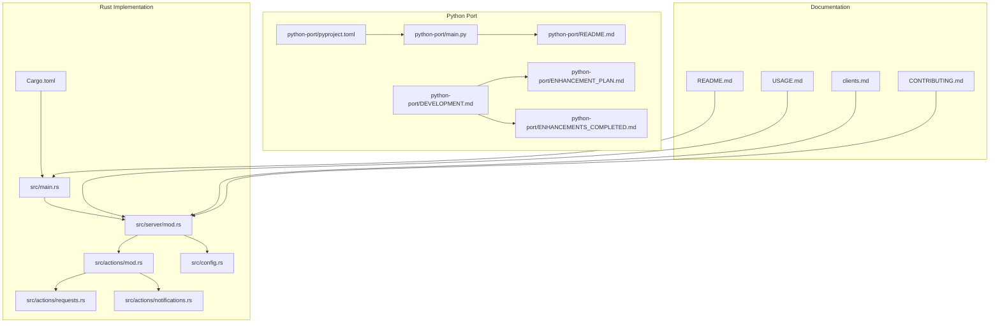
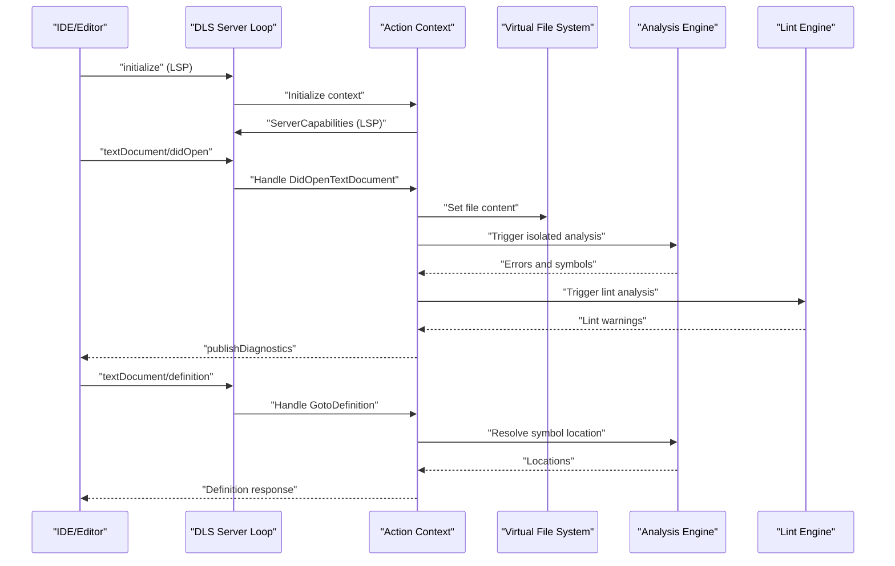
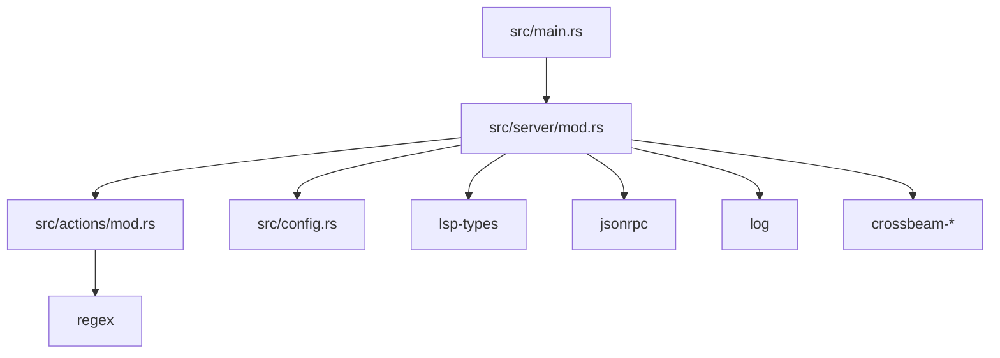

# Project Overview

<cite>
**Referenced Files in This Document**
- [README.md](file://README.md)
- [USAGE.md](file://USAGE.md)
- [clients.md](file://clients.md)
- [CONTRIBUTING.md](file://CONTRIBUTING.md)
- [src/main.rs](file://src/main.rs)
- [src/server/mod.rs](file://src/server/mod.rs)
- [src/actions/mod.rs](file://src/actions/mod.rs)
- [src/actions/requests.rs](file://src/actions/requests.rs)
- [src/actions/notifications.rs](file://src/actions/notifications.rs)
- [src/config.rs](file://src/config.rs)
- [Cargo.toml](file://Cargo.toml)
- [python-port/README.md](file://python-port/README.md)
- [python-port/main.py](file://python-port/main.py)
- [python-port/pyproject.toml](file://python-port/pyproject.toml)
- [python-port/DEVELOPMENT.md](file://python-port/DEVELOPMENT.md)
- [python-port/ENHANCEMENTS_COMPLETED.md](file://python-port/ENHANCEMENTS_COMPLETED.md)
- [python-port/ENHANCEMENT_PLAN.md](file://python-port/ENHANCEMENT_PLAN.md)
</cite>

## Table of Contents
1. [Introduction](#introduction)
2. [Project Structure](#project-structure)
3. [Core Components](#core-components)
4. [Architecture Overview](#architecture-overview)
5. [Detailed Component Analysis](#detailed-component-analysis)
6. [Dependency Analysis](#dependency-analysis)
7. [Performance Considerations](#performance-considerations)
8. [Troubleshooting Guide](#troubleshooting-guide)
9. [Conclusion](#conclusion)

## Introduction
The DML Language Server (DLS) is a background server that provides IDEs, editors, and tools with rich information about DML device and common code. It focuses on delivering fast, best-effort feedback for DML development, including syntax error reporting, symbol search, navigation features (go-to-definition, go-to-implementation, find references, go-to-base), and configurable linting support. The project targets DML 1.4 and integrates with the Language Server Protocol (LSP) to work with a wide range of editors and IDEs.

Key characteristics:
- Purpose: Provide IDE support for DML files with syntax and semantic analysis, symbol navigation, and linting.
- Target language version: DML 1.4.
- Protocol: Language Server Protocol (LSP) for integration with editors and IDEs.
- Current capabilities: Syntax error reporting, symbol search, go-to-definition, go-to-implementation, find references, go-to-base, and configurable linting.
- Future roadmap: Extended semantic and type analysis, basic refactoring patterns, improved templates, renaming support, and more.

Practical examples of functionality:
- Syntax error reporting highlights issues in DML files as you type or save.
- Go-to-definition navigates to the declaration or definition of a symbol.
- Find references lists all locations where a symbol is used.
- Linting reports warnings based on configurable rules.

**Section sources**
- [README.md](file://README.md#L7-L21)
- [USAGE.md](file://USAGE.md#L15-L86)

## Project Structure
The repository contains both a Rust implementation and a Python port, along with supporting documentation and examples. The Rust implementation is the primary reference, while the Python port mirrors the architecture and features for environments where Python is preferred.

High-level structure:
- Rust implementation: src/, Cargo.toml, README.md, USAGE.md, clients.md, CONTRIBUTING.md.
- Python port: python-port/, pyproject.toml, README.md, DEVELOPMENT.md, ENHANCEMENTS_COMPLETED.md, ENHANCEMENT_PLAN.md.
- Examples and configuration: example_files/, python-port/examples/.

**Diagram sources**
- [src/main.rs](file://src/main.rs#L14-L59)
- [src/server/mod.rs](file://src/server/mod.rs#L67-L84)
- [src/actions/mod.rs](file://src/actions/mod.rs#L1-L120)
- [src/actions/requests.rs](file://src/actions/requests.rs#L1-L60)
- [src/actions/notifications.rs](file://src/actions/notifications.rs#L1-L40)
- [src/config.rs](file://src/config.rs#L120-L140)
- [Cargo.toml](file://Cargo.toml#L1-L62)
- [python-port/main.py](file://python-port/main.py#L25-L106)
- [python-port/README.md](file://python-port/README.md#L1-L120)
- [python-port/DEVELOPMENT.md](file://python-port/DEVELOPMENT.md#L1-L60)
- [python-port/ENHANCEMENT_PLAN.md](file://python-port/ENHANCEMENT_PLAN.md#L1-L40)
- [python-port/ENHANCEMENTS_COMPLETED.md](file://python-port/ENHANCEMENTS_COMPLETED.md#L1-L40)
- [python-port/pyproject.toml](file://python-port/pyproject.toml#L1-L60)
- [README.md](file://README.md#L1-L57)
- [USAGE.md](file://USAGE.md#L1-L40)
- [clients.md](file://clients.md#L1-L60)
- [CONTRIBUTING.md](file://CONTRIBUTING.md#L135-L186)

**Section sources**
- [README.md](file://README.md#L1-L57)
- [USAGE.md](file://USAGE.md#L1-L40)
- [clients.md](file://clients.md#L1-L60)
- [CONTRIBUTING.md](file://CONTRIBUTING.md#L135-L186)
- [src/main.rs](file://src/main.rs#L14-L59)
- [src/server/mod.rs](file://src/server/mod.rs#L67-L84)
- [python-port/README.md](file://python-port/README.md#L1-L120)
- [python-port/main.py](file://python-port/main.py#L25-L106)

## Core Components
The DLS consists of several core components that work together to deliver IDE integration and analysis:

- Language Server Protocol (LSP) integration: The server communicates over stdin/stdout using the LSP to provide syntactic and semantic analysis and feedback for DML files.
- Virtual File System (VFS): Tracks file changes and manages file operations, enabling real-time analysis without requiring the IDE to save files first.
- Analysis engine: Performs parsing, isolated analysis, and device analysis to power symbol resolution, reference matching, and semantic diagnostics.
- Request and notification handlers: Implement LSP requests (go-to-definition, find references, hover, document symbols, workspace symbols) and notifications (file open/change/save, configuration changes).
- Configuration system: Supports runtime configuration updates, linting settings, and device context modes.
- Lint engine: Provides configurable linting rules with warnings and errors based on user-defined configurations.

Practical examples:
- Opening a DML file triggers VFS updates and isolated analysis; diagnostics are published to the client.
- Clicking "go-to-definition" resolves the symbol location using semantic analysis.
- Changing configuration dynamically updates include paths, lint rules, and analysis behavior.

**Section sources**
- [src/server/mod.rs](file://src/server/mod.rs#L678-L731)
- [src/actions/mod.rs](file://src/actions/mod.rs#L97-L177)
- [src/actions/requests.rs](file://src/actions/requests.rs#L354-L554)
- [src/actions/notifications.rs](file://src/actions/notifications.rs#L75-L92)
- [src/config.rs](file://src/config.rs#L120-L140)
- [USAGE.md](file://USAGE.md#L15-L86)

## Architecture Overview
The DLS follows a layered architecture with clear separation of concerns:
- Entry point: The binary initializes logging, parses CLI arguments, and starts either CLI mode or the LSP server.
- Server loop: Reads LSP messages from stdin, dispatches notifications and requests, and coordinates analysis.
- Action context: Maintains configuration, VFS, analysis storage, and device contexts; handles state transitions and progress reporting.
- Analysis pipeline: VFS change → isolated analysis → device analysis → lint analysis → diagnostics publishing.
- Client integration: Supports standard LSP requests and notifications, with experimental extensions for device context control.

**Diagram sources**
- [src/server/mod.rs](file://src/server/mod.rs#L207-L289)
- [src/actions/notifications.rs](file://src/actions/notifications.rs#L75-L92)
- [src/actions/requests.rs](file://src/actions/requests.rs#L500-L554)
- [src/actions/mod.rs](file://src/actions/mod.rs#L503-L557)

**Section sources**
- [src/server/mod.rs](file://src/server/mod.rs#L67-L84)
- [src/actions/mod.rs](file://src/actions/mod.rs#L97-L177)
- [src/actions/requests.rs](file://src/actions/requests.rs#L354-L554)
- [src/actions/notifications.rs](file://src/actions/notifications.rs#L75-L92)

## Detailed Component Analysis

### Language Server Protocol Integration
The server implements core LSP capabilities and experimental extensions:
- Capabilities: Text synchronization (open/close/change/save), hover, go-to-definition, go-to-implementation, document symbols, workspace symbols, and workspace folders.
- Experimental features: Device context control via custom notifications and requests for managing active device contexts.
- Initialization: Processes initialization options, sets up server capabilities, and optionally registers client capabilities for configuration updates.

Practical example:
- After initialization, the server publishes capabilities indicating support for go-to-definition and hover providers.

**Section sources**
- [src/server/mod.rs](file://src/server/mod.rs#L678-L731)
- [src/server/mod.rs](file://src/server/mod.rs#L207-L289)
- [clients.md](file://clients.md#L99-L181)

### Navigation and Symbol Search
The DLS provides robust navigation features tailored to DML’s declarative nature:
- Go-to-definition: Resolves to the most specific definition or declaration depending on the symbol type.
- Go-to-implementation: Finds overriding or implementing declarations for methods and objects.
- Find references: Lists all usage locations for a symbol.
- Document symbols and workspace symbols: Expose hierarchical symbol structures for browsing.

Clarifications for DML semantics:
- Declarations in DML merge according to hierarchy; navigation behavior differs from imperative languages.
- References-to-declarations mapping is not always possible; go-to-definition and similar operations may be incomplete in some cases.

**Section sources**
- [USAGE.md](file://USAGE.md#L15-L86)
- [src/actions/requests.rs](file://src/actions/requests.rs#L384-L612)

### Configuration and Device Context Management
The configuration system supports:
- Runtime configuration updates via LSP notifications and pull-style requests.
- Device context modes controlling automatic activation of device analyses.
- Linting toggles and rule configurations.
- Compilation info paths for include resolution and DMLC flags.

Practical example:
- Changing configuration dynamically updates include paths and re-runs analysis as needed.

**Section sources**
- [src/config.rs](file://src/config.rs#L120-L140)
- [src/actions/notifications.rs](file://src/actions/notifications.rs#L177-L224)
- [src/actions/mod.rs](file://src/actions/mod.rs#L645-L740)
- [CONTRIBUTING.md](file://CONTRIBUTING.md#L201-L229)

### Linting Support
The DLS includes configurable linting with:
- Built-in rules and user-defined configurations.
- Inline lint directives for per-file overrides.
- Dynamic rule enable/disable and configuration updates.

Practical example:
- Inline directives allow suppressing specific rules for a file or line.

**Section sources**
- [USAGE.md](file://USAGE.md#L87-L120)
- [src/actions/mod.rs](file://src/actions/mod.rs#L439-L451)

### Entry Point and Binary Behavior
The binary supports:
- LSP server mode for IDE integration.
- CLI mode for interactive debugging and testing.
- Command-line options for compile info and linting configuration.

Practical example:
- Starting the server in CLI mode provides a prompt for manual commands.

**Section sources**
- [src/main.rs](file://src/main.rs#L21-L59)
- [CONTRIBUTING.md](file://CONTRIBUTING.md#L113-L134)

## Dependency Analysis
The Rust implementation relies on a focused set of crates for LSP, logging, concurrency, and parsing:
- LSP types and JSON-RPC for protocol handling.
- Logging and environment configuration.
- Concurrency primitives for job coordination.
- Lexing and parsing utilities for DML syntax.

**Diagram sources**
- [Cargo.toml](file://Cargo.toml#L33-L62)
- [src/main.rs](file://src/main.rs#L14-L59)
- [src/server/mod.rs](file://src/server/mod.rs#L67-L84)
- [src/actions/mod.rs](file://src/actions/mod.rs#L1-L40)
- [src/config.rs](file://src/config.rs#L1-L20)

**Section sources**
- [Cargo.toml](file://Cargo.toml#L33-L62)

## Performance Considerations
- Incremental analysis: Changes are tracked via VFS, minimizing full re-analysis.
- Concurrency: Job queues and worker pools manage analysis tasks efficiently.
- Progress reporting: Long-running operations emit progress notifications to keep clients responsive.
- Caching: Analysis results are retained and reused when appropriate.

[No sources needed since this section provides general guidance]

## Troubleshooting Guide
Common issues and resolutions:
- Out-of-order file changes: The server warns and discards out-of-sequence change notifications.
- Missing built-in templates: If dml-builtins are not found, semantic analysis may be incomplete; the server emits a warning.
- Configuration problems: Unknown, duplicated, or deprecated configuration keys are reported via LSP messages.
- Device context mismatches: Use experimental context control notifications to adjust active contexts for accurate diagnostics.

**Section sources**
- [src/actions/notifications.rs](file://src/actions/notifications.rs#L125-L135)
- [src/actions/mod.rs](file://src/actions/mod.rs#L776-L788)
- [src/server/mod.rs](file://src/server/mod.rs#L109-L205)
- [clients.md](file://clients.md#L99-L181)

## Conclusion
The DML Language Server delivers essential IDE support for DML 1.4, focusing on fast feedback and navigation features enabled by LSP. Its architecture cleanly separates concerns across VFS, analysis, configuration, and LSP integration, while the Python port demonstrates parity with the Rust implementation for environments preferring Python. Planned enhancements aim to expand semantic analysis, refactoring, and AI-assisted development, aligning with ongoing improvements in the Rust codebase.

[No sources needed since this section summarizes without analyzing specific files]