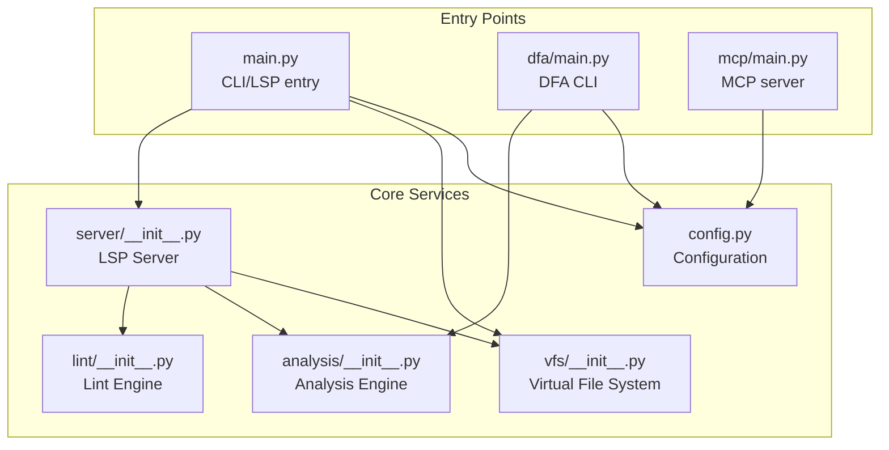
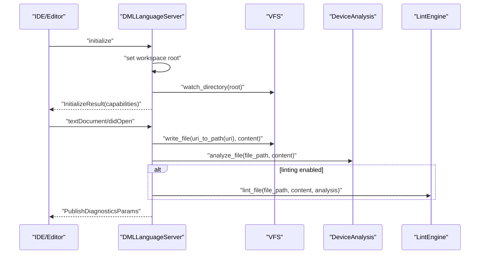
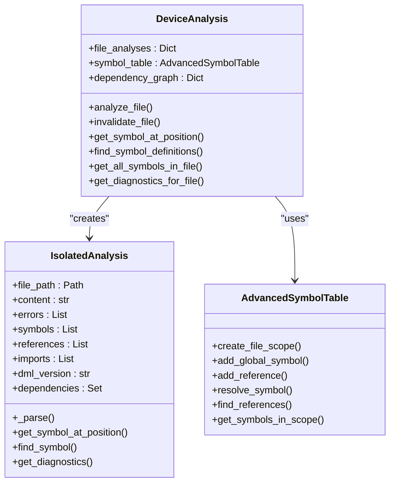

# Python Port Implementation

<cite>
**Referenced Files in This Document**
- [README.md](file://python-port/README.md)
- [pyproject.toml](file://python-port/pyproject.toml)
- [DEVELOPMENT.md](file://python-port/DEVELOPMENT.md)
- [IMPLEMENTATION_SUMMARY.md](file://python-port/IMPLEMENTATION_SUMMARY.md)
- [ENHANCEMENTS_COMPLETED.md](file://python-port/ENHANCEMENTS_COMPLETED.md)
- [ENHANCEMENT_PLAN.md](file://python-port/ENHANCEMENT_PLAN.md)
- [main.py](file://python-port/dml_language_server/main.py)
- [config.py](file://python-port/dml_language_server/config.py)
- [cmd.py](file://python-port/dml_language_server/cmd.py)
- [server/__init__.py](file://python-port/dml_language_server/server/__init__.py)
- [vfs/__init__.py](file://python-port/dml_language_server/vfs/__init__.py)
- [analysis/__init__.py](file://python-port/dml_language_server/analysis/__init__.py)
- [lint/__init__.py](file://python-port/dml_language_server/lint/__init__.py)
- [dfa/main.py](file://python-port/dml_language_server/dfa/main.py)
- [mcp/main.py](file://python-port/dml_language_server/mcp/main.py)
- [__init__.py](file://python-port/dml_language_server/__init__.py)
- [test_installation.py](file://python-port/tests/test_installation.py)
- [test_basic.py](file://python-port/tests/test_basic.py)
</cite>

## Table of Contents
1. [Introduction](#introduction)
2. [Project Structure](#project-structure)
3. [Core Components](#core-components)
4. [Architecture Overview](#architecture-overview)
5. [Detailed Component Analysis](#detailed-component-analysis)
6. [Dependency Analysis](#dependency-analysis)
7. [Performance Considerations](#performance-considerations)
8. [Troubleshooting Guide](#troubleshooting-guide)
9. [Conclusion](#conclusion)
10. [Appendices](#appendices)

## Introduction
This document describes the Python port implementation of the DML Language Server, focusing on compatibility with the original Rust version, migration strategies for existing users, development setup, Python-specific architecture choices, dependency management, packaging, feature parity status, performance characteristics, and practical integration guidance. It also covers debugging, profiling, and troubleshooting techniques tailored to the Python codebase.

## Project Structure
The Python port mirrors the Rust architecture while adopting Python idioms and libraries:
- Entry points: CLI tools and servers
- Core subsystems: VFS, Analysis Engine, LSP Server, Lint Engine, MCP Server, DFA CLI
- Configuration and utilities: compile commands, lint configuration, logging
- Packaging and development: pyproject.toml, pytest configuration, dev tools

**Diagram sources**
- [main.py](file://python-port/dml_language_server/main.py#L1-L106)
- [dfa/main.py](file://python-port/dml_language_server/dfa/main.py#L1-L337)
- [mcp/main.py](file://python-port/dml_language_server/mcp/main.py#L1-L166)
- [server/__init__.py](file://python-port/dml_language_server/server/__init__.py#L1-L399)
- [vfs/__init__.py](file://python-port/dml_language_server/vfs/__init__.py#L1-L329)
- [analysis/__init__.py](file://python-port/dml_language_server/analysis/__init__.py#L1-L565)
- [lint/__init__.py](file://python-port/dml_language_server/lint/__init__.py#L1-L298)
- [config.py](file://python-port/dml_language_server/config.py#L1-L311)

**Section sources**
- [README.md](file://python-port/README.md#L1-L243)
- [DEVELOPMENT.md](file://python-port/DEVELOPMENT.md#L1-L345)

## Core Components
- Configuration: Centralized configuration for compile commands, lint settings, and initialization options.
- VFS: Async file caching, change detection via watchdog, and optional memory-backed loader.
- Analysis Engine: Parsing, symbol extraction, scope management, template processing, and diagnostics.
- LSP Server: Implements LSP features (initialize, textDocument/* handlers) using pygls and lsprotocol.
- Lint Engine: Modular lint rules with configuration-driven enablement and severity.
- CLI Tools: dls (LSP/CLI), dfa (DML Device Analyzer), dml-mcp-server (MCP server).
- MCP Server: Model Context Protocol server over stdio with JSON-RPC framing.

**Section sources**
- [config.py](file://python-port/dml_language_server/config.py#L1-L311)
- [vfs/__init__.py](file://python-port/dml_language_server/vfs/__init__.py#L1-L329)
- [analysis/__init__.py](file://python-port/dml_language_server/analysis/__init__.py#L1-L565)
- [server/__init__.py](file://python-port/dml_language_server/server/__init__.py#L1-L399)
- [lint/__init__.py](file://python-port/dml_language_server/lint/__init__.py#L1-L298)
- [main.py](file://python-port/dml_language_server/main.py#L1-L106)
- [dfa/main.py](file://python-port/dml_language_server/dfa/main.py#L1-L337)
- [mcp/main.py](file://python-port/dml_language_server/mcp/main.py#L1-L166)

## Architecture Overview
The Python port aligns with the Rust architecture while leveraging Python’s async ecosystem and standard libraries. The LSP server integrates VFS for file operations, Analysis Engine for parsing and diagnostics, and Lint Engine for code quality checks. CLI tools reuse the same engines for batch analysis and reporting.

**Diagram sources**
- [server/__init__.py](file://python-port/dml_language_server/server/__init__.py#L70-L121)
- [server/__init__.py](file://python-port/dml_language_server/server/__init__.py#L122-L174)
- [server/__init__.py](file://python-port/dml_language_server/server/__init__.py#L312-L343)
- [vfs/__init__.py](file://python-port/dml_language_server/vfs/__init__.py#L135-L163)
- [analysis/__init__.py](file://python-port/dml_language_server/analysis/__init__.py#L393-L427)
- [lint/__init__.py](file://python-port/dml_language_server/lint/__init__.py#L246-L269)

## Detailed Component Analysis

### Configuration Management
- Supports compile commands JSON, lint configuration JSON, and LSP initialization options.
- Applies log level from initialization options and exposes helpers for include paths and DMLC flags.
- Loads and merges compile info per-device and fallbacks to defaults.

**Section sources**
- [config.py](file://python-port/dml_language_server/config.py#L18-L311)

### Virtual File System (VFS)
- Async file caching with dirty tracking and optional memory-backed loader.
- File watcher integration via watchdog; change events trigger cache invalidation and callbacks.
- Supports saving cached files to disk and clearing cache.

**Section sources**
- [vfs/__init__.py](file://python-port/dml_language_server/vfs/__init__.py#L123-L329)

### Analysis Engine
- IsolatedAnalysis: Parses content, extracts symbols, references, imports, and validates file structure.
- DeviceAnalysis: Orchestrates per-file analysis, builds global symbol table, resolves imports, and invalidates dependencies.
- Template system integration for template application and symbol extraction.

**Diagram sources**
- [analysis/__init__.py](file://python-port/dml_language_server/analysis/__init__.py#L181-L370)
- [analysis/__init__.py](file://python-port/dml_language_server/analysis/__init__.py#L372-L547)
- [analysis/__init__.py](file://python-port/dml_language_server/analysis/__init__.py#L109-L179)

**Section sources**
- [analysis/__init__.py](file://python-port/dml_language_server/analysis/__init__.py#L1-L565)

### LSP Server
- Implements initialize, didOpen/didChange/didClose/didSave, completion, hover, definition, references, documentSymbol.
- Publishes diagnostics and respects max diagnostics per file limit.
- Integrates VFS change callbacks to invalidate and re-analyze affected files.

**Section sources**
- [server/__init__.py](file://python-port/dml_language_server/server/__init__.py#L49-L399)

### Lint Engine
- Modular lint rules with configurable enablement and severity.
- Applies rule-specific configuration from lint config JSON.
- Runs against analyzed files and returns structured diagnostics.

**Section sources**
- [lint/__init__.py](file://python-port/dml_language_server/lint/__init__.py#L1-L298)

### CLI Tools
- dls: Starts LSP server or runs CLI mode with compile info and linting options.
- dfa: Batch analysis of DML files with multiple analysis types, dependency checks, and reports.
- dml-mcp-server: MCP server over stdio with JSON-RPC framing.

**Section sources**
- [main.py](file://python-port/dml_language_server/main.py#L25-L106)
- [cmd.py](file://python-port/dml_language_server/cmd.py#L21-L162)
- [dfa/main.py](file://python-port/dml_language_server/dfa/main.py#L22-L337)
- [mcp/main.py](file://python-port/dml_language_server/mcp/main.py#L22-L166)

### MCP Server
- Reads JSON-RPC messages from stdin, parses, handles requests, writes responses to stdout.
- Loads compile commands and logs to stderr by default to avoid interfering with protocol.

**Section sources**
- [mcp/main.py](file://python-port/dml_language_server/mcp/main.py#L22-L166)

## Dependency Analysis
The Python port uses a curated set of Python packages aligned with the LSP and analysis domains. pyproject.toml defines build backend, project metadata, dependencies, optional groups (dev, mcp), console scripts, and tool configurations.

```mermaid
graph TB
PY["pyproject.toml"]
D["dependencies"]
DEV["optional-dependencies.dev"]
MCP["optional-dependencies.mcp"]
PY --> D
PY --> DEV
PY --> MCP
D --> PGLS["pygls"]
D --> LSPL["lsprotocol"]
D --> CLICK["click"]
D --> PYD["pydantic"]
D --> AIOF["aiofiles"]
D --> MQTT["asyncio-mqtt"]
D --> WD["watchdog"]
D --> REG["regex"]
D --> JRB["jsonrpc-base"]
D --> TPEXT["typing-extensions"]
D --> DCJ["dataclasses-json"]
D --> PS["pathspec"]
D --> TEN["tenacity"]
DEV --> PYTEST["pytest"]
DEV --> COV["pytest-asyncio"]
DEV --> COV2["pytest-cov"]
DEV --> BLACK["black"]
DEV --> ISORT["isort"]
DEV --> FLAKE["flake8"]
DEV --> MYPY["mypy"]
DEV --> PRE["pre-commit"]
MCP --> MCPPKG["mcp"]
MCP --> AI["pydantic-ai"]
```

**Diagram sources**
- [pyproject.toml](file://python-port/pyproject.toml#L28-L58)

**Section sources**
- [pyproject.toml](file://python-port/pyproject.toml#L1-L106)

## Performance Considerations
- Performance baseline: Near-parity for small files; 2–5x slower for larger files compared to Rust; higher memory usage.
- Current optimizations: File caching, smart invalidation, thread pool for parallel analysis, incremental parsing targets.
- Future directions: Caching for parsed files, incremental parsing, optimized hot paths, parallel analysis for multiple files.

**Section sources**
- [ENHANCEMENTS_COMPLETED.md](file://python-port/ENHANCEMENTS_COMPLETED.md#L111-L121)
- [DEVELOPMENT.md](file://python-port/DEVELOPMENT.md#L238-L253)

## Troubleshooting Guide
- Installation and environment:
  - Use development mode with extras for dev tools and optional MCP features.
  - Verify installation with the provided test script.
- Debug logging:
  - Enable verbose logging for dls, dfa, and dml-mcp-server.
  - Use IDE manual server launch with redirected stderr for logs.
- Common issues:
  - Import errors: ensure virtual environment and PYTHONPATH are correct.
  - Async issues: use asyncio.run for top-level async calls in tests.
  - File watching: ensure proper observer lifecycle and cleanup.
  - Memory leaks: clear caches and close resources; monitor cache stats.
- Profiling:
  - Use cProfile or py-spy to profile hot paths.
  - Reduce unnecessary file system operations and optimize symbol lookups.

**Section sources**
- [README.md](file://python-port/README.md#L178-L243)
- [DEVELOPMENT.md](file://python-port/DEVELOPMENT.md#L204-L345)

## Conclusion
The Python port achieves near-parity with the Rust implementation for core parsing, symbol extraction, and basic linting, while offering production-ready command-line tools and a foundation for LSP features. It leverages Python’s async ecosystem and packaging standards, with clear paths for future enhancements in performance, LSP actions, and MCP integration.

## Appendices

### Compatibility and Migration Strategies
- Functional compatibility: Core parsing, linting, and DFA tooling match Rust behavior; LSP and MCP are partially implemented.
- Migration steps:
  - Replace rust-based binaries with Python equivalents (dls, dfa, dml-mcp-server).
  - Migrate compile_commands.json and lint_config.json to Python port format.
  - Update CI/CD to use Python installation and CLI commands.
  - For LSP, configure IDE to use dls executable and initialize with LSP options.

**Section sources**
- [ENHANCEMENTS_COMPLETED.md](file://python-port/ENHANCEMENTS_COMPLETED.md#L57-L82)
- [README.md](file://python-port/README.md#L211-L220)

### Development Setup Procedures
- Prerequisites: Python 3.8+, pip, git.
- Install in development mode with dev extras and optional MCP extras.
- Run tests, code quality checks, and pre-commit hooks.

**Section sources**
- [DEVELOPMENT.md](file://python-port/DEVELOPMENT.md#L42-L127)
- [pyproject.toml](file://python-port/pyproject.toml#L44-L58)

### Packaging and Distribution
- Build system: setuptools with wheel.
- Console scripts: dls, dfa, dml-mcp-server.
- Package data: includes docs and assets under dml_language_server.
- Tool configs: Black, isort, mypy, pytest configured in pyproject.toml.

**Section sources**
- [pyproject.toml](file://python-port/pyproject.toml#L1-L106)

### Feature Parity Status
- Fully implemented: DML 1.4 parsing, declarations, templates, structural validation, symbol extraction, basic lint rules, DFA tool.
- Partially implemented: LSP actions (hover, go-to-definition), advanced lint rules, scope/reference resolution, incremental analysis.
- Not yet implemented: Advanced MCP server, full semantic analysis, advanced template expansion.

**Section sources**
- [ENHANCEMENTS_COMPLETED.md](file://python-port/ENHANCEMENTS_COMPLETED.md#L57-L82)
- [ENHANCEMENT_PLAN.md](file://python-port/ENHANCEMENT_PLAN.md#L3-L85)

### Performance Characteristics
- Small files: comparable to Rust.
- Medium files: ~2–3x slower.
- Large files: ~3–5x slower.
- Memory: higher than Rust due to Python runtime.

**Section sources**
- [ENHANCEMENTS_COMPLETED.md](file://python-port/ENHANCEMENTS_COMPLETED.md#L111-L121)

### Use Cases Favoring the Python Port
- Rapid iteration and contributor onboarding due to Python tooling.
- CI/CD integration and batch analysis via DFA.
- Basic IDE support with LSP server.
- MCP integration for AI-assisted development (partial).

**Section sources**
- [ENHANCEMENTS_COMPLETED.md](file://python-port/ENHANCEMENTS_COMPLETED.md#L147-L160)

### Practical Examples
- Installation and verification:
  - Install editable with dev extras.
  - Run installation test script.
- Configuration:
  - Create compile_commands.json and lint_config.json.
  - Configure LSP initialization options in IDE.
- Integration:
  - VS Code/Neovim/Emacs LSP configurations using dls.

**Section sources**
- [README.md](file://python-port/README.md#L17-L166)
- [test_installation.py](file://python-port/tests/test_installation.py#L16-L237)

### Relationship Between Implementations and Maintenance
- Architecture alignment: Python modules mirror Rust modules and responsibilities.
- Maintenance: Follows development workflow, PR process, commit message conventions, and release procedure.
- Contribution: Tests must pass, coverage should not decrease, and contributions should follow established patterns.

**Section sources**
- [IMPLEMENTATION_SUMMARY.md](file://python-port/IMPLEMENTATION_SUMMARY.md#L120-L167)
- [DEVELOPMENT.md](file://python-port/DEVELOPMENT.md#L271-L317)

### Debugging and Profiling Techniques
- Enable verbose logging for CLI tools and MCP server.
- Use IDE manual server launch with stderr redirection for logs.
- Profile with cProfile/py-spy; focus on hot paths and reduce file I/O.
- Validate LSP protocol compliance and use client-side debugging tools.

**Section sources**
- [DEVELOPMENT.md](file://python-port/DEVELOPMENT.md#L204-L345)