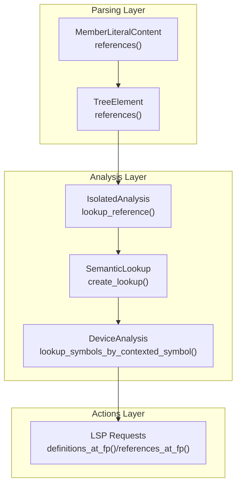
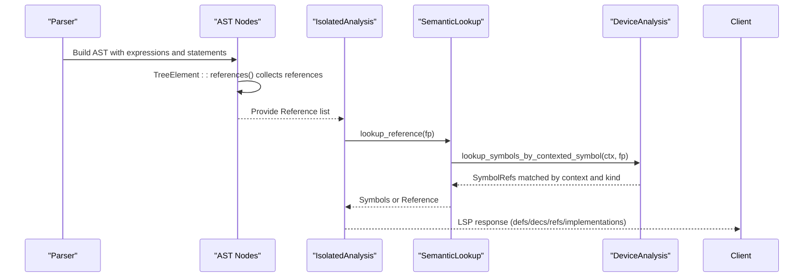
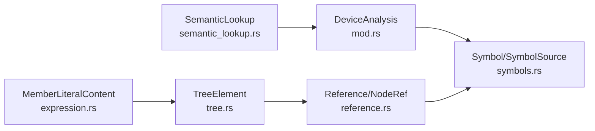

# Reference Resolution

<cite>
**Referenced Files in This Document**
- [reference.rs](file://src/analysis/reference.rs)
- [symbols.rs](file://src/analysis/symbols.rs)
- [semantic_lookup.rs](file://src/actions/semantic_lookup.rs)
- [tree.rs](file://src/analysis/parsing/tree.rs)
- [expression.rs](file://src/analysis/parsing/expression.rs)
- [mod.rs](file://src/analysis/mod.rs)
- [methods.rs](file://src/analysis/templating/methods.rs)
</cite>

## Table of Contents
1. [Introduction](#introduction)
2. [Project Structure](#project-structure)
3. [Core Components](#core-components)
4. [Architecture Overview](#architecture-overview)
5. [Detailed Component Analysis](#detailed-component-analysis)
6. [Dependency Analysis](#dependency-analysis)
7. [Performance Considerations](#performance-considerations)
8. [Troubleshooting Guide](#troubleshooting-guide)
9. [Conclusion](#conclusion)

## Introduction
This document explains the cross-reference resolution and symbol linking mechanisms in the DML language server. It focuses on how references are collected during parsing, how they are resolved and validated during analysis, and how symbols are tracked and looked up. It also covers forward reference handling, method call resolution, template instantiation linkage, external dependency awareness, circular reference detection, dangling reference handling, error reporting, and performance optimizations for large codebases and incremental resolution.

## Project Structure
The reference resolution pipeline spans three layers:
- Parsing and AST: Nodes emit references via a common trait and collect them during traversal.
- Analysis: Device and isolated analyses resolve references against symbol tables and contexts.
- Actions: LSP-facing APIs surface definitions, declarations, references, and implementations.

**Diagram sources**
- [tree.rs](file://src/analysis/parsing/tree.rs#L83-L93)
- [expression.rs](file://src/analysis/parsing/expression.rs#L120-L129)
- [semantic_lookup.rs](file://src/actions/semantic_lookup.rs#L88-L123)
- [mod.rs](file://src/analysis/mod.rs#L1051-L1095)

**Section sources**
- [tree.rs](file://src/analysis/parsing/tree.rs#L78-L93)
- [expression.rs](file://src/analysis/parsing/expression.rs#L120-L144)
- [semantic_lookup.rs](file://src/actions/semantic_lookup.rs#L88-L123)
- [mod.rs](file://src/analysis/mod.rs#L1051-L1095)

## Core Components
- Reference model: NodeRef and Reference represent local chained references and global references, respectively, with kinds indicating whether they target templates, types, variables, or callable targets.
- Symbol model: Symbol tracks locations for definitions, declarations, references, and implementations, with SymbolSource linking to concrete DML constructs.
- Collection and lookup: TreeElement.default_references drives collection; SemanticLookup coordinates isolated and device analyses to resolve references and return symbols.

Key responsibilities:
- Collect references during parsing via TreeElement::references and MaybeIsNodeRef.
- Resolve references against device symbol tables and context-aware lookups.
- Validate correctness and report limitations (e.g., type semantics, uninstantiated templates).
- Provide LSP queries for definitions, declarations, references, and implementations.

**Section sources**
- [reference.rs](file://src/analysis/reference.rs#L8-L220)
- [symbols.rs](file://src/analysis/symbols.rs#L19-L331)
- [tree.rs](file://src/analysis/parsing/tree.rs#L78-L93)
- [semantic_lookup.rs](file://src/actions/semantic_lookup.rs#L88-L123)

## Architecture Overview
The reference resolution architecture integrates parsing, analysis, and action layers:

**Diagram sources**
- [tree.rs](file://src/analysis/parsing/tree.rs#L83-L93)
- [semantic_lookup.rs](file://src/actions/semantic_lookup.rs#L88-L123)
- [mod.rs](file://src/analysis/mod.rs#L1051-L1095)

## Detailed Component Analysis

### Reference Model and Kinds
- NodeRef supports simple identifiers and chained sub-references (e.g., nested member access).
- ReferenceKind distinguishes templates, types, variables, and callable targets.
- Reference carries either a VariableReference (NodeRef plus kind) or a GlobalReference (name, location, kind).
- ReferenceInfo records auxiliary flags (e.g., whether a reference was an instantiation site).

Resolution entry points:
- From a NodeRef: Reference::from_noderef.
- From a LeafToken: Reference::global_from_token.

Validation:
- LocationSpan and DeclarationSpan are implemented consistently for precise selection ranges.

**Section sources**
- [reference.rs](file://src/analysis/reference.rs#L8-L220)

### Symbol Model and Tracking
- DMLSymbolKind enumerates symbol categories (object kinds, parameters, constants, externs, hooks, locals, loggroups, methods, method args/locals, saved/session, templates, typedefs).
- Symbol holds sets of locations for definitions, declarations, references, and implementations, plus typed metadata and a SymbolSource link.
- SymbolSource ties symbols to concrete DML constructs (objects, methods, method args/locals, types, templates).
- SymbolRefInner provides thread-safe access to Symbol behind a mutex, with equality/hash based on ID.

Symbol creation and mutation:
- SymbolMaker assigns unique IDs and wraps symbols in Arc<Mutex<Symbol>>.
- symbol_ref! macro simplifies setting fields atomically.

**Section sources**
- [symbols.rs](file://src/analysis/symbols.rs#L19-L331)

### Reference Collection During Parsing
- TreeElement::references delegates to default_references, which recurses into subtrees and accumulates references.
- MemberLiteralContent implements references() to collect subtree references and injects a VariableReference derived from a NodeRef built from left-hand side and right-hand identifier.
- MaybeIsNodeRef enables constructing NodeRef from tokens and expressions.

Forward reference handling:
- MemberLiteralContent::maybe_noderef builds a NodeRef chain for member access expressions, enabling later resolution even if earlier members are unresolved.

**Section sources**
- [tree.rs](file://src/analysis/parsing/tree.rs#L78-L93)
- [expression.rs](file://src/analysis/parsing/expression.rs#L120-L144)

### Resolution During Analysis
- IsolatedAnalysis provides lookup_reference(fp) to find a Reference at a given position.
- SemanticLookup coordinates:
  - analysises_at_fp: fetches IsolatedAnalysis and filtered DeviceAnalysis instances.
  - get_refs_and_syms_at_fp: prefers symbols over references when both exist, logs a warning, and records limitations (e.g., type semantics).
  - get_symbols_of_ref: maps a Reference to SymbolRefs across devices, detecting limitations for uninstantiated templates.
- DeviceAnalysis::lookup_symbols_by_contexted_symbol resolves symbols within a contextual scope, handling global vs. local contexts and method default call recursion.

Global reference resolution:
- DeviceAnalysis::lookup_global_symbol and lookup_global_symbol_for_ref handle template global references.

Method call resolution:
- resolve_noderef_in_symbol supports chained member resolution within object and method contexts, including default call resolution for ambiguous methods.

Template instantiation linkage:
- ReferenceInfo tracks whether a reference was an instantiation site, aiding downstream diagnostics and navigation.

**Section sources**
- [semantic_lookup.rs](file://src/actions/semantic_lookup.rs#L88-L223)
- [mod.rs](file://src/analysis/mod.rs#L967-L1181)

### LSP Queries and Limitations
- definitions_at_fp, declarations_at_fp, references_at_fp, implementations_at_fp query the current context and return spans for navigation.
- Limitations are surfaced via DLSLimitation:
  - Type semantic limitation indicates lack of type-level reference analysis.
  - Isolated template limitation warns when references occur inside templates without instantiation context.

**Section sources**
- [semantic_lookup.rs](file://src/actions/semantic_lookup.rs#L32-L62)
- [semantic_lookup.rs](file://src/actions/semantic_lookup.rs#L299-L399)

### Method Call Resolution Details
- resolve_noderef_in_symbol handles chained member resolution within object and method contexts.
- Default call resolution for methods supports both single valid defaults and ambiguous defaults, iterating over implementations to expand matches.

**Section sources**
- [mod.rs](file://src/analysis/mod.rs#L1097-L1181)
- [methods.rs](file://src/analysis/templating/methods.rs#L164-L200)

## Dependency Analysis
The following diagram shows key dependencies among reference resolution components:

**Diagram sources**
- [reference.rs](file://src/analysis/reference.rs#L8-L220)
- [symbols.rs](file://src/analysis/symbols.rs#L180-L331)
- [tree.rs](file://src/analysis/parsing/tree.rs#L78-L93)
- [expression.rs](file://src/analysis/parsing/expression.rs#L120-L144)
- [semantic_lookup.rs](file://src/actions/semantic_lookup.rs#L88-L123)
- [mod.rs](file://src/analysis/mod.rs#L1051-L1095)

**Section sources**
- [reference.rs](file://src/analysis/reference.rs#L8-L220)
- [symbols.rs](file://src/analysis/symbols.rs#L180-L331)
- [tree.rs](file://src/analysis/parsing/tree.rs#L78-L93)
- [expression.rs](file://src/analysis/parsing/expression.rs#L120-L144)
- [semantic_lookup.rs](file://src/actions/semantic_lookup.rs#L88-L123)
- [mod.rs](file://src/analysis/mod.rs#L1051-L1095)

## Performance Considerations
- Sparse fields boxing: ReferenceInfo and related structures use boxing for non-trivial fields to reduce memory footprint.
- Parallelism: The analysis module imports rayon for parallel computation where applicable.
- Incremental resolution:
  - Use SymbolRefInner locks judiciously; avoid holding locks across iterations to prevent contention.
  - Prefer context-aware lookups (lookup_first_context, lookup_context_symbol) to narrow search spaces.
  - Cache and reuse SymbolRefs across queries to minimize repeated allocations.
- Large codebases:
  - Limit deep recursion in chained member resolution; short-circuit on cycles or excessive depth.
  - Batch symbol lookups per device to reduce repeated map traversals.

[No sources needed since this section provides general guidance]

## Troubleshooting Guide
Common issues and remedies:
- Both symbol and reference at position:
  - The system prefers symbols and logs a warning; ensure context resolution is correct.
- Type semantic limitation:
  - References targeting types are not fully resolved; enable device analysis to see type-related diagnostics.
- Uninstantiated template limitation:
  - References inside templates without instantiation context are flagged; open a device file that uses the template to resolve.
- Missing template symbol:
  - lookup_global_symbol errors indicate missing template symbols; verify template registration and location tracking.
- Method default call ambiguity:
  - Ambiguous defaults require expanding implementations; ensure method overrides are properly linked.

**Section sources**
- [semantic_lookup.rs](file://src/actions/semantic_lookup.rs#L162-L179)
- [semantic_lookup.rs](file://src/actions/semantic_lookup.rs#L52-L62)
- [mod.rs](file://src/analysis/mod.rs#L997-L1004)

## Conclusion
The DML language server implements a robust, layered reference resolution pipeline:
- References are collected during parsing via a unified TreeElement::references mechanism.
- Analysis resolves references against device symbol tables and context-aware lookups, with special handling for templates and methods.
- The action layer exposes LSP queries and surfaces limitations to guide users.
- Performance and scalability are addressed through careful data structures, parallelism, and incremental strategies.

[No sources needed since this section summarizes without analyzing specific files]