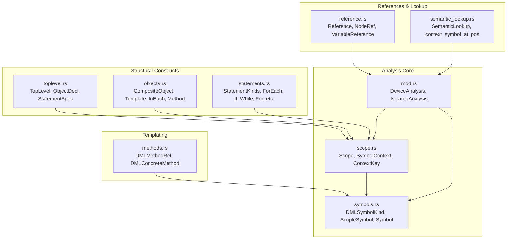
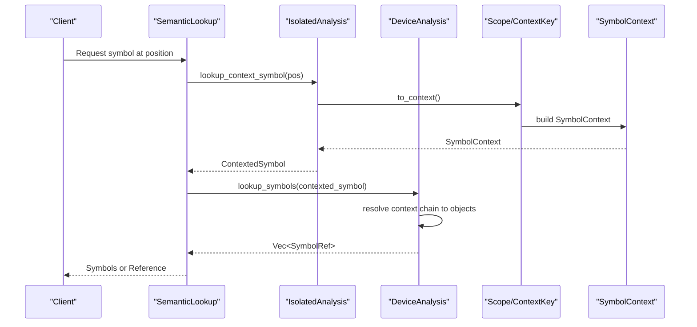
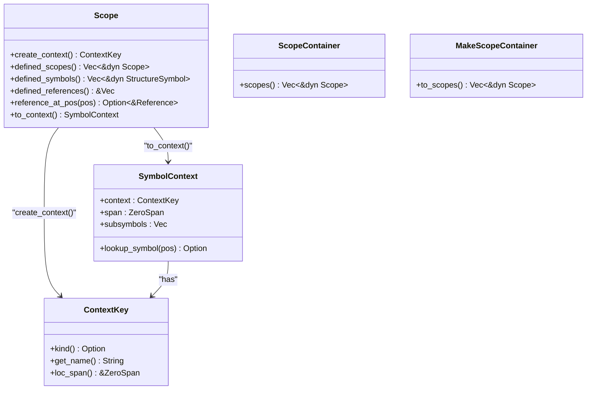
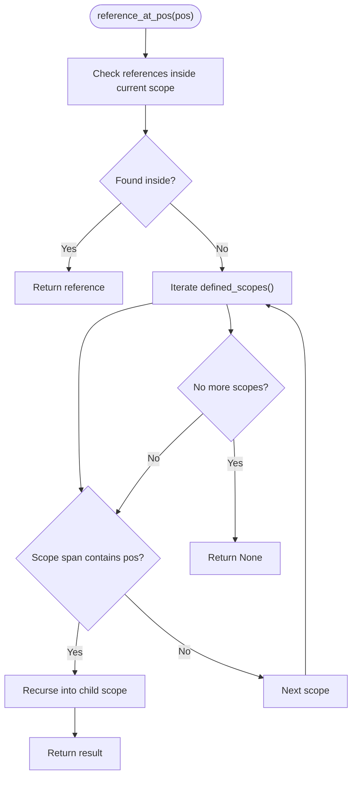
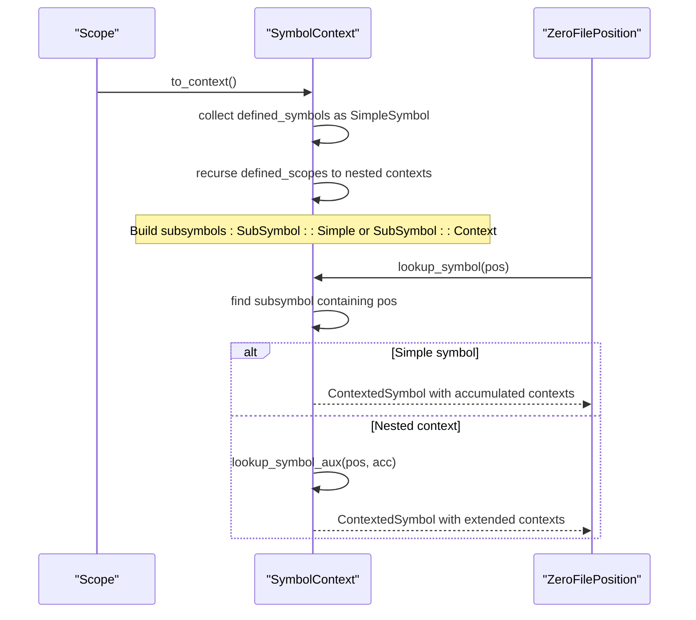
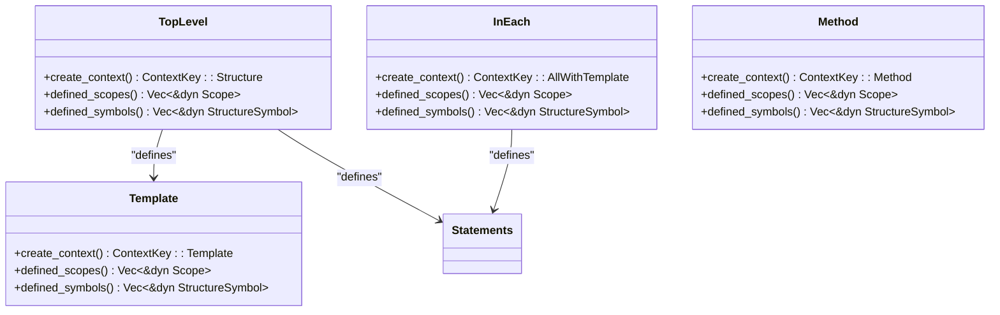
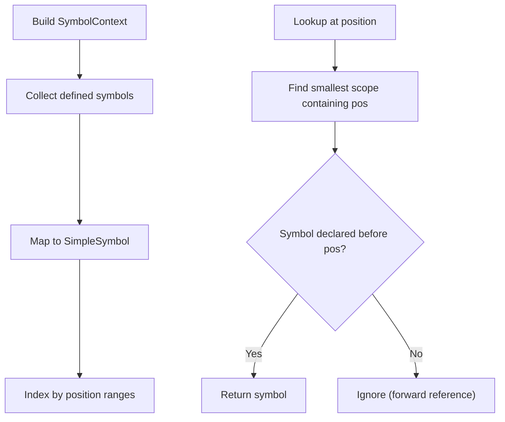
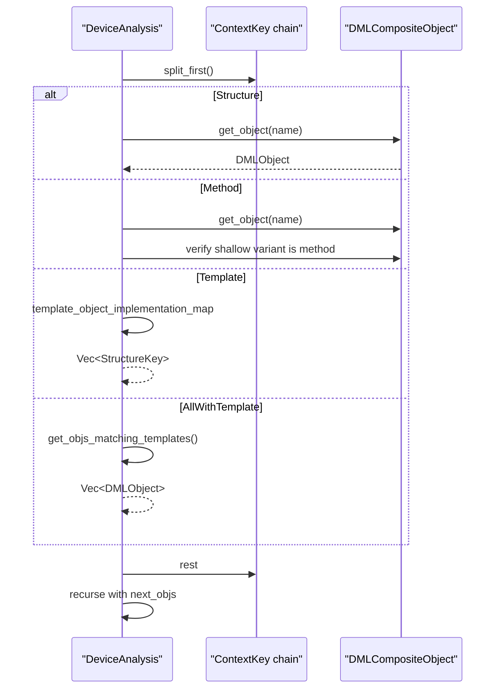
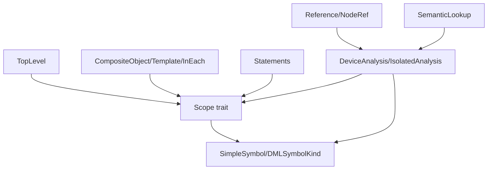

# Scope Analysis

<cite>
**Referenced Files in This Document**
- [scope.rs](file://src/analysis/scope.rs)
- [symbols.rs](file://src/analysis/symbols.rs)
- [mod.rs](file://src/analysis/mod.rs)
- [toplevel.rs](file://src/analysis/structure/toplevel.rs)
- [objects.rs](file://src/analysis/structure/objects.rs)
- [statements.rs](file://src/analysis/structure/statements.rs)
- [reference.rs](file://src/analysis/reference.rs)
- [methods.rs](file://src/analysis/templating/methods.rs)
- [semantic_lookup.rs](file://src/actions/semantic_lookup.rs)
</cite>

## Table of Contents
1. [Introduction](#introduction)
2. [Project Structure](#project-structure)
3. [Core Components](#core-components)
4. [Architecture Overview](#architecture-overview)
5. [Detailed Component Analysis](#detailed-component-analysis)
6. [Dependency Analysis](#dependency-analysis)
7. [Performance Considerations](#performance-considerations)
8. [Troubleshooting Guide](#troubleshooting-guide)
9. [Conclusion](#conclusion)

## Introduction
This document provides comprehensive coverage of scope analysis and hierarchical symbol resolution in the DML language server. It explains how scopes are created for different DML constructs (files, objects, methods, blocks), how scope chains are traversed, and how symbols are bound and looked up. It also documents shadowing rules, visibility determination, nested scope resolution, forward reference handling, and scope-based symbol cleanup and memory optimization strategies.

## Project Structure
The scope analysis system is implemented primarily in the analysis module with supporting structures in the structure and templating modules. Key areas:
- Scope and symbol representation: scope.rs, symbols.rs
- Structural constructs and scope creation: toplevel.rs, objects.rs, statements.rs
- Reference handling and lookup: reference.rs, semantic_lookup.rs
- Method symbolization: methods.rs

**Diagram sources**
- [scope.rs](file://src/analysis/scope.rs#L13-L62)
- [symbols.rs](file://src/analysis/symbols.rs#L19-L38)
- [mod.rs](file://src/analysis/mod.rs#L33-L34)
- [toplevel.rs](file://src/analysis/structure/toplevel.rs#L547-L604)
- [objects.rs](file://src/analysis/structure/objects.rs#L349-L375)
- [statements.rs](file://src/analysis/structure/statements.rs#L43-L80)
- [reference.rs](file://src/analysis/reference.rs#L8-L43)
- [semantic_lookup.rs](file://src/actions/semantic_lookup.rs#L88-L129)
- [methods.rs](file://src/analysis/templating/methods.rs#L313-L398)

**Section sources**
- [scope.rs](file://src/analysis/scope.rs#L1-L247)
- [symbols.rs](file://src/analysis/symbols.rs#L1-L331)
- [mod.rs](file://src/analysis/mod.rs#L1-L2540)

## Core Components
- Scope trait: Defines how constructs expose defined scopes, symbols, and references, and how to traverse scope chains.
- SymbolContext: Hierarchical representation of symbols and scopes for fast lookup.
- ContextKey: Identifies the context of a scope (structure, method, template, or "all-with-template").
- SimpleSymbol and Symbol: Lightweight symbol representation and full symbol metadata with lifecycle tracking.
- DeviceAnalysis and IsolatedAnalysis: Device-wide and file-level analyses that drive symbol lookup and reference resolution.

Key responsibilities:
- Scope creation: Top-level file, objects, templates, in-each blocks, and method bodies create distinct scopes.
- Scope traversal: Nested scope resolution and containment checks.
- Symbol binding: Creation of SimpleSymbol entries and mapping to full Symbol metadata.
- Reference resolution: Mapping references to symbols across device and template instantiations.

**Section sources**
- [scope.rs](file://src/analysis/scope.rs#L13-L62)
- [symbols.rs](file://src/analysis/symbols.rs#L72-L110)
- [mod.rs](file://src/analysis/mod.rs#L247-L269)

## Architecture Overview
The scope analysis architecture centers on a hierarchical scope model with explicit context keys and a symbol context tree. Scopes are created by structural constructs and exposed via the Scope trait. The IsolatedAnalysis builds a SymbolContext for a file, and DeviceAnalysis resolves symbols across device instantiations and templates.

**Diagram sources**
- [semantic_lookup.rs](file://src/actions/semantic_lookup.rs#L88-L129)
- [scope.rs](file://src/analysis/scope.rs#L47-L61)
- [mod.rs](file://src/analysis/mod.rs#L576-L589)

## Detailed Component Analysis

### Scope Hierarchy Implementation
Scopes are implemented via the Scope trait, which requires:
- create_context(): Produces a ContextKey identifying the scope’s context.
- defined_scopes(): Returns child scopes.
- defined_symbols(): Returns symbols defined in the scope.
- defined_references(): Returns references defined in the scope.
- reference_at_pos()/reference_at_pos_inside(): Locates references by position, recursing into nested scopes.

Scope containers (ScopeContainer, MakeScopeContainer) aggregate scopes from collections of constructs.

**Diagram sources**
- [scope.rs](file://src/analysis/scope.rs#L13-L62)
- [scope.rs](file://src/analysis/scope.rs#L98-L138)
- [scope.rs](file://src/analysis/scope.rs#L164-L187)

**Section sources**
- [scope.rs](file://src/analysis/scope.rs#L13-L62)
- [scope.rs](file://src/analysis/scope.rs#L98-L138)
- [scope.rs](file://src/analysis/scope.rs#L164-L187)

### Scope Chain Traversal and Containment
Scope traversal is performed by:
- reference_at_pos(): Searches within the current scope; if not found, recurses into nested scopes whose spans contain the position.
- to_context(): Builds a SymbolContext by collecting defined symbols and recursively converting nested scopes.

This ensures that nearest enclosing scope wins for position-based lookups.

**Diagram sources**
- [scope.rs](file://src/analysis/scope.rs#L31-L45)

**Section sources**
- [scope.rs](file://src/analysis/scope.rs#L31-L45)

### Symbol Lookup and Binding Procedures
Symbol binding proceeds through:
- SimpleSymbol creation: Lightweight wrappers around named, location-aware items.
- SymbolContext construction: Converts defined symbols and scopes into a hierarchical structure.
- Position-based lookup: SymbolContext.lookup_symbol() walks the tree, accumulating context keys to identify the resolution chain.

**Diagram sources**
- [scope.rs](file://src/analysis/scope.rs#L47-L61)
- [scope.rs](file://src/analysis/scope.rs#L219-L246)

**Section sources**
- [scope.rs](file://src/analysis/scope.rs#L47-L61)
- [scope.rs](file://src/analysis/scope.rs#L219-L246)

### Scope Creation for DML Constructs
Different DML constructs create scopes as follows:

- Files (TopLevel): Creates a structure context representing the device-level scope. Defined scopes include templates and statements; defined symbols include templates and top-level declarations.
- Objects (CompositeObject): Does not create a separate scope for itself; its statements contribute to the surrounding scope.
- Templates: Create a template context; their statements define symbols and nested scopes.
- InEach blocks: Create an "all-with-template" context keyed by template specifiers; used to resolve symbols across all matching template instantiations.
- Methods: Create a method context; their bodies define local symbols and nested scopes.

**Diagram sources**
- [toplevel.rs](file://src/analysis/structure/toplevel.rs#L586-L604)
- [objects.rs](file://src/analysis/structure/objects.rs#L664-L677)
- [objects.rs](file://src/analysis/structure/objects.rs#L349-L375)
- [methods.rs](file://src/analysis/templating/methods.rs#L313-L398)

**Section sources**
- [toplevel.rs](file://src/analysis/structure/toplevel.rs#L586-L604)
- [objects.rs](file://src/analysis/structure/objects.rs#L664-L677)
- [objects.rs](file://src/analysis/structure/objects.rs#L349-L375)
- [methods.rs](file://src/analysis/templating/methods.rs#L313-L398)

### Shadowing Rules and Visibility Determination
Shadowing occurs when a symbol in an inner scope has the same name as a symbol in an outer scope. The current scope’s symbol takes precedence for lookups within that scope. Visibility is determined by:
- Containment: A symbol is visible if its scope contains the lookup position.
- Order of appearance: For forward references, symbols declared after the reference are ignored in the same scope (enforced by position comparisons in symbol storage lookups).

The RangeEntry-based lookup enforces that symbols declared after the reference position are not matched in the same scope, preventing forward references from resolving to later-declared symbols.

**Section sources**
- [mod.rs](file://src/analysis/mod.rs#L281-L327)

### Nested Scope Resolution and Forward Reference Handling
Nested scope resolution:
- SymbolContext.walk finds the smallest enclosing scope by position and returns the symbol within it.
- ContextedSymbol accumulates the context chain to guide device-level resolution.

Forward reference handling:
- RangeEntry.find_symbol_for_name() checks that the symbol’s declaration position precedes the reference position within the same scope.
- IsolatedAnalysis.build_symbol_context() ensures that symbols are indexed with their declaration positions.

**Diagram sources**
- [scope.rs](file://src/analysis/scope.rs#L47-L61)
- [mod.rs](file://src/analysis/mod.rs#L281-L327)

**Section sources**
- [scope.rs](file://src/analysis/scope.rs#L47-L61)
- [mod.rs](file://src/analysis/mod.rs#L281-L327)

### Scope-Based Symbol Cleanup and Lifetime Management
Symbol lifetimes and cleanup:
- SymbolRef holds a Symbol behind a Mutex; symbols are shared across analyses and can be mutated by reference resolution.
- DeviceAnalysis maintains indexed symbol storages (template_symbols, param_symbols, object_symbols, method_symbols, variable_symbols) to efficiently locate symbols by location and context.
- Scope-based cleanup is implicit: when a scope is dropped, its defined symbols and references are released. The underlying SymbolRef instances remain valid until all references to them are dropped.

Memory optimization strategies:
- Use lightweight SimpleSymbol for indexing and context building.
- Index symbols by location spans and names to minimize scans.
- Avoid deep cloning of large structures; pass references where possible.
- Consider spatial indexing (segment or interval tree) for large symbol sets (as noted in comments).

**Section sources**
- [symbols.rs](file://src/analysis/symbols.rs#L183-L207)
- [mod.rs](file://src/analysis/mod.rs#L329-L352)

### Reference Resolution Across Templates and Methods
Reference resolution integrates with scope contexts:
- DeviceAnalysis.context_to_objs() converts a context chain (structure, method, template, or "all-with-template") into concrete device objects.
- context_to_objs() validates that a method context indeed refers to a method object and resolves template instantiations.
- ReferenceMatches aggregates matches, suggestions, and mismatched findings, and supports merging.

**Diagram sources**
- [mod.rs](file://src/analysis/mod.rs#L716-L799)

**Section sources**
- [mod.rs](file://src/analysis/mod.rs#L716-L799)

## Dependency Analysis
The scope analysis system exhibits clear separation of concerns:
- Scope and SymbolContext depend on DMLSymbolKind and SimpleSymbol.
- Structural constructs implement Scope and expose defined scopes/symbols.
- DeviceAnalysis orchestrates cross-device and template-based resolution.
- SemanticLookup coordinates file-level and device-level lookups.

**Diagram sources**
- [scope.rs](file://src/analysis/scope.rs#L13-L62)
- [symbols.rs](file://src/analysis/symbols.rs#L19-L38)
- [toplevel.rs](file://src/analysis/structure/toplevel.rs#L586-L604)
- [objects.rs](file://src/analysis/structure/objects.rs#L349-L375)
- [statements.rs](file://src/analysis/structure/statements.rs#L612-L625)
- [mod.rs](file://src/analysis/mod.rs#L359-L374)
- [reference.rs](file://src/analysis/reference.rs#L8-L43)
- [semantic_lookup.rs](file://src/actions/semantic_lookup.rs#L88-L129)

**Section sources**
- [scope.rs](file://src/analysis/scope.rs#L13-L62)
- [symbols.rs](file://src/analysis/symbols.rs#L19-L38)
- [toplevel.rs](file://src/analysis/structure/toplevel.rs#L586-L604)
- [objects.rs](file://src/analysis/structure/objects.rs#L349-L375)
- [statements.rs](file://src/analysis/structure/statements.rs#L612-L625)
- [mod.rs](file://src/analysis/mod.rs#L359-L374)
- [reference.rs](file://src/analysis/reference.rs#L8-L43)
- [semantic_lookup.rs](file://src/actions/semantic_lookup.rs#L88-L129)

## Performance Considerations
- Prefer positional indexing and containment checks over linear scans for symbol lookup.
- Use SymbolContext to cache hierarchical symbol views and avoid repeated traversal.
- Limit deep cloning of structures; pass references where feasible.
- Consider spatial indexing for large symbol sets to improve lookup performance.
- Avoid unnecessary allocations in hot paths (e.g., avoid cloning symbols unless required).

[No sources needed since this section provides general guidance]

## Troubleshooting Guide
Common issues and remedies:
- No symbol or reference found: Verify that the position is within a scope’s span and that the symbol is declared before the reference in the same scope.
- Template references inside uninstantiated templates: The system inserts limitations indicating that template references require instantiation.
- Method override mismatches: The system reports mismatches in argument count, types, and throw declarations.

**Section sources**
- [semantic_lookup.rs](file://src/actions/semantic_lookup.rs#L169-L173)
- [semantic_lookup.rs](file://src/actions/semantic_lookup.rs#L214-L220)
- [methods.rs](file://src/analysis/templating/methods.rs#L182-L268)

## Conclusion
The DML language server implements a robust scope analysis system centered on hierarchical scopes, context keys, and a SymbolContext tree. Scopes are created by structural constructs, and traversal respects containment and declaration order to enforce shadowing and visibility rules. The system supports template-based resolution and method override checking, with mechanisms for forward reference handling and efficient symbol lookup. Scope-based cleanup and memory optimization are achieved through lightweight symbol wrappers and indexed storages.