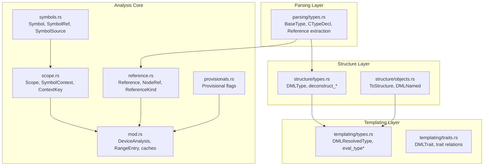
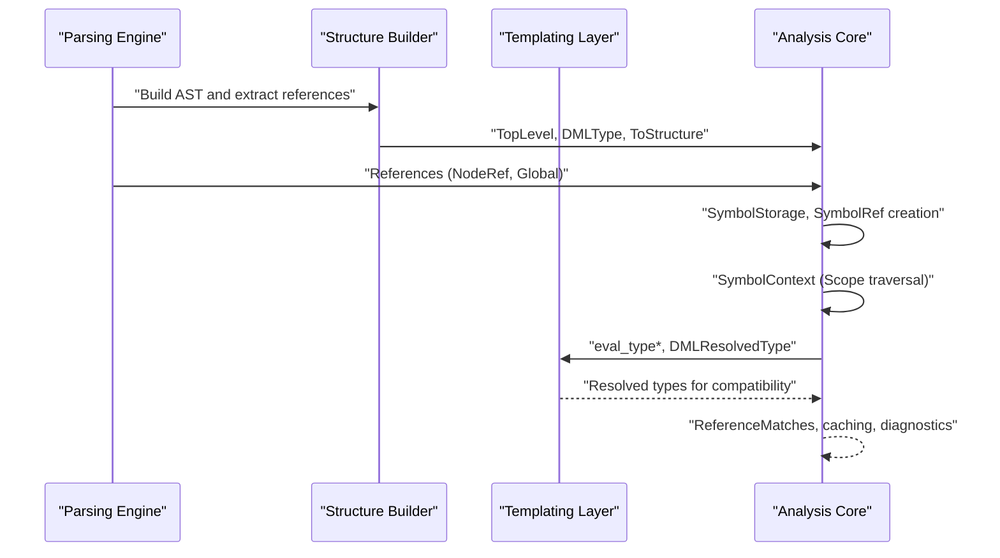
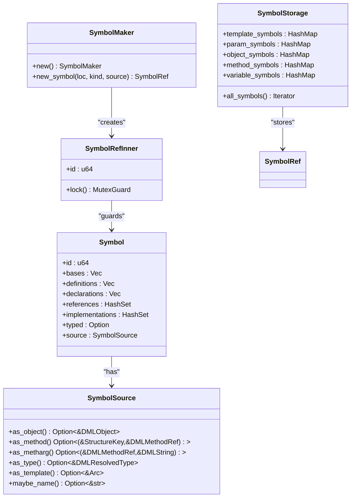
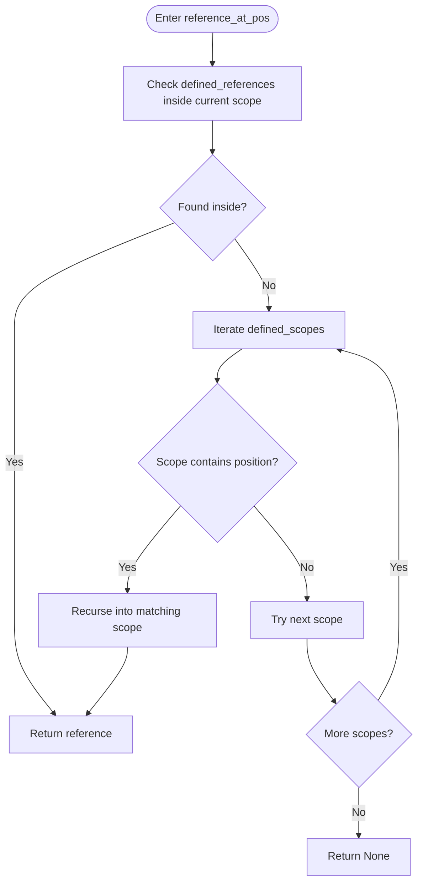
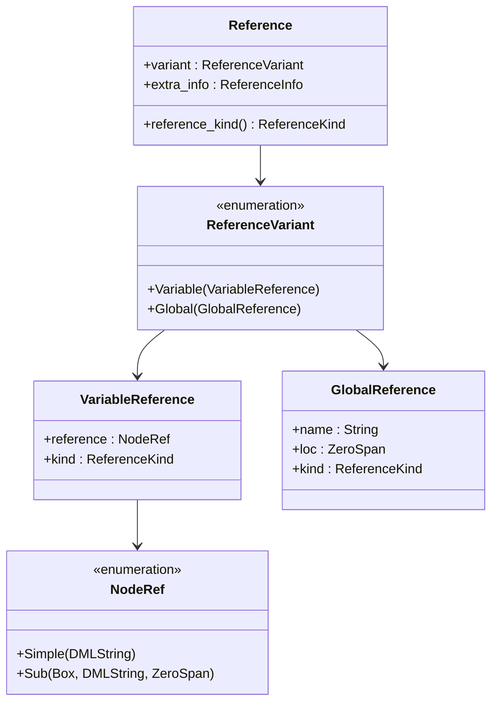
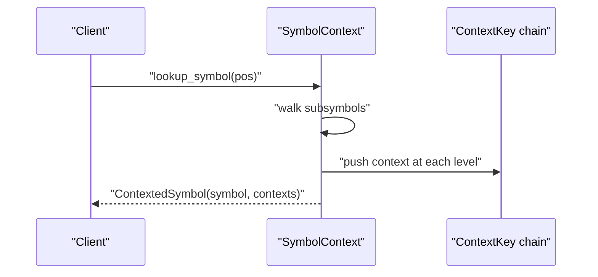
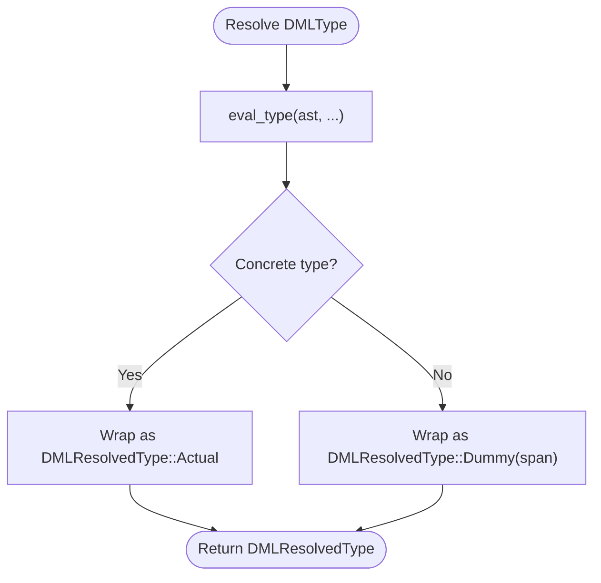
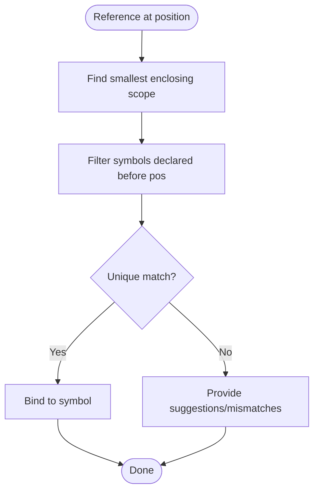
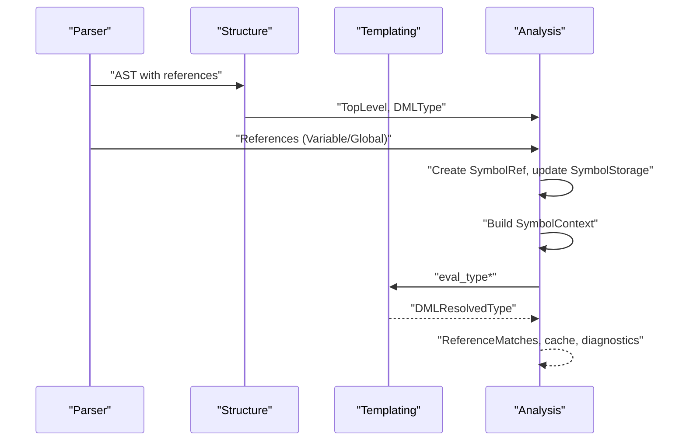
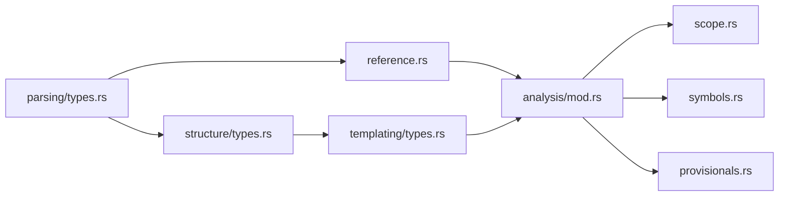

# Symbol Resolution and Type System

<cite>
**Referenced Files in This Document**
- [symbols.rs](file://src/analysis/symbols.rs)
- [scope.rs](file://src/analysis/scope.rs)
- [reference.rs](file://src/analysis/reference.rs)
- [provisionals.rs](file://src/analysis/provisionals.rs)
- [types.rs](file://src/analysis/structure/types.rs)
- [mod.rs](file://src/analysis/mod.rs)
- [types.rs](file://src/analysis/templating/types.rs)
- [types.rs](file://src/analysis/parsing/types.rs)
- [objects.rs](file://src/analysis/structure/objects.rs)
- [traits.rs](file://src/analysis/templating/traits.rs)
</cite>

## Table of Contents
1. [Introduction](#introduction)
2. [Project Structure](#project-structure)
3. [Core Components](#core-components)
4. [Architecture Overview](#architecture-overview)
5. [Detailed Component Analysis](#detailed-component-analysis)
6. [Dependency Analysis](#dependency-analysis)
7. [Performance Considerations](#performance-considerations)
8. [Troubleshooting Guide](#troubleshooting-guide)
9. [Conclusion](#conclusion)

## Introduction
This document explains the symbol resolution and type system of the DML language server. It focuses on:
- Hierarchical symbol table management and scope analysis
- Reference resolution mechanisms and name binding
- Type inference and type checking, including provisional type handling
- Integration with the parsing engine and analysis workflow
- Practical examples such as forward references, nested scopes, and symbol visibility

## Project Structure
The symbol and type system spans several modules:
- Analysis core: symbol definitions, scope traversal, reference representation, and analysis orchestration
- Structure layer: DML AST-to-structure conversion and type construction helpers
- Templating layer: resolved types, trait-based type checking, and evaluation helpers
- Parsing layer: type grammar and reference extraction during parsing

**Diagram sources**
- [symbols.rs](file://src/analysis/symbols.rs#L180-L331)
- [scope.rs](file://src/analysis/scope.rs#L13-L247)
- [reference.rs](file://src/analysis/reference.rs#L8-L220)
- [provisionals.rs](file://src/analysis/provisionals.rs#L28-L81)
- [mod.rs](file://src/analysis/mod.rs#L246-L800)
- [types.rs](file://src/analysis/structure/types.rs#L9-L90)
- [objects.rs](file://src/analysis/structure/objects.rs#L32-L200)
- [types.rs](file://src/analysis/templating/types.rs#L46-L93)
- [traits.rs](file://src/analysis/templating/traits.rs#L29-L200)
- [types.rs](file://src/analysis/parsing/types.rs#L477-L570)

**Section sources**
- [mod.rs](file://src/analysis/mod.rs#L1-L120)
- [scope.rs](file://src/analysis/scope.rs#L13-L115)
- [reference.rs](file://src/analysis/reference.rs#L8-L146)
- [symbols.rs](file://src/analysis/symbols.rs#L180-L331)
- [types.rs](file://src/analysis/structure/types.rs#L9-L90)
- [types.rs](file://src/analysis/templating/types.rs#L46-L93)
- [types.rs](file://src/analysis/parsing/types.rs#L477-L570)
- [objects.rs](file://src/analysis/structure/objects.rs#L32-L200)
- [traits.rs](file://src/analysis/templating/traits.rs#L29-L200)

## Core Components
- Symbols and symbol storage
  - Symbol: central record of a definition, declarations, references, implementations, and typed information
  - SymbolRef: thread-safe handle to a symbol with atomic ID and mutex-protected data
  - SymbolSource: identifies the origin of a symbol (object, method, method argument/local, type, template)
  - SymbolStorage: indexed maps for template, parameter, object, method, and variable symbols
- Scopes and contexts
  - Scope: declares defined scopes, symbols, and references; supports position-based lookup and context building
  - SymbolContext: hierarchical representation of scopes and symbols for fast lookups
  - ContextKey: identifies a scope’s context (structure, method, template, or “all with template”)
- References
  - Reference: a resolved or pending reference to a symbol with kind (template, type, variable, callable)
  - NodeRef: dot-chained identifiers representing compound references
- Provisionals
  - ProvisionalsManager: tracks active provisional flags and collects duplicates/invalid entries
- Types
  - DMLResolvedType: resolved or dummy type used for compatibility checks and method override verification
  - eval_type*: converts a DMLType AST into a resolved type representation

**Section sources**
- [symbols.rs](file://src/analysis/symbols.rs#L180-L331)
- [scope.rs](file://src/analysis/scope.rs#L13-L115)
- [reference.rs](file://src/analysis/reference.rs#L8-L146)
- [provisionals.rs](file://src/analysis/provisionals.rs#L28-L81)
- [types.rs](file://src/analysis/templating/types.rs#L46-L93)
- [types.rs](file://src/analysis/structure/types.rs#L9-L90)

## Architecture Overview
The analysis pipeline integrates parsing, structure building, templating, and symbol/type resolution:

**Diagram sources**
- [mod.rs](file://src/analysis/mod.rs#L246-L800)
- [types.rs](file://src/analysis/structure/types.rs#L9-L90)
- [types.rs](file://src/analysis/templating/types.rs#L46-L93)
- [types.rs](file://src/analysis/parsing/types.rs#L477-L570)
- [reference.rs](file://src/analysis/reference.rs#L8-L146)

## Detailed Component Analysis

### Hierarchical Symbol Table Management
- Symbol lifecycle
  - Creation via SymbolMaker.new_symbol produces a SymbolRef with a unique ID and initial metadata
  - Symbol holds locations for definitions, declarations, references, and implementations
  - SymbolSource ties a symbol to its origin (object/method/template/type)
- Storage and indexing
  - SymbolStorage organizes symbols by kind and location keys (e.g., method symbols indexed by declaration location and parent key)
  - Provides iterators over all symbols for downstream consumers
- Thread safety
  - SymbolRefInner wraps Symbol in a Mutex to support concurrent updates during incremental analysis

**Diagram sources**
- [symbols.rs](file://src/analysis/symbols.rs#L239-L331)

**Section sources**
- [symbols.rs](file://src/analysis/symbols.rs#L180-L331)
- [mod.rs](file://src/analysis/mod.rs#L329-L374)

### Scope Analysis and Context Building
- Scope interface
  - defined_scopes, defined_symbols, defined_references expose the hierarchical structure
  - reference_at_pos traverses nested scopes to locate a reference at a file position
  - to_context builds a SymbolContext of nested scopes and simple symbols
- SymbolContext
  - ContextKey identifies the current scope (structure, method, template, or “all with template”)
  - lookup_symbol walks the context tree to find the nearest symbol at a position and returns it with its context chain

**Diagram sources**
- [scope.rs](file://src/analysis/scope.rs#L25-L45)

**Section sources**
- [scope.rs](file://src/analysis/scope.rs#L13-L115)
- [scope.rs](file://src/analysis/scope.rs#L220-L247)

### Reference Resolution Mechanisms
- Reference kinds
  - Template, Type, Variable, Callable distinguish how a reference is interpreted
- NodeRef and VariableReference
  - NodeRef supports chained dotted references (e.g., a.b.c)
  - VariableReference carries the kind and the NodeRef
- GlobalReference
  - For top-level identifiers without dots
- Reference collection and extraction
  - Parsing layer extracts references from type grammars and expressions
  - ReferenceContainer accumulates references across AST nodes

**Diagram sources**
- [reference.rs](file://src/analysis/reference.rs#L8-L220)
- [types.rs](file://src/analysis/parsing/types.rs#L477-L570)

**Section sources**
- [reference.rs](file://src/analysis/reference.rs#L8-L146)
- [types.rs](file://src/analysis/parsing/types.rs#L477-L570)

### Name Binding and Scope Chain Traversal
- Position-based lookup
  - SymbolContext.lookup_symbol finds the nearest symbol at a file position and returns it with its context chain
- Context chain semantics
  - ContextKey encodes whether the context is a structure, method, template, or “all with template”
  - The chain is used to narrow objects and templates during semantic lookups
- Nested scopes
  - Scope.to_context recursively includes child scopes, enabling deep traversal

**Diagram sources**
- [scope.rs](file://src/analysis/scope.rs#L220-L247)

**Section sources**
- [scope.rs](file://src/analysis/scope.rs#L116-L187)
- [scope.rs](file://src/analysis/scope.rs#L220-L247)

### Type Inference, Compatibility, and Provisional Handling
- Type representation
  - DMLResolvedType encapsulates either a concrete resolved type or a dummy for forward references
  - DMLConcreteType includes base and struct types; DMLBaseType/DMLStructType carry minimal spans
- Evaluation
  - eval_type and eval_type_simple convert a DMLType AST into a resolved type tuple
  - Used during structural analysis to compute types for expressions and declarations
- Compatibility checks
  - DMLResolvedType.equivalent currently returns true to avoid false negatives in method override argument checks
- Provisional flags
  - ProvisionalsManager tracks active flags and records duplicates/invalid entries
  - Supports features like explicit method/param declarations and vector utilities

**Diagram sources**
- [types.rs](file://src/analysis/templating/types.rs#L46-L93)

**Section sources**
- [types.rs](file://src/analysis/templating/types.rs#L46-L93)
- [provisionals.rs](file://src/analysis/provisionals.rs#L28-L81)

### Forward References, Nested Scopes, and Visibility
- Forward references
  - Provisional flags enable forward-declared constructs; ProvisionalsManager tracks active flags
  - DMLResolvedType::Dummy allows downstream consumers to continue analysis while deferring resolution
- Nested scopes
  - Scope.defined_scopes and SymbolContext nesting ensure proper lexical scoping
  - reference_at_pos traverses nested scopes to resolve references at arbitrary positions
- Visibility
  - RangeEntry enforces visibility by filtering symbols declared after the reference position
  - Scope.to_context flattens symbols and nested scopes for efficient lookups

**Diagram sources**
- [mod.rs](file://src/analysis/mod.rs#L281-L327)
- [scope.rs](file://src/analysis/scope.rs#L25-L45)

**Section sources**
- [mod.rs](file://src/analysis/mod.rs#L281-L327)
- [provisionals.rs](file://src/analysis/provisionals.rs#L28-L81)

### Integration with Parsing and Analysis Workflow
- Parsing extracts references and types
  - BaseType and CTypeDecl capture type grammar and emit references for identifiers
- Structural conversion
  - ToStructure transforms parsed content into structured forms; DMLType helpers assist type construction
- Templating and traits
  - DMLTrait and trait relations drive compatibility checks and method resolution
- Analysis orchestration
  - DeviceAnalysis orchestrates symbol lookup, reference matching, and diagnostics
  - ReferenceCache keys references by object path, flattened reference, and method scope to speed lookups

**Diagram sources**
- [types.rs](file://src/analysis/parsing/types.rs#L477-L570)
- [types.rs](file://src/analysis/structure/types.rs#L9-L90)
- [traits.rs](file://src/analysis/templating/traits.rs#L29-L200)
- [mod.rs](file://src/analysis/mod.rs#L551-L800)

**Section sources**
- [types.rs](file://src/analysis/parsing/types.rs#L477-L570)
- [types.rs](file://src/analysis/structure/types.rs#L9-L90)
- [traits.rs](file://src/analysis/templating/traits.rs#L29-L200)
- [mod.rs](file://src/analysis/mod.rs#L551-L800)

## Dependency Analysis
- Coupling and cohesion
  - symbols.rs and scope.rs are tightly coupled: scopes produce contexts that feed symbol lookups
  - reference.rs is consumed by analysis and templating layers for kind-aware resolution
  - provisionals.rs influences type evaluation and compatibility checks
- External dependencies
  - Parsing types (BaseType, CTypeDecl) feed into structure and templating type systems
  - LSP types and logging inform diagnostics and tracing

**Diagram sources**
- [types.rs](file://src/analysis/parsing/types.rs#L477-L570)
- [types.rs](file://src/analysis/structure/types.rs#L9-L90)
- [types.rs](file://src/analysis/templating/types.rs#L46-L93)
- [reference.rs](file://src/analysis/reference.rs#L8-L146)
- [mod.rs](file://src/analysis/mod.rs#L246-L800)
- [scope.rs](file://src/analysis/scope.rs#L13-L115)
- [symbols.rs](file://src/analysis/symbols.rs#L180-L331)
- [provisionals.rs](file://src/analysis/provisionals.rs#L28-L81)

**Section sources**
- [mod.rs](file://src/analysis/mod.rs#L246-L800)
- [scope.rs](file://src/analysis/scope.rs#L13-L115)
- [reference.rs](file://src/analysis/reference.rs#L8-L146)
- [symbols.rs](file://src/analysis/symbols.rs#L180-L331)
- [types.rs](file://src/analysis/templating/types.rs#L46-L93)
- [types.rs](file://src/analysis/structure/types.rs#L9-L90)
- [types.rs](file://src/analysis/parsing/types.rs#L477-L570)
- [provisionals.rs](file://src/analysis/provisionals.rs#L28-L81)

## Performance Considerations
- Spatial indexing
  - RangeEntry uses nested ranges to accelerate symbol lookup; consider replacing with a segment/interval tree for dense symbol distributions
- Concurrent symbol updates
  - SymbolRefInner uses a Mutex; minimize contention by batching updates and leveraging SymbolRef sharing
- Reference caching
  - ReferenceCache keys by object path, flattened reference, and method scope to reduce repeated computation
- Scope traversal
  - SymbolContext precomputes nested structures; keep chains shallow to avoid deep recursion overhead

[No sources needed since this section provides general guidance]

## Troubleshooting Guide
- Reference not found
  - Verify the reference kind (template/type/variable/callable) and ensure the symbol exists in the correct scope
  - Check that the reference position falls within the expected scope and that declarations precede the reference
- Mismatched find
  - Occurs when multiple candidates exist; refine the context chain or adjust template/object narrowing
- Type mismatch
  - DMLResolvedType.equivalent currently returns true to avoid false negatives; ensure downstream checks are robust
- Provisional flag issues
  - Validate that active provisionals are correctly recorded and that duplicates/invalid entries are reported

**Section sources**
- [mod.rs](file://src/analysis/mod.rs#L376-L473)
- [types.rs](file://src/analysis/templating/types.rs#L65-L71)
- [provisionals.rs](file://src/analysis/provisionals.rs#L35-L63)

## Conclusion
The DML language server implements a robust symbol resolution and type system:
- Hierarchical scopes and contexts enable precise name binding and visibility
- Symbol storage and reference resolution integrate with parsing to support forward references and provisional features
- Resolved types and compatibility checks underpin method override verification and trait-based reasoning
- The analysis workflow leverages caching and spatial indexing to balance correctness and performance