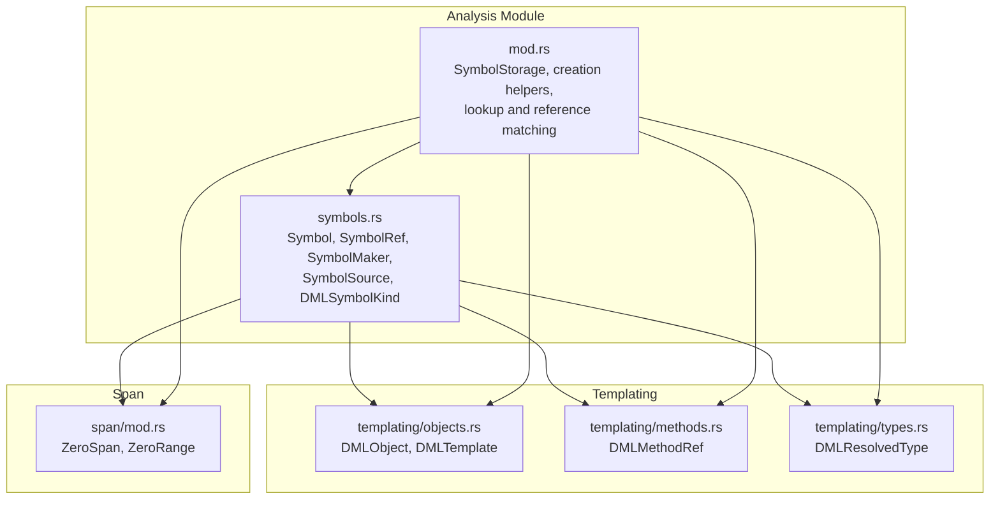
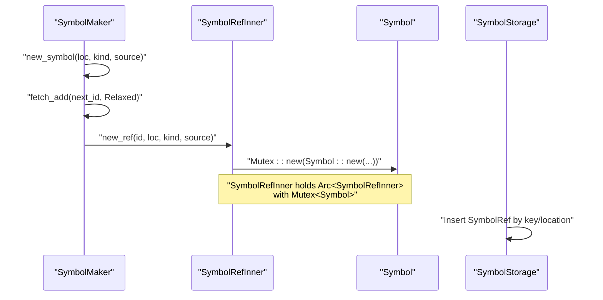
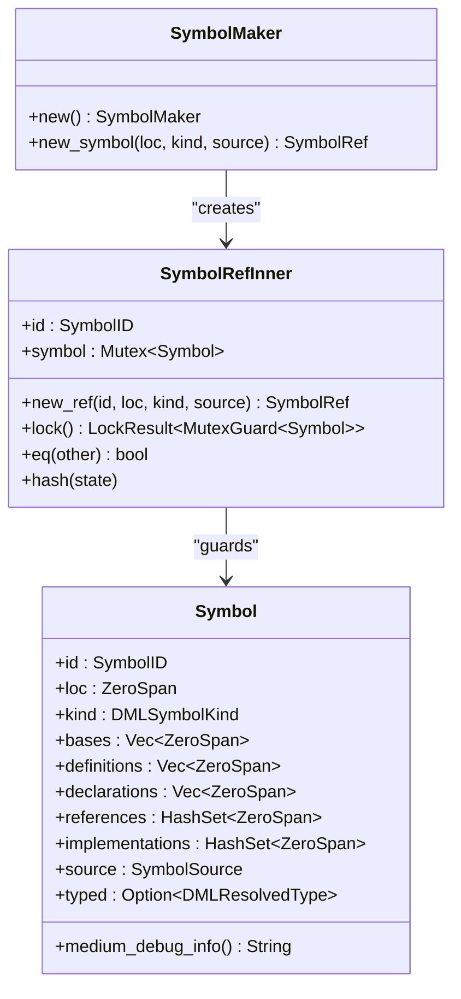
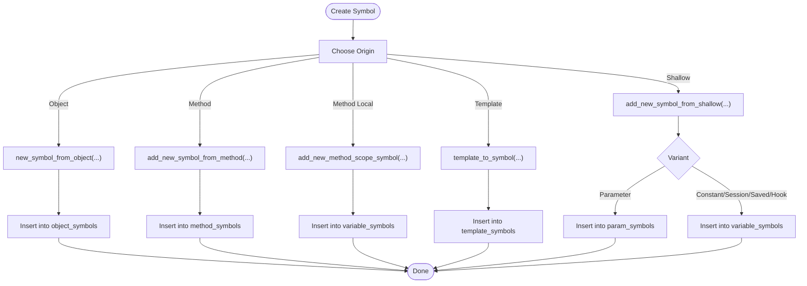
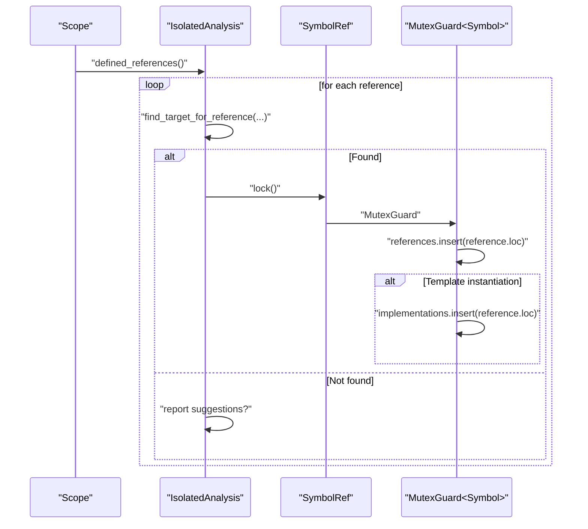
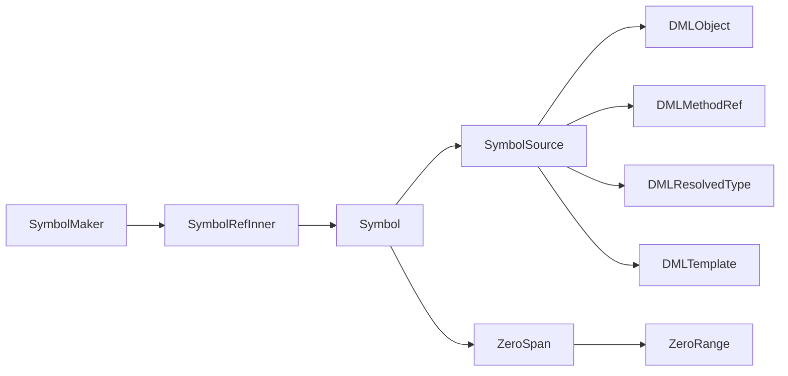

# Symbol Table Management

<cite>
**Referenced Files in This Document**
- [symbols.rs](file://src/analysis/symbols.rs)
- [mod.rs](file://src/analysis/mod.rs)
- [objects.rs](file://src/analysis/templating/objects.rs)
- [tree.rs](file://src/span/mod.rs)
</cite>

## Table of Contents
1. [Introduction](#introduction)
2. [Project Structure](#project-structure)
3. [Core Components](#core-components)
4. [Architecture Overview](#architecture-overview)
5. [Detailed Component Analysis](#detailed-component-analysis)
6. [Dependency Analysis](#dependency-analysis)
7. [Performance Considerations](#performance-considerations)
8. [Troubleshooting Guide](#troubleshooting-guide)
9. [Conclusion](#conclusion)

## Introduction
This document explains the symbol table management subsystem, focusing on the Symbol and SymbolRef implementations, the SymbolMaker factory, and the SymbolSource enum. It covers symbol creation, identity management, concurrent access patterns, and the indexing strategy used to support fast lookups and reference tracking. It also documents the SymbolSource variants for different symbol types (objects, methods, method arguments and locals, templates, and types), and provides guidance on memory management, symbol equivalence, and performance considerations for large symbol tables.

## Project Structure
The symbol table lives primarily in the analysis module:
- Symbol types and factories are defined in the symbols module.
- The global symbol storage and creation routines live in the analysis module.
- Supporting types (DMLObject, DMLMethodRef, DMLResolvedType, DMLTemplate) are defined in templating and structure modules.
- Span types (ZeroSpan, ZeroRange) are defined in the span module.

**Diagram sources**
- [symbols.rs](file://src/analysis/symbols.rs#L1-L331)
- [mod.rs](file://src/analysis/mod.rs#L329-L519)
- [objects.rs](file://src/analysis/templating/objects.rs#L367-L406)
- [tree.rs](file://src/span/mod.rs#L276-L323)

**Section sources**
- [symbols.rs](file://src/analysis/symbols.rs#L1-L331)
- [mod.rs](file://src/analysis/mod.rs#L329-L519)

## Core Components
- Symbol: The core runtime representation of a symbol with identity, kind, location, and sets of bases, definitions, declarations, references, and implementations. It holds a SymbolSource to identify the originating construct and optional typing information.
- SymbolRef: An Arc’ed handle to a Symbol with a Mutex-guarded inner structure, enabling safe concurrent updates. Equality and hashing are based on the numeric SymbolID.
- SymbolMaker: A factory that atomically generates unique SymbolID values and constructs SymbolRef instances.
- SymbolSource: An enum that identifies the origin of a symbol (DMLObject, Method, MethodArg, MethodLocal, Type, Template), enabling equivalence checks and name extraction for display.
- DMLSymbolKind: Enumerates kinds of symbols (objects, methods, parameters, constants, hooks, locals, templates, typedefs, etc.), including a variant carrying CompObjectKind for composite objects.

These components collectively enable:
- Unique symbol identity via atomic ID generation.
- Thread-safe mutation through per-symbol Mutex guards.
- Efficient indexing and lookup via SymbolStorage.
- Equivalence and deduplication during symbol tracking.

**Section sources**
- [symbols.rs](file://src/analysis/symbols.rs#L180-L331)
- [mod.rs](file://src/analysis/mod.rs#L329-L374)

## Architecture Overview
The symbol table is built around a factory (SymbolMaker) and a storage structure (SymbolStorage). Creation routines build SymbolRefs and index them by location or key. Lookup and reference matching traverse scopes and indices to connect references to symbols, updating symbol metadata such as references and implementations.

**Diagram sources**
- [symbols.rs](file://src/analysis/symbols.rs#L239-L298)
- [mod.rs](file://src/analysis/mod.rs#L329-L342)

## Detailed Component Analysis

### Symbol and SymbolRef
- Identity: Each Symbol carries a unique SymbolID generated by SymbolMaker. SymbolRefInner equality and hashing rely on this ID, ensuring efficient deduplication and map operations.
- Concurrency: SymbolRefInner exposes a lock method returning a MutexGuard<Symbol>. All mutations (adding references, implementations, definitions, declarations, bases) occur under this guard.
- Memory model: SymbolRef is an Arc, so cloning the handle is cheap and safe. The underlying Symbol is protected by a Mutex, preventing data races across threads.

**Diagram sources**
- [symbols.rs](file://src/analysis/symbols.rs#L239-L331)

**Section sources**
- [symbols.rs](file://src/analysis/symbols.rs#L180-L331)

### SymbolMaker Factory Pattern and Atomic ID Generation
- SymbolMaker maintains an AtomicU64 counter initialized to zero. Each call to new_symbol atomically increments it with a relaxed ordering, assigning a fresh SymbolID to the new symbol.
- Construction: new_symbol creates a SymbolRefInner holding a Mutex-protected Symbol, then returns an Arc handle to it.

Practical implications:
- Linearly increasing IDs simplify debugging and enable compact indexing.
- Relaxed ordering is sufficient for uniqueness; stronger ordering is unnecessary for IDs.

**Section sources**
- [symbols.rs](file://src/analysis/symbols.rs#L239-L258)

### SymbolSource Enum Variants and Usage
SymbolSource captures the origin of a symbol to support:
- Equivalence checks (e.g., DMLObject equivalence ignores structure keys).
- Name extraction for display and diagnostics.
- Discriminated accessors for downstream logic.

Variants:
- DMLObject(DMLObject): Composite or shallow object symbols.
- Method(StructureKey, Arc<DMLMethodRef>): Method symbols bound to a parent object key and method reference.
- MethodArg(Arc<DMLMethodRef>, DMLString): Formal parameter symbols.
- MethodLocal(Arc<DMLMethodRef>, DMLString): Local variable symbols inside methods.
- Type(DMLResolvedType): Typed symbols (no name).
- Template(Arc<DMLTemplate>): Template symbols.

Equivalence:
- For DMLObject, equivalence compares shallow object variants rather than structure keys, aiding deduplication across copies.
- For other variants, equality is structural.

Name extraction:
- Provides a human-readable name when available (objects, methods, method args/locals, templates), otherwise None.

**Section sources**
- [symbols.rs](file://src/analysis/symbols.rs#L112-L178)
- [objects.rs](file://src/analysis/templating/objects.rs#L367-L406)

### Symbol Creation and Indexing
Creation routines build SymbolRefs and index them into SymbolStorage:
- Objects: new_symbol_from_object builds a symbol for composite objects, populating bases, definitions, declarations, and implementations.
- Methods: add_new_symbol_from_method creates method symbols per override level and parent object, then registers argument symbols and method scope symbols.
- Method scope symbols: add_new_method_scope_symbol registers locals and identifiers within method bodies.
- Templates: template_to_symbol creates template symbols when location information is present.
- Shallow objects: add_new_symbol_from_shallow handles parameters, constants, session/saved, and hook symbols.

Indexing strategy:
- template_symbols: indexed by ZeroSpan (location).
- param_symbols: doubly indexed by (ZeroSpan, String) and parent StructureKey to handle implicit parameters at the same location.
- object_symbols: indexed by StructureKey.
- method_symbols: doubly indexed by declaration ZeroSpan and parent StructureKey.
- variable_symbols: indexed by ZeroSpan.

**Diagram sources**
- [mod.rs](file://src/analysis/mod.rs#L1748-L1962)
- [mod.rs](file://src/analysis/mod.rs#L1964-L2200)
- [mod.rs](file://src/analysis/mod.rs#L1774-L1803)

**Section sources**
- [mod.rs](file://src/analysis/mod.rs#L1748-L1962)
- [mod.rs](file://src/analysis/mod.rs#L1964-L2200)
- [mod.rs](file://src/analysis/mod.rs#L1774-L1803)

### Lookup Operations and Reference Counting
Lookup and reference matching:
- match_references_in_scope iterates references within a scope, attempting to resolve them against objects and contexts.
- For each match, handle_symbol_ref updates the symbol’s references set and, for template symbols that were instantiated, adds the reference location to implementations.

Reference counting:
- Each reference to a symbol is recorded in the symbol’s references set.
- For templates, instantiation sites are tracked in implementations.

**Diagram sources**
- [mod.rs](file://src/analysis/mod.rs#L1451-L1528)
- [mod.rs](file://src/analysis/mod.rs#L1441-L1448)

**Section sources**
- [mod.rs](file://src/analysis/mod.rs#L1451-L1528)
- [mod.rs](file://src/analysis/mod.rs#L1441-L1448)

### Symbol Equivalence Checking
Two symbols are considered equivalent if:
- Their location spans are equal.
- Their kinds are equal.
- Their definitions and declarations are equal.
- Their SymbolSource equivalents are equal.

SymbolSource equivalence:
- For DMLObject, equivalence compares shallow object variants rather than structure keys.
- For other variants, structural equality is used.

This mechanism prevents duplicate entries in symbol maps and ensures consistent merging during analysis.

**Section sources**
- [symbols.rs](file://src/analysis/symbols.rs#L225-L235)
- [symbols.rs](file://src/analysis/symbols.rs#L160-L166)
- [objects.rs](file://src/analysis/templating/objects.rs#L392-L400)

## Dependency Analysis
The symbol table relies on:
- Templating types for origins: DMLObject, DMLMethodRef, DMLResolvedType, DMLTemplate.
- Span types for location tracking: ZeroSpan, ZeroRange.
- Standard library collections for indexing and concurrency primitives.

**Diagram sources**
- [symbols.rs](file://src/analysis/symbols.rs#L180-L331)
- [objects.rs](file://src/analysis/templating/objects.rs#L367-L406)
- [tree.rs](file://src/span/mod.rs#L276-L323)

**Section sources**
- [symbols.rs](file://src/analysis/symbols.rs#L1-L331)
- [objects.rs](file://src/analysis/templating/objects.rs#L367-L406)
- [tree.rs](file://src/span/mod.rs#L276-L323)

## Performance Considerations
- Atomic ID generation: SymbolMaker uses a relaxed fetch_add, minimizing contention while ensuring uniqueness.
- Per-symbol Mutex: Only the specific symbol is locked during updates, avoiding global locks. This scales well with concurrent writers.
- Indexing strategy: SymbolStorage uses targeted HashMaps keyed by location or keys, enabling O(1) average-time lookups for most queries.
- Deduplication: Symbol.equivalent and SymbolSource.equivalent reduce redundant entries and simplify merges.
- Scope-aware lookups: RangeEntry supports hierarchical symbol discovery within method scopes, filtering by position to avoid forward-declared symbols.
- Parallelism: Reference matching uses parallel chunks to distribute work across cores.

Recommendations:
- Prefer SymbolRef cloning over deep copying; Arc is cheap.
- Keep Symbol fields minimal; avoid boxing unless necessary.
- Monitor HashSet sizes for references/implementations in large codebases; consider sparse structures if memory pressure arises.
- Use SymbolSource.name extraction sparingly for diagnostics to avoid repeated string operations.

[No sources needed since this section provides general guidance]

## Troubleshooting Guide
Common issues and remedies:
- Duplicate symbol insertion: log_non_same_insert detects and reports mismatches when inserting symbols at the same key, preventing silent corruption.
- Missing template symbol: template_to_symbol only creates symbols when a template has a valid location; absence at lookup indicates missing location metadata.
- Reference not found: ReferenceMatches tracks NotFound, MismatchedFind, and Found states; suggestions are accumulated when no exact match exists.
- Internal errors: The code logs internal_error for unexpected conditions (e.g., overwriting non-equivalent symbols), aiding diagnosis.

Operational tips:
- Verify that Symbol.equivalent conditions are met when adding to maps.
- Ensure SymbolSource variants are constructed consistently (e.g., MethodArg pairs include the correct method reference and name).
- Confirm that ZeroSpan and ZeroRange are valid and ordered; invalid spans can cause lookups to fail.

**Section sources**
- [mod.rs](file://src/analysis/mod.rs#L1838-L1861)
- [mod.rs](file://src/analysis/mod.rs#L1774-L1803)
- [mod.rs](file://src/analysis/mod.rs#L376-L473)

## Conclusion
The symbol table management system combines a robust factory (SymbolMaker), a thread-safe handle (SymbolRef), and a flexible origin descriptor (SymbolSource) to support accurate symbol creation, indexing, and lookup. The indexing strategy and scope-aware traversal enable efficient reference resolution, while equivalence checks and deduplication keep the table consistent. Together, these components provide a scalable foundation for large-scale DML analysis.