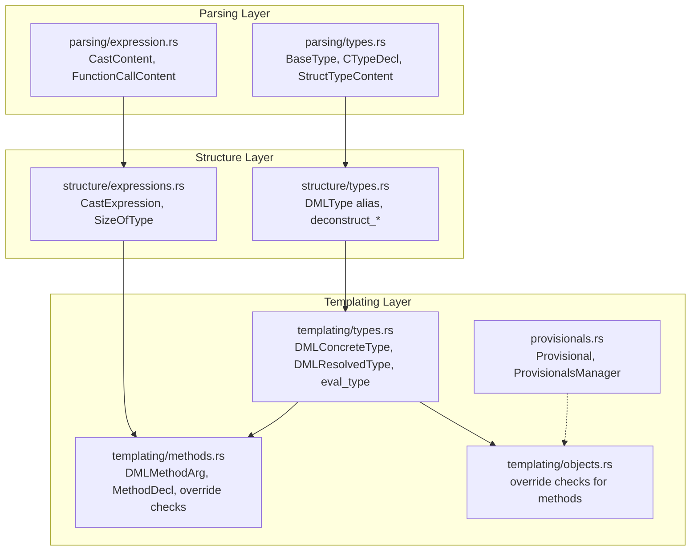
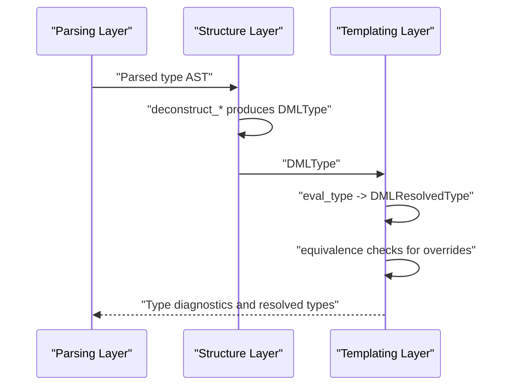
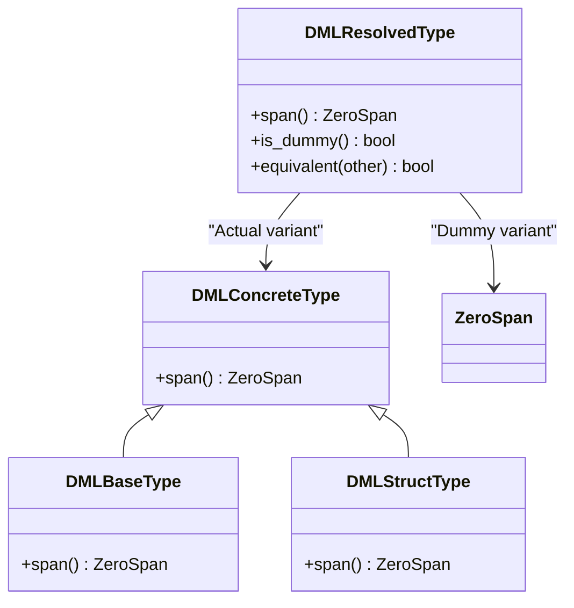
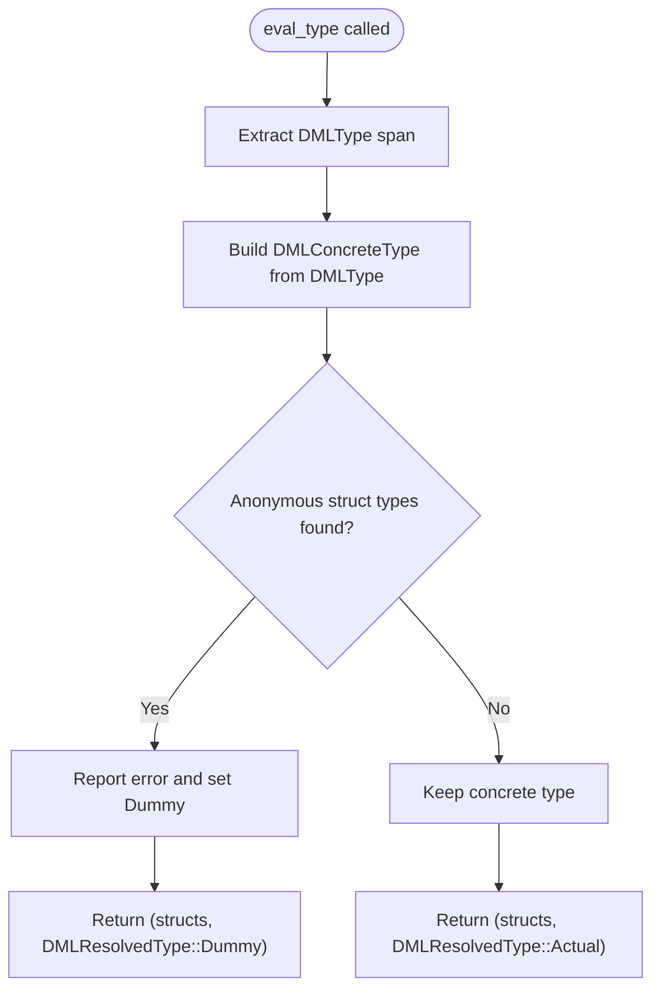
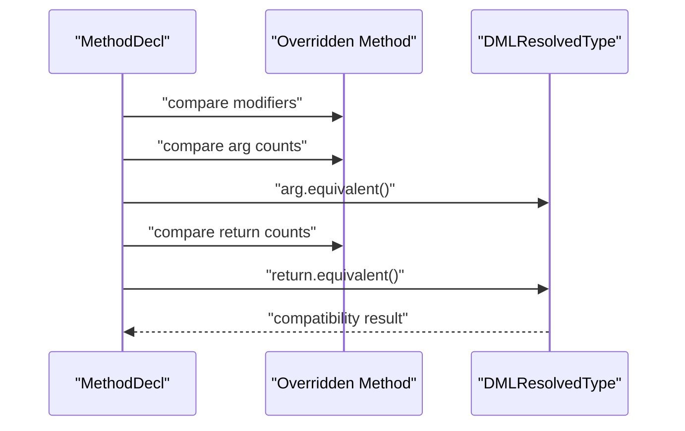
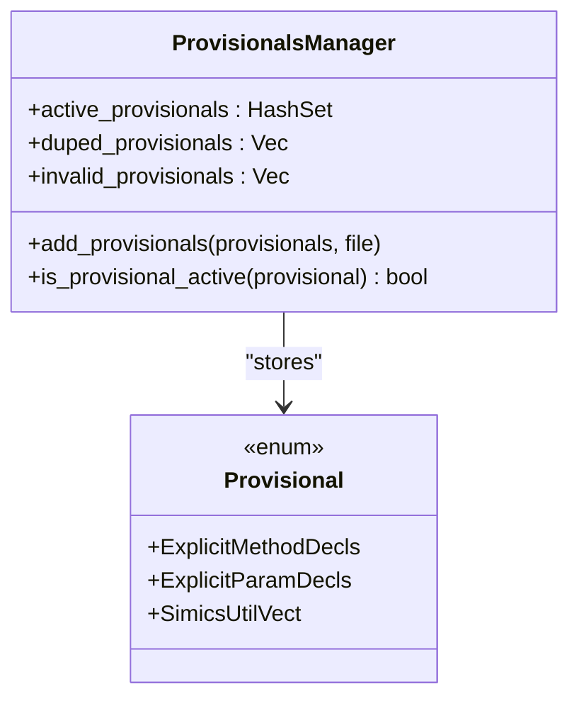
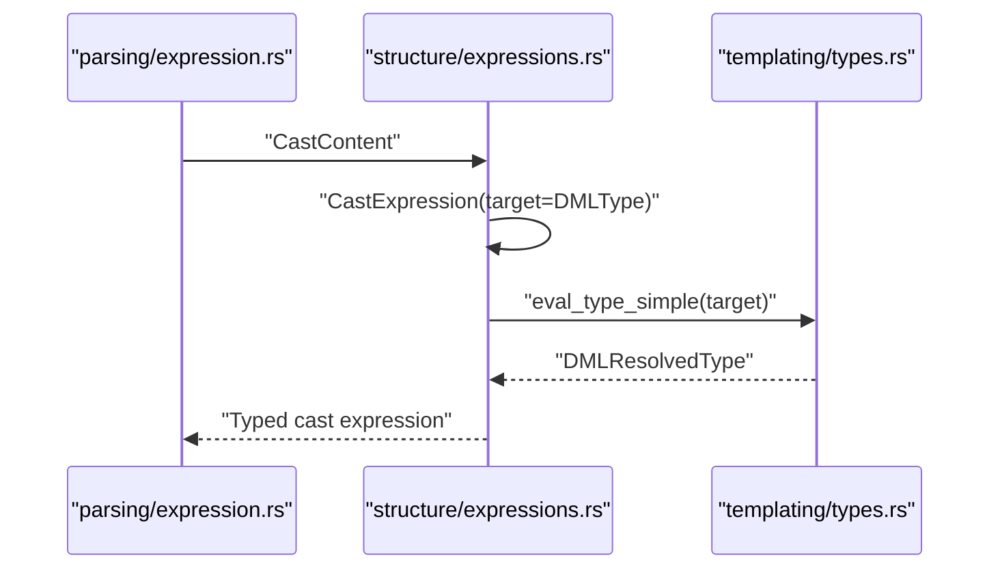
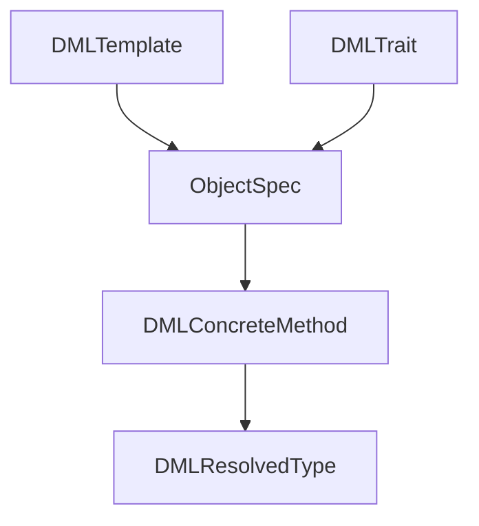
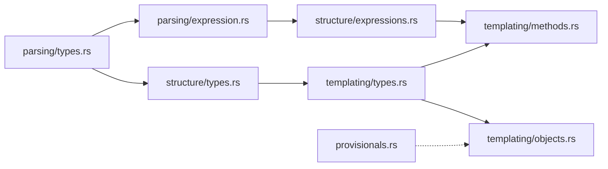

# Type System and Inference

<cite>
**Referenced Files in This Document**
- [types.rs](file://src/analysis/templating/types.rs)
- [types.rs](file://src/analysis/structure/types.rs)
- [types.rs](file://src/analysis/parsing/types.rs)
- [provisionals.rs](file://src/analysis/provisionals.rs)
- [methods.rs](file://src/analysis/templating/methods.rs)
- [objects.rs](file://src/analysis/templating/objects.rs)
- [expressions.rs](file://src/analysis/structure/expressions.rs)
- [expression.rs](file://src/analysis/parsing/expression.rs)
</cite>

## Table of Contents
1. [Introduction](#introduction)
2. [Project Structure](#project-structure)
3. [Core Components](#core-components)
4. [Architecture Overview](#architecture-overview)
5. [Detailed Component Analysis](#detailed-component-analysis)
6. [Dependency Analysis](#dependency-analysis)
7. [Performance Considerations](#performance-considerations)
8. [Troubleshooting Guide](#troubleshooting-guide)
9. [Conclusion](#conclusion)

## Introduction
This document explains the DML type system and inference model implemented in the language server. It focuses on:
- DMLResolvedType representation and its role in type resolution
- Type compatibility rules and equivalence semantics
- Implicit conversion and casting via expressions
- Type inference for expressions, method signatures, and template parameters
- Provisional type handling for forward references and incomplete type information
- Examples of type resolution, error reporting for mismatches, and type constraint solving
- Type unification, generic instantiation, and type safety guarantees

## Project Structure
The type system spans three layers:
- Parsing layer: constructs type declarations and expressions from source tokens
- Structure layer: deconstructs parsed types into a lightweight DMLType representation
- Templating layer: resolves DMLType into DMLResolvedType, performs compatibility checks, and manages provisional types

**Diagram sources**
- [types.rs](file://src/analysis/parsing/types.rs#L477-L526)
- [expression.rs](file://src/analysis/parsing/expression.rs#L1488-L1531)
- [types.rs](file://src/analysis/structure/types.rs#L9-L11)
- [expressions.rs](file://src/analysis/structure/expressions.rs#L350-L375)
- [types.rs](file://src/analysis/templating/types.rs#L45-L92)
- [methods.rs](file://src/analysis/templating/methods.rs#L62-L115)
- [objects.rs](file://src/analysis/templating/objects.rs#L2050-L2085)
- [provisionals.rs](file://src/analysis/provisionals.rs#L13-L64)

**Section sources**
- [types.rs](file://src/analysis/parsing/types.rs#L477-L526)
- [types.rs](file://src/analysis/structure/types.rs#L9-L11)
- [types.rs](file://src/analysis/templating/types.rs#L45-L92)
- [methods.rs](file://src/analysis/templating/methods.rs#L62-L115)
- [objects.rs](file://src/analysis/templating/objects.rs#L2050-L2085)
- [provisionals.rs](file://src/analysis/provisionals.rs#L13-L64)

## Core Components
- DMLType: Lightweight type placeholder backed by a source span, produced by deconstructing parsed type declarations.
- DMLConcreteType: Concrete type variants used during evaluation (base types, struct types).
- DMLResolvedType: Final resolved type carrying either a concrete type or a dummy variant for forward references.
- Provisional: Flags enabling forward-compatible behavior for incomplete declarations.
- Method signature typing: Argument and return type resolution with compatibility checks for overrides.

Key responsibilities:
- Convert parsed type declarations to DMLType
- Evaluate DMLType to DMLResolvedType
- Report type errors for invalid anonymous struct usage
- Enforce method override compatibility using DMLResolvedType equivalence

**Section sources**
- [types.rs](file://src/analysis/structure/types.rs#L9-L11)
- [types.rs](file://src/analysis/templating/types.rs#L30-L92)
- [methods.rs](file://src/analysis/templating/methods.rs#L62-L115)
- [provisionals.rs](file://src/analysis/provisionals.rs#L13-L64)

## Architecture Overview
The type system follows a staged pipeline:
1. Parsing constructs typed AST nodes (e.g., CTypeDecl, StructTypeContent).
2. Structure deconstruction yields DMLType placeholders.
3. Templating evaluation converts DMLType to DMLResolvedType.
4. Compatibility checks compare DMLResolvedType instances for method overrides.
5. Provisional flags allow forward references to resolve later.

**Diagram sources**
- [types.rs](file://src/analysis/structure/types.rs#L13-L89)
- [types.rs](file://src/analysis/templating/types.rs#L80-L92)
- [methods.rs](file://src/analysis/templating/methods.rs#L182-L268)

## Detailed Component Analysis

### DMLResolvedType Representation and Compatibility
DMLResolvedType encapsulates resolved types and a fallback “dummy” variant for forward references. It exposes:
- span(): unified access to the underlying span
- is_dummy(): detect dummy variant
- equivalent(): compatibility check for method override rules

Compatibility rules:
- For method override checks, equivalent() currently returns true to avoid false negatives, indicating a conservative policy for argument/return type matching.

**Diagram sources**
- [types.rs](file://src/analysis/templating/types.rs#L8-L51)

**Section sources**
- [types.rs](file://src/analysis/templating/types.rs#L45-L92)

### Type Evaluation and Resolution
eval_type converts a DMLType (source-span placeholder) into a DMLResolvedType. It also returns a vector of struct types encountered during evaluation. If anonymous struct types are present, they are reported as errors and the resulting DMLResolvedType is set to Dummy to preserve downstream analysis.

- eval_type_simple is a convenience wrapper around eval_type.
- Anonymous struct types are rejected in argument and return positions; errors are emitted accordingly.

**Diagram sources**
- [types.rs](file://src/analysis/templating/types.rs#L80-L92)
- [methods.rs](file://src/analysis/templating/methods.rs#L62-L115)

**Section sources**
- [types.rs](file://src/analysis/templating/types.rs#L80-L92)
- [methods.rs](file://src/analysis/templating/methods.rs#L62-L115)

### Method Signature Compatibility and Override Checking
Method typing is performed in two stages:
- Arguments: eval_method_args converts typed arguments to DMLMethodArg, resolving types and marking anonymous structs as Dummy.
- Returns: eval_method_returns resolves return types similarly.

Override checks enforce:
- Shared vs non-shared modifier compatibility
- Throws vs non-throws compatibility
- Argument count and type compatibility
- Return count and type compatibility

Equivalence for arguments and returns relies on DMLResolvedType.equivalent(), which is conservative in current implementation.

**Diagram sources**
- [methods.rs](file://src/analysis/templating/methods.rs#L182-L268)
- [types.rs](file://src/analysis/templating/types.rs#L65-L71)

**Section sources**
- [methods.rs](file://src/analysis/templating/methods.rs#L62-L115)
- [methods.rs](file://src/analysis/templating/methods.rs#L182-L268)
- [types.rs](file://src/analysis/templating/types.rs#L65-L71)

### Provisional Type Handling for Forward References
Provisional flags enable forward-compatible behavior for incomplete declarations. The ProvisionalsManager tracks:
- Active provisionals
- Duplicate entries
- Invalid identifiers

These flags influence downstream resolution to tolerate forward references until full information is available.

**Diagram sources**
- [provisionals.rs](file://src/analysis/provisionals.rs#L13-L64)

**Section sources**
- [provisionals.rs](file://src/analysis/provisionals.rs#L13-L64)

### Implicit Conversion and Casting
Implicit conversions are not implemented in the current codebase. Explicit conversions are supported via cast expressions:
- Parsing layer defines CastContent for typed casts.
- Structure layer converts CastContent into CastExpression carrying a DMLType.
- Templating layer evaluates the cast target type via eval_type_simple.

**Diagram sources**
- [expression.rs](file://src/analysis/parsing/expression.rs#L1488-L1531)
- [expressions.rs](file://src/analysis/structure/expressions.rs#L350-L375)
- [types.rs](file://src/analysis/templating/types.rs#L89-L92)

**Section sources**
- [expression.rs](file://src/analysis/parsing/expression.rs#L1488-L1531)
- [expressions.rs](file://src/analysis/structure/expressions.rs#L350-L375)
- [types.rs](file://src/analysis/templating/types.rs#L89-L92)

### Type Inference for Expressions
Expression typing is handled by converting parsed expressions into structured forms:
- Binary, unary, member, function call, cast, new, sizeof, sizeof(type), slice, and others are represented as ExpressionKind variants.
- Each variant captures spans and typed sub-expressions, preserving source locations for diagnostics.

While full type inference for arbitrary expressions is not shown in the referenced files, the infrastructure supports building typed expression trees with spans for later analysis.

**Section sources**
- [expressions.rs](file://src/analysis/structure/expressions.rs#L556-L621)
- [expressions.rs](file://src/analysis/structure/expressions.rs#L742-L798)

### Template Parameters and Generic Instantiation
Template instantiation and trait-based resolution are orchestrated by the templating layer:
- ObjectSpec aggregates instantiations, imports, and in-each configurations.
- Methods and objects use DMLResolvedType to validate compatibility against trait constraints.
- Override checks ensure that concrete methods satisfy abstract expectations.

**Diagram sources**
- [objects.rs](file://src/analysis/templating/objects.rs#L43-L103)
- [methods.rs](file://src/analysis/templating/methods.rs#L293-L308)
- [types.rs](file://src/analysis/templating/types.rs#L45-L92)

**Section sources**
- [objects.rs](file://src/analysis/templating/objects.rs#L43-L103)
- [methods.rs](file://src/analysis/templating/methods.rs#L293-L308)
- [types.rs](file://src/analysis/templating/types.rs#L45-L92)

## Dependency Analysis
The type system exhibits layered dependencies:
- Parsing types feed into structure deconstruction
- Structure types feed into templating evaluation
- Templating types power method override checks and object-level compatibility

**Diagram sources**
- [types.rs](file://src/analysis/parsing/types.rs#L477-L526)
- [types.rs](file://src/analysis/structure/types.rs#L9-L11)
- [types.rs](file://src/analysis/templating/types.rs#L80-L92)
- [expression.rs](file://src/analysis/parsing/expression.rs#L1488-L1531)
- [expressions.rs](file://src/analysis/structure/expressions.rs#L350-L375)
- [methods.rs](file://src/analysis/templating/methods.rs#L62-L115)
- [objects.rs](file://src/analysis/templating/objects.rs#L2050-L2085)
- [provisionals.rs](file://src/analysis/provisionals.rs#L13-L64)

**Section sources**
- [types.rs](file://src/analysis/parsing/types.rs#L477-L526)
- [types.rs](file://src/analysis/structure/types.rs#L9-L11)
- [types.rs](file://src/analysis/templating/types.rs#L80-L92)
- [methods.rs](file://src/analysis/templating/methods.rs#L62-L115)
- [objects.rs](file://src/analysis/templating/objects.rs#L2050-L2085)
- [provisionals.rs](file://src/analysis/provisionals.rs#L13-L64)

## Performance Considerations
- DMLType is a minimal span-based placeholder; keeping it lightweight avoids heavy copying during traversal.
- DMLResolvedType’s Dummy variant allows forward references without recomputation, reducing backtracking.
- Equivalence checks are conservative to minimize false positives; refine equivalence rules as more precise typing emerges.

## Troubleshooting Guide
Common type-related diagnostics:
- Anonymous struct types in argument or return positions are rejected; errors are emitted and DMLResolvedType is set to Dummy to prevent cascading failures.
- Method override violations report mismatched modifiers, counts, or types with related spans pointing to the overridden declaration.

Resolution tips:
- Replace anonymous struct types with named types or typedefs.
- Ensure argument and return counts and types match the overridden method signature.
- Use explicit casts when necessary, relying on eval_type_simple to resolve the target type.

**Section sources**
- [methods.rs](file://src/analysis/templating/methods.rs#L62-L115)
- [methods.rs](file://src/analysis/templating/methods.rs#L182-L268)

## Conclusion
The DML type system integrates parsing, structure, and templating layers to provide:
- A robust DMLResolvedType representation supporting forward references via Dummy
- Conservative compatibility checks for method overrides
- Infrastructure for explicit casting and expression typing
- Provisional flags to tolerate incomplete type information during early analysis

Future enhancements can refine equivalence semantics, introduce implicit conversions, and expand type inference for expressions and templates.