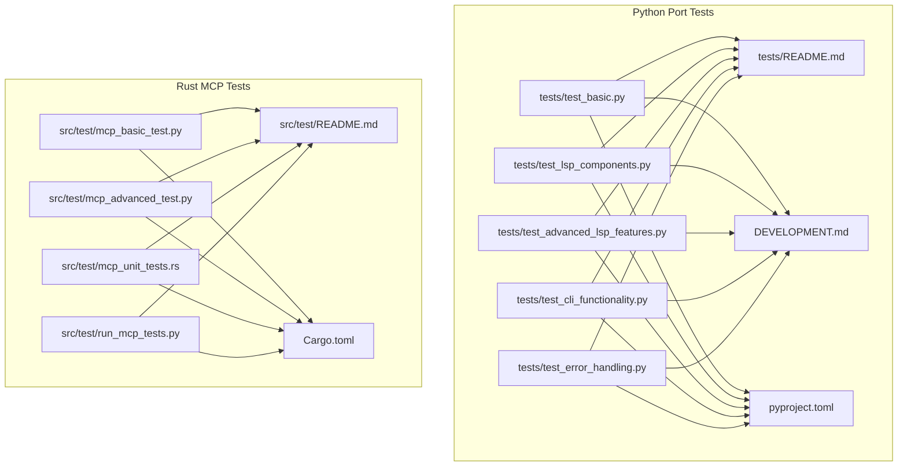
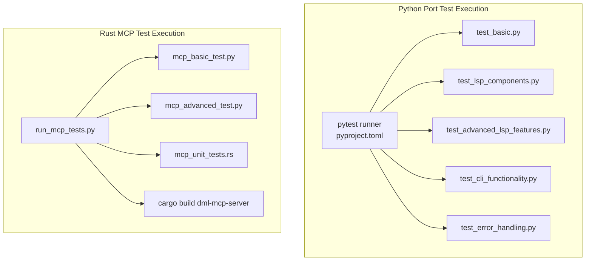
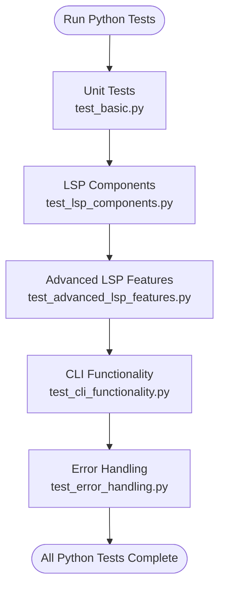
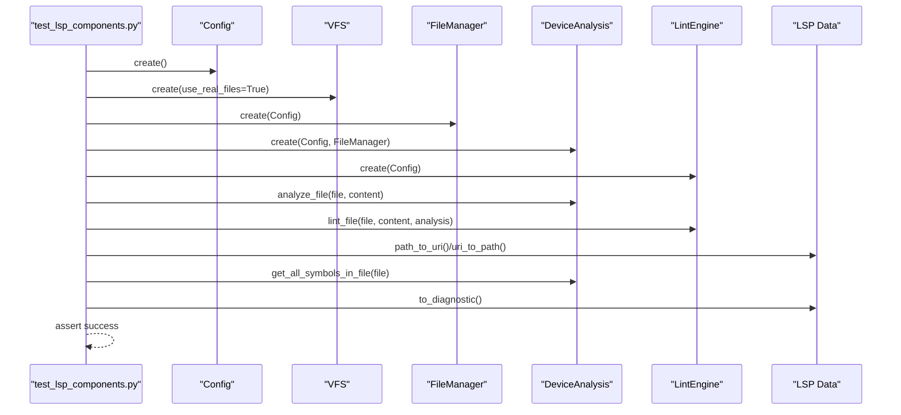
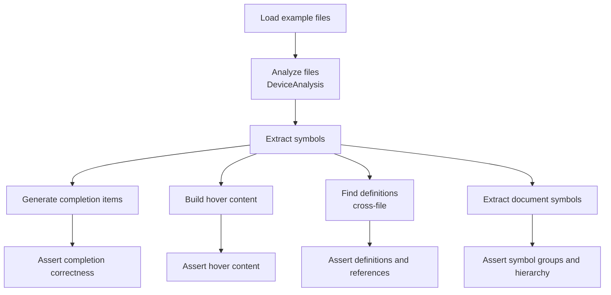
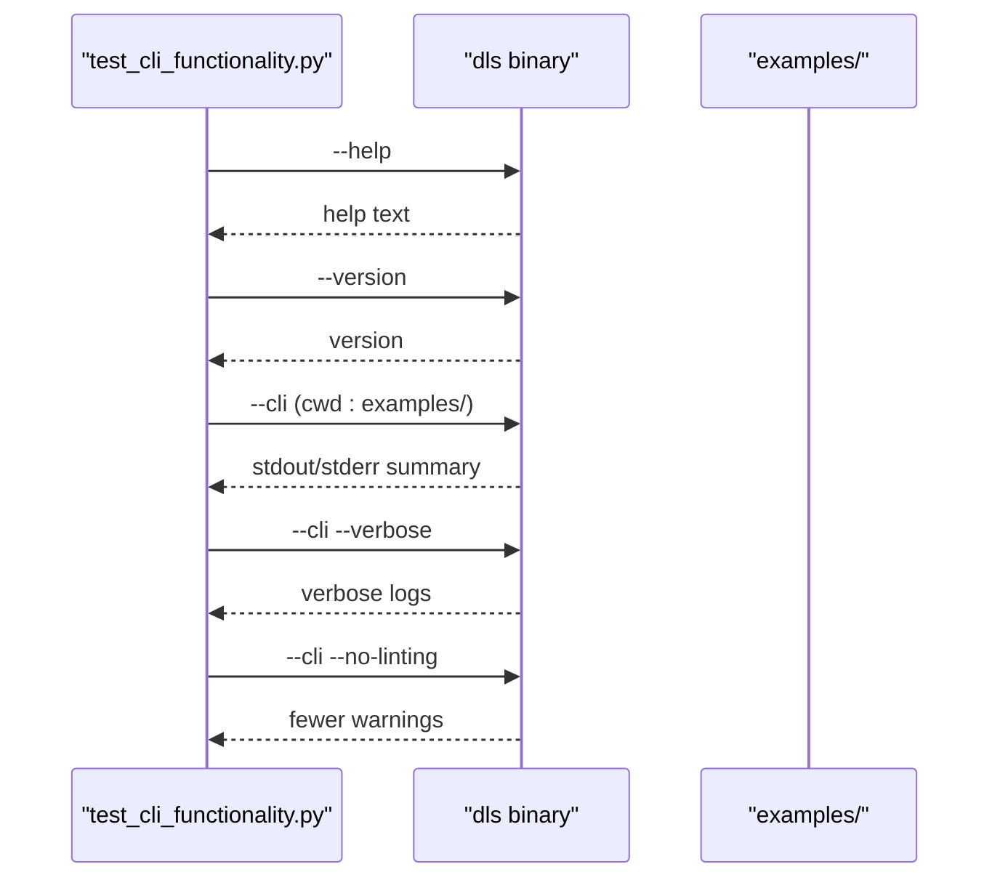
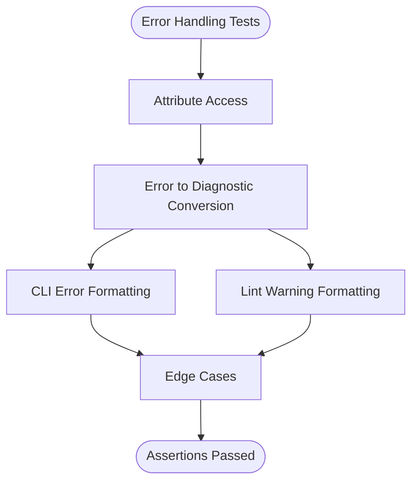
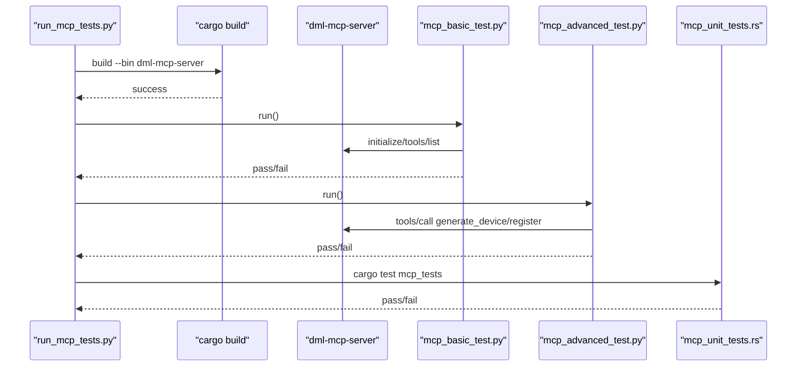
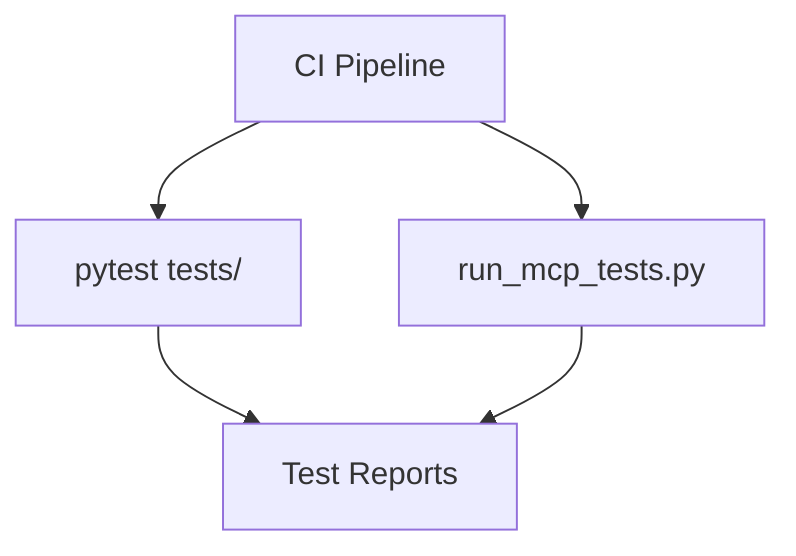
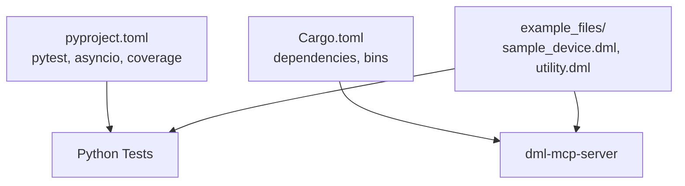

# Testing Framework

<cite>
**Referenced Files in This Document**
- [tests/README.md](file://python-port/tests/README.md)
- [DEVELOPMENT.md](file://python-port/DEVELOPMENT.md)
- [pyproject.toml](file://python-port/pyproject.toml)
- [test_basic.py](file://python-port/tests/test_basic.py)
- [test_lsp_components.py](file://python-port/tests/test_lsp_components.py)
- [test_advanced_lsp_features.py](file://python-port/tests/test_advanced_lsp_features.py)
- [test_cli_functionality.py](file://python-port/tests/test_cli_functionality.py)
- [test_error_handling.py](file://python-port/tests/test_error_handling.py)
- [Cargo.toml](file://Cargo.toml)
- [src/test/README.md](file://src/test/README.md)
- [mcp_basic_test.py](file://src/test/mcp_basic_test.py)
- [mcp_advanced_test.py](file://src/test/mcp_advanced_test.py)
- [mcp_unit_tests.rs](file://src/test/mcp_unit_tests.rs)
- [run_mcp_tests.py](file://src/test/run_mcp_tests.py)
</cite>

## Table of Contents
1. [Introduction](#introduction)
2. [Project Structure](#project-structure)
3. [Core Components](#core-components)
4. [Architecture Overview](#architecture-overview)
5. [Detailed Component Analysis](#detailed-component-analysis)
6. [Dependency Analysis](#dependency-analysis)
7. [Performance Considerations](#performance-considerations)
8. [Troubleshooting Guide](#troubleshooting-guide)
9. [Conclusion](#conclusion)
10. [Appendices](#appendices)

## Introduction
This document describes the testing framework for the DML Language Server, covering both the Python port and the Rust implementation. It explains unit testing strategies, integration testing approaches, and test utilities for the Language Server Protocol (LSP) components and the Model Context Protocol (MCP) server. It also documents the Python port testing infrastructure, LSP component testing, and MCP testing methodologies, along with test case organization, mock implementations, assertion frameworks, examples of testing language server features, linting rules, and MCP tools. Finally, it outlines the relationship between Rust and Python testing approaches, continuous integration setup, automated testing workflows, best practices, debugging test failures, and performance testing techniques.

## Project Structure
The testing framework is organized across two primary areas:
- Python port tests under python-port/tests/, which exercise core LSP components, advanced LSP features, CLI functionality, and error handling.
- Rust MCP tests under src/test/, which validate MCP protocol compliance, tool execution, and code generation, complemented by unit tests in Rust.

**Diagram sources**
- [tests/README.md](file://python-port/tests/README.md#L1-L157)
- [DEVELOPMENT.md](file://python-port/DEVELOPMENT.md#L102-L117)
- [pyproject.toml](file://python-port/pyproject.toml#L99-L106)
- [src/test/README.md](file://src/test/README.md#L1-L188)
- [Cargo.toml](file://Cargo.toml#L1-L62)

**Section sources**
- [tests/README.md](file://python-port/tests/README.md#L1-L157)
- [src/test/README.md](file://src/test/README.md#L1-L188)

## Core Components
The testing framework is composed of:
- Python unit and integration tests validating core LSP components, parsing, symbol extraction, diagnostics, and CLI behavior.
- Python integration tests for MCP server protocol compliance and code generation.
- Rust unit tests for MCP components, generation context, specs, and templates.
- A test runner for MCP tests that builds the Rust binary and executes Python-based protocol tests.

Key testing utilities and assertions:
- Python tests leverage pytest for structured test execution, fixtures, and async support.
- Assertions focus on component initialization, parsing correctness, symbol extraction, diagnostics conversion, CLI exit codes, and error formatting.
- MCP tests use JSON-RPC protocol messaging to initialize, list tools, and call tools, asserting response presence and content.

**Section sources**
- [test_basic.py](file://python-port/tests/test_basic.py#L19-L239)
- [test_lsp_components.py](file://python-port/tests/test_lsp_components.py#L13-L207)
- [test_advanced_lsp_features.py](file://python-port/tests/test_advanced_lsp_features.py#L13-L374)
- [test_cli_functionality.py](file://python-port/tests/test_cli_functionality.py#L11-L212)
- [test_error_handling.py](file://python-port/tests/test_error_handling.py#L13-L336)
- [mcp_basic_test.py](file://src/test/mcp_basic_test.py#L37-L134)
- [mcp_advanced_test.py](file://src/test/mcp_advanced_test.py#L33-L184)
- [mcp_unit_tests.rs](file://src/test/mcp_unit_tests.rs#L14-L406)
- [run_mcp_tests.py](file://src/test/run_mcp_tests.py#L61-L104)

## Architecture Overview
The testing architecture separates concerns between Python port tests and Rust MCP tests while maintaining a cohesive CI-ready workflow.

**Diagram sources**
- [pyproject.toml](file://python-port/pyproject.toml#L99-L106)
- [test_basic.py](file://python-port/tests/test_basic.py#L1-L239)
- [test_lsp_components.py](file://python-port/tests/test_lsp_components.py#L1-L207)
- [test_advanced_lsp_features.py](file://python-port/tests/test_advanced_lsp_features.py#L1-L374)
- [test_cli_functionality.py](file://python-port/tests/test_cli_functionality.py#L1-L212)
- [test_error_handling.py](file://python-port/tests/test_error_handling.py#L1-L336)
- [run_mcp_tests.py](file://src/test/run_mcp_tests.py#L1-L104)
- [mcp_basic_test.py](file://src/test/mcp_basic_test.py#L1-L134)
- [mcp_advanced_test.py](file://src/test/mcp_advanced_test.py#L1-L184)
- [mcp_unit_tests.rs](file://src/test/mcp_unit_tests.rs#L1-L406)
- [Cargo.toml](file://Cargo.toml#L28-L31)

## Detailed Component Analysis

### Python Port Unit and Integration Tests
The Python port tests validate:
- Basic functionality, configuration, VFS, and span utilities.
- DML lexer and parser behavior, including tokenization, keyword recognition, string literals, comments, and syntax error detection.
- File operations with VFS using both memory and real files, including async read operations.
- LSP component initialization, file analysis, symbol extraction, URI/path conversions, diagnostics conversion, and server capabilities.
- Advanced LSP features: completion scenarios, hover information, go-to-definition, and document symbol extraction with cross-file resolution.
- CLI functionality: help/version, analysis mode, verbose logging, and disabling linting.
- Error handling: attribute access, diagnostic conversion, CLI error formatting, lint warning formatting, and edge cases.

**Diagram sources**
- [test_basic.py](file://python-port/tests/test_basic.py#L19-L239)
- [test_lsp_components.py](file://python-port/tests/test_lsp_components.py#L13-L207)
- [test_advanced_lsp_features.py](file://python-port/tests/test_advanced_lsp_features.py#L13-L374)
- [test_cli_functionality.py](file://python-port/tests/test_cli_functionality.py#L11-L212)
- [test_error_handling.py](file://python-port/tests/test_error_handling.py#L13-L336)

**Section sources**
- [test_basic.py](file://python-port/tests/test_basic.py#L19-L239)
- [test_lsp_components.py](file://python-port/tests/test_lsp_components.py#L13-L207)
- [test_advanced_lsp_features.py](file://python-port/tests/test_advanced_lsp_features.py#L13-L374)
- [test_cli_functionality.py](file://python-port/tests/test_cli_functionality.py#L11-L212)
- [test_error_handling.py](file://python-port/tests/test_error_handling.py#L13-L336)

### LSP Component Testing
This suite validates LSP components without starting a full server:
- Imports and initialization of Config, FileManager, DeviceAnalysis, LintEngine, VFS, and LSP data structures.
- File analysis and symbol extraction from example DML files.
- URI/path conversions and diagnostics conversion.
- Server creation and capability configuration.

**Diagram sources**
- [test_lsp_components.py](file://python-port/tests/test_lsp_components.py#L13-L207)

**Section sources**
- [test_lsp_components.py](file://python-port/tests/test_lsp_components.py#L13-L207)

### Advanced LSP Features Testing
This suite demonstrates completion, hover, go-to-definition, and document symbol extraction with realistic scenarios:
- Completion items generated from symbols and DML keywords.
- Hover content built from symbol metadata and documentation.
- Definition lookup across files and symbol references.
- Document symbol extraction grouped by kind and hierarchical relationships.

**Diagram sources**
- [test_advanced_lsp_features.py](file://python-port/tests/test_advanced_lsp_features.py#L13-L374)

**Section sources**
- [test_advanced_lsp_features.py](file://python-port/tests/test_advanced_lsp_features.py#L13-L374)

### CLI Functionality Testing
This suite validates the command-line interface:
- Help and version commands.
- Batch analysis mode with discovery and summary output.
- Verbose logging output and exit code behavior.
- Disabling linting and observing reduced warnings.

**Diagram sources**
- [test_cli_functionality.py](file://python-port/tests/test_cli_functionality.py#L11-L212)

**Section sources**
- [test_cli_functionality.py](file://python-port/tests/test_cli_functionality.py#L11-L212)

### Error Handling Testing
This suite validates error attribute access, diagnostic conversion, CLI error formatting, lint warning formatting, and edge cases:
- Attribute access on error spans and messages.
- Conversion to diagnostics with severity mapping.
- CLI error/warning formatting with line/column display.
- Edge cases: zero positions, empty messages, and long messages.

**Diagram sources**
- [test_error_handling.py](file://python-port/tests/test_error_handling.py#L13-L336)

**Section sources**
- [test_error_handling.py](file://python-port/tests/test_error_handling.py#L13-L336)

### MCP Testing Methodologies
The MCP testing combines Python-based protocol tests with Rust unit tests:
- Python integration tests spawn the compiled MCP server, send JSON-RPC initialize and tools/list messages, and call tools like generate_device and generate_register, asserting response presence and content.
- Advanced tests generate complex devices (UART controller, CPU, memory) and registers with fields, validating generated DML code.
- Rust unit tests validate MCP server info, capabilities, generation configuration, spec structs, DML generator, and template patterns.

**Diagram sources**
- [run_mcp_tests.py](file://src/test/run_mcp_tests.py#L37-L104)
- [mcp_basic_test.py](file://src/test/mcp_basic_test.py#L37-L134)
- [mcp_advanced_test.py](file://src/test/mcp_advanced_test.py#L33-L184)
- [mcp_unit_tests.rs](file://src/test/mcp_unit_tests.rs#L14-L406)
- [Cargo.toml](file://Cargo.toml#L28-L31)

**Section sources**
- [mcp_basic_test.py](file://src/test/mcp_basic_test.py#L37-L134)
- [mcp_advanced_test.py](file://src/test/mcp_advanced_test.py#L33-L184)
- [mcp_unit_tests.rs](file://src/test/mcp_unit_tests.rs#L14-L406)
- [run_mcp_tests.py](file://src/test/run_mcp_tests.py#L37-L104)

### Test Case Organization and Mock Implementations
- Test organization follows a clear naming convention and separation of concerns: unit tests for core components, integration tests for LSP and MCP, and CLI tests for command-line behavior.
- Mock implementations are minimal and rely on real components where possible (e.g., VFS with real files, example DML files). When external processes are involved (MCP server), tests spawn the actual binary and communicate via JSON-RPC.
- Assertion frameworks:
  - Python tests use pytest with assert statements and async fixtures.
  - Rust tests use standard #[test] and #[tokio::test] macros with assert! and assertion helpers.

**Section sources**
- [tests/README.md](file://python-port/tests/README.md#L125-L135)
- [src/test/README.md](file://src/test/README.md#L177-L188)
- [pyproject.toml](file://python-port/pyproject.toml#L99-L106)

### Continuous Integration and Automated Workflows
- Python tests can be executed via pytest or individually with Python scripts.
- MCP tests are orchestrated by a Python runner that builds the Rust binary and executes Python-based protocol tests.
- CI integration examples are provided in the test READMEs for running test suites in CI environments.

**Diagram sources**
- [tests/README.md](file://python-port/tests/README.md#L145-L157)
- [src/test/README.md](file://src/test/README.md#L48-L61)
- [run_mcp_tests.py](file://src/test/run_mcp_tests.py#L61-L104)

**Section sources**
- [tests/README.md](file://python-port/tests/README.md#L145-L157)
- [src/test/README.md](file://src/test/README.md#L48-L61)

## Dependency Analysis
The testing framework depends on:
- Python project configuration for pytest, asyncio, and coverage.
- Rust build system for MCP server compilation and execution.
- Example DML files for realistic test scenarios.

**Diagram sources**
- [pyproject.toml](file://python-port/pyproject.toml#L99-L106)
- [Cargo.toml](file://Cargo.toml#L33-L62)

**Section sources**
- [pyproject.toml](file://python-port/pyproject.toml#L99-L106)
- [Cargo.toml](file://Cargo.toml#L33-L62)

## Performance Considerations
- Caching strategy: VFS caches file contents, analysis caches parsed symbols and errors per file, and dependency graphs are cached with smart invalidation.
- Optimization tips: incremental parsing, limiting diagnostic counts, request cancellation for LSP, and efficient symbol lookup data structures.
- Profiling and debugging: use cProfile or py-spy for Python, and enable debug logging for MCP tests via environment variables.

**Section sources**
- [DEVELOPMENT.md](file://python-port/DEVELOPMENT.md#L238-L253)
- [src/test/README.md](file://src/test/README.md#L171-L176)

## Troubleshooting Guide
Common issues and resolutions:
- Python import errors: ensure virtual environment activation and dependencies installation.
- File not found: verify example DML files exist in examples/.
- Permission errors: ensure the dls binary is executable.
- Path issues: tests expect to run from the project root.
- Build failures: update dependencies and rebuild the MCP server.
- Server not starting: confirm binary existence and permissions.
- Test timeouts: check system resources.
- JSON parse errors: verify MCP protocol version compatibility.
- Debug mode: set RUST_LOG=debug for verbose MCP logging.

**Section sources**
- [tests/README.md](file://python-port/tests/README.md#L136-L144)
- [src/test/README.md](file://src/test/README.md#L148-L176)

## Conclusion
The DML Language Server testing framework provides comprehensive coverage across Python port unit and integration tests, and Rust MCP unit and integration tests. It emphasizes practical, protocol-driven testing for MCP, robust LSP component validation, and CLI verification. The framework supports CI-friendly execution and offers clear troubleshooting guidance and performance considerations.

## Appendices

### Appendix A: Test Utilities and Assertions
- Python pytest configuration and async mode are defined in pyproject.toml.
- Assertions focus on component initialization, parsing correctness, symbol extraction, diagnostics conversion, CLI exit codes, and error formatting.
- Rust tests use standard macros and assert! for deterministic outcomes.

**Section sources**
- [pyproject.toml](file://python-port/pyproject.toml#L99-L106)
- [mcp_unit_tests.rs](file://src/test/mcp_unit_tests.rs#L14-L406)