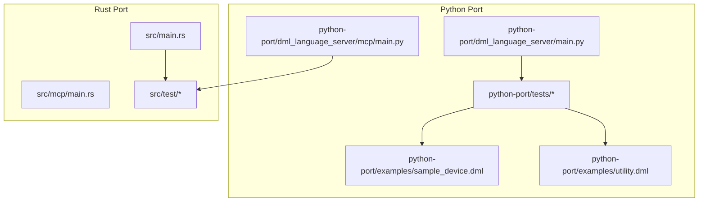
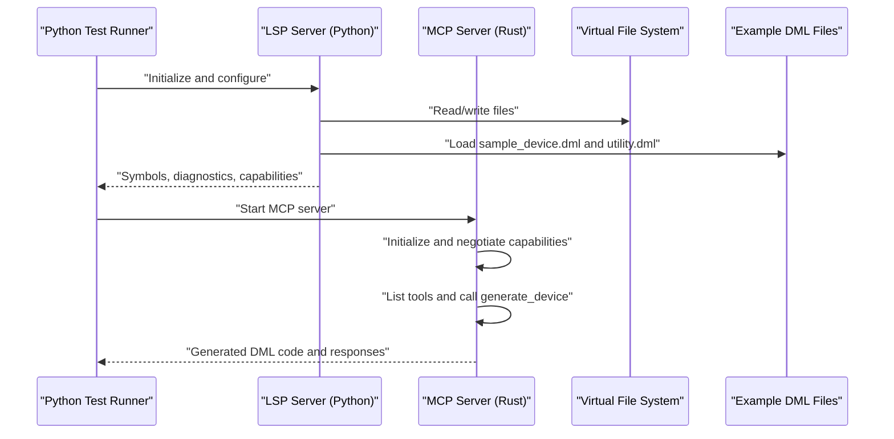
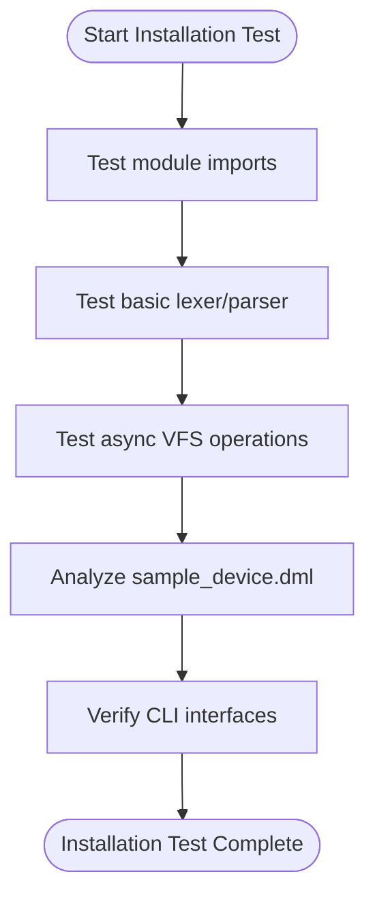
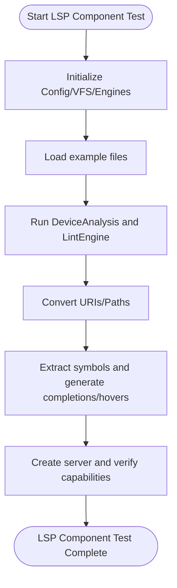
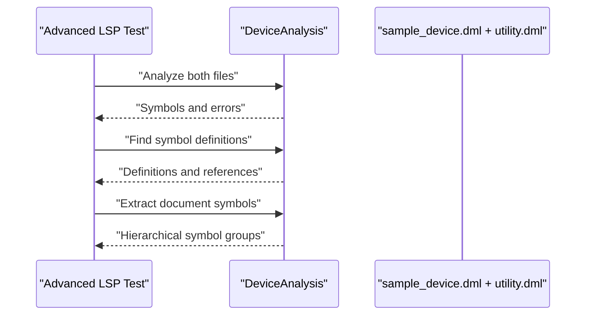
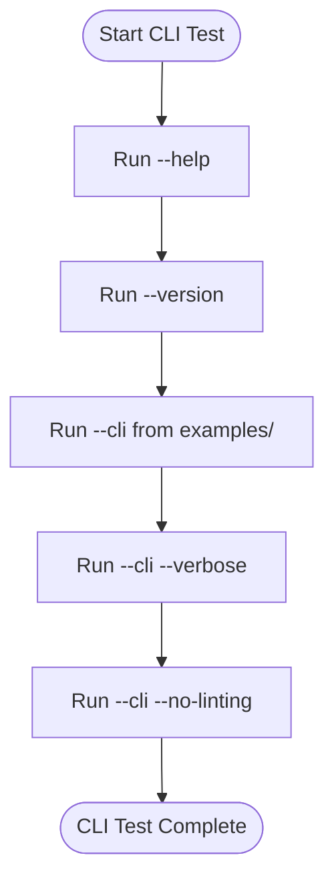
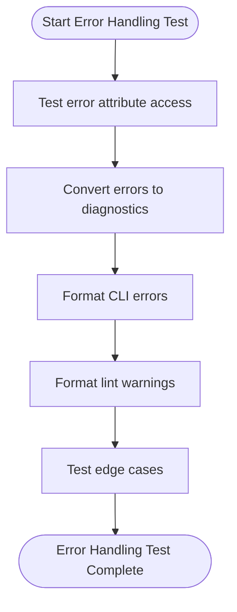
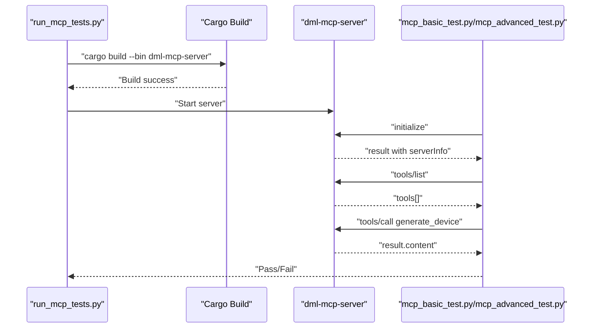
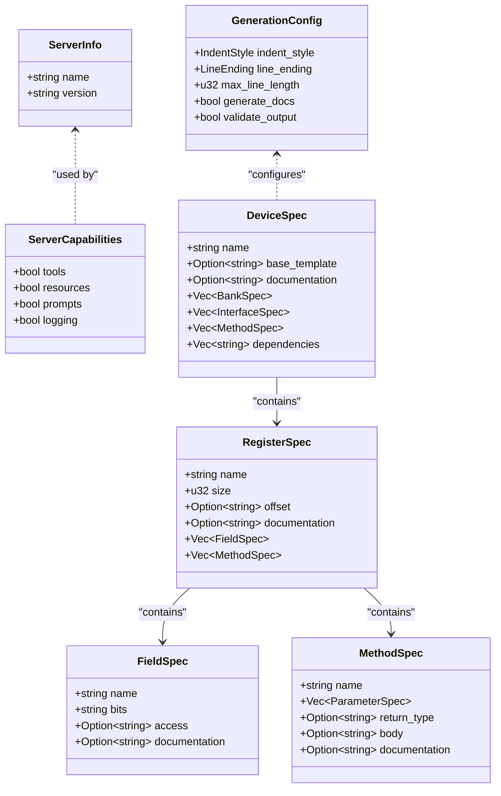
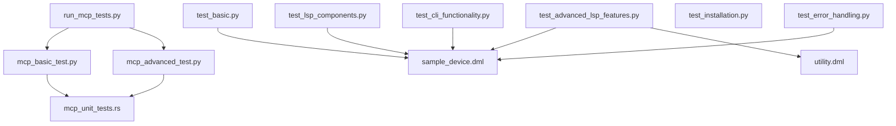

# Integration and End-to-End Tests

<cite>
**Referenced Files in This Document**
- [README.md](file://python-port/tests/README.md)
- [README.md](file://src/test/README.md)
- [test_installation.py](file://python-port/tests/test_installation.py)
- [test_basic.py](file://python-port/tests/test_basic.py)
- [test_lsp_components.py](file://python-port/tests/test_lsp_components.py)
- [test_advanced_lsp_features.py](file://python-port/tests/test_advanced_lsp_features.py)
- [test_cli_functionality.py](file://python-port/tests/test_cli_functionality.py)
- [test_error_handling.py](file://python-port/tests/test_error_handling.py)
- [mcp_basic_test.py](file://src/test/mcp_basic_test.py)
- [mcp_advanced_test.py](file://src/test/mcp_advanced_test.py)
- [run_mcp_tests.py](file://src/test/run_mcp_tests.py)
- [mcp_unit_tests.rs](file://src/test/mcp_unit_tests.rs)
- [main.py](file://python-port/dml_language_server/main.py)
- [main.py](file://python-port/dml_language_server/mcp/main.py)
- [main.rs](file://src/main.rs)
- [main.rs](file://src/mcp/main.rs)
- [sample_device.dml](file://python-port/examples/sample_device.dml)
- [utility.dml](file://python-port/examples/utility.dml)
</cite>

## Table of Contents
1. [Introduction](#introduction)
2. [Project Structure](#project-structure)
3. [Core Components](#core-components)
4. [Architecture Overview](#architecture-overview)
5. [Detailed Component Analysis](#detailed-component-analysis)
6. [Dependency Analysis](#dependency-analysis)
7. [Performance Considerations](#performance-considerations)
8. [Troubleshooting Guide](#troubleshooting-guide)
9. [Conclusion](#conclusion)
10. [Appendices](#appendices)

## Introduction
This document describes integration and end-to-end testing strategies for the DML Language Server project. It focuses on validating complete system workflows, including installation testing, MCP integration testing, and full language server functionality validation. The guide covers test scenarios for multi-file analysis, LSP protocol compliance, and real-world usage patterns. It also provides practical examples of testing the entire analysis pipeline from file input to LSP responses, validating MCP tool integration, and testing cross-document references. Guidance is included for setting up test environments that mirror production deployments, testing external tool integrations, and validating system-level performance and reliability.

## Project Structure
The repository includes two primary language ports and associated test suites:
- Python port: LSP server, MCP server, CLI, and a comprehensive set of unit and integration tests.
- Rust port: LSP server and MCP server binaries, plus Rust unit tests for MCP components.

Key testing areas:
- Python LSP tests: component-level checks, advanced LSP features, CLI functionality, error handling, and installation verification.
- Rust MCP tests: protocol compliance, tool invocation, and code generation validation.
- Example DML files for realistic multi-file analysis and cross-document symbol resolution.

**Diagram sources**
- [main.py](file://python-port/dml_language_server/main.py#L1-L106)
- [main.py](file://python-port/dml_language_server/mcp/main.py#L1-L166)
- [main.rs](file://src/main.rs#L1-L60)
- [main.rs](file://src/mcp/main.rs#L1-L23)
- [README.md](file://python-port/tests/README.md#L1-L157)
- [README.md](file://src/test/README.md#L1-L188)

**Section sources**
- [README.md](file://python-port/tests/README.md#L1-L157)
- [README.md](file://src/test/README.md#L1-L188)

## Core Components
This section outlines the core testing components and their responsibilities:
- Installation tests: verify module imports, basic functionality, async operations, sample file analysis, and CLI interfaces.
- LSP component tests: validate configuration, VFS, file management, analysis, linting, URI/path conversions, symbol extraction, and server capability creation.
- Advanced LSP feature tests: completion, hover, go-to-definition, and document symbol extraction across multiple files.
- CLI functionality tests: help/version, CLI analysis, verbose logging, and disabling linting.
- Error handling tests: attribute access, diagnostic conversion, CLI error formatting, lint warning formatting, and edge cases.
- MCP integration tests: protocol handshake, tool discovery, device generation, and advanced code generation scenarios.
- MCP unit tests: Rust-side validation of server info, capabilities, generation config, specs, and templates.

Practical outcomes validated by these tests:
- End-to-end analysis pipeline from file input to diagnostics and symbol extraction.
- LSP feature compliance (completion, hover, definitions, references, document symbols).
- MCP protocol compliance and tool integration.
- Cross-document symbol resolution and multi-file analysis.

**Section sources**
- [test_installation.py](file://python-port/tests/test_installation.py#L1-L237)
- [test_lsp_components.py](file://python-port/tests/test_lsp_components.py#L1-L207)
- [test_advanced_lsp_features.py](file://python-port/tests/test_advanced_lsp_features.py#L1-L374)
- [test_cli_functionality.py](file://python-port/tests/test_cli_functionality.py#L1-L212)
- [test_error_handling.py](file://python-port/tests/test_error_handling.py#L1-L336)
- [mcp_basic_test.py](file://src/test/mcp_basic_test.py#L1-L134)
- [mcp_advanced_test.py](file://src/test/mcp_advanced_test.py#L1-L184)
- [mcp_unit_tests.rs](file://src/test/mcp_unit_tests.rs#L1-L406)

## Architecture Overview
The testing architecture integrates Python and Rust components with example DML files to validate end-to-end workflows.

**Diagram sources**
- [test_advanced_lsp_features.py](file://python-port/tests/test_advanced_lsp_features.py#L181-L267)
- [mcp_basic_test.py](file://src/test/mcp_basic_test.py#L37-L120)
- [mcp_advanced_test.py](file://src/test/mcp_advanced_test.py#L33-L174)
- [sample_device.dml](file://python-port/examples/sample_device.dml#L1-L188)
- [utility.dml](file://python-port/examples/utility.dml#L1-L77)

## Detailed Component Analysis

### Installation Testing Strategy
Goal: Validate that the Python port installs and initializes correctly, including module imports, basic functionality, async operations, sample file analysis, and CLI interfaces.

Recommended approach:
- Run import tests to ensure all modules are available.
- Exercise basic functionality (lexer, parser) with minimal DML content.
- Validate async VFS operations against temporary files.
- Analyze example DML files and confirm symbol extraction.
- Verify CLI entry points for main server and MCP server.

**Diagram sources**
- [test_installation.py](file://python-port/tests/test_installation.py#L16-L179)

**Section sources**
- [test_installation.py](file://python-port/tests/test_installation.py#L1-L237)

### LSP Component Testing Strategy
Goal: Validate core LSP components without starting a full server, ensuring configuration, VFS, file management, analysis, linting, URI/path conversions, symbol extraction, and server capability creation.

Recommended approach:
- Initialize Config, VFS, FileManager, DeviceAnalysis, and LintEngine.
- Load example files and run analysis to produce diagnostics and symbols.
- Convert URIs to paths and vice versa.
- Generate completion-like and hover-like content from extracted symbols.
- Create a server instance and verify capabilities.

**Diagram sources**
- [test_lsp_components.py](file://python-port/tests/test_lsp_components.py#L13-L183)

**Section sources**
- [test_lsp_components.py](file://python-port/tests/test_lsp_components.py#L1-L207)

### Advanced LSP Feature Testing Strategy
Goal: Demonstrate completion, hover, go-to-definition, and document symbol extraction with realistic scenarios across multiple files.

Recommended approach:
- Analyze both sample_device.dml and utility.dml.
- Generate completion items scoped to device, bank, and register contexts.
- Produce hover content enriched with details and documentation.
- Resolve go-to-definition across files and validate cross-file symbol lookup.
- Extract and group document symbols by kind and hierarchy.

**Diagram sources**
- [test_advanced_lsp_features.py](file://python-port/tests/test_advanced_lsp_features.py#L13-L327)
- [sample_device.dml](file://python-port/examples/sample_device.dml#L1-L188)
- [utility.dml](file://python-port/examples/utility.dml#L1-L77)

**Section sources**
- [test_advanced_lsp_features.py](file://python-port/tests/test_advanced_lsp_features.py#L1-L374)

### CLI Functionality Testing Strategy
Goal: Validate CLI help, version, analysis, verbose logging, and disabling linting.

Recommended approach:
- Invoke CLI help and version to ensure proper argument parsing.
- Run CLI analysis from the examples directory and verify output presence.
- Enable verbose logging and confirm INFO/DEBUG messages.
- Disable linting and confirm reduced warning output.

**Diagram sources**
- [test_cli_functionality.py](file://python-port/tests/test_cli_functionality.py#L11-L172)
- [main.py](file://python-port/dml_language_server/main.py#L25-L103)

**Section sources**
- [test_cli_functionality.py](file://python-port/tests/test_cli_functionality.py#L1-L212)
- [main.py](file://python-port/dml_language_server/main.py#L1-L106)

### Error Handling Testing Strategy
Goal: Validate error attribute access, diagnostic conversion, CLI error formatting, lint warning formatting, and edge cases.

Recommended approach:
- Construct error objects with spans and verify 1-based conversions.
- Convert errors to diagnostics and assert severity and span mapping.
- Format CLI-style errors/warnings and validate line/column placement.
- Test edge cases: zero positions, empty messages, and long messages.

**Diagram sources**
- [test_error_handling.py](file://python-port/tests/test_error_handling.py#L13-L296)

**Section sources**
- [test_error_handling.py](file://python-port/tests/test_error_handling.py#L1-L336)

### MCP Integration Testing Strategy
Goal: Validate MCP protocol compliance, tool discovery, and code generation across basic and advanced scenarios.

Recommended approach:
- Build the MCP server binary and start it via subprocess.
- Perform JSON-RPC initialize handshake and verify server info.
- List tools and confirm expected tool availability.
- Call generate_device and validate generated content.
- Execute advanced generation tests for complex peripherals, registers with fields, CPU, and memory devices.

**Diagram sources**
- [run_mcp_tests.py](file://src/test/run_mcp_tests.py#L37-L101)
- [mcp_basic_test.py](file://src/test/mcp_basic_test.py#L37-L120)
- [mcp_advanced_test.py](file://src/test/mcp_advanced_test.py#L33-L174)

**Section sources**
- [README.md](file://src/test/README.md#L1-L188)
- [run_mcp_tests.py](file://src/test/run_mcp_tests.py#L1-L104)
- [mcp_basic_test.py](file://src/test/mcp_basic_test.py#L1-L134)
- [mcp_advanced_test.py](file://src/test/mcp_advanced_test.py#L1-L184)

### MCP Unit Testing Strategy (Rust)
Goal: Validate MCP server defaults, generation configuration, spec creation, and template patterns.

Recommended approach:
- Assert server info defaults and capabilities.
- Validate GenerationConfig defaults and indent/style settings.
- Create DeviceSpec/RegisterSpec/FieldSpec/MethodSpec and ensure correctness.
- Generate register/register-with-fields/method code and verify content.
- Use DMLTemplates to generate CPU/memory/peripheral devices and validate structure.

**Diagram sources**
- [mcp_unit_tests.rs](file://src/test/mcp_unit_tests.rs#L14-L147)
- [mcp_unit_tests.rs](file://src/test/mcp_unit_tests.rs#L150-L250)
- [mcp_unit_tests.rs](file://src/test/mcp_unit_tests.rs#L253-L321)

**Section sources**
- [mcp_unit_tests.rs](file://src/test/mcp_unit_tests.rs#L1-L406)

## Dependency Analysis
The testing suite relies on:
- Python test harnesses invoking the Python LSP and MCP servers and validating outputs.
- Rust MCP tests building and invoking the MCP server binary.
- Example DML files for multi-file analysis and cross-document symbol resolution.

**Diagram sources**
- [test_basic.py](file://python-port/tests/test_basic.py#L1-L239)
- [test_lsp_components.py](file://python-port/tests/test_lsp_components.py#L1-L207)
- [test_advanced_lsp_features.py](file://python-port/tests/test_advanced_lsp_features.py#L1-L374)
- [test_cli_functionality.py](file://python-port/tests/test_cli_functionality.py#L1-L212)
- [test_error_handling.py](file://python-port/tests/test_error_handling.py#L1-L336)
- [test_installation.py](file://python-port/tests/test_installation.py#L1-L237)
- [run_mcp_tests.py](file://src/test/run_mcp_tests.py#L1-L104)
- [mcp_basic_test.py](file://src/test/mcp_basic_test.py#L1-L134)
- [mcp_advanced_test.py](file://src/test/mcp_advanced_test.py#L1-L184)
- [mcp_unit_tests.rs](file://src/test/mcp_unit_tests.rs#L1-L406)
- [sample_device.dml](file://python-port/examples/sample_device.dml#L1-L188)
- [utility.dml](file://python-port/examples/utility.dml#L1-L77)

**Section sources**
- [README.md](file://python-port/tests/README.md#L1-L157)
- [README.md](file://src/test/README.md#L1-L188)

## Performance Considerations
- Minimize repeated file reads by leveraging VFS caching during tests.
- Batch analysis operations when validating multi-file scenarios to reduce overhead.
- Use targeted symbol extraction and diagnostics to avoid unnecessary computation.
- For MCP tests, ensure the server binary is built once per test run and reused.
- Limit verbose logging in CI to reduce I/O overhead.

## Troubleshooting Guide
Common issues and resolutions:
- Import failures: Ensure the Python virtual environment is activated and dependencies are installed.
- Missing example files: Confirm that example DML files exist in the examples directory.
- Permission errors: Ensure the MCP server binary is executable.
- Path issues: Tests assume execution from the project root.
- Build failures: Update dependencies and rebuild the MCP server binary.
- Server timeouts: Verify system resources and increase timeouts if needed.
- JSON parse errors: Confirm MCP protocol version compatibility.

**Section sources**
- [README.md](file://python-port/tests/README.md#L136-L157)
- [README.md](file://src/test/README.md#L148-L188)

## Conclusion
The testing strategy comprehensively validates installation, LSP functionality, CLI behavior, error handling, and MCP integration. By combining Python and Rust test suites with example DML files, the project ensures robust end-to-end coverage for multi-file analysis, LSP protocol compliance, and real-world usage patterns. The provided diagrams and references facilitate reproducible setups and reliable CI integration.

## Appendices
- Example DML files for testing:
  - [sample_device.dml](file://python-port/examples/sample_device.dml#L1-L188)
  - [utility.dml](file://python-port/examples/utility.dml#L1-L77)
- Entry points for servers:
  - [main.py](file://python-port/dml_language_server/main.py#L1-L106)
  - [main.py](file://python-port/dml_language_server/mcp/main.py#L1-L166)
  - [main.rs](file://src/main.rs#L1-L60)
  - [main.rs](file://src/mcp/main.rs#L1-L23)