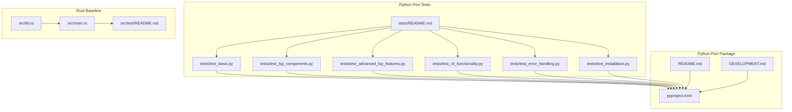
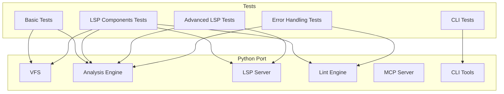
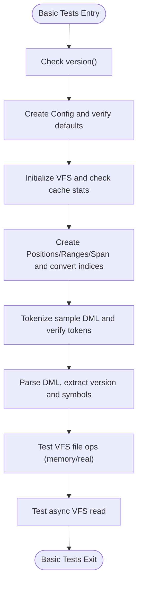
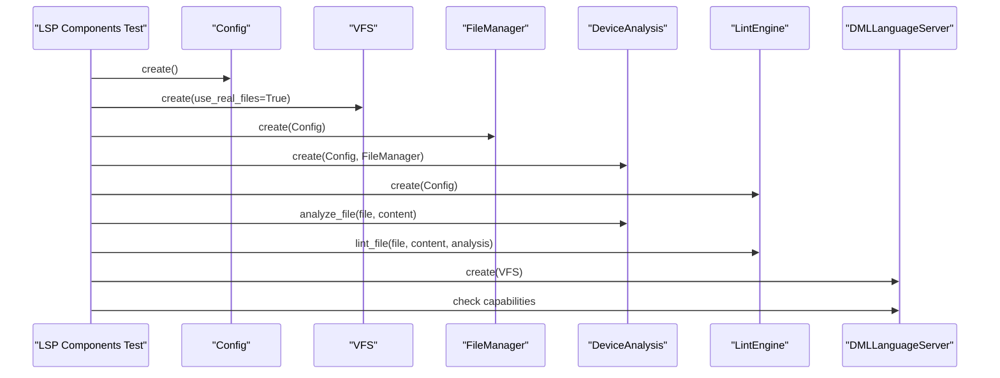
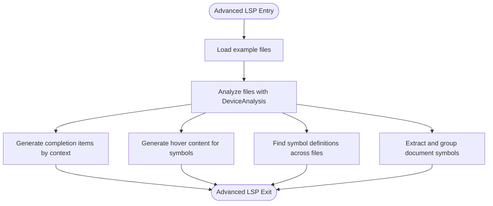
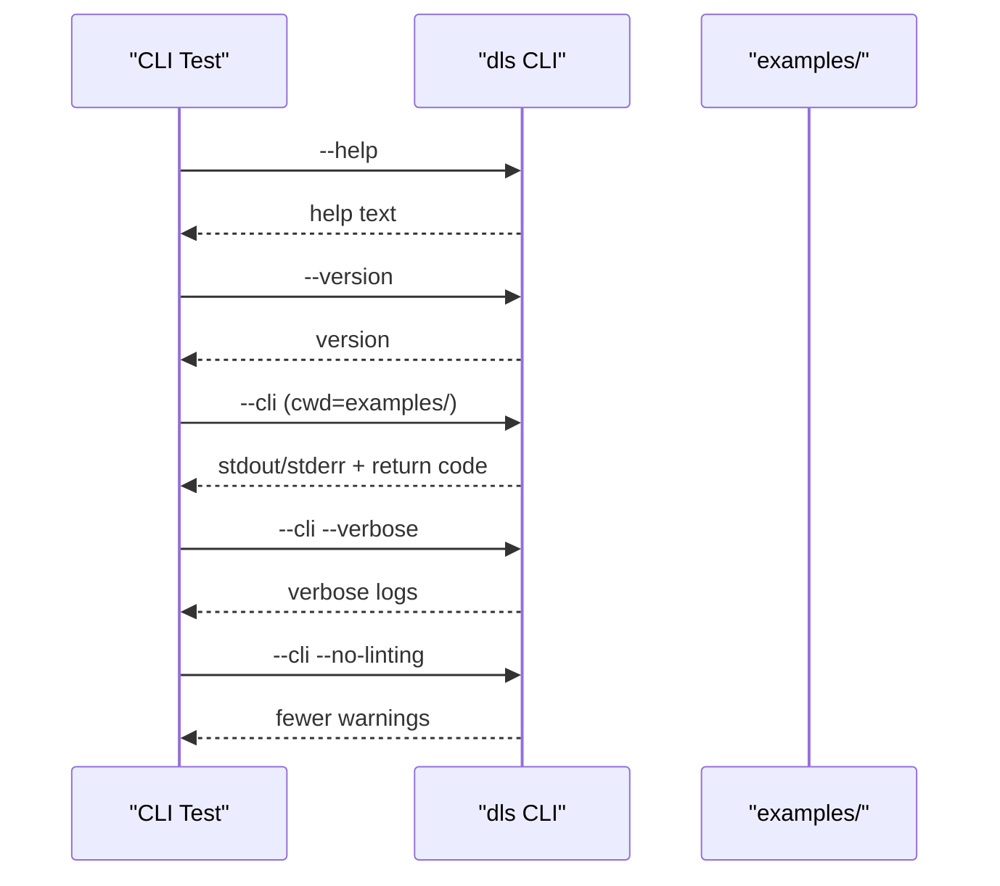
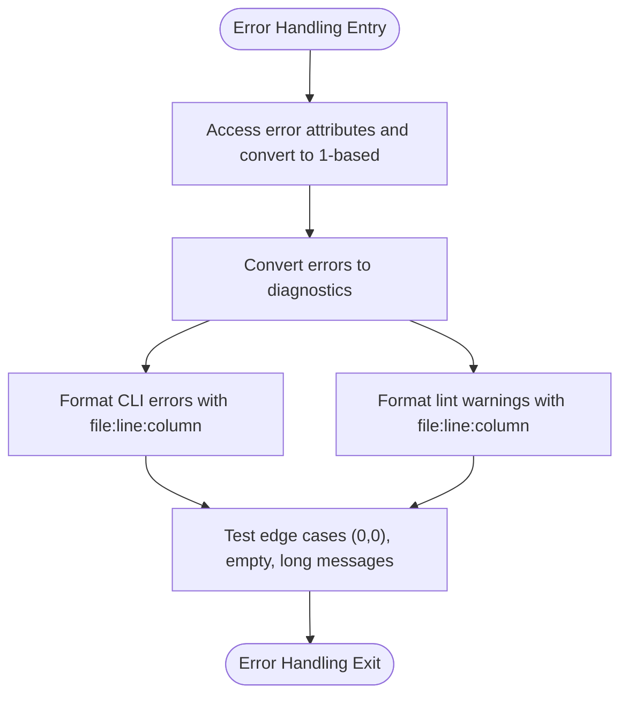
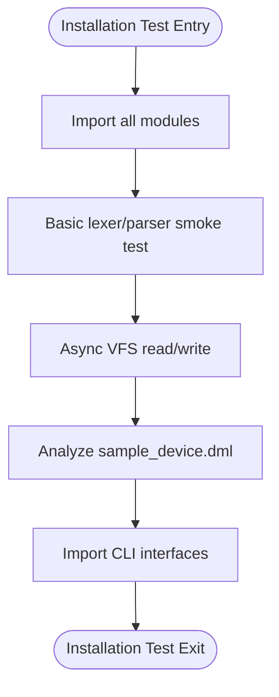
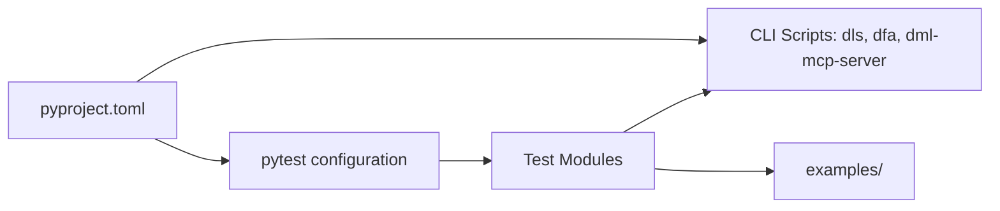

# Python Port Testing

<cite>
**Referenced Files in This Document**
- [tests/README.md](file://python-port/tests/README.md)
- [DEVELOPMENT.md](file://python-port/DEVELOPMENT.md)
- [README.md](file://python-port/README.md)
- [pyproject.toml](file://python-port/pyproject.toml)
- [tests/test_basic.py](file://python-port/tests/test_basic.py)
- [tests/test_cli_functionality.py](file://python-port/tests/test_cli_functionality.py)
- [tests/test_lsp_components.py](file://python-port/tests/test_lsp_components.py)
- [tests/test_advanced_lsp_features.py](file://python-port/tests/test_advanced_lsp_features.py)
- [tests/test_error_handling.py](file://python-port/tests/test_error_handling.py)
- [tests/test_installation.py](file://python-port/tests/test_installation.py)
- [src/lib.rs](file://src/lib.rs)
- [src/main.rs](file://src/main.rs)
- [src/test/README.md](file://src/test/README.md)
</cite>

## Table of Contents
1. [Introduction](#introduction)
2. [Project Structure](#project-structure)
3. [Core Components](#core-components)
4. [Architecture Overview](#architecture-overview)
5. [Detailed Component Analysis](#detailed-component-analysis)
6. [Dependency Analysis](#dependency-analysis)
7. [Performance Considerations](#performance-considerations)
8. [Troubleshooting Guide](#troubleshooting-guide)
9. [Conclusion](#conclusion)
10. [Appendices](#appendices)

## Introduction
This document describes the testing strategy and compatibility validation approach for the Python port of the DML Language Server. It explains how the test suite ensures functional equivalence and API compatibility between the Python implementation and the original Rust baseline, and how it validates core functionality, CLI behavior, LSP features, and error handling. It also outlines practical approaches for cross-language validation, performance comparisons, and integration testing across Python port components.

## Project Structure
The Python port’s test suite is organized into focused test modules that validate distinct areas of functionality. The tests rely on example DML files and the installed CLI entry points to exercise both programmatic and end-to-end behaviors.

**Diagram sources**
- [tests/README.md](file://python-port/tests/README.md#L1-L157)
- [pyproject.toml](file://python-port/pyproject.toml#L1-L106)
- [README.md](file://python-port/README.md#L1-L243)
- [DEVELOPMENT.md](file://python-port/DEVELOPMENT.md#L1-L345)
- [src/lib.rs](file://src/lib.rs#L1-L54)
- [src/main.rs](file://src/main.rs#L1-L60)
- [src/test/README.md](file://src/test/README.md#L1-L188)

**Section sources**
- [tests/README.md](file://python-port/tests/README.md#L1-L157)
- [pyproject.toml](file://python-port/pyproject.toml#L1-L106)
- [README.md](file://python-port/README.md#L1-L243)
- [DEVELOPMENT.md](file://python-port/DEVELOPMENT.md#L1-L345)
- [src/lib.rs](file://src/lib.rs#L1-L54)
- [src/main.rs](file://src/main.rs#L1-L60)
- [src/test/README.md](file://src/test/README.md#L1-L188)

## Core Components
The test suite is composed of five primary categories:
- Basic functionality tests: validate fundamental building blocks such as version, configuration, VFS, spans, and parsing.
- LSP component tests: validate core LSP engines (analysis, lint, VFS) and server capability creation without launching the full server.
- Advanced LSP feature tests: validate completion, hover, go-to-definition, and document symbol extraction with realistic scenarios.
- CLI functionality tests: validate CLI help/version, batch analysis, verbose logging, and linting toggles.
- Error handling tests: validate error attribute access, diagnostic conversion, and CLI/lint formatting.

Each category targets a specific aspect of the system and is documented in the tests README with expected outcomes and usage instructions.

**Section sources**
- [tests/README.md](file://python-port/tests/README.md#L1-L157)
- [tests/test_basic.py](file://python-port/tests/test_basic.py#L1-L239)
- [tests/test_lsp_components.py](file://python-port/tests/test_lsp_components.py#L1-L207)
- [tests/test_advanced_lsp_features.py](file://python-port/tests/test_advanced_lsp_features.py#L1-L374)
- [tests/test_cli_functionality.py](file://python-port/tests/test_cli_functionality.py#L1-L212)
- [tests/test_error_handling.py](file://python-port/tests/test_error_handling.py#L1-L336)

## Architecture Overview
The Python port mirrors the Rust architecture: VFS, analysis engine, LSP server, lint engine, MCP server, and CLI tools. The tests validate both the internal APIs and external interfaces (CLI and LSP).

**Diagram sources**
- [DEVELOPMENT.md](file://python-port/DEVELOPMENT.md#L128-L153)
- [tests/test_basic.py](file://python-port/tests/test_basic.py#L1-L239)
- [tests/test_lsp_components.py](file://python-port/tests/test_lsp_components.py#L1-L207)
- [tests/test_advanced_lsp_features.py](file://python-port/tests/test_advanced_lsp_features.py#L1-L374)
- [tests/test_cli_functionality.py](file://python-port/tests/test_cli_functionality.py#L1-L212)
- [tests/test_error_handling.py](file://python-port/tests/test_error_handling.py#L1-L336)

## Detailed Component Analysis

### Basic Functionality Tests
These tests validate foundational elements:
- Version retrieval and type correctness
- Internal error logging behavior
- Configuration defaults and linting enablement
- VFS cache statistics and file operations
- Span creation and index conversions
- DML lexer tokenization and keyword recognition
- DML parser DML version extraction, symbol collection, and syntax error detection
- File operations with VFS (memory vs real files)
- Async file reading behavior

**Diagram sources**
- [tests/test_basic.py](file://python-port/tests/test_basic.py#L22-L236)

**Section sources**
- [tests/test_basic.py](file://python-port/tests/test_basic.py#L1-L239)

### LSP Components Tests
These tests exercise the core LSP engines without starting the server:
- Component imports and initialization (Config, VFS, FileManager, DeviceAnalysis, LintEngine)
- File analysis and symbol extraction
- LSP data conversions (URI/path transformations)
- Server creation and capability configuration

**Diagram sources**
- [tests/test_lsp_components.py](file://python-port/tests/test_lsp_components.py#L13-L183)

**Section sources**
- [tests/test_lsp_components.py](file://python-port/tests/test_lsp_components.py#L1-L207)

### Advanced LSP Feature Tests
These tests simulate realistic LSP scenarios:
- Completion: generate completion items scoped to device/bank/register/field contexts
- Hover: produce rich hover content with symbol details and documentation
- Go-to-definition: locate symbol definitions across files
- Document symbols: extract and group symbols by kind and hierarchy

**Diagram sources**
- [tests/test_advanced_lsp_features.py](file://python-port/tests/test_advanced_lsp_features.py#L13-L327)

**Section sources**
- [tests/test_advanced_lsp_features.py](file://python-port/tests/test_advanced_lsp_features.py#L1-L374)

### CLI Functionality Tests
These tests validate the CLI entry points and behaviors:
- Help and version output
- Batch analysis with example files
- Verbose logging output
- Disabling linting and observing reduced warnings

**Diagram sources**
- [tests/test_cli_functionality.py](file://python-port/tests/test_cli_functionality.py#L11-L172)

**Section sources**
- [tests/test_cli_functionality.py](file://python-port/tests/test_cli_functionality.py#L1-L212)
- [pyproject.toml](file://python-port/pyproject.toml#L60-L63)

### Error Handling Tests
These tests validate robustness of error reporting:
- Error attribute access and 1-based display conversions
- Conversion of errors to diagnostics
- CLI error formatting with line/column
- Lint warning formatting
- Edge cases (zero positions, empty messages, long messages)

**Diagram sources**
- [tests/test_error_handling.py](file://python-port/tests/test_error_handling.py#L13-L296)

**Section sources**
- [tests/test_error_handling.py](file://python-port/tests/test_error_handling.py#L1-L336)

### Installation and Smoke Tests
These tests verify installation and basic operation:
- Module imports across the package
- Basic functionality (lexer/parser)
- Async VFS operations
- Analysis of a sample DML file
- CLI interface imports

**Diagram sources**
- [tests/test_installation.py](file://python-port/tests/test_installation.py#L16-L179)

**Section sources**
- [tests/test_installation.py](file://python-port/tests/test_installation.py#L1-L237)

## Dependency Analysis
The Python test suite depends on:
- The installed CLI entry points (dls, dfa, dml-mcp-server) as defined in pyproject.toml scripts
- Example DML files located under examples/
- Test runner configuration via pytest (as defined in pyproject.toml)

**Diagram sources**
- [pyproject.toml](file://python-port/pyproject.toml#L44-L63)
- [tests/README.md](file://python-port/tests/README.md#L74-L82)

**Section sources**
- [pyproject.toml](file://python-port/pyproject.toml#L44-L63)
- [tests/README.md](file://python-port/tests/README.md#L74-L82)

## Performance Considerations
- The Python port acknowledges performance differences compared to Rust, noting higher memory usage and slower execution typical of Python. While not a strict requirement for tests, performance characteristics should be considered when validating equivalence and when benchmarking cross-language behavior.
- The development guide highlights caching strategies and optimization tips (incremental parsing, limiting diagnostics, request cancellation, efficient symbol lookups) that inform expectations for performance-sensitive validations.

[No sources needed since this section provides general guidance]

## Troubleshooting Guide
Common issues and remedies derived from the test suite documentation:
- Import errors: ensure the virtual environment is activated and dependencies are installed
- File not found: confirm example DML files exist in the examples/ directory
- Permission errors: ensure the CLI binaries (.venv/bin/dls) are executable
- Path issues: tests expect to be run from the project root directory
- Timeout during CLI verbose mode: tests include timeouts to prevent hangs

**Section sources**
- [tests/README.md](file://python-port/tests/README.md#L136-L144)
- [tests/test_cli_functionality.py](file://python-port/tests/test_cli_functionality.py#L133-L138)

## Conclusion
The Python port’s test suite comprehensively validates core functionality, LSP features, CLI behavior, and error handling. By structuring tests around component-level verification, realistic LSP scenarios, and CLI integration, the suite ensures compatibility with the original Rust architecture while accommodating Python-specific constraints. The included troubleshooting guidance and development notes provide practical support for maintaining test parity and diagnosing issues.

[No sources needed since this section summarizes without analyzing specific files]

## Appendices

### Compatibility Validation Strategy
To validate compatibility between the Rust and Python implementations:
- Functional equivalence testing: compare outputs of equivalent operations (e.g., symbol extraction, diagnostics) across both implementations using identical example files.
- API compatibility validation: ensure that CLI flags and LSP capabilities match expected behavior and return codes.
- Cross-language test validation: run the same example DML files through both implementations and compare normalized outputs (e.g., sorted diagnostics, symbol lists).
- Performance comparison testing: measure latency and throughput for parsing and analysis tasks, acknowledging Python’s performance characteristics.
- Integration testing: validate end-to-end workflows (CLI batch analysis, LSP server responses) across both implementations.

[No sources needed since this section provides general guidance]