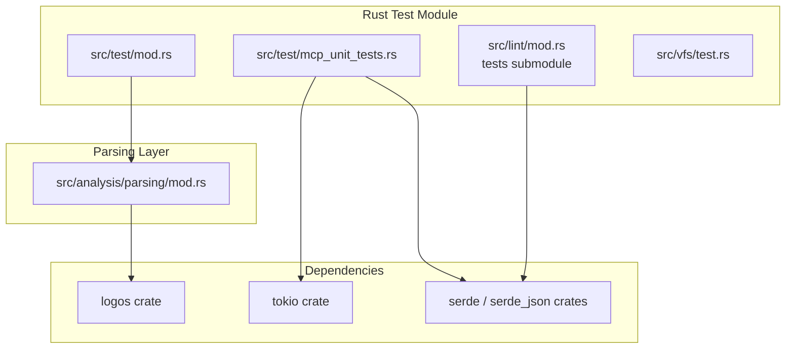
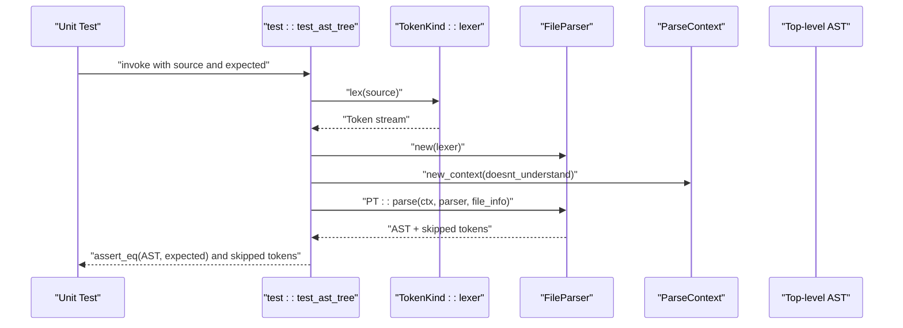
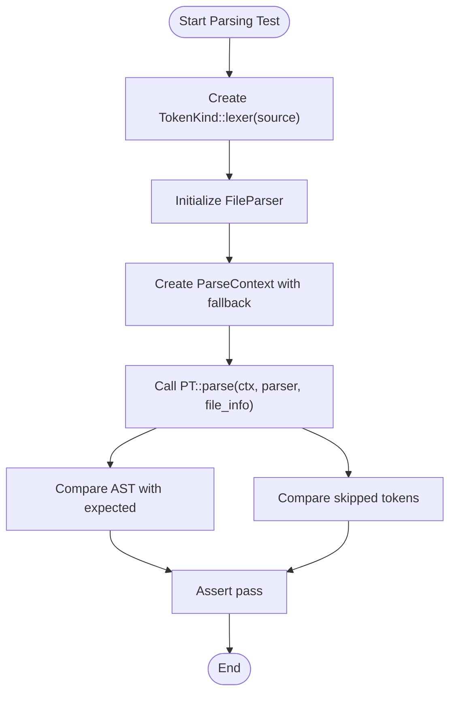
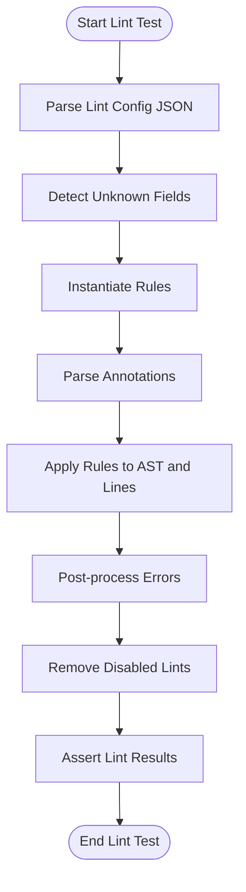
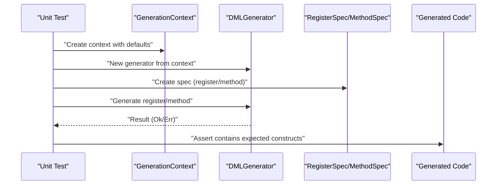
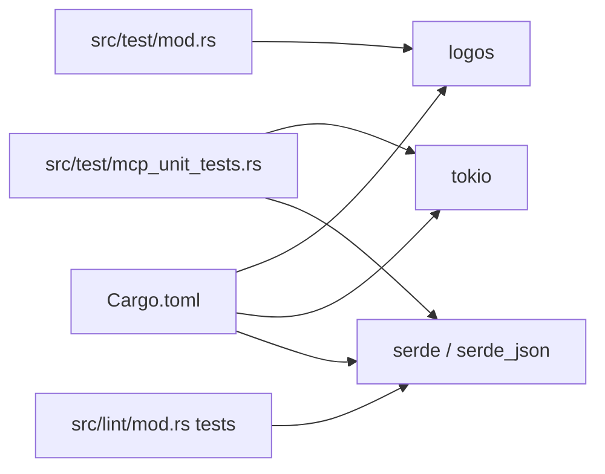

# Rust Unit Tests

<cite>
**Referenced Files in This Document**
- [Cargo.toml](file://Cargo.toml)
- [src/test/mod.rs](file://src/test/mod.rs)
- [src/test/mcp_unit_tests.rs](file://src/test/mcp_unit_tests.rs)
- [src/test/README.md](file://src/test/README.md)
- [src/analysis/parsing/mod.rs](file://src/analysis/parsing/mod.rs)
- [src/lint/mod.rs](file://src/lint/mod.rs)
- [src/vfs/test.rs](file://src/vfs/test.rs)
</cite>

## Table of Contents
1. [Introduction](#introduction)
2. [Project Structure](#project-structure)
3. [Core Components](#core-components)
4. [Architecture Overview](#architecture-overview)
5. [Detailed Component Analysis](#detailed-component-analysis)
6. [Dependency Analysis](#dependency-analysis)
7. [Performance Considerations](#performance-considerations)
8. [Troubleshooting Guide](#troubleshooting-guide)
9. [Conclusion](#conclusion)
10. [Appendices](#appendices)

## Introduction
This document explains the Rust unit testing strategies and implementation in the DML language server. It focuses on the unit test architecture covering parsing tests, analysis engine tests, and MCP unit tests. It documents testing patterns for lexical analysis, syntax parsing, semantic analysis, and template processing, along with practical examples for language server components, mocking external dependencies, and testing error conditions. It also covers test utilities for AST construction, token verification, and parse context testing, and outlines performance testing approaches, memory safety validation, and concurrent testing strategies for multi-threaded components.

## Project Structure
The repository organizes tests primarily under the Rust module tree and a dedicated test directory:
- Rust unit tests live under the src/test module and are compiled as part of the library’s test harness.
- The test module exposes helpers for constructing AST nodes, tokens, missing tokens, and ranges, and provides a reusable test harness for parsing-driven assertions.
- MCP-specific unit tests reside in src/test/mcp_unit_tests.rs and exercise the MCP server components, generation engine, and templates.
- Linting tests are integrated into the lint module’s tests submodule and validate configuration parsing, annotation handling, and rule application.
- The VFS test module provides filesystem-backed tests for virtualized file handling.

**Diagram sources**
- [src/test/mod.rs](file://src/test/mod.rs#L1-L70)
- [src/test/mcp_unit_tests.rs](file://src/test/mcp_unit_tests.rs#L1-L406)
- [src/lint/mod.rs](file://src/lint/mod.rs#L409-L586)
- [src/analysis/parsing/mod.rs](file://src/analysis/parsing/mod.rs#L1-L16)
- [Cargo.toml](file://Cargo.toml#L33-L62)

**Section sources**
- [src/test/mod.rs](file://src/test/mod.rs#L1-L70)
- [src/test/mcp_unit_tests.rs](file://src/test/mcp_unit_tests.rs#L1-L406)
- [src/lint/mod.rs](file://src/lint/mod.rs#L409-L586)
- [src/analysis/parsing/mod.rs](file://src/analysis/parsing/mod.rs#L1-L16)
- [Cargo.toml](file://Cargo.toml#L33-L62)

## Core Components
This section describes the core testing utilities and patterns used across the codebase.

- Test utilities for AST construction and token verification:
  - Helpers to construct AST objects, leaf tokens, missing tokens, and zero-based ranges are exposed from the test module. These enable deterministic assertions against parsed structures.
  - A reusable harness runs a lexer, constructs a parser, initializes a parse context, and compares the resulting AST and skipped tokens against expected values.

- MCP unit tests:
  - Cover server metadata defaults, capabilities, and protocol version.
  - Exercise generation configuration defaults, indent styles, and line endings.
  - Validate creation and behavior of generation contexts, device specs, register specs, field specs, and method specs.
  - Test asynchronous generation of registers and methods and synchronous template pattern execution.

- Linting tests:
  - Validate parsing of example lint configurations and detection of unknown fields.
  - Verify annotation parsing and application, including allow-file and per-line allowances.
  - Confirm post-processing and removal of disabled lints.

- VFS tests:
  - Provide filesystem-backed tests for virtualized file handling, ensuring correctness of file operations and text retrieval.

Practical usage patterns:
- Use the test harness to assert AST equality and skipped token sequences for small DML snippets.
- For MCP tests, prefer synchronous tests for pure data structures and async tests for I/O-bound or template generation tasks.
- For linting, isolate configuration parsing and annotation logic with targeted unit tests.

**Section sources**
- [src/test/mod.rs](file://src/test/mod.rs#L17-L70)
- [src/test/mcp_unit_tests.rs](file://src/test/mcp_unit_tests.rs#L14-L406)
- [src/lint/mod.rs](file://src/lint/mod.rs#L409-L586)
- [src/vfs/test.rs](file://src/vfs/test.rs)

## Architecture Overview
The unit test architecture integrates tightly with the language server’s parsing and analysis layers. The test harness leverages the logos lexer to tokenize input, feeds tokens into the parser, and validates the resulting AST and skipped tokens. MCP tests rely on tokio for async operations and serde for JSON-based configuration and template execution. Linting tests validate configuration deserialization and annotation semantics.

**Diagram sources**
- [src/test/mod.rs](file://src/test/mod.rs#L55-L70)

**Section sources**
- [src/test/mod.rs](file://src/test/mod.rs#L55-L70)

## Detailed Component Analysis

### Parsing Tests and Utilities
Testing patterns for lexical analysis, syntax parsing, and AST construction:
- Lexical analysis:
  - Use the logos-based lexer to tokenize input strings and feed them into the parser.
  - Construct tokens and leaf tokens with precise zero-based ranges for deterministic comparisons.
- Syntax parsing:
  - Initialize a parse context with a fallback handler for unknown tokens.
  - Parse top-level constructs and compare the produced AST with expected structures.
  - Capture and assert on skipped tokens to ensure robustness against malformed input.
- AST construction:
  - Build minimal AST objects and leaf tokens to represent expected parse outcomes.
  - Use zero-position and zero-range utilities to define positions and spans consistently.

**Diagram sources**
- [src/test/mod.rs](file://src/test/mod.rs#L55-L70)

**Section sources**
- [src/test/mod.rs](file://src/test/mod.rs#L17-L70)
- [src/analysis/parsing/mod.rs](file://src/analysis/parsing/mod.rs#L1-L16)

### Analysis Engine Tests (Linting)
Testing patterns for configuration parsing, annotation handling, and rule application:
- Configuration parsing:
  - Parse example lint configurations and assert they match the default configuration.
  - Detect unknown fields using serde_ignored and assert that only known fields remain.
- Annotation parsing:
  - Validate parsing of allow and allow-file annotations and their application to line-specific and whole-file scopes.
  - Assert error reporting for invalid commands and targets.
- Rule application:
  - Apply rules to AST nodes and lines, then post-process and remove disabled lints according to annotations.

**Diagram sources**
- [src/lint/mod.rs](file://src/lint/mod.rs#L409-L586)

**Section sources**
- [src/lint/mod.rs](file://src/lint/mod.rs#L409-L586)

### MCP Unit Tests
Testing patterns for MCP server components, generation engine, and templates:
- Server metadata and capabilities:
  - Validate default server info, capabilities, and protocol version.
- Generation configuration:
  - Assert defaults for indent style, line ending, max line length, and validation flags.
  - Test different indent styles (spaces vs tabs) and their effects on generated code.
- Generation contexts and specs:
  - Create and validate contexts, device specs, register specs with fields, and method specs.
- Asynchronous generation:
  - Generate registers and methods asynchronously and assert output contains expected constructs and documentation.
- Template patterns:
  - Retrieve pattern templates and execute them with JSON configurations, asserting device structure and interface presence.

**Diagram sources**
- [src/test/mcp_unit_tests.rs](file://src/test/mcp_unit_tests.rs#L149-L250)

**Section sources**
- [src/test/mcp_unit_tests.rs](file://src/test/mcp_unit_tests.rs#L14-L406)

### VFS Tests
Testing patterns for virtualized file system operations:
- Validate file text retrieval, path canonicalization, and error propagation.
- Ensure tests operate deterministically with controlled file contents and paths.

**Section sources**
- [src/vfs/test.rs](file://src/vfs/test.rs)

## Dependency Analysis
The test suite relies on several key dependencies:
- logos for tokenization during parsing tests.
- tokio for async MCP generation tests.
- serde and serde_json for configuration parsing and template execution.
- crossbeam and rayon for concurrent operations in the broader codebase (relevant for concurrent testing strategies).

**Diagram sources**
- [src/test/mod.rs](file://src/test/mod.rs#L7-L15)
- [src/test/mcp_unit_tests.rs](file://src/test/mcp_unit_tests.rs#L1-L13)
- [src/lint/mod.rs](file://src/lint/mod.rs#L409-L586)
- [Cargo.toml](file://Cargo.toml#L33-L62)

**Section sources**
- [Cargo.toml](file://Cargo.toml#L33-L62)
- [src/test/mod.rs](file://src/test/mod.rs#L7-L15)
- [src/test/mcp_unit_tests.rs](file://src/test/mcp_unit_tests.rs#L1-L13)
- [src/lint/mod.rs](file://src/lint/mod.rs#L409-L586)

## Performance Considerations
- Prefer micro-benchmarks for hot parsing loops and tokenization paths using criterion or built-in benchmarks.
- Use representative DML snippets to measure parsing throughput and memory allocations.
- For MCP generation, benchmark template execution and code generation steps separately to isolate overhead.
- Profile linting passes to identify expensive rule checks and optimize regex-heavy or repeated computations.

[No sources needed since this section provides general guidance]

## Troubleshooting Guide
Common issues and resolutions:
- Build failures:
  - Update dependencies and rebuild the MCP server binary before running tests.
- Server startup issues:
  - Verify the binary exists and has executable permissions.
- Test timeouts:
  - Increase timeout thresholds for slow systems and ensure adequate resources.
- JSON parse errors:
  - Confirm MCP protocol version compatibility and correct JSON-RPC payloads.

Debugging tips:
- Enable debug logs by setting the RUST_LOG environment variable when running Python-based MCP tests.
- Use targeted unit tests to narrow down failing scenarios and assert intermediate states (tokens, AST, skipped tokens).

**Section sources**
- [src/test/README.md](file://src/test/README.md#L148-L176)

## Conclusion
The Rust unit testing strategy in the DML language server combines a flexible test harness for parsing, comprehensive MCP unit tests for generation and templates, and robust linting tests for configuration and annotations. By leveraging logos-based lexing, tokio for async operations, and serde for JSON handling, the tests remain maintainable and effective. Extending the suite involves adding new parsing assertions, expanding MCP generation coverage, and validating additional lint rules and configurations.

[No sources needed since this section summarizes without analyzing specific files]

## Appendices
- Running tests:
  - Use the provided test runner to execute Python-based MCP tests and Rust unit tests.
  - Run specific Rust test modules using cargo test with module selectors.

**Section sources**
- [src/test/README.md](file://src/test/README.md#L48-L61)