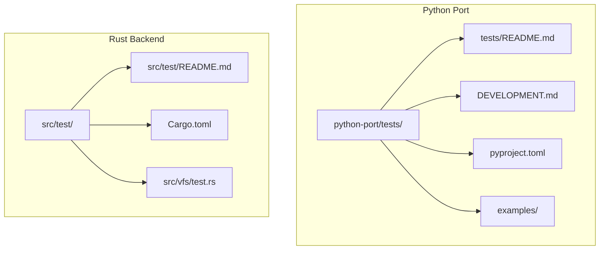
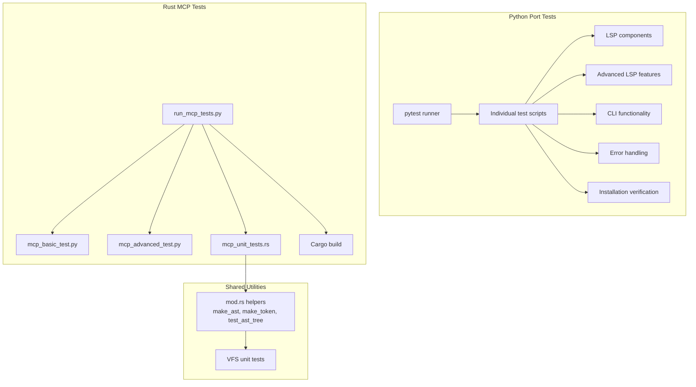
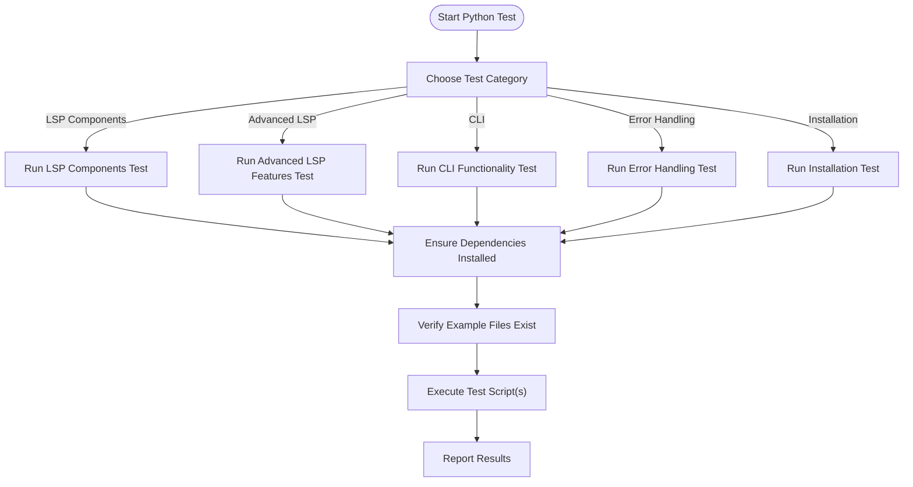
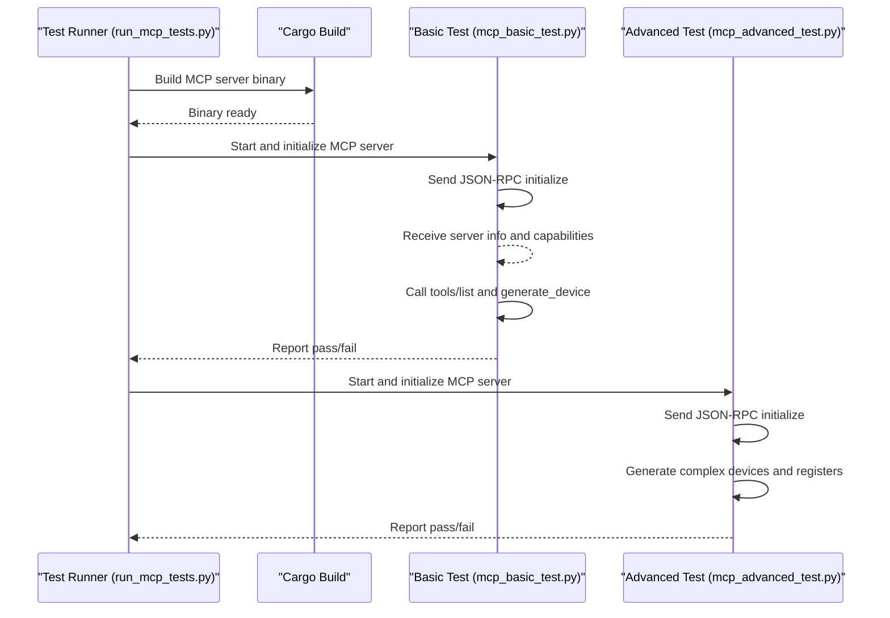
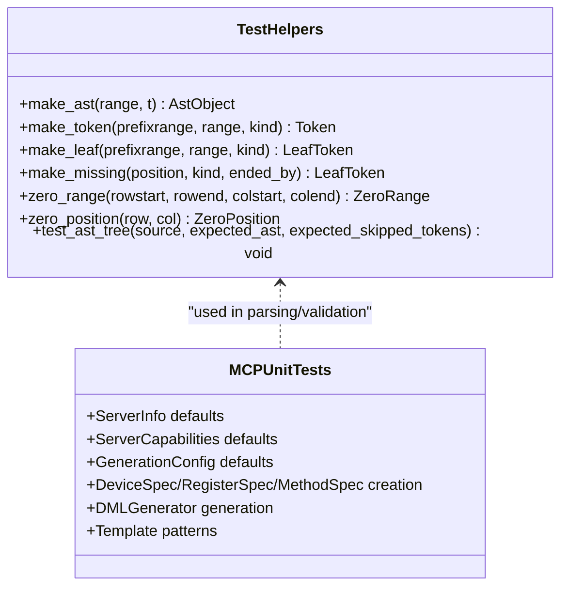
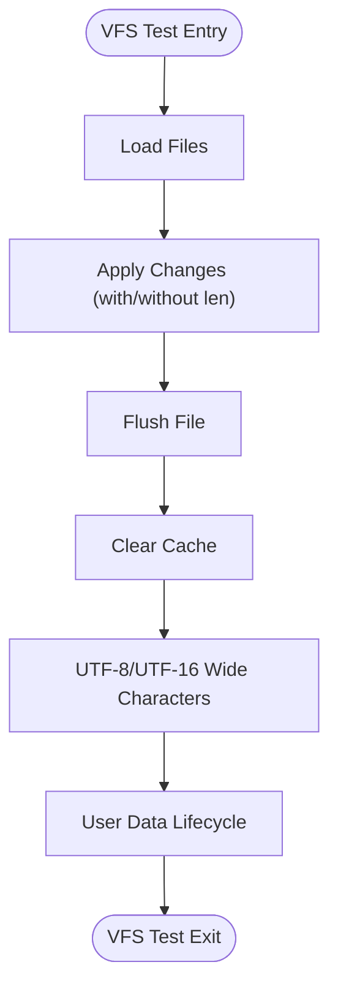
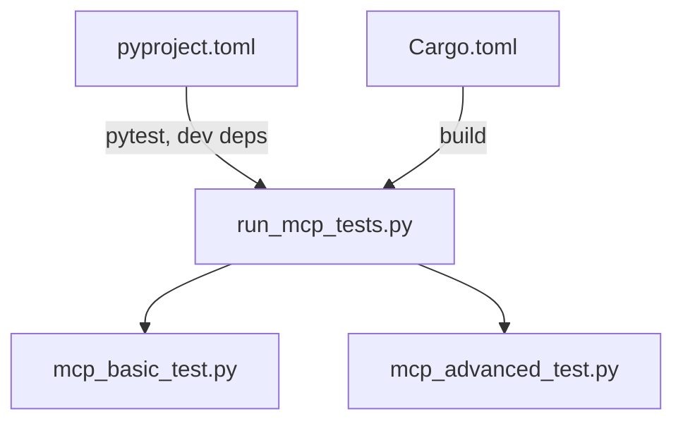

# Test Infrastructure and Setup

<cite>
**Referenced Files in This Document**
- [tests/README.md](file://python-port/tests/README.md)
- [DEVELOPMENT.md](file://python-port/DEVELOPMENT.md)
- [pyproject.toml](file://python-port/pyproject.toml)
- [Cargo.toml](file://Cargo.toml)
- [test_basic.py](file://python-port/tests/test_basic.py)
- [test_installation.py](file://python-port/tests/test_installation.py)
- [test_lsp_components.py](file://python-port/tests/test_lsp_components.py)
- [test_advanced_lsp_features.py](file://python-port/tests/test_advanced_lsp_features.py)
- [test_cli_functionality.py](file://python-port/tests/test_cli_functionality.py)
- [test_error_handling.py](file://python-port/tests/test_error_handling.py)
- [README.md](file://src/test/README.md)
- [mod.rs](file://src/test/mod.rs)
- [mcp_unit_tests.rs](file://src/test/mcp_unit_tests.rs)
- [run_mcp_tests.py](file://src/test/run_mcp_tests.py)
- [mcp_basic_test.py](file://src/test/mcp_basic_test.py)
- [mcp_advanced_test.py](file://src/test/mcp_advanced_test.py)
- [test.rs](file://src/vfs/test.rs)
- [sample_device.dml](file://python-port/examples/sample_device.dml)
</cite>

## Table of Contents
1. [Introduction](#introduction)
2. [Project Structure](#project-structure)
3. [Core Components](#core-components)
4. [Architecture Overview](#architecture-overview)
5. [Detailed Component Analysis](#detailed-component-analysis)
6. [Dependency Analysis](#dependency-analysis)
7. [Performance Considerations](#performance-considerations)
8. [Troubleshooting Guide](#troubleshooting-guide)
9. [Conclusion](#conclusion)
10. [Appendices](#appendices)

## Introduction
This document explains the testing infrastructure and setup procedures for the DML Language Server project. It covers:
- The overall test architecture across the Rust-based backend and Python port
- Python port testing infrastructure and execution workflows
- Cross-platform compatibility testing strategies
- Test environment configuration and dependency management
- Helper functions and utilities for testing (make_ast, make_token, test_ast_tree, etc.)
- Practical examples for setting up test environments, running suites, and interpreting results
- Relationship between test categories and execution priorities in CI/CD pipelines

## Project Structure
The repository organizes tests across two primary areas:
- Python port tests under python-port/tests/, covering LSP components, advanced LSP features, CLI functionality, and error handling
- Rust MCP server tests under src/test/, including Python integration tests, a Rust unit test suite, and a test runner

**Diagram sources**
- [tests/README.md](file://python-port/tests/README.md#L1-L157)
- [DEVELOPMENT.md](file://python-port/DEVELOPMENT.md#L1-L345)
- [pyproject.toml](file://python-port/pyproject.toml#L1-L106)
- [README.md](file://src/test/README.md#L1-L188)
- [Cargo.toml](file://Cargo.toml#L1-L62)
- [test.rs](file://src/vfs/test.rs#L1-L359)

**Section sources**
- [tests/README.md](file://python-port/tests/README.md#L1-L157)
- [README.md](file://src/test/README.md#L1-L188)

## Core Components
- Python port test suite:
  - LSP components, advanced LSP features, CLI functionality, error handling, and installation verification
  - Executed via pytest or individual scripts
  - Dependencies managed by pyproject.toml with dev extras
- Rust MCP server test suite:
  - Python integration tests (basic and advanced) and a Rust unit test suite
  - Automated test runner builds the MCP server binary and executes tests
  - Rust unit tests validate MCP components and generation logic
- Shared utilities:
  - Helper macros and functions for building AST nodes and tokens in Rust tests
  - VFS unit tests validating caching, change tracking, and UTF-8/UTF-16 handling

**Section sources**
- [test_basic.py](file://python-port/tests/test_basic.py#L1-L239)
- [test_installation.py](file://python-port/tests/test_installation.py#L1-L237)
- [test_lsp_components.py](file://python-port/tests/test_lsp_components.py)
- [test_advanced_lsp_features.py](file://python-port/tests/test_advanced_lsp_features.py)
- [test_cli_functionality.py](file://python-port/tests/test_cli_functionality.py)
- [test_error_handling.py](file://python-port/tests/test_error_handling.py)
- [README.md](file://src/test/README.md#L1-L188)
- [mcp_unit_tests.rs](file://src/test/mcp_unit_tests.rs#L1-L406)
- [mod.rs](file://src/test/mod.rs#L1-L70)
- [test.rs](file://src/vfs/test.rs#L1-L359)

## Architecture Overview
The test architecture combines Python-based functional tests with Rust-based unit and integration tests. Python tests exercise the language server’s LSP and CLI features, while Rust tests validate parsing, AST construction, MCP protocol compliance, and code generation. A shared test runner coordinates Rust binary builds and Python test execution.

**Diagram sources**
- [pyproject.toml](file://python-port/pyproject.toml#L99-L106)
- [README.md](file://src/test/README.md#L28-L61)
- [run_mcp_tests.py](file://src/test/run_mcp_tests.py#L1-L104)
- [mcp_basic_test.py](file://src/test/mcp_basic_test.py#L1-L134)
- [mcp_advanced_test.py](file://src/test/mcp_advanced_test.py#L1-L184)
- [mcp_unit_tests.rs](file://src/test/mcp_unit_tests.rs#L1-L406)
- [mod.rs](file://src/test/mod.rs#L17-L70)
- [test.rs](file://src/vfs/test.rs#L1-L359)

## Detailed Component Analysis

### Python Port Test Suite
- Purpose and scope:
  - Validates LSP components, advanced LSP features, CLI behavior, error handling, and installation
  - Provides usage examples and expected outcomes
- Execution:
  - Individual scripts or pytest with configured options
  - Requires example DML files and installed dependencies
- Coverage highlights:
  - Configuration, VFS, file management, analysis engine, lint engine
  - Code completion, hover, go-to-definition, document symbols
  - CLI help/version, file analysis, verbose logging, lint toggles
  - Error attribute access, diagnostic conversion, CLI error formatting, lint warnings

**Diagram sources**
- [tests/README.md](file://python-port/tests/README.md#L56-L91)
- [test_basic.py](file://python-port/tests/test_basic.py#L1-L239)
- [test_installation.py](file://python-port/tests/test_installation.py#L1-L237)

**Section sources**
- [tests/README.md](file://python-port/tests/README.md#L1-L157)
- [test_basic.py](file://python-port/tests/test_basic.py#L1-L239)
- [test_installation.py](file://python-port/tests/test_installation.py#L1-L237)

### Rust MCP Server Test Suite
- Purpose and scope:
  - Validates MCP protocol compliance, tool discovery, device generation, and JSON-RPC communication
  - Includes Python integration tests and Rust unit tests for MCP components
- Execution:
  - Automated test runner builds the MCP server binary and runs Python tests
  - Rust unit tests executed via cargo test
- Coverage highlights:
  - Protocol version, tool listing, device generation, register generation, method generation
  - Template system, pattern execution, generation configuration, and code generation correctness

**Diagram sources**
- [README.md](file://src/test/README.md#L28-L61)
- [run_mcp_tests.py](file://src/test/run_mcp_tests.py#L37-L89)
- [mcp_basic_test.py](file://src/test/mcp_basic_test.py#L37-L120)
- [mcp_advanced_test.py](file://src/test/mcp_advanced_test.py#L33-L174)

**Section sources**
- [README.md](file://src/test/README.md#L1-L188)
- [run_mcp_tests.py](file://src/test/run_mcp_tests.py#L1-L104)
- [mcp_basic_test.py](file://src/test/mcp_basic_test.py#L1-L134)
- [mcp_advanced_test.py](file://src/test/mcp_advanced_test.py#L1-L184)

### Rust Test Utilities and Helpers
- Helper functions for AST and token construction:
  - make_ast, make_token, make_leaf, make_missing, zero_range, zero_position
  - test_ast_tree for parsing and AST validation
- Usage patterns:
  - Construct minimal AST nodes and tokens for unit tests
  - Validate parser outputs against expected AST structures and skipped tokens

**Diagram sources**
- [mod.rs](file://src/test/mod.rs#L17-L70)
- [mcp_unit_tests.rs](file://src/test/mcp_unit_tests.rs#L1-L406)

**Section sources**
- [mod.rs](file://src/test/mod.rs#L1-L70)
- [mcp_unit_tests.rs](file://src/test/mcp_unit_tests.rs#L1-L406)

### VFS Unit Tests
- Purpose:
  - Validate VFS caching, change tracking, flush behavior, UTF-8/UTF-16 handling, and user data management
- Highlights:
  - Change recording and application with and without length hints
  - File addition, replacement, flushing, and clearing
  - User data lifecycle and clearing on flush/change

**Diagram sources**
- [test.rs](file://src/vfs/test.rs#L81-L359)

**Section sources**
- [test.rs](file://src/vfs/test.rs#L1-L359)

## Dependency Analysis
- Python port dependencies:
  - Managed via pyproject.toml with core dependencies and optional dev dependencies for testing and quality tools
  - Scripts for CLI tools are defined for dls, dfa, and dml-mcp-server
- Rust dependencies:
  - Defined in Cargo.toml with logging, async, JSON-RPC, and LSP-related crates
- Test runner dependencies:
  - Python subprocess and standard libraries for process control and JSON-RPC messaging

**Diagram sources**
- [pyproject.toml](file://python-port/pyproject.toml#L1-L106)
- [Cargo.toml](file://Cargo.toml#L1-L62)
- [run_mcp_tests.py](file://src/test/run_mcp_tests.py#L37-L59)
- [mcp_basic_test.py](file://src/test/mcp_basic_test.py#L42-L52)
- [mcp_advanced_test.py](file://src/test/mcp_advanced_test.py#L38-L46)

**Section sources**
- [pyproject.toml](file://python-port/pyproject.toml#L1-L106)
- [Cargo.toml](file://Cargo.toml#L1-L62)
- [run_mcp_tests.py](file://src/test/run_mcp_tests.py#L1-L104)

## Performance Considerations
- Python tests:
  - Use pytest with strict configuration and asyncio mode for async tests
  - Keep test fixtures minimal and avoid heavy file I/O where possible
- Rust tests:
  - Favor unit tests over integration tests for speed
  - Use targeted parsing and AST validation helpers to reduce overhead
- CI/CD:
  - Parallelize independent test suites when feasible
  - Cache build artifacts and virtual environments to reduce cold-start times

[No sources needed since this section provides general guidance]

## Troubleshooting Guide
- Python port tests:
  - Ensure the virtual environment is activated and dependencies installed
  - Confirm example DML files exist in the examples directory
  - Verify the CLI tool path and permissions
  - Run from the project root to avoid path issues
- Rust MCP tests:
  - Build the MCP server binary before running tests
  - Check binary existence and permissions
  - Increase timeouts if the server takes longer to start
  - Validate JSON-RPC protocol version compatibility
- General:
  - Use verbose logging for debugging MCP server issues
  - Review expected outputs and coverage lists for failing tests

**Section sources**
- [tests/README.md](file://python-port/tests/README.md#L136-L157)
- [README.md](file://src/test/README.md#L148-L188)

## Conclusion
The DML Language Server employs a robust dual-language testing strategy:
- Python port tests validate LSP and CLI functionality with comprehensive coverage
- Rust MCP tests ensure protocol compliance and code generation correctness
- Shared helpers streamline AST and token construction in Rust tests
- Clear documentation and automated runners simplify environment setup and execution

[No sources needed since this section summarizes without analyzing specific files]

## Appendices

### Practical Setup and Execution Examples
- Python port:
  - Install in development mode and run pytest or individual test scripts
  - Ensure example DML files are present and dependencies are installed
- Rust MCP:
  - Build the MCP server binary, then run the test runner or individual Python tests
  - Use verbose logging for debugging MCP server behavior

**Section sources**
- [DEVELOPMENT.md](file://python-port/DEVELOPMENT.md#L50-L117)
- [tests/README.md](file://python-port/tests/README.md#L74-L82)
- [README.md](file://src/test/README.md#L63-L81)

### Test Environment Configuration
- Python:
  - Use pyproject.toml to manage dependencies and pytest configuration
  - Define scripts for CLI tools and ensure they are available in PATH
- Rust:
  - Use Cargo.toml to manage dependencies and build targets
  - Ensure the MCP server binary is built and executable

**Section sources**
- [pyproject.toml](file://python-port/pyproject.toml#L1-L106)
- [Cargo.toml](file://Cargo.toml#L1-L62)

### Cross-Platform Compatibility Testing Strategies
- Python:
  - Pin supported Python versions and use tox-like matrix testing in CI
  - Validate example file paths and permissions across platforms
- Rust:
  - Build and test on multiple targets (e.g., x86_64 Linux/macOS/Windows)
  - Validate UTF-8/UTF-16 handling and wide character support

[No sources needed since this section provides general guidance]

### CI/CD Pipeline Execution Priorities
- Pre-build:
  - Install dependencies and set up virtual environments
- Rust:
  - Build MCP server binary and run Rust unit tests
- Python:
  - Run Python port tests and report coverage
- Post-build:
  - Archive artifacts and publish reports

**Section sources**
- [README.md](file://src/test/README.md#L148-L157)
- [tests/README.md](file://python-port/tests/README.md#L145-L157)