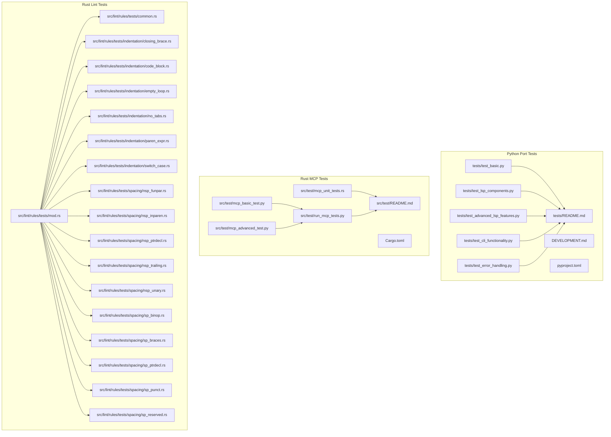
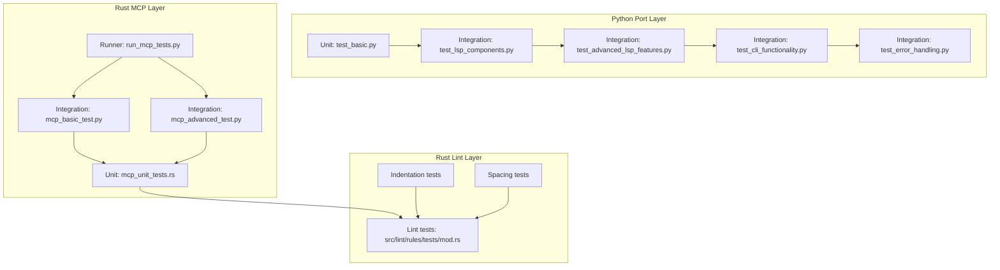
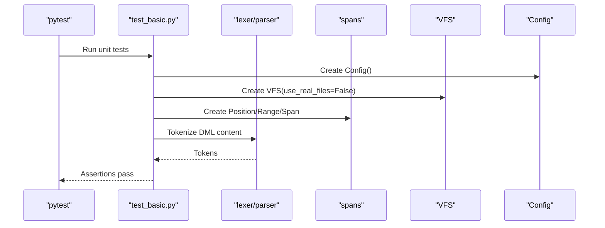
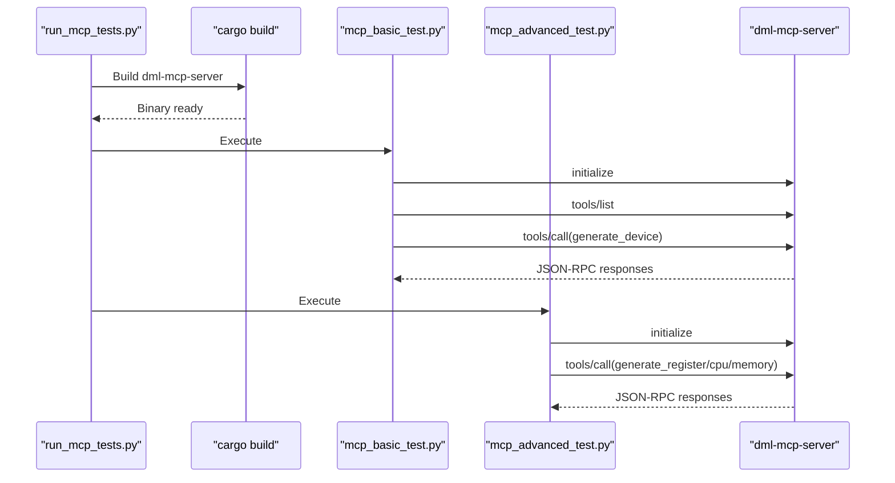
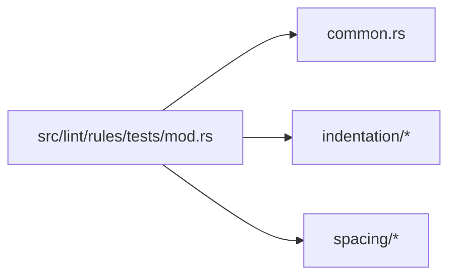
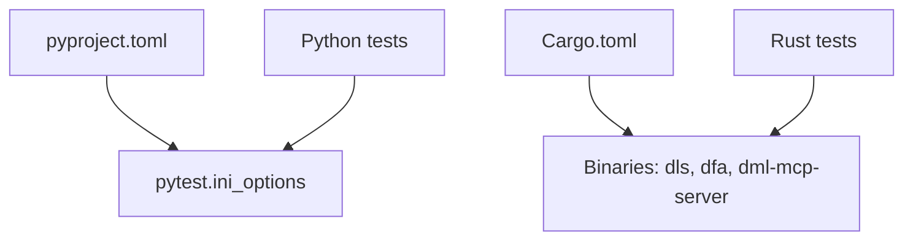

# Testing and Quality Assurance

<cite>
**Referenced Files in This Document**
- [README.md](file://python-port/tests/README.md)
- [README.md](file://src/test/README.md)
- [DEVELOPMENT.md](file://python-port/DEVELOPMENT.md)
- [pyproject.toml](file://python-port/pyproject.toml)
- [Cargo.toml](file://Cargo.toml)
- [test_basic.py](file://python-port/tests/test_basic.py)
- [test_lsp_components.py](file://python-port/tests/test_lsp_components.py)
- [test_advanced_lsp_features.py](file://python-port/tests/test_advanced_lsp_features.py)
- [test_cli_functionality.py](file://python-port/tests/test_cli_functionality.py)
- [test_error_handling.py](file://python-port/tests/test_error_handling.py)
- [mcp_basic_test.py](file://src/test/mcp_basic_test.py)
- [mcp_advanced_test.py](file://src/test/mcp_advanced_test.py)
- [mcp_unit_tests.rs](file://src/test/mcp_unit_tests.rs)
- [run_mcp_tests.py](file://src/test/run_mcp_tests.py)
- [mod.rs](file://src/lint/rules/tests/mod.rs)
- [common.rs](file://src/lint/rules/tests/common.rs)
- [closing_brace.rs](file://src/lint/rules/tests/indentation/closing_brace.rs)
- [code_block.rs](file://src/lint/rules/tests/indentation/code_block.rs)
- [empty_loop.rs](file://src/lint/rules/tests/indentation/empty_loop.rs)
- [no_tabs.rs](file://src/lint/rules/tests/indentation/no_tabs.rs)
- [paren_expr.rs](file://src/lint/rules/tests/indentation/paren_expr.rs)
- [switch_case.rs](file://src/lint/rules/tests/indentation/switch_case.rs)
- [nsp_funpar.rs](file://src/lint/rules/tests/spacing/nsp_funpar.rs)
- [nsp_inparen.rs](file://src/lint/rules/tests/spacing/nsp_inparen.rs)
- [nsp_ptrdecl.rs](file://src/lint/rules/tests/spacing/nsp_ptrdecl.rs)
- [nsp_trailing.rs](file://src/lint/rules/tests/spacing/nsp_trailing.rs)
- [nsp_unary.rs](file://src/lint/rules/tests/spacing/nsp_unary.rs)
- [sp_binop.rs](file://src/lint/rules/tests/spacing/sp_binop.rs)
- [sp_braces.rs](file://src/lint/rules/tests/spacing/sp_braces.rs)
- [sp_ptrdecl.rs](file://src/lint/rules/tests/spacing/sp_ptrdecl.rs)
- [sp_punct.rs](file://src/lint/rules/tests/spacing/sp_punct.rs)
- [sp_reserved.rs](file://src/lint/rules/tests/spacing/sp_reserved.rs)
</cite>

## Table of Contents
1. [Introduction](#introduction)
2. [Project Structure](#project-structure)
3. [Core Components](#core-components)
4. [Architecture Overview](#architecture-overview)
5. [Detailed Component Analysis](#detailed-component-analysis)
6. [Dependency Analysis](#dependency-analysis)
7. [Performance Considerations](#performance-considerations)
8. [Troubleshooting Guide](#troubleshooting-guide)
9. [Conclusion](#conclusion)
10. [Appendices](#appendices)

## Introduction
This document describes the testing infrastructure and quality assurance practices for the DML Language Server project. It covers the test architecture across unit, integration, and end-to-end testing, test suite organization for both the Python port and the Rust MCP server, frameworks and strategies used, and CI/CD integration patterns. It also provides practical guidance for writing new tests, debugging failures, and maintaining reliability across platforms.

## Project Structure
The repository includes two primary testing ecosystems:
- Python-based tests for the Python port of the language server, focusing on LSP components, CLI functionality, error handling, and advanced LSP features.
- Rust-based tests for the MCP server, including unit tests for generation logic and integration-style tests that exercise the MCP server via JSON-RPC.

**Diagram sources**
- [test_basic.py](file://python-port/tests/test_basic.py#L1-L239)
- [test_lsp_components.py](file://python-port/tests/test_lsp_components.py#L1-L207)
- [test_advanced_lsp_features.py](file://python-port/tests/test_advanced_lsp_features.py#L1-L374)
- [test_cli_functionality.py](file://python-port/tests/test_cli_functionality.py#L1-L212)
- [test_error_handling.py](file://python-port/tests/test_error_handling.py#L1-L336)
- [README.md](file://python-port/tests/README.md#L1-L157)
- [DEVELOPMENT.md](file://python-port/DEVELOPMENT.md#L102-L117)
- [pyproject.toml](file://python-port/pyproject.toml#L99-L106)
- [mcp_basic_test.py](file://src/test/mcp_basic_test.py#L1-L134)
- [mcp_advanced_test.py](file://src/test/mcp_advanced_test.py#L1-L184)
- [mcp_unit_tests.rs](file://src/test/mcp_unit_tests.rs#L1-L406)
- [run_mcp_tests.py](file://src/test/run_mcp_tests.py#L1-L104)
- [README.md](file://src/test/README.md#L1-L188)
- [Cargo.toml](file://Cargo.toml#L1-L62)
- [mod.rs](file://src/lint/rules/tests/mod.rs)
- [common.rs](file://src/lint/rules/tests/common.rs)
- [closing_brace.rs](file://src/lint/rules/tests/indentation/closing_brace.rs)
- [code_block.rs](file://src/lint/rules/tests/indentation/code_block.rs)
- [empty_loop.rs](file://src/lint/rules/tests/indentation/empty_loop.rs)
- [no_tabs.rs](file://src/lint/rules/tests/indentation/no_tabs.rs)
- [paren_expr.rs](file://src/lint/rules/tests/indentation/paren_expr.rs)
- [switch_case.rs](file://src/lint/rules/tests/indentation/switch_case.rs)
- [nsp_funpar.rs](file://src/lint/rules/tests/spacing/nsp_funpar.rs)
- [nsp_inparen.rs](file://src/lint/rules/tests/spacing/nsp_inparen.rs)
- [nsp_ptrdecl.rs](file://src/lint/rules/tests/spacing/nsp_ptrdecl.rs)
- [nsp_trailing.rs](file://src/lint/rules/tests/spacing/nsp_trailing.rs)
- [nsp_unary.rs](file://src/lint/rules/tests/spacing/nsp_unary.rs)
- [sp_binop.rs](file://src/lint/rules/tests/spacing/sp_binop.rs)
- [sp_braces.rs](file://src/lint/rules/tests/spacing/sp_braces.rs)
- [sp_ptrdecl.rs](file://src/lint/rules/tests/spacing/sp_ptrdecl.rs)
- [sp_punct.rs](file://src/lint/rules/tests/spacing/sp_punct.rs)
- [sp_reserved.rs](file://src/lint/rules/tests/spacing/sp_reserved.rs)

**Section sources**
- [README.md](file://python-port/tests/README.md#L1-L157)
- [README.md](file://src/test/README.md#L1-L188)
- [DEVELOPMENT.md](file://python-port/DEVELOPMENT.md#L102-L117)
- [pyproject.toml](file://python-port/pyproject.toml#L99-L106)
- [Cargo.toml](file://Cargo.toml#L1-L62)

## Core Components
- Python port test suite:
  - Unit tests for core components (version, config, VFS, spans, lexer, parser).
  - Component-level tests for LSP features without full server startup.
  - Advanced LSP feature demonstrations (completion, hover, go-to-definition, document symbols).
  - CLI functionality tests validating help, version, analysis, verbose logging, and disabling linting.
  - Error handling tests for attribute access, diagnostic conversion, and formatting.
- Rust MCP test suite:
  - Python integration tests exercising JSON-RPC protocol and tool calls.
  - Rust unit tests for MCP generation models, templates, and protocol compliance.
  - Test runner that builds the MCP server and executes tests sequentially.
- Rust lint rule tests:
  - Comprehensive test coverage for indentation and spacing rules organized by category.

**Section sources**
- [test_basic.py](file://python-port/tests/test_basic.py#L1-L239)
- [test_lsp_components.py](file://python-port/tests/test_lsp_components.py#L1-L207)
- [test_advanced_lsp_features.py](file://python-port/tests/test_advanced_lsp_features.py#L1-L374)
- [test_cli_functionality.py](file://python-port/tests/test_cli_functionality.py#L1-L212)
- [test_error_handling.py](file://python-port/tests/test_error_handling.py#L1-L336)
- [mcp_basic_test.py](file://src/test/mcp_basic_test.py#L1-L134)
- [mcp_advanced_test.py](file://src/test/mcp_advanced_test.py#L1-L184)
- [mcp_unit_tests.rs](file://src/test/mcp_unit_tests.rs#L1-L406)
- [run_mcp_tests.py](file://src/test/run_mcp_tests.py#L1-L104)
- [mod.rs](file://src/lint/rules/tests/mod.rs)
- [common.rs](file://src/lint/rules/tests/common.rs)
- [closing_brace.rs](file://src/lint/rules/tests/indentation/closing_brace.rs)
- [code_block.rs](file://src/lint/rules/tests/indentation/code_block.rs)
- [empty_loop.rs](file://src/lint/rules/tests/indentation/empty_loop.rs)
- [no_tabs.rs](file://src/lint/rules/tests/indentation/no_tabs.rs)
- [paren_expr.rs](file://src/lint/rules/tests/indentation/paren_expr.rs)
- [switch_case.rs](file://src/lint/rules/tests/indentation/switch_case.rs)
- [nsp_funpar.rs](file://src/lint/rules/tests/spacing/nsp_funpar.rs)
- [nsp_inparen.rs](file://src/lint/rules/tests/spacing/nsp_inparen.rs)
- [nsp_ptrdecl.rs](file://src/lint/rules/tests/spacing/nsp_ptrdecl.rs)
- [nsp_trailing.rs](file://src/lint/rules/tests/spacing/nsp_trailing.rs)
- [nsp_unary.rs](file://src/lint/rules/tests/spacing/nsp_unary.rs)
- [sp_binop.rs](file://src/lint/rules/tests/spacing/sp_binop.rs)
- [sp_braces.rs](file://src/lint/rules/tests/spacing/sp_braces.rs)
- [sp_ptrdecl.rs](file://src/lint/rules/tests/spacing/sp_ptrdecl.rs)
- [sp_punct.rs](file://src/lint/rules/tests/spacing/sp_punct.rs)
- [sp_reserved.rs](file://src/lint/rules/tests/spacing/sp_reserved.rs)

## Architecture Overview
The testing architecture separates concerns across layers:
- Unit tests validate isolated components (lexer/parser, generation models, lint rules).
- Integration tests validate component interactions (VFS, analysis, LSP data conversion).
- End-to-end tests validate protocol compliance and tool execution (MCP JSON-RPC, CLI invocations).

**Diagram sources**
- [test_basic.py](file://python-port/tests/test_basic.py#L1-L239)
- [test_lsp_components.py](file://python-port/tests/test_lsp_components.py#L1-L207)
- [test_advanced_lsp_features.py](file://python-port/tests/test_advanced_lsp_features.py#L1-L374)
- [test_cli_functionality.py](file://python-port/tests/test_cli_functionality.py#L1-L212)
- [test_error_handling.py](file://python-port/tests/test_error_handling.py#L1-L336)
- [mcp_basic_test.py](file://src/test/mcp_basic_test.py#L1-L134)
- [mcp_advanced_test.py](file://src/test/mcp_advanced_test.py#L1-L184)
- [mcp_unit_tests.rs](file://src/test/mcp_unit_tests.rs#L1-L406)
- [run_mcp_tests.py](file://src/test/run_mcp_tests.py#L1-L104)
- [mod.rs](file://src/lint/rules/tests/mod.rs)

## Detailed Component Analysis

### Python Port Test Suite Organization
- Unit tests:
  - Validate version, internal error logging, configuration, VFS cache stats, span conversions, and lexer/parser tokenization.
- Component tests:
  - Exercise analysis engine, VFS, FileManager, LintEngine, and LSP data conversions without starting the full server.
- Advanced LSP features:
  - Demonstrate completion, hover, go-to-definition, and document symbol extraction with realistic scenarios.
- CLI tests:
  - Validate help/version, CLI analysis, verbose logging, and disabling linting.
- Error handling tests:
  - Validate attribute access, diagnostic conversion, CLI error formatting, lint warning formatting, and edge cases.

**Diagram sources**
- [test_basic.py](file://python-port/tests/test_basic.py#L19-L123)

**Section sources**
- [test_basic.py](file://python-port/tests/test_basic.py#L1-L239)
- [test_lsp_components.py](file://python-port/tests/test_lsp_components.py#L1-L207)
- [test_advanced_lsp_features.py](file://python-port/tests/test_advanced_lsp_features.py#L1-L374)
- [test_cli_functionality.py](file://python-port/tests/test_cli_functionality.py#L1-L212)
- [test_error_handling.py](file://python-port/tests/test_error_handling.py#L1-L336)

### MCP Server Test Suite Organization
- Python integration tests:
  - Initialize server, list tools, and invoke tool calls (e.g., generate_device) via JSON-RPC.
- Rust unit tests:
  - Validate server info, capabilities, MCP version, generation config defaults, spec models, and template patterns.
- Test runner:
  - Builds the MCP server binary and runs integration tests sequentially.

**Diagram sources**
- [run_mcp_tests.py](file://src/test/run_mcp_tests.py#L37-L88)
- [mcp_basic_test.py](file://src/test/mcp_basic_test.py#L37-L120)
- [mcp_advanced_test.py](file://src/test/mcp_advanced_test.py#L33-L174)

**Section sources**
- [mcp_basic_test.py](file://src/test/mcp_basic_test.py#L1-L134)
- [mcp_advanced_test.py](file://src/test/mcp_advanced_test.py#L1-L184)
- [mcp_unit_tests.rs](file://src/test/mcp_unit_tests.rs#L1-L406)
- [run_mcp_tests.py](file://src/test/run_mcp_tests.py#L1-L104)
- [README.md](file://src/test/README.md#L1-L188)

### Rust Lint Rule Tests Organization
- Tests are grouped by categories (indentation, spacing) under a central module.
- Each rule has dedicated test files ensuring positive and negative cases.

**Diagram sources**
- [mod.rs](file://src/lint/rules/tests/mod.rs)
- [common.rs](file://src/lint/rules/tests/common.rs)
- [closing_brace.rs](file://src/lint/rules/tests/indentation/closing_brace.rs)
- [code_block.rs](file://src/lint/rules/tests/indentation/code_block.rs)
- [empty_loop.rs](file://src/lint/rules/tests/indentation/empty_loop.rs)
- [no_tabs.rs](file://src/lint/rules/tests/indentation/no_tabs.rs)
- [paren_expr.rs](file://src/lint/rules/tests/indentation/paren_expr.rs)
- [switch_case.rs](file://src/lint/rules/tests/indentation/switch_case.rs)
- [nsp_funpar.rs](file://src/lint/rules/tests/spacing/nsp_funpar.rs)
- [nsp_inparen.rs](file://src/lint/rules/tests/spacing/nsp_inparen.rs)
- [nsp_ptrdecl.rs](file://src/lint/rules/tests/spacing/nsp_ptrdecl.rs)
- [nsp_trailing.rs](file://src/lint/rules/tests/spacing/nsp_trailing.rs)
- [nsp_unary.rs](file://src/lint/rules/tests/spacing/nsp_unary.rs)
- [sp_binop.rs](file://src/lint/rules/tests/spacing/sp_binop.rs)
- [sp_braces.rs](file://src/lint/rules/tests/spacing/sp_braces.rs)
- [sp_ptrdecl.rs](file://src/lint/rules/tests/spacing/sp_ptrdecl.rs)
- [sp_punct.rs](file://src/lint/rules/tests/spacing/sp_punct.rs)
- [sp_reserved.rs](file://src/lint/rules/tests/spacing/sp_reserved.rs)

**Section sources**
- [mod.rs](file://src/lint/rules/tests/mod.rs)
- [common.rs](file://src/lint/rules/tests/common.rs)
- [closing_brace.rs](file://src/lint/rules/tests/indentation/closing_brace.rs)
- [code_block.rs](file://src/lint/rules/tests/indentation/code_block.rs)
- [empty_loop.rs](file://src/lint/rules/tests/indentation/empty_loop.rs)
- [no_tabs.rs](file://src/lint/rules/tests/indentation/no_tabs.rs)
- [paren_expr.rs](file://src/lint/rules/tests/indentation/paren_expr.rs)
- [switch_case.rs](file://src/lint/rules/tests/indentation/switch_case.rs)
- [nsp_funpar.rs](file://src/lint/rules/tests/spacing/nsp_funpar.rs)
- [nsp_inparen.rs](file://src/lint/rules/tests/spacing/nsp_inparen.rs)
- [nsp_ptrdecl.rs](file://src/lint/rules/tests/spacing/nsp_ptrdecl.rs)
- [nsp_trailing.rs](file://src/lint/rules/tests/spacing/nsp_trailing.rs)
- [nsp_unary.rs](file://src/lint/rules/tests/spacing/nsp_unary.rs)
- [sp_binop.rs](file://src/lint/rules/tests/spacing/sp_binop.rs)
- [sp_braces.rs](file://src/lint/rules/tests/spacing/sp_braces.rs)
- [sp_ptrdecl.rs](file://src/lint/rules/tests/spacing/sp_ptrdecl.rs)
- [sp_punct.rs](file://src/lint/rules/tests/spacing/sp_punct.rs)
- [sp_reserved.rs](file://src/lint/rules/tests/spacing/sp_reserved.rs)

## Dependency Analysis
- Python test configuration:
  - pytest is configured with strict markers and async mode.
  - Optional dev dependencies include pytest, pytest-asyncio, pytest-cov, and linters.
- Rust build and runtime:
  - Cargo configuration defines binaries and dependencies, including JSON-RPC and LSP types.
- Test interdependencies:
  - MCP integration tests depend on a built binary produced by the test runner.
  - Lint rule tests are self-contained and executed via Rust’s test harness.

**Diagram sources**
- [pyproject.toml](file://python-port/pyproject.toml#L99-L106)
- [Cargo.toml](file://Cargo.toml#L18-L31)

**Section sources**
- [pyproject.toml](file://python-port/pyproject.toml#L99-L106)
- [Cargo.toml](file://Cargo.toml#L18-L31)

## Performance Considerations
- Python port:
  - Asynchronous operations are tested using pytest-asyncio; ensure async functions are awaited in tests.
  - Caching strategies (VFS, analysis) should be validated in integration tests to avoid repeated filesystem operations.
- Rust MCP:
  - Generation logic is tested with async tests; ensure tokio runtime is available during execution.
  - Template and pattern tests validate correctness and performance characteristics of generated code.

[No sources needed since this section provides general guidance]

## Troubleshooting Guide
- Python tests:
  - Use pytest with verbose output and coverage to diagnose failures.
  - Validate environment setup, example files presence, and virtual environment activation.
- MCP tests:
  - Ensure the MCP server binary is built before running integration tests.
  - Use debug logging by setting environment variables for verbose output.
  - Confirm JSON-RPC protocol version compatibility and handle timeouts.
- Lint rule tests:
  - Execute via Rust’s test harness; verify rule-specific test files are included in the module tree.

**Section sources**
- [README.md](file://python-port/tests/README.md#L136-L157)
- [README.md](file://src/test/README.md#L148-L188)
- [DEVELOPMENT.md](file://python-port/DEVELOPMENT.md#L204-L237)

## Conclusion
The testing infrastructure combines robust unit, integration, and end-to-end strategies across Python and Rust components. The Python port emphasizes component isolation and protocol compliance, while the Rust MCP suite validates JSON-RPC interactions and generation correctness. Lint rule tests ensure consistent code quality. CI/CD integration can leverage the provided test runners and pytest configurations to automate verification across platforms.

[No sources needed since this section summarizes without analyzing specific files]

## Appendices

### Practical Examples

- Writing a new Python unit test:
  - Follow naming conventions and include descriptive docstrings.
  - Use pytest fixtures and assertions; add the new file to the test suite.
  - Reference: [test_basic.py](file://python-port/tests/test_basic.py#L19-L123), [README.md](file://python-port/tests/README.md#L125-L135)

- Writing a new Python integration test:
  - Demonstrate realistic scenarios with example files.
  - Validate LSP features or CLI behavior; add to the README.
  - Reference: [test_advanced_lsp_features.py](file://python-port/tests/test_advanced_lsp_features.py#L1-L374), [test_cli_functionality.py](file://python-port/tests/test_cli_functionality.py#L1-L212)

- Writing a new Rust MCP unit test:
  - Add tests for generation models and templates; use async tests where applicable.
  - Reference: [mcp_unit_tests.rs](file://src/test/mcp_unit_tests.rs#L149-L250)

- Debugging a failing MCP integration test:
  - Build the server, set debug logging, and inspect JSON-RPC responses.
  - Reference: [run_mcp_tests.py](file://src/test/run_mcp_tests.py#L37-L88), [README.md](file://src/test/README.md#L171-L176)

- Performance regression testing:
  - Use pytest with coverage and benchmarking tools in CI.
  - Reference: [DEVELOPMENT.md](file://python-port/DEVELOPMENT.md#L254-L270)

- Testing critical components:
  - Analysis engine: validate lexer/parser and symbol extraction.
  - LSP protocol: verify capabilities and data conversions.
  - MCP functionality: confirm tool discovery and code generation.
  - Reference: [test_lsp_components.py](file://python-port/tests/test_lsp_components.py#L13-L139), [mcp_basic_test.py](file://src/test/mcp_basic_test.py#L37-L120), [mcp_unit_tests.rs](file://src/test/mcp_unit_tests.rs#L14-L52)

### Continuous Integration Setup
- Python tests:
  - Run with pytest and optional coverage collection.
  - Reference: [pyproject.toml](file://python-port/pyproject.toml#L99-L106), [README.md](file://python-port/tests/README.md#L68-L72)

- Rust MCP tests:
  - Build the MCP server and execute integration tests via the test runner.
  - Reference: [run_mcp_tests.py](file://src/test/run_mcp_tests.py#L61-L101), [README.md](file://src/test/README.md#L148-L157)