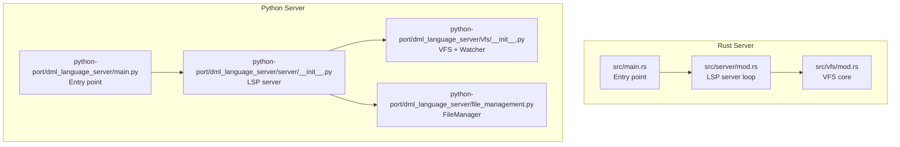
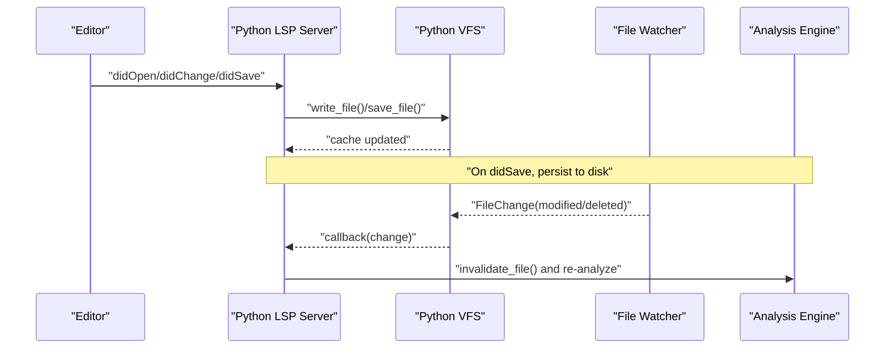
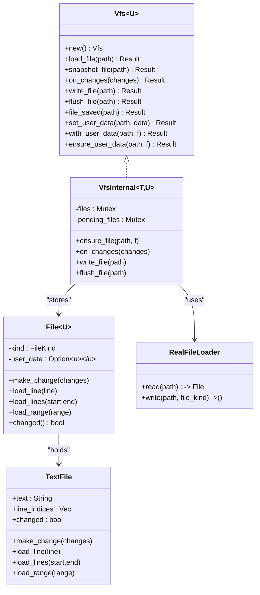
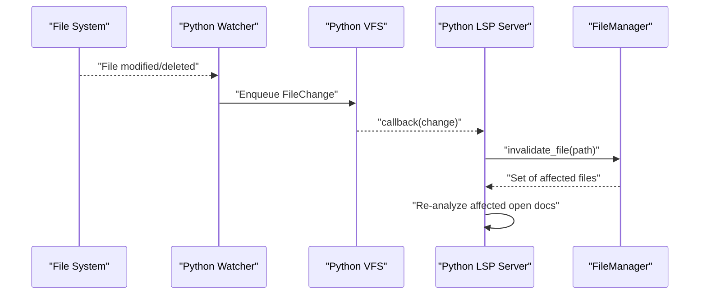
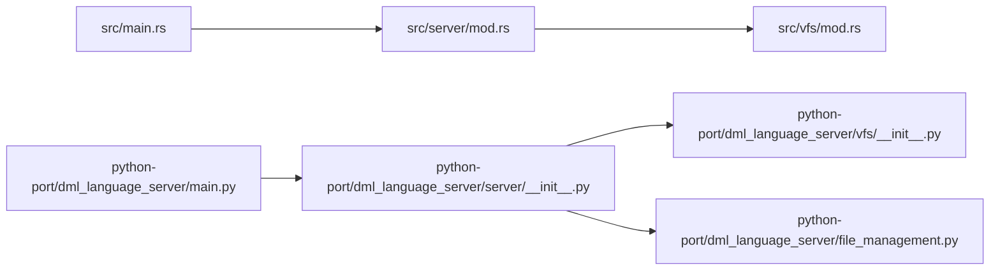

# Virtual File System

<cite>
**Referenced Files in This Document**
- [src/vfs/mod.rs](file://src/vfs/mod.rs)
- [src/vfs/test.rs](file://src/vfs/test.rs)
- [src/server/mod.rs](file://src/server/mod.rs)
- [src/main.rs](file://src/main.rs)
- [python-port/dml_language_server/vfs/__init__.py](file://python-port/dml_language_server/vfs/__init__.py)
- [python-port/dml_language_server/server/__init__.py](file://python-port/dml_language_server/server/__init__.py)
- [python-port/dml_language_server/file_management.py](file://python-port/dml_language_server/file_management.py)
</cite>

## Table of Contents
1. [Introduction](#introduction)
2. [Project Structure](#project-structure)
3. [Core Components](#core-components)
4. [Architecture Overview](#architecture-overview)
5. [Detailed Component Analysis](#detailed-component-analysis)
6. [Dependency Analysis](#dependency-analysis)
7. [Performance Considerations](#performance-considerations)
8. [Troubleshooting Guide](#troubleshooting-guide)
9. [Conclusion](#conclusion)
10. [Appendices](#appendices)

## Introduction
This document explains the Virtual File System (VFS) implementation used by the DML Language Server. It covers caching strategies, change tracking, synchronization between in-memory representations and disk, multi-threaded operations with locking, file watching for external changes, and integration with the analysis engine for automatic re-analysis. It also documents file management APIs (read, write buffering, cache invalidation), examples of change propagation, performance optimizations for large projects, memory management considerations, edge cases (concurrent modifications, network file systems, large DML files), and the relationship between VFS and the broader analysis pipeline.

## Project Structure
The VFS is implemented in two complementary layers:
- Rust-based VFS for the native server, providing thread-safe in-memory caching, change coalescing, and disk I/O abstraction.
- Python-based VFS for the LSP server, providing asynchronous file watching, caching, and integration with the analysis engine.

**Diagram sources**
- [src/main.rs](file://src/main.rs#L56-L58)
- [src/server/mod.rs](file://src/server/mod.rs#L68-L84)
- [src/vfs/mod.rs](file://src/vfs/mod.rs#L29-L288)
- [python-port/dml_language_server/main.py](file://python-port/dml_language_server/main.py#L82-L83)
- [python-port/dml_language_server/server/__init__.py](file://python-port/dml_language_server/server/__init__.py#L49-L69)
- [python-port/dml_language_server/vfs/__init__.py](file://python-port/dml_language_server/vfs/__init__.py#L123-L329)
- [python-port/dml_language_server/file_management.py](file://python-port/dml_language_server/file_management.py#L33-L387)

**Section sources**
- [src/main.rs](file://src/main.rs#L56-L58)
- [src/server/mod.rs](file://src/server/mod.rs#L68-L84)
- [src/vfs/mod.rs](file://src/vfs/mod.rs#L29-L288)
- [python-port/dml_language_server/main.py](file://python-port/dml_language_server/main.py#L82-L83)
- [python-port/dml_language_server/server/__init__.py](file://python-port/dml_language_server/server/__init__.py#L49-L69)
- [python-port/dml_language_server/vfs/__init__.py](file://python-port/dml_language_server/vfs/__init__.py#L123-L329)
- [python-port/dml_language_server/file_management.py](file://python-port/dml_language_server/file_management.py#L33-L387)

## Core Components
- Rust VFS
  - Public API: creation, file loading/saving, change recording, user data attachment, cache inspection, flushing, and synchronization checks.
  - Internals: per-file in-memory representation, line index cache, change coalescing, and thread coordination via mutexes and parking.
  - Disk I/O abstraction via a trait with a real file loader.
- Python VFS
  - Asynchronous file caching with dirty-set tracking.
  - File watcher using watchdog to detect external changes and propagate them to the server.
  - Integration hooks for callbacks and continuous change processing.

Key responsibilities:
- Provide fast in-memory access to DML files.
- Track and apply incremental edits safely.
- Keep disk in sync when requested.
- Notify the analysis engine of external changes to re-analyze affected files.

**Section sources**
- [src/vfs/mod.rs](file://src/vfs/mod.rs#L180-L288)
- [src/vfs/mod.rs](file://src/vfs/mod.rs#L293-L603)
- [src/vfs/mod.rs](file://src/vfs/mod.rs#L895-L952)
- [python-port/dml_language_server/vfs/__init__.py](file://python-port/dml_language_server/vfs/__init__.py#L123-L329)

## Architecture Overview
The VFS sits at the intersection of the LSP server and the analysis engine. Rust VFS is used by the native server; Python VFS is used by the LSP server. Both provide:
- In-memory caching with dirty tracking.
- Change recording and coalescing.
- External change detection and propagation.
- Integration with analysis and linting.

**Diagram sources**
- [python-port/dml_language_server/server/__init__.py](file://python-port/dml_language_server/server/__init__.py#L122-L174)
- [python-port/dml_language_server/server/__init__.py](file://python-port/dml_language_server/server/__init__.py#L344-L363)
- [python-port/dml_language_server/vfs/__init__.py](file://python-port/dml_language_server/vfs/__init__.py#L92-L121)
- [python-port/dml_language_server/vfs/__init__.py](file://python-port/dml_language_server/vfs/__init__.py#L280-L304)

## Detailed Component Analysis

### Rust VFS: In-memory model and change tracking
- Data model
  - Per-file storage: text content, line indices, and a changed flag.
  - Line indices enable O(1) random access to lines and efficient slicing.
  - User data attached per file for analysis metadata.
- Change tracking
  - Changes are recorded as additions or replacements with spans.
  - Coalescing groups all changes per file and applies them in-order.
  - After applying changes, line indices are recomputed and the changed flag is set.
- Synchronization and locking
  - Two mutex-protected maps: cached files and pending writers.
  - A strict lock ordering: pending_files first, then files.
  - Threads waiting for a file to finish loading are parked and unparked when ready.
- Disk I/O
  - RealFileLoader reads/writes UTF-8 text or falls back to binary bytes.
  - Writing clears the changed flag and persists to disk.

**Diagram sources**
- [src/vfs/mod.rs](file://src/vfs/mod.rs#L29-L288)
- [src/vfs/mod.rs](file://src/vfs/mod.rs#L293-L603)
- [src/vfs/mod.rs](file://src/vfs/mod.rs#L663-L729)
- [src/vfs/mod.rs](file://src/vfs/mod.rs#L655-L661)
- [src/vfs/mod.rs](file://src/vfs/mod.rs#L900-L952)

**Section sources**
- [src/vfs/mod.rs](file://src/vfs/mod.rs#L614-L623)
- [src/vfs/mod.rs](file://src/vfs/mod.rs#L731-L777)
- [src/vfs/mod.rs](file://src/vfs/mod.rs#L354-L379)
- [src/vfs/mod.rs](file://src/vfs/mod.rs#L468-L512)
- [src/vfs/mod.rs](file://src/vfs/mod.rs#L514-L530)
- [src/vfs/mod.rs](file://src/vfs/mod.rs#L900-L952)

### Rust VFS: Multi-threading and file watching
- Locking and parking
  - Pending writers are tracked per path; readers park while writers hold the lock.
  - Ensures safe concurrent reads and writes without data races.
- File watching
  - The Rust VFS does not include a file watcher; external watchers (e.g., OS-level) should invalidate caches and trigger re-analysis in the server.

**Section sources**
- [src/vfs/mod.rs](file://src/vfs/mod.rs#L290-L297)
- [src/vfs/mod.rs](file://src/vfs/mod.rs#L331-L344)
- [src/vfs/mod.rs](file://src/vfs/mod.rs#L472-L512)

### Python VFS: Caching, change propagation, and integration
- Caching
  - In-memory file cache with a dirty set to track unsaved changes.
  - Reads first check cache; otherwise load from disk and update cache.
- Change propagation
  - File watcher detects created/modified/deleted events for DML files.
  - On change, cache is invalidated and callbacks notify the server.
- Integration with analysis
  - Server registers a change callback; on external changes, it invalidates analysis and re-analyzes affected open documents.

**Diagram sources**
- [python-port/dml_language_server/vfs/__init__.py](file://python-port/dml_language_server/vfs/__init__.py#L92-L121)
- [python-port/dml_language_server/vfs/__init__.py](file://python-port/dml_language_server/vfs/__init__.py#L280-L304)
- [python-port/dml_language_server/server/__init__.py](file://python-port/dml_language_server/server/__init__.py#L344-L363)
- [python-port/dml_language_server/file_management.py](file://python-port/dml_language_server/file_management.py#L305-L334)

**Section sources**
- [python-port/dml_language_server/vfs/__init__.py](file://python-port/dml_language_server/vfs/__init__.py#L135-L164)
- [python-port/dml_language_server/vfs/__init__.py](file://python-port/dml_language_server/vfs/__init__.py#L178-L198)
- [python-port/dml_language_server/vfs/__init__.py](file://python-port/dml_language_server/vfs/__init__.py#L240-L270)
- [python-port/dml_language_server/vfs/__init__.py](file://python-port/dml_language_server/vfs/__init__.py#L280-L304)
- [python-port/dml_language_server/server/__init__.py](file://python-port/dml_language_server/server/__init__.py#L344-L363)
- [python-port/dml_language_server/file_management.py](file://python-port/dml_language_server/file_management.py#L305-L334)

### API surface and usage patterns
- Rust VFS APIs
  - Creation: Vfs::new().
  - Read: load_file, load_line, load_lines, load_span, for_each_line, snapshot_file.
  - Write: on_changes (applies edits), write_file (persists), file_saved (marks synced), flush_file (removes from cache).
  - Cache inspection: get_cached_files, get_changes, has_changes, file_is_synced.
  - User data: set_user_data, with_user_data, ensure_user_data.
- Python VFS APIs
  - read_file, write_file, save_file, remove_file, file_exists, is_dirty, get_dirty_files.
  - watch_directory, stop_watching, add_change_callback, process_changes, clear_cache, get_cache_stats.

**Section sources**
- [src/vfs/mod.rs](file://src/vfs/mod.rs#L180-L288)
- [python-port/dml_language_server/vfs/__init__.py](file://python-port/dml_language_server/vfs/__init__.py#L135-L318)

## Dependency Analysis
- Rust server bootstraps VFS and passes it to the LSP server loop.
- Python server constructs VFS and FileManager, wires file watching, and integrates with analysis/lint engines.
- Tests exercise change coalescing, user data lifecycle, and write behavior.

**Diagram sources**
- [src/main.rs](file://src/main.rs#L56-L58)
- [src/server/mod.rs](file://src/server/mod.rs#L68-L84)
- [src/vfs/mod.rs](file://src/vfs/mod.rs#L29-L288)
- [python-port/dml_language_server/main.py](file://python-port/dml_language_server/main.py#L82-L83)
- [python-port/dml_language_server/server/__init__.py](file://python-port/dml_language_server/server/__init__.py#L49-L69)
- [python-port/dml_language_server/vfs/__init__.py](file://python-port/dml_language_server/vfs/__init__.py#L123-L329)
- [python-port/dml_language_server/file_management.py](file://python-port/dml_language_server/file_management.py#L33-L387)

**Section sources**
- [src/main.rs](file://src/main.rs#L56-L58)
- [src/server/mod.rs](file://src/server/mod.rs#L68-L84)
- [src/vfs/test.rs](file://src/vfs/test.rs#L106-L172)

## Performance Considerations
- In-memory representation
  - TextFile stores line indices to avoid repeated scanning; this enables O(1) line access and efficient slicing.
- Change coalescing
  - Multiple edits are grouped per file and applied in-order, minimizing redundant computations.
- Locking strategy
  - Strict lock ordering prevents deadlocks and reduces contention.
  - Readers park while writers hold locks, avoiding busy-wait loops.
- Asynchronous file watching (Python)
  - Uses an async queue and background task to process file changes without blocking the main server loop.
- Large DML files
  - Prefer incremental edits and avoid frequent full reloads.
  - Use line-based APIs to minimize string copies.
- Dirty tracking
  - Only dirty files are persisted to reduce I/O overhead.

[No sources needed since this section provides general guidance]

## Troubleshooting Guide
Common issues and resolutions:
- File not cached
  - Ensure the file was loaded via VFS before attempting operations.
- Out-of-sync errors
  - Call file_saved after persisting to disk; otherwise, subsequent writes may be blocked.
- Uncommitted changes
  - Persist changes via write_file/save_file before expecting synced state.
- Bad location or span
  - Verify row/column indices and lengths; spans must be within file bounds.
- External changes not reflected
  - Ensure file watching is active and callbacks are registered to invalidate caches and re-analyze.

**Section sources**
- [src/vfs/mod.rs](file://src/vfs/mod.rs#L110-L128)
- [src/vfs/mod.rs](file://src/vfs/mod.rs#L321-L330)
- [src/vfs/mod.rs](file://src/vfs/mod.rs#L514-L530)
- [python-port/dml_language_server/vfs/__init__.py](file://python-port/dml_language_server/vfs/__init__.py#L240-L270)
- [python-port/dml_language_server/server/__init__.py](file://python-port/dml_language_server/server/__init__.py#L344-L363)

## Conclusion
The VFS provides a robust foundation for fast, reliable file access and change management across the DML Language Server. The Rust implementation offers strong concurrency guarantees and efficient in-memory operations, while the Python implementation adds asynchronous file watching and seamless integration with the analysis pipeline. Together, they ensure accurate, timely re-analysis when files change, whether edited in the editor or externally.

[No sources needed since this section summarizes without analyzing specific files]

## Appendices

### Example: Applying edits and saving
- Apply edits via on_changes (Rust) or write_file (Python).
- Persist via write_file/save_file.
- Mark synced via file_saved (Rust) or rely on successful save (Python).

**Section sources**
- [src/vfs/mod.rs](file://src/vfs/mod.rs#L203-L205)
- [src/vfs/mod.rs](file://src/vfs/mod.rs#L514-L530)
- [python-port/dml_language_server/vfs/__init__.py](file://python-port/dml_language_server/vfs/__init__.py#L165-L198)

### Example: External change propagation
- Watch directory and enqueue changes.
- Invalidate analysis cache and re-analyze affected open documents.

**Section sources**
- [python-port/dml_language_server/vfs/__init__.py](file://python-port/dml_language_server/vfs/__init__.py#L240-L270)
- [python-port/dml_language_server/server/__init__.py](file://python-port/dml_language_server/server/__init__.py#L344-L363)
- [python-port/dml_language_server/file_management.py](file://python-port/dml_language_server/file_management.py#L305-L334)