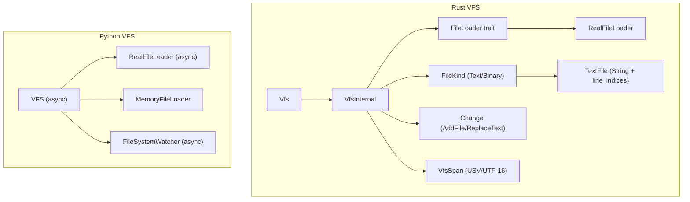
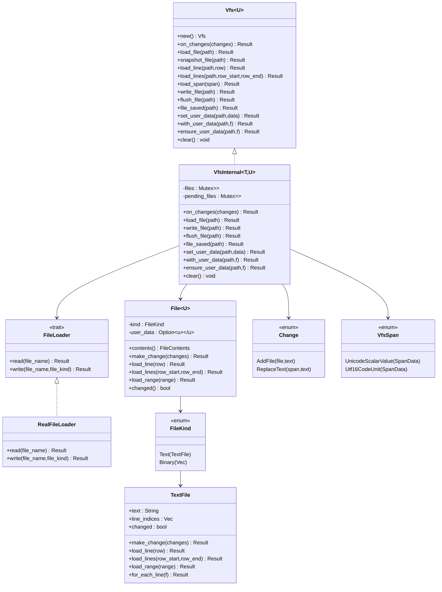
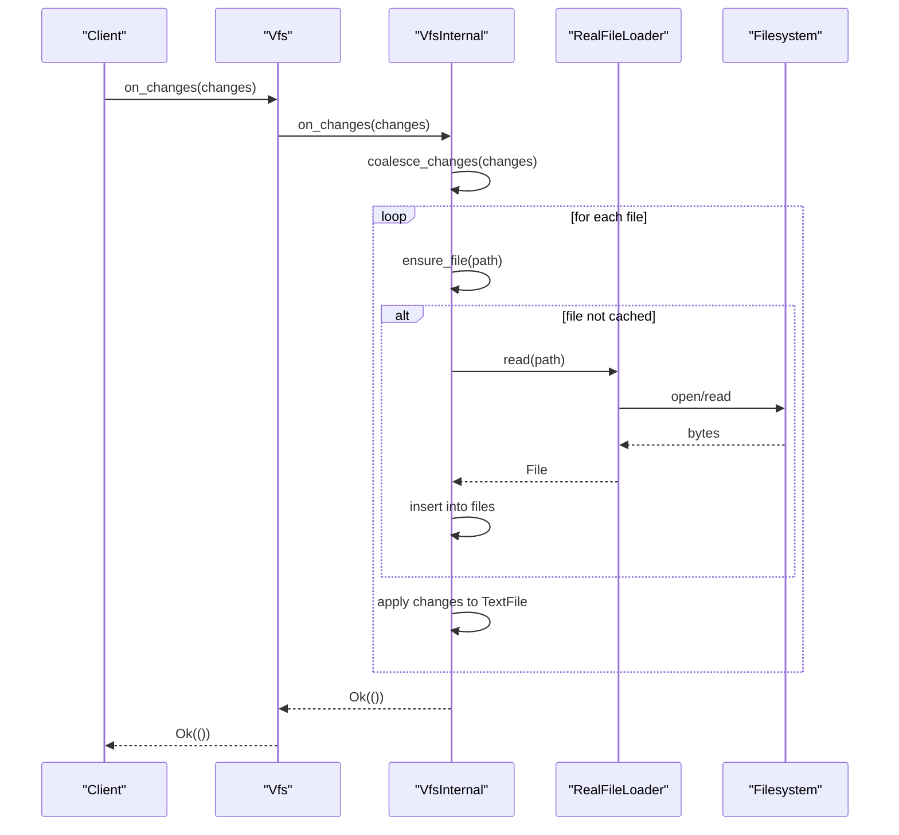
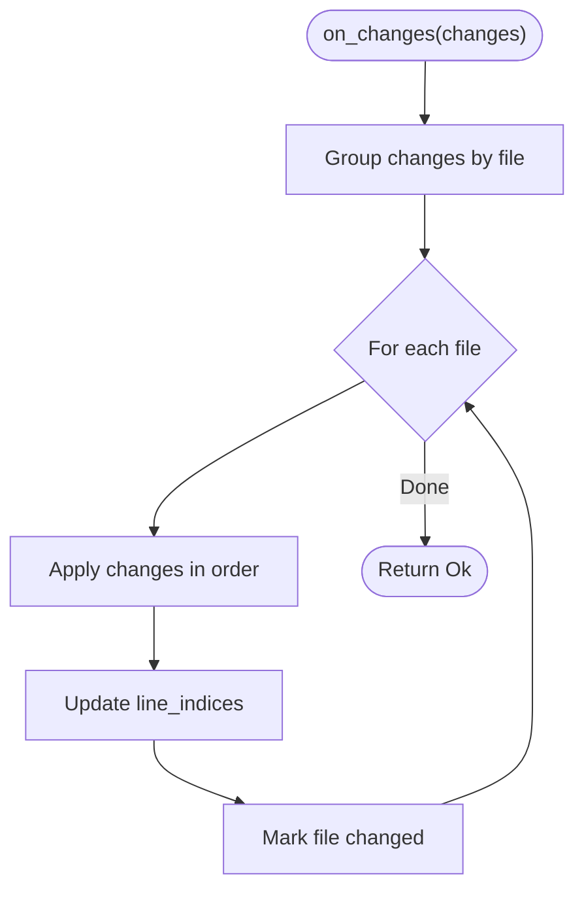
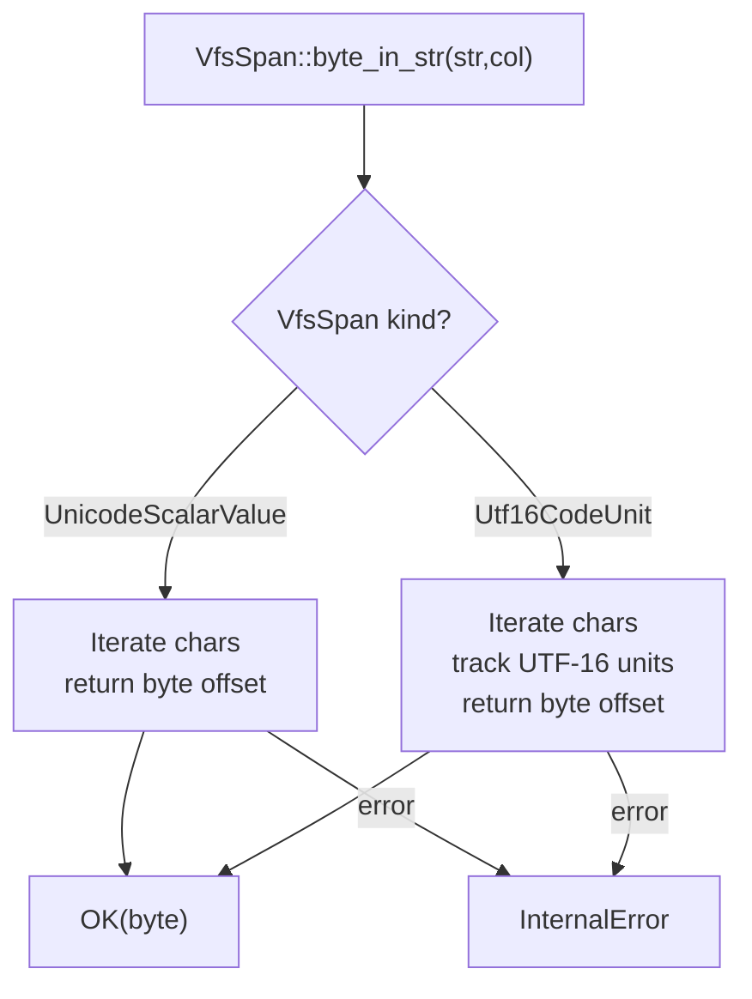
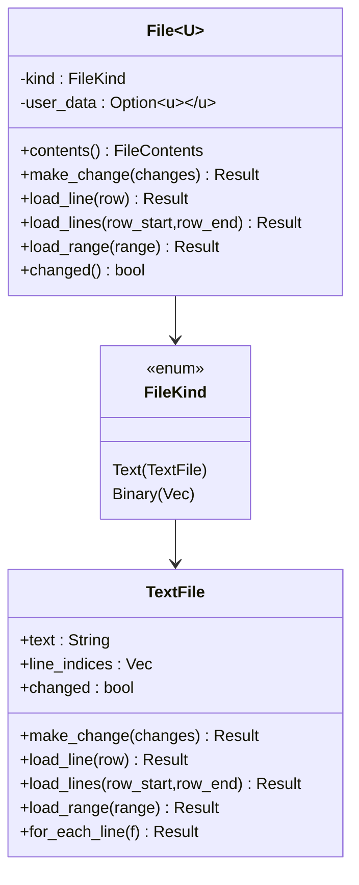
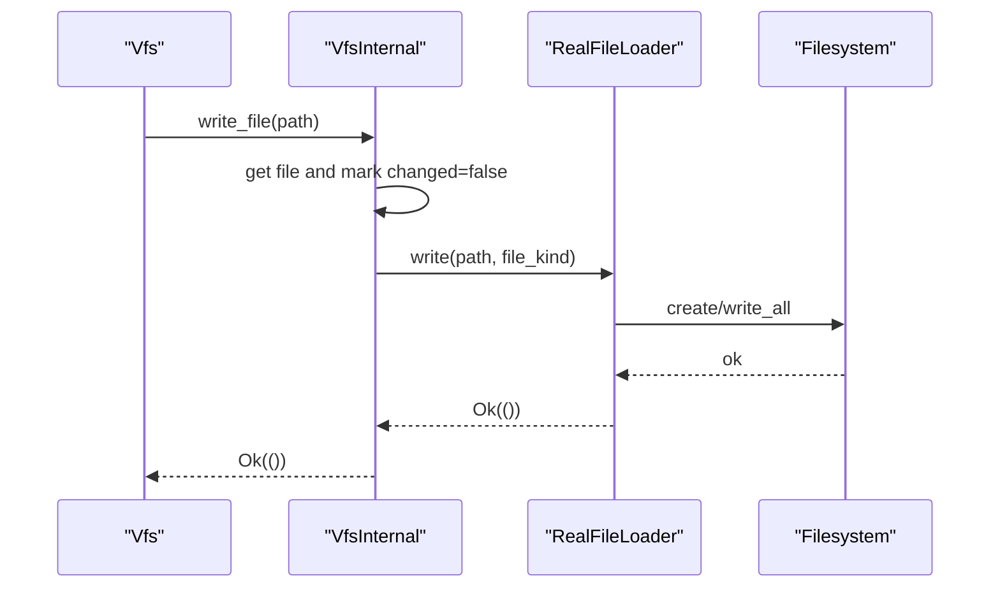
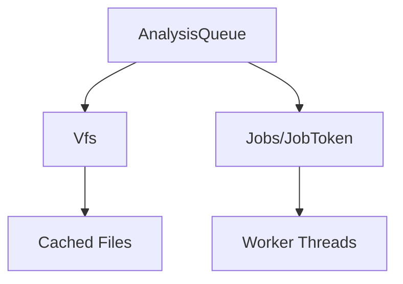
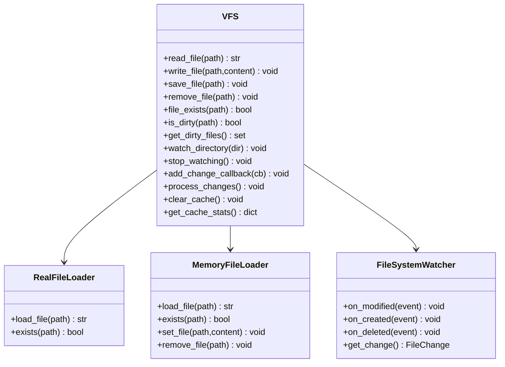
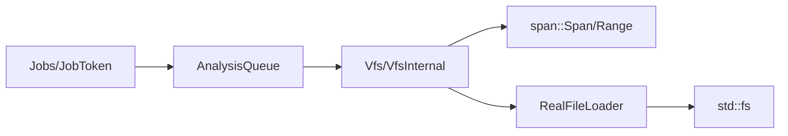

# Virtual File System

<cite>
**Referenced Files in This Document**
- [mod.rs](file://src/vfs/mod.rs)
- [test.rs](file://src/vfs/test.rs)
- [mod.rs](file://src/span/mod.rs)
- [analysis_queue.rs](file://src/actions/analysis_queue.rs)
- [concurrency.rs](file://src/concurrency.rs)
- [file_management.rs](file://src/file_management.rs)
- [__init__.py](file://python-port/dml_language_server/vfs/__init__.py)
</cite>

## Table of Contents
1. [Introduction](#introduction)
2. [Project Structure](#project-structure)
3. [Core Components](#core-components)
4. [Architecture Overview](#architecture-overview)
5. [Detailed Component Analysis](#detailed-component-analysis)
6. [Dependency Analysis](#dependency-analysis)
7. [Performance Considerations](#performance-considerations)
8. [Troubleshooting Guide](#troubleshooting-guide)
9. [Conclusion](#conclusion)
10. [Appendices](#appendices)

## Introduction
This document describes the Virtual File System (VFS) used by the DML Language Server. It covers the VFS architecture, file operations abstraction, change tracking mechanisms, memory management and caching policies, file content synchronization, integration with the underlying filesystem, virtual file representation, incremental update handling, examples of file operations, change detection algorithms, performance optimization techniques, the relationship between VFS and the analysis engine, concurrent access patterns, thread safety considerations, and the testing framework for VFS operations.

## Project Structure
The VFS is implemented in Rust under src/vfs and includes:
- A public API surface (Vfs) that wraps an internal implementation (VfsInternal)
- A file abstraction supporting text and binary content
- Change tracking via a Change enumeration and coalesced updates
- Span-based text positioning and byte-offset calculations for UTF-8 and UTF-16
- A file loader trait abstracting disk I/O
- A comprehensive test suite validating change application, caching, and user data semantics

Additionally, there is a Python port of the VFS in python-port/dml_language_server/vfs that demonstrates asynchronous file watching and caching behavior.

**Diagram sources**
- [mod.rs](file://src/vfs/mod.rs#L29-L288)
- [mod.rs](file://src/vfs/mod.rs#L293-L297)
- [mod.rs](file://src/vfs/mod.rs#L895-L952)
- [__init__.py](file://python-port/dml_language_server/vfs/__init__.py#L123-L329)

**Section sources**
- [mod.rs](file://src/vfs/mod.rs#L1-L100)
- [__init__.py](file://python-port/dml_language_server/vfs/__init__.py#L1-L50)

## Core Components
- Vfs and VfsInternal: Public and internal APIs for file caching, change application, and synchronization.
- File and FileKind: Virtual file representation supporting text and binary content.
- TextFile: In-memory text file with line indices for efficient random access.
- Change: Enumeration representing file additions and text replacements.
- VfsSpan: Span abstraction supporting Unicode scalar values and UTF-16 code units with precise byte offset calculation.
- FileLoader trait and RealFileLoader: Abstraction for reading/writing files from disk.
- Error: Comprehensive error model covering IO, out-of-sync conditions, bad locations, and internal errors.

Key capabilities:
- Incremental text editing with coalesced changes
- Line-indexed random access for fast line and range reads
- UTF-8 and UTF-16 aware byte offset translation
- Dirty tracking and explicit save semantics
- User data attached to files for analysis engine integration

**Section sources**
- [mod.rs](file://src/vfs/mod.rs#L29-L288)
- [mod.rs](file://src/vfs/mod.rs#L625-L666)
- [mod.rs](file://src/vfs/mod.rs#L655-L666)
- [mod.rs](file://src/vfs/mod.rs#L84-L98)
- [mod.rs](file://src/vfs/mod.rs#L44-L85)
- [mod.rs](file://src/vfs/mod.rs#L895-L952)

## Architecture Overview
The VFS architecture separates concerns between:
- Virtual file representation and caching
- Change application and coalescing
- Span-based text positioning and byte offset translation
- File loading and writing abstractions
- Integration with the analysis engine and concurrency primitives

**Diagram sources**
- [mod.rs](file://src/vfs/mod.rs#L29-L288)
- [mod.rs](file://src/vfs/mod.rs#L293-L297)
- [mod.rs](file://src/vfs/mod.rs#L895-L952)
- [mod.rs](file://src/vfs/mod.rs#L625-L666)
- [mod.rs](file://src/vfs/mod.rs#L655-L666)
- [mod.rs](file://src/vfs/mod.rs#L84-L98)
- [mod.rs](file://src/vfs/mod.rs#L44-L85)

## Detailed Component Analysis

### VFS API Surface and Operations
- Creation and lifecycle:
  - Vfs::new creates an empty VFS backed by RealFileLoader.
  - Vfs::clear clears all cached files and awakens pending threads.
- File operations:
  - Vfs::load_file loads a file into memory if not cached.
  - Vfs::snapshot_file returns a copy of the in-memory TextFile.
  - Vfs::load_line, Vfs::load_lines, Vfs::load_span provide targeted reads.
  - Vfs::write_file persists changes to disk and marks the file clean.
  - Vfs::flush_file removes a file from cache and awakens pending threads.
  - Vfs::file_saved marks a file as saved to disk (clean).
  - Vfs::file_is_synced checks whether a file is clean.
- Change application:
  - Vfs::on_changes accepts a slice of Change and applies them atomically per file.
  - Changes are coalesced by file to preserve ordering and minimize redundant work.
- User data:
  - Vfs::set_user_data attaches arbitrary data to a file.
  - Vfs::with_user_data reads or computes user data for a file.
  - Vfs::ensure_user_data lazily initializes user data if absent.

**Diagram sources**
- [mod.rs](file://src/vfs/mod.rs#L354-L379)
- [mod.rs](file://src/vfs/mod.rs#L468-L512)
- [mod.rs](file://src/vfs/mod.rs#L902-L932)

**Section sources**
- [mod.rs](file://src/vfs/mod.rs#L180-L288)
- [mod.rs](file://src/vfs/mod.rs#L354-L379)
- [mod.rs](file://src/vfs/mod.rs#L468-L512)

### Change Tracking and Coalescing
- Change enumeration supports AddFile and ReplaceText.
- Coalescing groups changes by file and preserves order.
- ReplaceText uses VfsSpan to compute byte offsets for UTF-8 or UTF-16.
- After applying changes, TextFile updates its line indices and marks itself changed.

**Diagram sources**
- [mod.rs](file://src/vfs/mod.rs#L605-L612)
- [mod.rs](file://src/vfs/mod.rs#L732-L777)
- [mod.rs](file://src/vfs/mod.rs#L771-L773)

**Section sources**
- [mod.rs](file://src/vfs/mod.rs#L84-L98)
- [mod.rs](file://src/vfs/mod.rs#L605-L612)
- [mod.rs](file://src/vfs/mod.rs#L732-L777)

### Span-Based Positioning and Byte Offset Translation
- VfsSpan supports Unicode scalar values and UTF-16 code units.
- byte_in_str converts a Unicode scalar offset to a UTF-8 byte offset.
- byte_in_str_utf16 converts a UTF-16 code unit offset to a UTF-8 byte offset with strict boundary checks.
- These utilities enable precise replacement ranges for editors that may not compute row/col end points reliably.

**Diagram sources**
- [mod.rs](file://src/vfs/mod.rs#L64-L85)
- [mod.rs](file://src/vfs/mod.rs#L864-L874)
- [mod.rs](file://src/vfs/mod.rs#L877-L893)

**Section sources**
- [mod.rs](file://src/vfs/mod.rs#L44-L85)
- [mod.rs](file://src/vfs/mod.rs#L864-L893)

### File Representation and Caching
- FileKind encapsulates either TextFile or Binary(Vec<u8>).
- TextFile stores the entire content as a String plus precomputed line indices for O(1) line access.
- VfsInternal caches files in a HashMap protected by a Mutex; pending_files coordinates concurrent readers/writers.
- ensure_file handles lazy loading and wakes waiting threads upon completion.

**Diagram sources**
- [mod.rs](file://src/vfs/mod.rs#L625-L666)
- [mod.rs](file://src/vfs/mod.rs#L655-L666)
- [mod.rs](file://src/vfs/mod.rs#L631-L638)

**Section sources**
- [mod.rs](file://src/vfs/mod.rs#L625-L666)
- [mod.rs](file://src/vfs/mod.rs#L655-L666)
- [mod.rs](file://src/vfs/mod.rs#L468-L512)

### File Loading and Writing Abstractions
- FileLoader trait abstracts reading and writing files.
- RealFileLoader reads UTF-8 text when possible, otherwise treats content as binary.
- write_file persists TextFile content to disk and clears the changed flag.

**Diagram sources**
- [mod.rs](file://src/vfs/mod.rs#L514-L529)
- [mod.rs](file://src/vfs/mod.rs#L934-L951)

**Section sources**
- [mod.rs](file://src/vfs/mod.rs#L895-L952)
- [mod.rs](file://src/vfs/mod.rs#L514-L529)

### Integration with the Analysis Engine and Concurrency
- The analysis queue uses Vfs to access file contents during analysis.
- Concurrency primitives (Jobs, JobToken) coordinate long-running tasks and ensure determinism in tests.
- Vfs ensures thread-safe access to cached files and pending operations.

**Diagram sources**
- [analysis_queue.rs](file://src/actions/analysis_queue.rs#L28-L29)
- [concurrency.rs](file://src/concurrency.rs#L71-L122)

**Section sources**
- [analysis_queue.rs](file://src/actions/analysis_queue.rs#L28-L29)
- [concurrency.rs](file://src/concurrency.rs#L71-L122)

### Python Port: Asynchronous File Watching and Caching
The Python VFS provides an async implementation with:
- RealFileLoader and MemoryFileLoader for disk and in-memory content
- FileSystemWatcher for detecting file system changes
- Async read/write/save operations with dirty tracking and cache invalidation

**Diagram sources**
- [__init__.py](file://python-port/dml_language_server/vfs/__init__.py#L123-L329)

**Section sources**
- [__init__.py](file://python-port/dml_language_server/vfs/__init__.py#L123-L329)

## Dependency Analysis
- Vfs depends on span for position and range types.
- VfsInternal uses Mutex-protected maps for files and pending_files.
- RealFileLoader depends on std::fs for I/O.
- The analysis queue imports Vfs for file access.
- Concurrency utilities provide job management and thread-safety guarantees.

**Diagram sources**
- [mod.rs](file://src/vfs/mod.rs#L1-L15)
- [mod.rs](file://src/vfs/mod.rs#L895-L952)
- [analysis_queue.rs](file://src/actions/analysis_queue.rs#L28-L29)
- [concurrency.rs](file://src/concurrency.rs#L71-L122)

**Section sources**
- [mod.rs](file://src/vfs/mod.rs#L1-L15)
- [analysis_queue.rs](file://src/actions/analysis_queue.rs#L28-L29)
- [concurrency.rs](file://src/concurrency.rs#L71-L122)

## Performance Considerations
- Memory management:
  - TextFile stores entire content as String; line_indices enable O(1) line access.
  - User data is stored per file and cleared on flush/change to reduce memory footprint.
- Caching policy:
  - Lazy loading via ensure_file prevents unnecessary disk I/O.
  - Pending_files coordination avoids race conditions without blocking writes.
- Change application:
  - Coalescing reduces redundant work and preserves editor intent.
  - UTF-8/UTF-16 conversions are performed only when needed.
- I/O efficiency:
  - RealFileLoader reads entire files into memory; consider streaming for very large files.
  - write_file writes entire content; consider incremental writes for large files.
- Concurrency:
  - Mutex-protected maps ensure thread safety; consider reader-writer locks for high-read scenarios.
  - Pending_files uses parking/unparking to avoid busy-waiting.

[No sources needed since this section provides general guidance]

## Troubleshooting Guide
Common issues and resolutions:
- BadLocation: Occurs when accessing invalid rows/columns or UTF-16 offsets not at char boundaries.
- FileNotCached: Attempting operations on files not present in cache; use load_file first.
- NoUserDataForFile: Accessing user data that was cleared after changes or flush.
- BadFileKind: Performing text operations on binary files.
- OutOfSync/UncommittedChanges: Disk content differs from VFS or unsaved changes exist.

Debugging tips:
- Enable tracing logs around change application and file loading.
- Verify VfsSpan selection (USV vs UTF-16) matches editor capabilities.
- Use Vfs::get_cached_files and Vfs::get_changes to inspect state.
- Validate UTF-8/UTF-16 conversions with unit tests.

**Section sources**
- [mod.rs](file://src/vfs/mod.rs#L110-L128)
- [test.rs](file://src/vfs/test.rs#L80-L103)
- [test.rs](file://src/vfs/test.rs#L174-L281)

## Conclusion
The VFS provides a robust abstraction for managing file content in the DML Language Server. It supports incremental updates, precise text positioning, and thread-safe caching. Its integration with the analysis engine and concurrency utilities enables scalable and reliable language server functionality. The Python port demonstrates complementary async patterns for file watching and caching.

[No sources needed since this section summarizes without analyzing specific files]

## Appendices

### Example Workflows

- Applying multiple edits to a file:
  - Group edits by file and apply in order; VfsSpan supports both USV and UTF-16 modes.
  - Use Vfs::on_changes to record changes and Vfs::write_file to persist.

- Reading specific lines or ranges:
  - Use Vfs::load_line, Vfs::load_lines, or Vfs::load_span for targeted reads.
  - Ensure VfsSpan uses the correct unit depending on editor capabilities.

- Managing user data:
  - Attach analysis metadata via Vfs::set_user_data or lazily initialize with Vfs::ensure_user_data.
  - Clear user data automatically on flush or change recording.

**Section sources**
- [mod.rs](file://src/vfs/mod.rs#L202-L205)
- [mod.rs](file://src/vfs/mod.rs#L233-L252)
- [mod.rs](file://src/vfs/mod.rs#L265-L283)
- [test.rs](file://src/vfs/test.rs#L174-L281)

### Testing Framework for VFS Operations
- Unit tests validate:
  - Change application with and without explicit lengths
  - Cache population and flushing
  - Dirty tracking and saving
  - User data lifecycle and clearing
  - UTF-8 and UTF-16 boundary handling

- Test coverage includes:
  - Has-changes semantics
  - Multi-file change scenarios
  - Add-file operations
  - User data read/write/compute/clear flows
  - Wide character handling

**Section sources**
- [test.rs](file://src/vfs/test.rs#L81-L103)
- [test.rs](file://src/vfs/test.rs#L105-L125)
- [test.rs](file://src/vfs/test.rs#L127-L172)
- [test.rs](file://src/vfs/test.rs#L174-L281)
- [test.rs](file://src/vfs/test.rs#L314-L358)